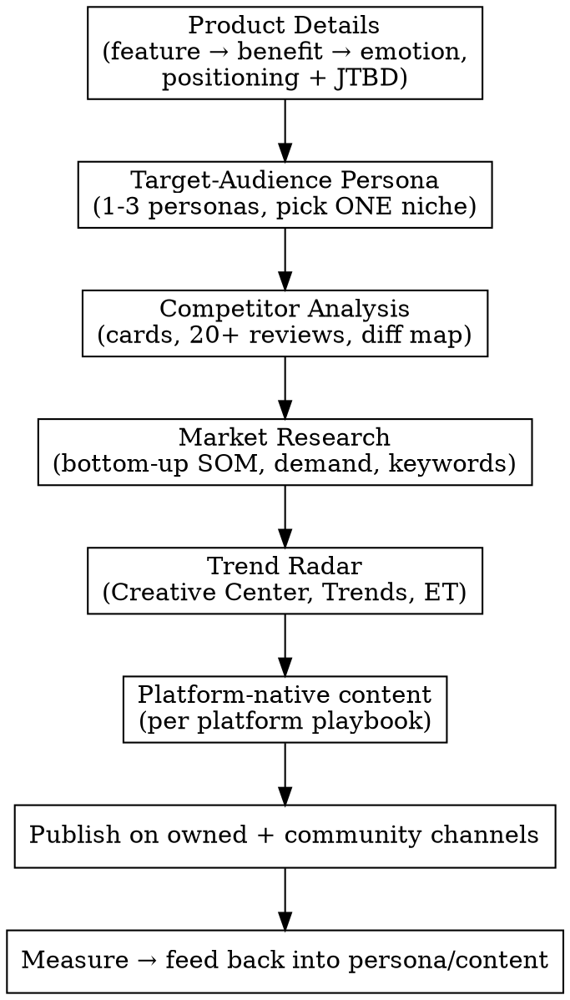

# Digital Marketing & Content Creation Playbook

## Overview

Digital marketing is showing the right product to the right audience through
the right message on the right channel. Before any content is made, four
foundations must exist — **product details, market research, competitor
analysis, target-audience persona** — plus a **trend radar**. Without them,
copy is guessing. With them, every piece of content is deliberate.

This skill gives a next agent (or human) a repeatable pipeline: research →
persona → differentiation → platform-native content → publish → measure.

## When to Use

- Capaign or content task where the product value, market, competitor, or
  audience is not yet written down.
- Building a persona, a positioning statement, a content calendar, or a launch
  plan.
- Choosing which platforms to publish on and how (see `platform_playbooks.md`).
- Researching a trend or deciding whether to ride one (see
  `trend-research.md`).
- Drafting messaging: app-store listing, landing page, ad copy, captions,
  hooks, emails.

**When NOT to use:** direct outbound sales to businesses/sponsors/creators →
that's `client-acquisition`.

## Mandatory Pre-flight (run in order, never skip)

The order is fixed: **product first**, then **persona**, then **competition**,
then **market**. Producing content before all four exist is a red flag.

1. **Product Details** — extract real features from the product (walk the
   codebase / the actual product, not memory), map each to
   `feature → benefit → emotion`, and compress into one **positioning
   statement** + 3 Jobs-To-Be-Done statements. Collect proof assets
   (testimonials, ratings, credentials).
2. **Target-Audience Persona** — build 1–3 personas grounded in real sources
   (interviews, community quotes, review themes), fill every field of the
   template or delete it. Pick **ONE niche** to focus marketing on first.
3. **Competitor Analysis** — top 3–5 competitors, each as a card; mine 20+
   recent reviews each; them-count pros/cons; build a feature matrix and a
   differentiation map; convert each top complaint into your counter-position.
4. **Market Research** — size the market bottom-up (SOM first), mine demand
   signals, keyword research with intent, cite sources, and label evidence
   (`primary` vs `secondary`, source + date).
5. **Trend Radar** — check in-app signals, TikTok Creative Center, Google
   Trends, Exploding Topics. Ride only what fits the brand and is search-backed
   and sustained.

### Cheap version

If time-boxed, the **minimum viable pre-flight** is: product → 1 persona →
1-line competitor scan → 1 demand check. Each step gets its own file, so
partial work is still reusable; but never ship content without at least
capturing product + persona + one competitor counter-position.

## Reference Index (read the file for the pillar you're working on)

| Need | File |
|---|---|
| Full four-pillar processes, prompts, tools, validation | `references/four-pillars.md` |
| How TikTok/IG/YT/X/LinkedIn/Reddit/FB/WhatsApp/Quora/PH operate, algorithms, formats, cadence, formulas, metrics | `references/platform_playbooks.md` |
| Trend lifecycle, discovery layers, hype-vs-demand test, when to ride | `references/trend-research.md` |
| Copy-paste prompt library (market research, SEO, email, content) | `references/prompts.md` |

## Core Workflow



## The Evidence Rule (applies to every pillar)

Every claim carries a **dated source** or an explicit `[ASSUMPTION]` label:
- Numbers: source + date, or they get the assumption label.
- Quotes: verbatim from a review, thread, or interview, or `[ASSUMPTION]`.
- Nothing gets invented — no made-up testimonials, no made-up download counts.
- Type: `primary` (your survey/interview/analytics) vs `secondary` (report,
  article, tool) is stated.

This label discipline is what turns a marketing doc into a trustworthy
playbook: a future agent can re-run your math and verify your claims.

## Positioning Statement Template

```
For [audience] who [need/struggle], [product] is a [category] that [benefit],
unlike [alternative] which [gap].
```

Paint the canonical example against Emerge (identity-first habit app, Nigeria
beachhead, sponsor-first rewards):

```
For self-improvement starters who quit after their first slip,
Emerge is the habit app that makes discipline visible,
unlike streak-based trackers that punish one missed day.
```

## Hero Content Formula (Emerge's shareable asset)

Emerge's content factory is **recaps + world-growth time-lapses** ("watch your
discipline grow into a world"). Convert that into every platform's native
format — loop-able time-lapses for short video, "day 1 vs day 90" everywhere,
identity-first storytelling ("every habit completed is a vote for who you're
becoming"). One hero piece/week, repurposed across 3 platforms (TikTok/Reels/
Shorts), stills to X/LinkedIn.

## Quick Reference — DTE (Do-This-Else) Cheat Sheet

| Step | Do this | Not this |
|---|---|---|
| Product | Lead with outcomes ("become who you're becoming") | Feature dumps ("streaks, reminders") |
| Audience | Ground in real quotes, one niche first | 6 invented personas |
| Competition | Count themes across 20+ reviews | Cherry-pick one 5★ + one 1★ |
| Market | Bottom-up SOM you can re-run | Top-down "1% of a $50B market" |
| Trends | Search-backed + sustained + brand fit | Meme-of-the-week, plateau riders |
| Copy | Benefit → hook in first 3s | Jargon and feature lists |

## Measurement (first 30 days discipline)

- **Short video:** watch time, completion/replay rate, shares, saves,
  follows-from-video, link clicks — not "views". Judge on retention & downstream
  behavior; the first 60 min and first 24h tell you almost everything.
- **Owned/community:** replies/post (target 10+ in 2–3 communities), email
  open/convert, Shopify-style UTM per channel.
- **Back into decisions:** double down on winning formats; refresh personas and
  keywords with real analytics once <10K installs of data exist.

## Common Mistakes

1. **Copying the leader's positioning** — you become a worse version of them.
   Differentiate on the axis the reviews reveal (e.g., "forgiving" beats
   "streaks" in habit apps).
2. **Vanity metrics** — download counts say nothing about retention; prefer
   review themes and feature completeness.
3. **Volume ≠ intent** — high search volume with informational intent doesn't
   mean buyers. Check intent.
4. **Fabricated persona/proof** — invented personas don't persuade; invented
   testimonials destroy trust. Every persona field traces to a quote or is
   labeled `[ASSUMPTION]`.
5. **Ignoring local context** — for the Nigeria beachhead: WhatsApp-first
   distribution, Paystack/transfer payment norms, low data plans, and
   campus/community networks all change channel and message decisions.
6. **Skipping the pre-flight** — producing content before product/persona/
   competition/market exist is the #1 reason campaigns guess.

## Red Flags — STOP and go back to pre-flight

- No positioning statement exists.  → Run Product Details.
- No persona (or persona is demographics-only).  → Run Target Audience Persona.
- No competitor counter-position.  → Run Competitor Analysis.
- No sourced market figure.  → Run Market Research.
- Content written before all four exist.  → Restart the workflow in order.

## Real-World Anchors (how peers in the space position)

- **Forest** — "a companion, not a coach — no shame, no preaching"; real-world
  impact (2M+ real trees), "60M+ downloads", "4.8 rating". (forestapp.cc)
- **Habits Garden** — pain-hook first ("80% of New Year's resolutions fail"),
  "4.8/5 from 17,742 achievers". (habitsgarden.com)
- **Habitica** — owns the RPG lane ("Gamify Your Life"). Copying it = losing.
- Lesson: number + credential together; pain hook up front; one owned lane.
