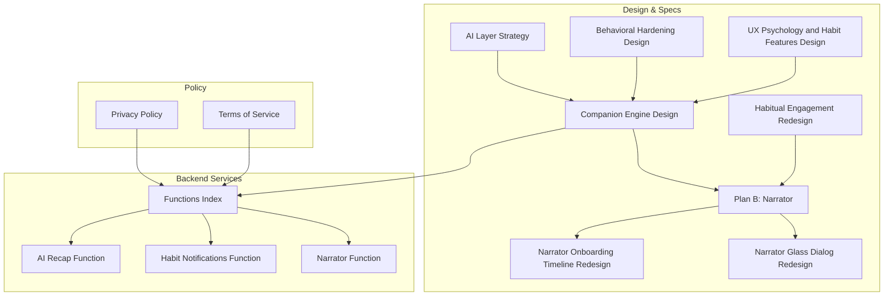
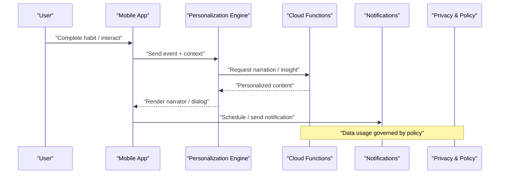
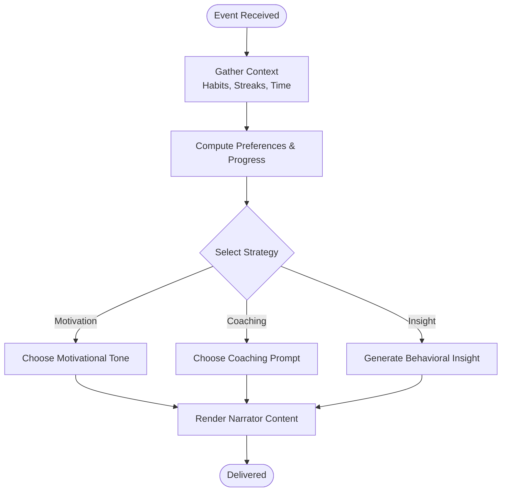
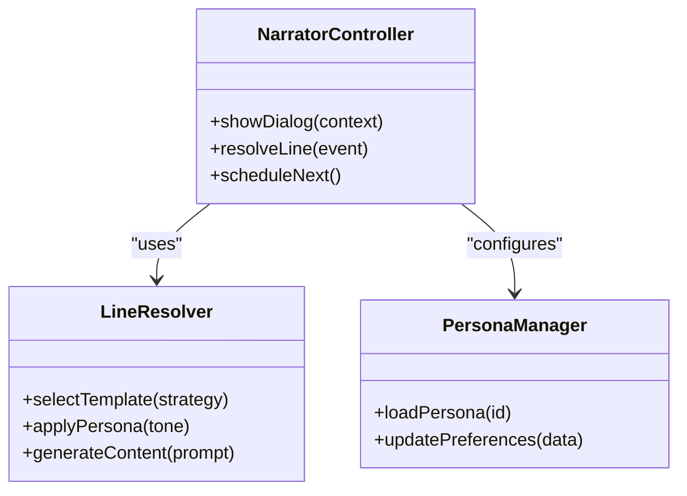
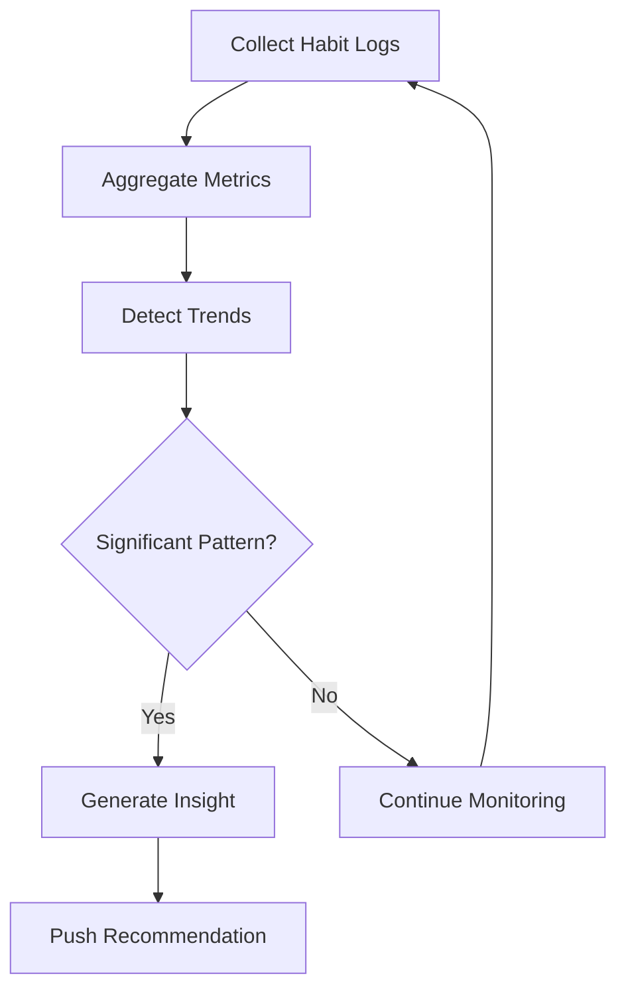
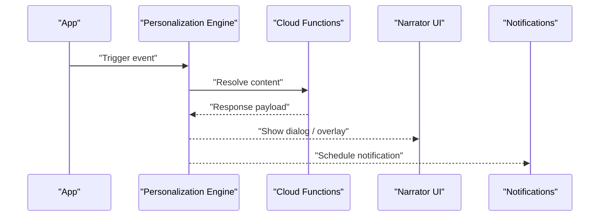
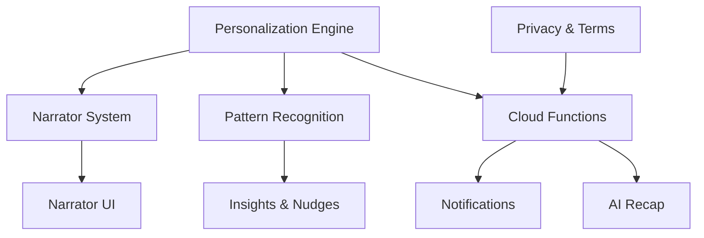

# AI Companion & Narrator

<cite>
**Referenced Files in This Document**
- [AI Layer Strategy](file://docs/AI_LAYER_STRATEGY.md)
- [Companion Engine Design](file://docs/superpowers/specs/2026-06-21-companion-engine-design.md)
- [Plan B: Narrator](file://docs/superpowers/plans/2026-07-02-plan-b-narrator.md)
- [Narrator Glass Dialog Redesign](file://docs/superpowers/specs/2026-07-04-narrator-glass-dialog-redesign.md)
- [Narrator Onboarding Timeline Redesign](file://docs/superpowers/specs/2026-07-05-narrator-onboarding-timeline-redesign-design.md)
- [Habitual Engagement Redesign](file://docs/superpowers/specs/2026-07-02-habitual-engagement-redesign.md)
- [Behavioral Hardening Design](file://docs/superpowers/specs/2026-04-30-behavioral-hardening-design.md)
- [UX Psychology and Habit Features Design](file://docs/superpowers/specs/2026-07-25-ux-psychology-and-habit-features-design.md)
- [Firebase Functions Index](file://functions/src/index.ts)
- [Narrator Function](file://functions/src/narrator.ts)
- [Habit Notifications Function](file://functions/src/habit_notifications.ts)
- [AI Recap Function](file://functions/src/ai_recap.ts)
- [Privacy Policy](file://docs/legal/PRIVACY_POLICY.md)
- [Terms of Service](file://docs/legal/TERMS_OF_SERVICE.md)
- [Notification System](file://docs/notification_system.md)
- [Emerge App Habit Formation Blueprint](file://docs/Emerge App_ Habit Formation Blueprint.md)
- [Project Structure](file://docs/project_structure.md)
</cite>

## Table of Contents
1. [Introduction](#introduction)
2. [Project Structure](#project-structure)
3. [Core Components](#core-components)
4. [Architecture Overview](#architecture-overview)
5. [Detailed Component Analysis](#detailed-component-analysis)
6. [Dependency Analysis](#dependency-analysis)
7. [Performance Considerations](#performance-considerations)
8. [Troubleshooting Guide](#troubleshooting-guide)
9. [Conclusion](#conclusion)
10. [Appendices](#appendices)

## Introduction
This document describes the AI-powered companion and narrator system that personalizes guidance, delivers contextual coaching, and recognizes behavioral patterns to drive habit formation. It covers the personalization engine, narrator delivery mechanisms, pattern recognition service, conversation flows, triggers, response generation, persona customization, notification integration, privacy policies, and model selection criteria. The goal is to provide a clear, accessible guide for both technical and non-technical stakeholders while mapping concepts to concrete implementation files where available.

## Project Structure
The AI companion and narrator spans multiple layers:
- Product design and specs define behavior, UX, and flow
- Cloud functions implement backend services (narration, notifications, recaps)
- Legal documents govern data usage and privacy
- Feature plans detail integration points with habit completion events and onboarding timelines

**Diagram sources**
- [AI Layer Strategy](file://docs/AI_LAYER_STRATEGY.md)
- [Companion Engine Design](file://docs/superpowers/specs/2026-06-21-companion-engine-design.md)
- [Plan B: Narrator](file://docs/superpowers/plans/2026-07-02-plan-b-narrator.md)
- [Narrator Glass Dialog Redesign](file://docs/superpowers/specs/2026-07-04-narrator-glass-dialog-redesign.md)
- [Narrator Onboarding Timeline Redesign](file://docs/superpowers/specs/2026-07-05-narrator-onboarding-timeline-redesign-design.md)
- [Habitual Engagement Redesign](file://docs/superpowers/specs/2026-07-02-habitual-engagement-redesign.md)
- [Behavioral Hardening Design](file://docs/superpowers/specs/2026-04-30-behavioral-hardening-design.md)
- [UX Psychology and Habit Features Design](file://docs/superpowers/specs/2026-07-25-ux-psychology-and-habit-features-design.md)
- [Firebase Functions Index](file://functions/src/index.ts)
- [Narrator Function](file://functions/src/narrator.ts)
- [Habit Notifications Function](file://functions/src/habit_notifications.ts)
- [AI Recap Function](file://functions/src/ai_recap.ts)
- [Privacy Policy](file://docs/legal/PRIVACY_POLICY.md)
- [Terms of Service](file://docs/legal/TERMS_OF_SERVICE.md)

**Section sources**
- [AI Layer Strategy](file://docs/AI_LAYER_STRATEGY.md)
- [Project Structure](file://docs/project_structure.md)

## Core Components
- AI Personalization Engine: Adapts responses based on user behavior, preferences, and progress. It consumes signals from habit completions, streaks, time-of-day context, and historical patterns to tailor messages and coaching prompts.
- Narrator System: Delivers contextual guidance, motivational messages, and habit coaching through UI overlays and dialogs. It orchestrates timing, tone, and content selection aligned with user state and goals.
- Pattern Recognition Service: Identifies behavioral trends such as consistency, drop-offs, and optimal times for habits. It generates actionable insights and nudges to improve adherence.
- Conversation Flows and Triggers: Event-driven interactions triggered by habit completion, missed cues, streak milestones, and periodic check-ins. Responses are generated via templated logic and optional AI augmentation.
- Custom AI Personas: Configurable voices and styles (e.g., coach, mentor, explorer) that influence message framing and encouragement strategies.
- Notification Integration: Synchronized with habit completion events to deliver timely reminders, celebrations, and reflective prompts.
- Privacy and Model Selection: Data minimization, consent, and retention policies; model selection based on latency, cost, safety, and capability requirements.

**Section sources**
- [Companion Engine Design](file://docs/superpowers/specs/2026-06-21-companion-engine-design.md)
- [Plan B: Narrator](file://docs/superpowers/plans/2026-07-02-plan-b-narrator.md)
- [Behavioral Hardening Design](file://docs/superpowers/specs/2026-04-30-behavioral-hardening-design.md)
- [Habitual Engagement Redesign](file://docs/superpowers/specs/2026-07-02-habitual-engagement-redesign.md)

## Architecture Overview
The system integrates frontend narrator experiences with backend services for narration, notifications, and recaps. Events from habit actions trigger cloud functions that compute personalized content and deliver it back to the app or push notifications.

**Diagram sources**
- [Companion Engine Design](file://docs/superpowers/specs/2026-06-21-companion-engine-design.md)
- [Plan B: Narrator](file://docs/superpowers/plans/2026-07-02-plan-b-narrator.md)
- [Habitual Engagement Redesign](file://docs/superpowers/specs/2026-07-02-habitual-engagement-redesign.md)
- [Firebase Functions Index](file://functions/src/index.ts)
- [Narrator Function](file://functions/src/narrator.ts)
- [Habit Notifications Function](file://functions/src/habit_notifications.ts)
- [Privacy Policy](file://docs/legal/PRIVACY_POLICY.md)

## Detailed Component Analysis

### AI Personalization Engine
Responsibilities:
- Ingests user signals (habit completions, streaks, time/context, past engagement)
- Computes preference weights and progress metrics
- Selects appropriate narrator tone, message templates, and coaching strategies
- Integrates with cloud functions for AI-augmented responses when needed

Key behaviors:
- Context-aware message selection
- Adaptive difficulty and encouragement levels
- Insight generation for recurring patterns

**Diagram sources**
- [Companion Engine Design](file://docs/superpowers/specs/2026-06-21-companion-engine-design.md)
- [Behavioral Hardening Design](file://docs/superpowers/specs/2026-04-30-behavioral-hardening-design.md)
- [UX Psychology and Habit Features Design](file://docs/superpowers/specs/2026-07-25-ux-psychology-and-habit-features-design.md)

**Section sources**
- [Companion Engine Design](file://docs/superpowers/specs/2026-06-21-companion-engine-design.md)
- [Behavioral Hardening Design](file://docs/superpowers/specs/2026-04-30-behavioral-hardening-design.md)

### Narrator System
Responsibilities:
- Orchestrates narrator UI overlays and glass dialogs
- Manages timing, pacing, and interruption rules
- Resolves line content from templates or AI-generated text
- Aligns messaging with current habit stage and user mood

Integration points:
- Habit completion events
- Onboarding timeline milestones
- Periodic reflection prompts

**Diagram sources**
- [Plan B: Narrator](file://docs/superpowers/plans/2026-07-02-plan-b-narrator.md)
- [Narrator Glass Dialog Redesign](file://docs/superpowers/specs/2026-07-04-narrator-glass-dialog-redesign.md)
- [Narrator Onboarding Timeline Redesign](file://docs/superpowers/specs/2026-07-05-narrator-onboarding-timeline-redesign-design.md)

**Section sources**
- [Plan B: Narrator](file://docs/superpowers/plans/2026-07-02-plan-b-narrator.md)
- [Narrator Glass Dialog Redesign](file://docs/superpowers/specs/2026-07-04-narrator-glass-dialog-redesign.md)
- [Narrator Onboarding Timeline Redesign](file://docs/superpowers/specs/2026-07-05-narrator-onboarding-timeline-redesign-design.md)

### Pattern Recognition Service
Responsibilities:
- Tracks habit adherence over time windows (daily, weekly, monthly)
- Detects trends like increasing consistency, frequent misses at certain times, or plateau phases
- Produces actionable insights and nudges to adjust routines

Algorithm highlights:
- Rolling window analysis
- Threshold-based alerts
- Correlation between time/context and success rates

**Diagram sources**
- [Behavioral Hardening Design](file://docs/superpowers/specs/2026-04-30-behavioral-hardening-design.md)
- [UX Psychology and Habit Features Design](file://docs/superpowers/specs/2026-07-25-ux-psychology-and-habit-features-design.md)

**Section sources**
- [Behavioral Hardening Design](file://docs/superpowers/specs/2026-04-30-behavioral-hardening-design.md)
- [UX Psychology and Habit Features Design](file://docs/superpowers/specs/2026-07-25-ux-psychology-and-habit-features-design.md)

### Conversation Flows and Trigger Mechanisms
Triggers:
- Habit completion
- Missed cue or scheduled time
- Streak milestone or break
- Reflection prompt or daily recap

Flow overview:
- Event capture -> context enrichment -> strategy selection -> content generation -> delivery (UI or notification)

**Diagram sources**
- [Habitual Engagement Redesign](file://docs/superpowers/specs/2026-07-02-habitual-engagement-redesign.md)
- [Plan B: Narrator](file://docs/superpowers/plans/2026-07-02-plan-b-narrator.md)
- [Firebase Functions Index](file://functions/src/index.ts)

**Section sources**
- [Habitual Engagement Redesign](file://docs/superpowers/specs/2026-07-02-habitual-engagement-redesign.md)
- [Plan B: Narrator](file://docs/superpowers/plans/2026-07-02-plan-b-narrator.md)

### Response Generation Algorithms
Approaches:
- Template-based selection with dynamic variables (streak count, time, habit name)
- Persona-driven tone adjustments
- Optional AI augmentation for richer, contextual messages

Quality controls:
- Safety filters
- Length and readability constraints
- Localization readiness

**Section sources**
- [Companion Engine Design](file://docs/superpowers/specs/2026-06-21-companion-engine-design.md)
- [Plan B: Narrator](file://docs/superpowers/plans/2026-07-02-plan-b-narrator.md)

### Custom AI Personas
Examples:
- Coach: Direct, action-oriented, focuses on accountability
- Mentor: Reflective, encouraging, emphasizes growth mindset
- Explorer: Curious, playful, frames habits as discovery

Configuration:
- Persona ID mapping
- Preference updates based on user feedback
- Tone calibration per habit category

**Section sources**
- [Plan B: Narrator](file://docs/superpowers/plans/2026-07-02-plan-b-narrator.md)
- [Companion Engine Design](file://docs/superpowers/specs/2026-06-21-companion-engine-design.md)

### Notification Triggers and Habit Completion Integration
Triggers:
- Immediate celebration after completion
- Gentle reminder for missed cues
- Weekly recap summaries

Integration:
- Cloud function handles scheduling and payload composition
- App subscribes to events and renders narrator overlays

**Section sources**
- [Habit Notifications Function](file://functions/src/habit_notifications.ts)
- [Notification System](file://docs/notification_system.md)
- [Habitual Engagement Redesign](file://docs/superpowers/specs/2026-07-02-habitual-engagement-redesign.md)

### Privacy Considerations and Data Usage Policies
Principles:
- Minimize data collection to what is necessary
- Provide clear consent and opt-out options
- Secure storage and transmission
- Transparent usage policies

References:
- Privacy Policy outlines data handling and user rights
- Terms of Service define acceptable use and responsibilities

**Section sources**
- [Privacy Policy](file://docs/legal/PRIVACY_POLICY.md)
- [Terms of Service](file://docs/legal/TERMS_OF_SERVICE.md)

### AI Model Selection Criteria
Criteria:
- Latency and responsiveness for real-time narration
- Cost efficiency for scalable usage
- Safety and compliance with content guidelines
- Capability alignment with persona and coaching needs

Decision process:
- Evaluate models against criteria
- A/B test tone and effectiveness
- Monitor performance and user satisfaction

**Section sources**
- [AI Layer Strategy](file://docs/AI_LAYER_STRATEGY.md)
- [Companion Engine Design](file://docs/superpowers/specs/2026-06-21-companion-engine-design.md)

## Dependency Analysis
The narrator and companion components depend on:
- Firebase Functions for computation and delivery
- Notification systems for push and in-app alerts
- Policy documents for governance and compliance

**Diagram sources**
- [Firebase Functions Index](file://functions/src/index.ts)
- [Narrator Function](file://functions/src/narrator.ts)
- [Habit Notifications Function](file://functions/src/habit_notifications.ts)
- [AI Recap Function](file://functions/src/ai_recap.ts)
- [Privacy Policy](file://docs/legal/PRIVACY_POLICY.md)
- [Terms of Service](file://docs/legal/TERMS_OF_SERVICE.md)

**Section sources**
- [Firebase Functions Index](file://functions/src/index.ts)
- [Narrator Function](file://functions/src/narrator.ts)
- [Habit Notifications Function](file://functions/src/habit_notifications.ts)
- [AI Recap Function](file://functions/src/ai_recap.ts)

## Performance Considerations
- Keep narrator interactions lightweight to avoid UI jank
- Cache template resolutions and persona configurations locally
- Batch pattern computations to reduce server load
- Use progressive loading for rich content and media
- Implement fallbacks when AI services are unavailable

[No sources needed since this section provides general guidance]

## Troubleshooting Guide
Common issues:
- Narrator not appearing: verify event triggers and UI visibility flags
- Delayed notifications: check cloud function logs and scheduling queues
- Incorrect tone or persona: review persona configuration and preference updates
- Insight inaccuracies: validate trend thresholds and data aggregation windows

Debugging steps:
- Inspect event payloads and context enrichment
- Review function execution logs and error traces
- Validate policy compliance checks and data access permissions

**Section sources**
- [Habit Notifications Function](file://functions/src/habit_notifications.ts)
- [Narrator Function](file://functions/src/narrator.ts)
- [AI Recap Function](file://functions/src/ai_recap.ts)

## Conclusion
The AI-powered companion and narrator system combines personalization, contextual guidance, and behavioral insights to enhance habit formation. By integrating robust design specs, cloud functions, and clear privacy policies, the system delivers adaptive, engaging experiences while maintaining safety and compliance. Continuous iteration on personas, triggers, and pattern recognition will further improve user outcomes.

[No sources needed since this section summarizes without analyzing specific files]

## Appendices
- Habit Formation Blueprint provides foundational principles guiding companion behavior
- Notification System details integration points and delivery mechanisms

**Section sources**
- [Emerge App Habit Formation Blueprint](file://docs/Emerge App_ Habit Formation Blueprint.md)
- [Notification System](file://docs/notification_system.md)