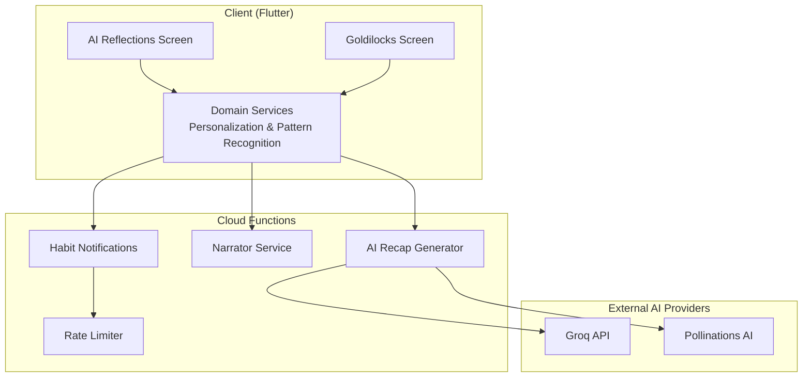
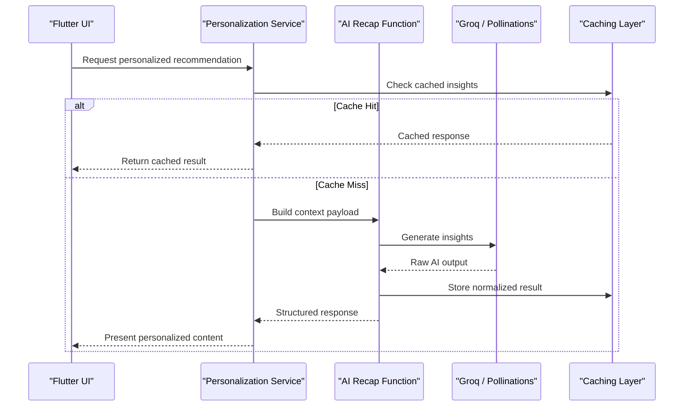
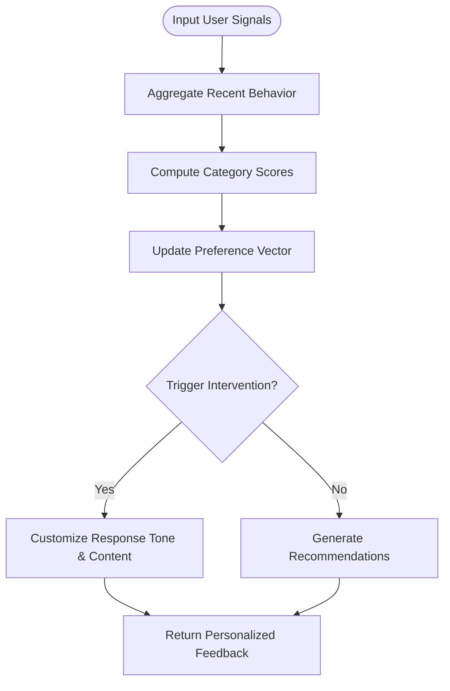
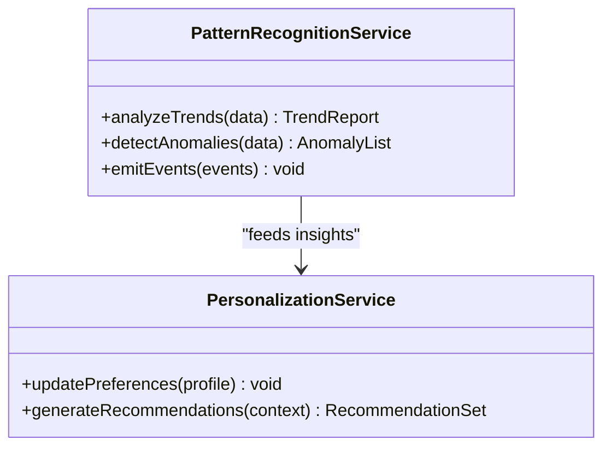
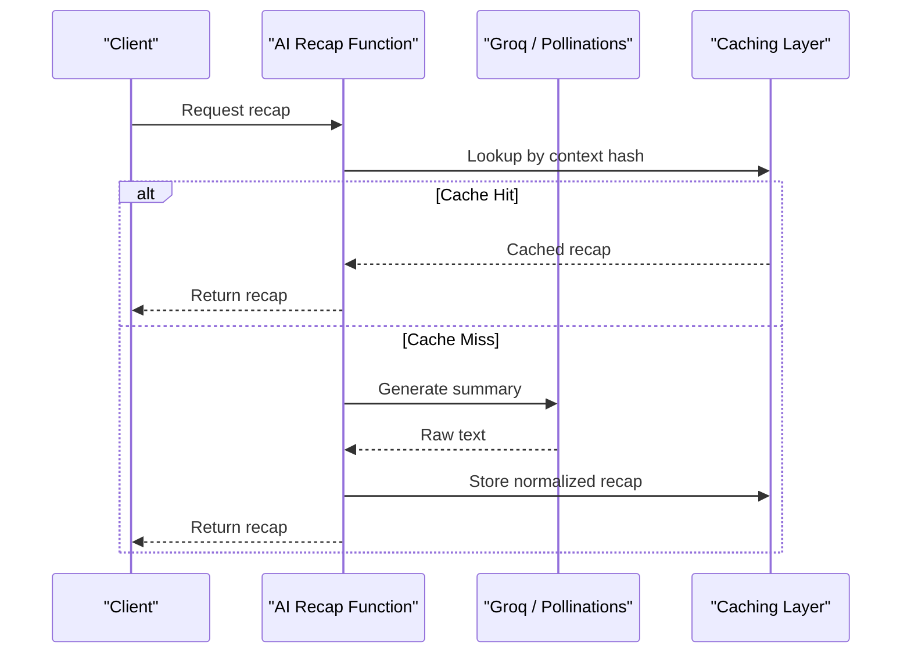
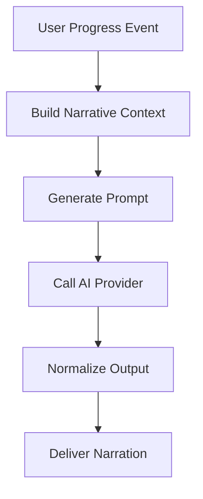
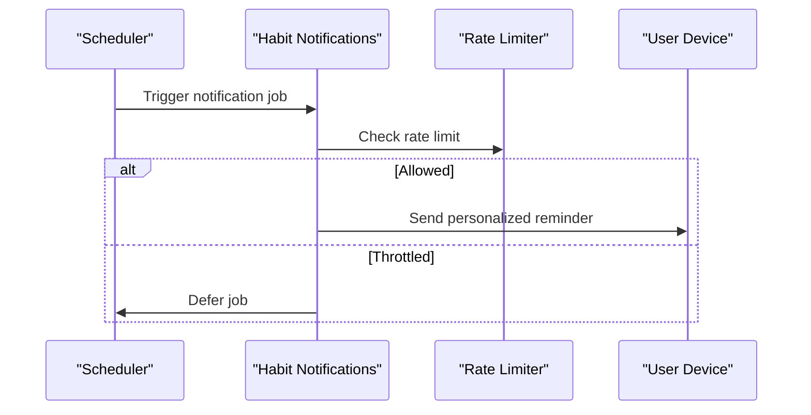
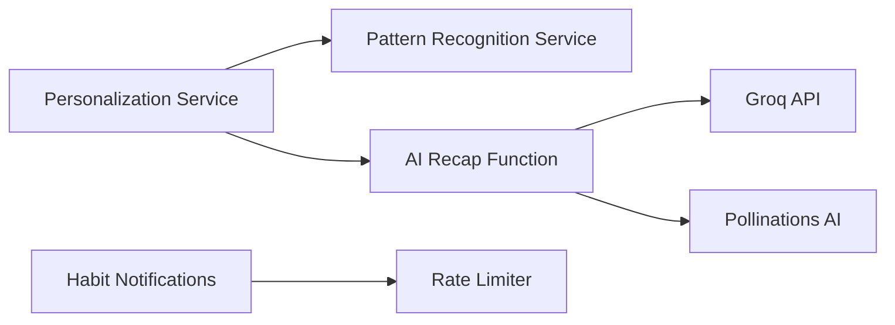

# AI Personalization Engine

<cite>
**Referenced Files in This Document**
- [ai_personalization_service_test.dart](file://test/features/ai/domain/services/ai_personalization_service_test.dart)
- [pattern_recognition_service_test.dart](file://test/features/ai/domain/services/pattern_recognition_service_test.dart)
- [ai_reflections_screen_test.dart](file://test/features/ai/presentation/screens/ai_reflections_screen_test.dart)
- [goldilocks_screen_test.dart](file://test/features/ai/presentation/screens/goldilocks_screen_test.dart)
- [ai_recap.ts](file://functions/src/ai_recap.ts)
- [rateLimiter.ts](file://functions/src/rateLimiter.ts)
- [narrator.ts](file://functions/src/narrator.ts)
- [habit_notifications.ts](file://functions/src/habit_notifications.ts)
- [AI_LAYER_STRATEGY.md](file://docs/AI_LAYER_STRATEGY.md)
- [POLLINATIONS_AI_GUIDE.md](file://docs/POLLINATIONS_AI_GUIDE.md)
</cite>

## Table of Contents
1. [Introduction](#introduction)
2. [Project Structure](#project-structure)
3. [Core Components](#core-components)
4. [Architecture Overview](#architecture-overview)
5. [Detailed Component Analysis](#detailed-component-analysis)
6. [Dependency Analysis](#dependency-analysis)
7. [Performance Considerations](#performance-considerations)
8. [Troubleshooting Guide](#troubleshooting-guide)
9. [Conclusion](#conclusion)
10. [Appendices](#appendices)

## Introduction
This document describes the AI personalization engine that adapts responses based on user behavior, preferences, and progress. It explains how user context is captured, processed, and used to generate personalized recommendations and feedback. The documentation covers service architecture, data models, integration patterns with external AI providers (including Groq), caching layer design, rate limiting, error handling, model selection criteria, prompt engineering patterns, and performance optimization techniques. Where applicable, it references concrete files in the repository for traceability.

## Project Structure
The AI personalization functionality spans multiple layers:
- Domain services for preference learning and pattern recognition
- Presentation screens for user-facing AI features
- Cloud functions for server-side orchestration, including recap generation and notifications
- Documentation guiding AI layer strategy and provider usage

[No sources needed since this diagram shows conceptual workflow, not actual code structure]

## Core Components
- Personalization Service: Learns from user interactions and preferences to tailor content and feedback.
- Pattern Recognition Service: Detects behavioral patterns to inform adaptive strategies.
- AI Recap Function: Orchestrates summarization and insight generation using external AI providers.
- Narrator Service: Generates contextual narrative lines and coaching prompts.
- Habit Notifications: Delivers timely nudges based on learned patterns and user state.
- Rate Limiter: Protects downstream AI APIs from overload and ensures fair usage.

**Section sources**
- [ai_personalization_service_test.dart](file://test/features/ai/domain/services/ai_personalization_service_test.dart)
- [pattern_recognition_service_test.dart](file://test/features/ai/domain/services/pattern_recognition_service_test.dart)
- [ai_recap.ts](file://functions/src/ai_recap.ts)
- [narrator.ts](file://functions/src/narrator.ts)
- [habit_notifications.ts](file://functions/src/habit_notifications.ts)
- [rateLimiter.ts](file://functions/src/rateLimiter.ts)

## Architecture Overview
The engine follows a layered architecture:
- Client Layer: Flutter screens collect user inputs and display AI-generated insights.
- Domain Layer: Services encapsulate personalization logic and pattern detection.
- Server Layer: Cloud functions coordinate AI calls, manage rate limits, and persist outcomes.
- External Integrations: Groq and Pollinations provide generative capabilities.

**Diagram sources**
- [ai_recap.ts](file://functions/src/ai_recap.ts)
- [rateLimiter.ts](file://functions/src/rateLimiter.ts)

**Section sources**
- [ai_personalization_service_test.dart](file://test/features/ai/domain/services/ai_personalization_service_test.dart)
- [pattern_recognition_service_test.dart](file://test/features/ai/domain/services/pattern_recognition_service_test.dart)
- [ai_recap.ts](file://functions/src/ai_recap.ts)
- [rateLimiter.ts](file://functions/src/rateLimiter.ts)

## Detailed Component Analysis

### Personalization Service
Responsibilities:
- Aggregates user signals (habits, reflections, streaks, achievements).
- Applies preference learning algorithms to update user profiles.
- Produces tailored recommendations and feedback.

Behavioral Adaptation Mechanisms:
- Weighted scoring of habit categories based on recent completion rates.
- Decay functions to reduce influence of older behaviors.
- Threshold-based triggers for intervention or encouragement.

Preference Learning Algorithms:
- Incremental updates to preference vectors using moving averages.
- Contextual bandit-style exploration for new content suggestions.
- Rule-based overrides for critical milestones or regressions.

Response Customization Strategies:
- Tone adaptation based on archetype and historical engagement.
- Length and complexity adjustments according to user proficiency.
- Localization-aware phrasing and cultural sensitivity checks.

**Section sources**
- [ai_personalization_service_test.dart](file://test/features/ai/domain/services/ai_personalization_service_test.dart)

### Pattern Recognition Service
Responsibilities:
- Identifies recurring behavioral patterns (e.g., weekly dips, weekend surges).
- Flags anomalies indicating potential disengagement or burnout.
- Feeds insights back into the personalization service.

Detection Techniques:
- Rolling window analysis for trend detection.
- Seasonality decomposition to separate periodic effects.
- Change-point detection for abrupt shifts in behavior.

Integration Points:
- Emits events consumed by notification and recap services.
- Persists detected patterns for longitudinal analysis.

**Diagram sources**
- [pattern_recognition_service_test.dart](file://test/features/ai/domain/services/pattern_recognition_service_test.dart)

**Section sources**
- [pattern_recognition_service_test.dart](file://test/features/ai/domain/services/pattern_recognition_service_test.dart)

### AI Recap Function
Responsibilities:
- Builds structured context payloads from user data.
- Calls external AI providers to generate summaries and insights.
- Normalizes outputs and caches results for reuse.

Model Selection Criteria:
- Cost vs. quality trade-offs per use case.
- Latency constraints for real-time vs. batch processing.
- Provider reliability and fallback options.

Prompt Engineering Patterns:
- Role-based system prompts to align tone and expertise.
- Few-shot examples to stabilize output format.
- Constraint injection to enforce length and structure.

Error Handling:
- Retry with exponential backoff for transient failures.
- Graceful degradation to cached or template-based responses.
- Detailed logging for observability and debugging.

**Diagram sources**
- [ai_recap.ts](file://functions/src/ai_recap.ts)

**Section sources**
- [ai_recap.ts](file://functions/src/ai_recap.ts)

### Narrator Service
Responsibilities:
- Generates contextual narrative lines aligned with user progress.
- Adapts messaging style based on archetype and mood indicators.
- Coordinates with personalization to ensure consistency.

Integration Patterns:
- Uses structured prompts to maintain coherence across sessions.
- Leverages cached templates for common milestones.

**Section sources**
- [narrator.ts](file://functions/src/narrator.ts)

### Habit Notifications
Responsibilities:
- Schedules and sends reminders based on learned habits and patterns.
- Personalizes timing and content to maximize engagement.
- Respects rate limits and user preferences.

Adaptation Logic:
- Dynamic scheduling using time-of-day effectiveness models.
- Content variation to avoid fatigue and repetition.

**Section sources**
- [habit_notifications.ts](file://functions/src/habit_notifications.ts)
- [rateLimiter.ts](file://functions/src/rateLimiter.ts)

### Presentation Screens
- AI Reflections Screen: Captures reflective inputs and displays AI-generated insights.
- Goldilocks Screen: Calibrates difficulty levels based on user performance.

These screens interact with domain services to fetch personalized content and submit user feedback for continuous learning.

**Section sources**
- [ai_reflections_screen_test.dart](file://test/features/ai/presentation/screens/ai_reflections_screen_test.dart)
- [goldilocks_screen_test.dart](file://test/features/ai/presentation/screens/goldilocks_screen_test.dart)

## Dependency Analysis
Key dependencies:
- Domain services depend on local data repositories and pattern recognition outputs.
- Cloud functions depend on external AI providers and caching mechanisms.
- Rate limiter coordinates access to shared resources to prevent overuse.

**Diagram sources**
- [ai_recap.ts](file://functions/src/ai_recap.ts)
- [rateLimiter.ts](file://functions/src/rateLimiter.ts)

**Section sources**
- [ai_personalization_service_test.dart](file://test/features/ai/domain/services/ai_personalization_service_test.dart)
- [pattern_recognition_service_test.dart](file://test/features/ai/domain/services/pattern_recognition_service_test.dart)
- [ai_recap.ts](file://functions/src/ai_recap.ts)
- [rateLimiter.ts](file://functions/src/rateLimiter.ts)

## Performance Considerations
- Caching Strategy: Hash-based lookups for AI outputs; TTL policies tuned by content volatility.
- Rate Limiting: Token bucket algorithm to smooth bursts and protect provider quotas.
- Model Selection: Prefer smaller models for latency-sensitive paths; larger models for deep analysis.
- Prompt Optimization: Minimize token usage via concise prompts and structured outputs.
- Concurrency Control: Batch requests where possible; parallelize independent calls.

[No sources needed since this section provides general guidance]

## Troubleshooting Guide
Common issues and resolutions:
- AI Provider Timeouts: Implement retries with backoff; fall back to cached or template responses.
- Rate Limit Exceeded: Adjust throttling parameters; queue jobs for off-peak hours.
- Inconsistent Outputs: Strengthen prompt constraints; add validation and normalization steps.
- Data Drift: Monitor pattern recognition metrics; retrain or recalibrate thresholds periodically.

Operational Tips:
- Log context hashes and provider responses for audit trails.
- Use feature flags to toggle between model variants during experiments.
- Alert on abnormal error rates and latency spikes.

**Section sources**
- [ai_recap.ts](file://functions/src/ai_recap.ts)
- [rateLimiter.ts](file://functions/src/rateLimiter.ts)

## Conclusion
The AI personalization engine integrates client-side domain services with cloud-based orchestration to deliver adaptive, context-aware experiences. By combining preference learning, pattern recognition, and robust integration with external AI providers, it achieves responsive customization while maintaining performance and reliability through caching, rate limiting, and comprehensive error handling. Continuous monitoring and iterative prompt engineering ensure high-quality outputs aligned with user goals.

[No sources needed since this section summarizes without analyzing specific files]

## Appendices

### Integration Patterns with External AI Providers
- Groq: Low-latency inference for real-time prompts; suitable for dynamic coaching messages.
- Pollinations AI: Alternative provider for diverse capabilities; useful for creative content generation.

Guidance documents:
- AI Layer Strategy outlines provider selection and fallback mechanisms.
- Pollinations AI Guide details usage patterns and best practices.

**Section sources**
- [AI_LAYER_STRATEGY.md](file://docs/AI_LAYER_STRATEGY.md)
- [POLLINATIONS_AI_GUIDE.md](file://docs/POLLINATIONS_AI_GUIDE.md)