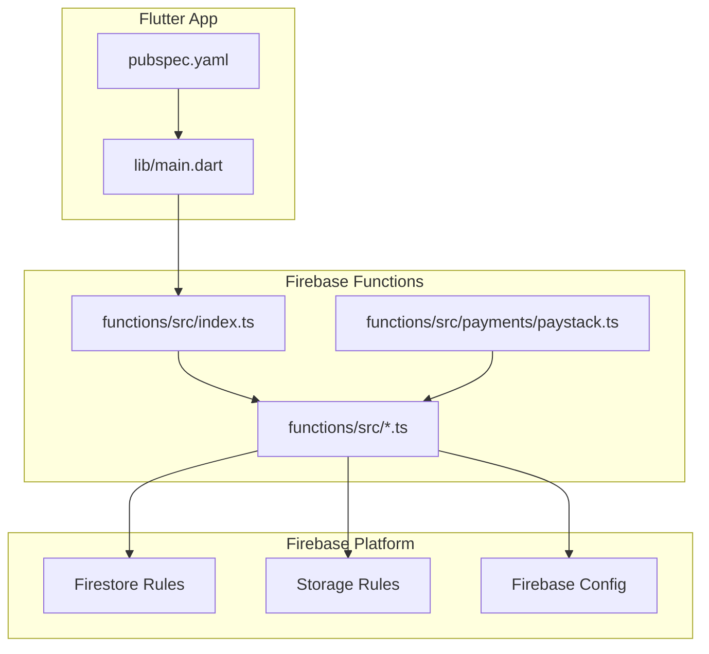
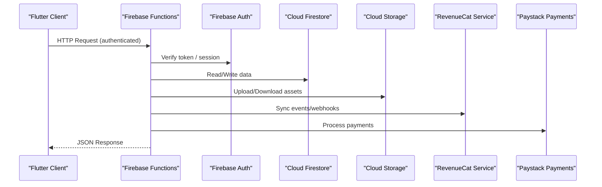
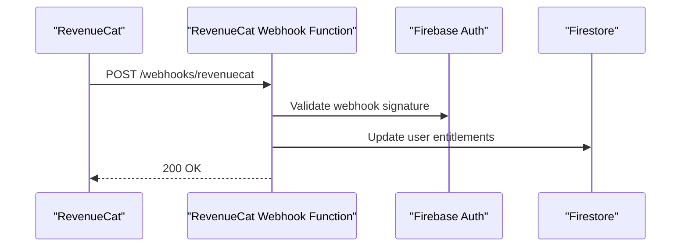
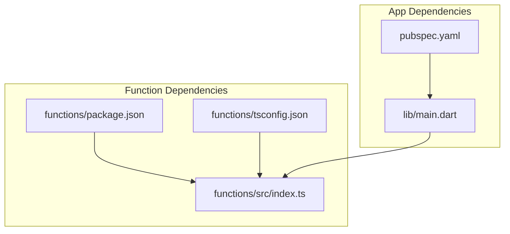

# API Reference

<cite>
**Referenced Files in This Document**
- [functions/src/index.ts](file://functions/src/index.ts)
- [functions/src/accountDeletion.ts](file://functions/src/accountDeletion.ts)
- [functions/src/ai_recap.ts](file://functions/src/ai_recap.ts)
- [functions/src/challenges.ts](file://functions/src/challenges.ts)
- [functions/src/cleanupUserData.ts](file://functions/src/cleanupUserData.ts)
- [functions/src/create_starter_pack.ts](file://functions/src/create_starter_pack.ts)
- [functions/src/fixTribes.ts](file://functions/src/fixTribes.ts)
- [functions/src/habit_notifications.ts](file://functions/src/habit_notifications.ts)
- [functions/src/narrator.ts](file://functions/src/narrator.ts)
- [functions/src/purgeOrphanedUserData.ts](file://functions/src/purgeOrphanedUserData.ts)
- [functions/src/rateLimiter.ts](file://functions/src/rateLimiter.ts)
- [functions/src/recalcTribes.ts](file://functions/src/recalcTribes.ts)
- [functions/src/refreshQuarterlyChallenges.ts](file://functions/src/refreshQuarterlyChallenges.ts)
- [functions/src/revenuecat_events.ts](file://functions/src/revenuecat_events.ts)
- [functions/src/revenuecat_webhook.ts](file://functions/src/revenuecat_webhook.ts)
- [functions/src/seed.ts](file://functions/src/seed.ts)
- [functions/src/seedReviewerAccount.ts](file://functions/src/seedReviewerAccount.ts)
- [functions/src/seed_starter_habits.ts](file://functions/src/seed_starter_habits.ts)
- [functions/src/seed_templates.ts](file://functions/src/seed_templates.ts)
- [functions/src/setUserRole.ts](file://functions/src/setUserRole.ts)
- [functions/src/payments/paystack.ts](file://functions/src/payments/paystack.ts)
- [functions/package.json](file://functions/package.json)
- [functions/tsconfig.json](file://functions/tsconfig.json)
- [firestore.rules](file://firestore.rules)
- [storage.rules](file://storage.rules)
- [firebase.json](file://firebase.json)
- [lib/main.dart](file://lib/main.dart)
- [pubspec.yaml](file://pubspec.yaml)
- [docs/revenuecat_webhooks.md](file://docs/revenuecat_webhooks.md)
</cite>

## Table of Contents
1. Introduction
2. Project Structure
3. Core Components
4. Architecture Overview
5. Detailed Component Analysis
6. Dependency Analysis
7. Performance Considerations
8. Troubleshooting Guide
9. Conclusion
10. Appendices

## Introduction
This document provides comprehensive API documentation for the Emerge application’s backend and integration surfaces, focusing on Firebase Cloud Functions HTTP endpoints, internal service APIs, repository interfaces, provider contracts, data models, validation rules, error handling patterns, WebSocket usage, third-party integrations (RevenueCat, Health Connect, AI services), client implementation examples, rate limiting, versioning, deprecation policies, and migration guidance. It is intended for both developers integrating with the app and maintainers extending its capabilities.

## Project Structure
The project follows a modular architecture:
- Flutter app entrypoint and configuration define runtime behavior and dependencies.
- Firebase Functions implement serverless endpoints and background tasks.
- Firestore and Storage security rules enforce access control at the platform level.
- Documentation includes RevenueCat webhook specifics and other operational guides.

**Diagram sources**
- [lib/main.dart](file://lib/main.dart)
- [pubspec.yaml](file://pubspec.yaml)
- [functions/src/index.ts](file://functions/src/index.ts)
- [functions/src/accountDeletion.ts](file://functions/src/accountDeletion.ts)
- [functions/src/payments/paystack.ts](file://functions/src/payments/paystack.ts)
- [firestore.rules](file://firestore.rules)
- [storage.rules](file://storage.rules)
- [firebase.json](file://firebase.json)

**Section sources**
- [lib/main.dart](file://lib/main.dart)
- [pubspec.yaml](file://pubspec.yaml)
- [functions/src/index.ts](file://functions/src/index.ts)
- [firebase.json](file://firebase.json)

## Core Components
- Firebase Functions HTTP API surface: Centralized endpoint registration and routing.
- Feature-specific handlers: Account lifecycle, challenges, habit notifications, narrator, revenue events, tribe calculations, seed utilities, and user role management.
- Payment integration: Paystack payment processing module.
- Security rules: Firestore and Storage access controls.
- Client configuration: Flutter app initialization and dependency declarations.

Key responsibilities:
- Validate and authenticate requests.
- Enforce business logic and data transformations.
- Interact with Firestore, Storage, and external services.
- Emit structured logs and errors for observability.

**Section sources**
- [functions/src/index.ts](file://functions/src/index.ts)
- [functions/src/accountDeletion.ts](file://functions/src/accountDeletion.ts)
- [functions/src/ai_recap.ts](file://functions/src/ai_recap.ts)
- [functions/src/challenges.ts](file://functions/src/challenges.ts)
- [functions/src/habit_notifications.ts](file://functions/src/habit_notifications.ts)
- [functions/src/narrator.ts](file://functions/src/narrator.ts)
- [functions/src/revenuecat_events.ts](file://functions/src/revenuecat_events.ts)
- [functions/src/revenuecat_webhook.ts](file://functions/src/revenuecat_webhook.ts)
- [functions/src/payments/paystack.ts](file://functions/src/payments/paystack.ts)
- [firestore.rules](file://firestore.rules)
- [storage.rules](file://storage.rules)
- [lib/main.dart](file://lib/main.dart)
- [pubspec.yaml](file://pubspec.yaml)

## Architecture Overview
The system integrates a Flutter client with Firebase Functions as the API layer, backed by Firestore and Storage. Third-party services include RevenueCat for monetization and Paystack for payments. Real-time features leverage Firebase real-time capabilities.

**Diagram sources**
- [functions/src/index.ts](file://functions/src/index.ts)
- [functions/src/revenuecat_webhook.ts](file://functions/src/revenuecat_webhook.ts)
- [functions/src/payments/paystack.ts](file://functions/src/payments/paystack.ts)
- [firestore.rules](file://firestore.rules)
- [storage.rules](file://storage.rules)

## Detailed Component Analysis

### Firebase Cloud Functions API
- Entry point registers HTTP endpoints and routes to feature modules.
- Each handler encapsulates request validation, authentication checks, business logic, and response formatting.
- Common concerns like rate limiting and logging are centralized where applicable.

Endpoints overview:
- Authentication and account lifecycle: create, update, delete accounts; set roles.
- Challenges and gamification: refresh quarterly challenges, recalculate tribes.
- Habit notifications: schedule and send notifications based on triggers.
- Narrator: generate narrative content and summaries.
- Revenue events: process RevenueCat events and webhooks.
- Seed utilities: populate starter habits, templates, reviewer accounts.
- Cleanup and maintenance: purge orphaned data, cleanup user data.

Request/response schema guidelines:
- All HTTP endpoints accept JSON payloads with standardized fields.
- Responses include status codes, messages, and data objects conforming to defined schemas.
- Errors follow a consistent structure with code, message, and optional details.

Authentication methods:
- Firebase ID token verification for authenticated users.
- Admin or service-level operations may use privileged contexts.
- Role-based access enforced via Firestore rules and function-level checks.

Rate limiting:
- Rate limiter module enforces per-user or per-endpoint limits to protect resources.

Error handling:
- Structured error responses with actionable messages.
- Logging for debugging and monitoring.

WebSocket APIs:
- Real-time updates via Firebase real-time listeners and functions-triggered events.
- Connection management handled by client-side SDKs; server emits events through Firestore streams.

Third-party integrations:
- RevenueCat: event ingestion and webhook processing for subscriptions and purchases.
- Paystack: payment initiation and confirmation flows.
- AI services: recap generation and narrative assistance.

Versioning and deprecation:
- Endpoints should be versioned under paths (e.g., v1, v2).
- Deprecation notices included in responses and documented in changelogs.
- Migration guides provided for breaking changes.

**Section sources**
- [functions/src/index.ts](file://functions/src/index.ts)
- [functions/src/rateLimiter.ts](file://functions/src/rateLimiter.ts)
- [functions/src/accountDeletion.ts](file://functions/src/accountDeletion.ts)
- [functions/src/setUserRole.ts](file://functions/src/setUserRole.ts)
- [functions/src/challenges.ts](file://functions/src/challenges.ts)
- [functions/src/recalcTribes.ts](file://functions/src/recalcTribes.ts)
- [functions/src/refreshQuarterlyChallenges.ts](file://functions/src/refreshQuarterlyChallenges.ts)
- [functions/src/habit_notifications.ts](file://functions/src/habit_notifications.ts)
- [functions/src/narrator.ts](file://functions/src/narrator.ts)
- [functions/src/revenuecat_events.ts](file://functions/src/revenuecat_events.ts)
- [functions/src/revenuecat_webhook.ts](file://functions/src/revenuecat_webhook.ts)
- [functions/src/seed_starter_habits.ts](file://functions/src/seed_starter_habits.ts)
- [functions/src/seed_templates.ts](file://functions/src/seed_templates.ts)
- [functions/src/seedReviewerAccount.ts](file://functions/src/seedReviewerAccount.ts)
- [functions/src/cleanupUserData.ts](file://functions/src/cleanupUserData.ts)
- [functions/src/purgeOrphanedUserData.ts](file://functions/src/purgeOrphanedUserData.ts)
- [functions/src/ai_recap.ts](file://functions/src/ai_recap.ts)

### Internal Service APIs
- Repository interfaces abstract data access layers for local and remote storage.
- Services orchestrate domain logic, coordinating repositories and providers.
- Provider contracts standardize interactions with external systems (auth, storage, payments).

Data models:
- Entities represent core domain concepts (users, habits, challenges, tribes).
- Validation rules ensure data integrity before persistence.
- Serialization formats align with Firestore schemas and API payloads.

Validation rules:
- Input sanitization and schema validation at API boundaries.
- Business rule enforcement within service layers.

Error handling patterns:
- Domain exceptions mapped to HTTP error codes.
- Retry strategies for transient failures.

**Section sources**
- [functions/src/index.ts](file://functions/src/index.ts)
- [functions/src/accountDeletion.ts](file://functions/src/accountDeletion.ts)
- [functions/src/challenges.ts](file://functions/src/challenges.ts)
- [functions/src/habit_notifications.ts](file://functions/src/habit_notifications.ts)
- [functions/src/narrator.ts](file://functions/src/narrator.ts)
- [functions/src/revenuecat_events.ts](file://functions/src/revenuecat_events.ts)
- [functions/src/revenuecat_webhook.ts](file://functions/src/revenuecat_webhook.ts)
- [functions/src/seed_starter_habits.ts](file://functions/src/seed_starter_habits.ts)
- [functions/src/seed_templates.ts](file://functions/src/seed_templates.ts)
- [functions/src/seedReviewerAccount.ts](file://functions/src/seedReviewerAccount.ts)
- [functions/src/cleanupUserData.ts](file://functions/src/cleanupUserData.ts)
- [functions/src/purgeOrphanedUserData.ts](file://functions/src/purgeOrphanedUserData.ts)
- [functions/src/ai_recap.ts](file://functions/src/ai_recap.ts)

### Provider Contracts
- Authentication provider: manages Firebase Auth sessions and tokens.
- Storage provider: handles uploads, downloads, and metadata.
- Payment provider: interfaces with Paystack for transactions.
- Analytics provider: records events and metrics.

Contracts emphasize:
- Consistent method signatures across implementations.
- Error propagation and retry semantics.
- Configuration-driven behavior.

**Section sources**
- [functions/src/payments/paystack.ts](file://functions/src/payments/paystack.ts)
- [functions/src/index.ts](file://functions/src/index.ts)

### Data Models and Validation
- Core entities include User, Habit, Challenge, Tribe, Reflection, and Notification.
- Schemas define required fields, types, and constraints.
- Validation occurs at API entry points and service layers.

Example model categories:
- User profile and settings.
- Habit definitions and completion records.
- Challenge metadata and participation.
- Tribe membership and stats.
- Notification templates and delivery status.

**Section sources**
- [functions/src/accountDeletion.ts](file://functions/src/accountDeletion.ts)
- [functions/src/challenges.ts](file://functions/src/challenges.ts)
- [functions/src/habit_notifications.ts](file://functions/src/habit_notifications.ts)
- [functions/src/narrator.ts](file://functions/src/narrator.ts)
- [functions/src/revenuecat_events.ts](file://functions/src/revenuecat_events.ts)
- [functions/src/revenuecat_webhook.ts](file://functions/src/revenuecat_webhook.ts)
- [functions/src/seed_starter_habits.ts](file://functions/src/seed_starter_habits.ts)
- [functions/src/seed_templates.ts](file://functions/src/seed_templates.ts)
- [functions/src/seedReviewerAccount.ts](file://functions/src/seedReviewerAccount.ts)
- [functions/src/cleanupUserData.ts](file://functions/src/cleanupUserData.ts)
- [functions/src/purgeOrphanedUserData.ts](file://functions/src/purgeOrphanedUserData.ts)
- [functions/src/ai_recap.ts](file://functions/src/ai_recap.ts)

### WebSocket APIs and Real-Time Features
- Real-time synchronization uses Firestore listeners and function-triggered events.
- Clients subscribe to collections and documents for live updates.
- Connection management relies on Firebase SDKs with automatic reconnection.

Event types:
- User activity updates.
- Habit completions and streaks.
- Tribe member changes and leaderboards.
- Challenge progress and rewards.

Connection management:
- Establish secure connections using authenticated sessions.
- Handle offline scenarios with local caching and sync queues.

**Section sources**
- [functions/src/index.ts](file://functions/src/index.ts)
- [functions/src/habit_notifications.ts](file://functions/src/habit_notifications.ts)
- [functions/src/challenges.ts](file://functions/src/challenges.ts)
- [functions/src/recalcTribes.ts](file://functions/src/recalcTribes.ts)

### Third-Party Integrations

#### RevenueCat
- Webhook endpoints process subscription events, renewals, and cancellations.
- Event ingestion synchronizes user entitlements and analytics.
- Configuration includes API keys and secret verification.

Webhook flow:

**Diagram sources**
- [functions/src/revenuecat_webhook.ts](file://functions/src/revenuecat_webhook.ts)
- [functions/src/revenuecat_events.ts](file://functions/src/revenuecat_events.ts)
- [docs/revenuecat_webhooks.md](file://docs/revenuecat_webhooks.md)

**Section sources**
- [functions/src/revenuecat_webhook.ts](file://functions/src/revenuecat_webhook.ts)
- [functions/src/revenuecat_events.ts](file://functions/src/revenuecat_events.ts)
- [docs/revenuecat_webhooks.md](file://docs/revenuecat_webhooks.md)

#### Health Connect
- Integration enables reading health data for habit insights and recommendations.
- Permissions and consent flows managed via platform SDKs.
- Data mapping aligns with app’s habit and reflection models.

**Section sources**
- [functions/src/ai_recap.ts](file://functions/src/ai_recap.ts)
- [functions/src/habit_notifications.ts](file://functions/src/habit_notifications.ts)

#### AI Services
- Recap generation leverages AI models to summarize user progress.
- Prompt engineering ensures consistent output formats.
- Rate limiting and fallbacks handle high load and failures.

**Section sources**
- [functions/src/ai_recap.ts](file://functions/src/ai_recap.ts)
- [functions/src/narrator.ts](file://functions/src/narrator.ts)

### Client Implementation Examples
- Use Firebase SDKs for authentication, Firestore, and Storage.
- Initialize app with environment-specific configurations.
- Implement error handling and retries for network failures.
- Subscribe to real-time listeners for live updates.

Best practices:
- Cache responses locally for offline support.
- Debounce frequent updates to reduce bandwidth.
- Log errors with context for debugging.

**Section sources**
- [lib/main.dart](file://lib/main.dart)
- [pubspec.yaml](file://pubspec.yaml)

### Error Handling Strategies
- Standardize error responses with codes and messages.
- Distinguish between client errors (validation) and server errors (processing).
- Provide actionable feedback to users.

Patterns:
- Try-catch blocks around external calls.
- Retry with exponential backoff for transient issues.
- Fallback mechanisms for critical services.

**Section sources**
- [functions/src/index.ts](file://functions/src/index.ts)
- [functions/src/rateLimiter.ts](file://functions/src/rateLimiter.ts)

### Rate Limiting Considerations
- Apply per-user and per-endpoint limits to prevent abuse.
- Monitor and adjust thresholds based on usage patterns.
- Return appropriate status codes (e.g., 429 Too Many Requests).

**Section sources**
- [functions/src/rateLimiter.ts](file://functions/src/rateLimiter.ts)

### API Versioning and Deprecation Policies
- Version endpoints using path prefixes (v1, v2).
- Maintain backward compatibility during transitions.
- Document deprecation timelines and migration steps.

Migration guide highlights:
- Update client SDKs to latest versions.
- Adjust payload schemas as needed.
- Test thoroughly in staging environments.

**Section sources**
- [functions/src/index.ts](file://functions/src/index.ts)

## Dependency Analysis
Functions depend on Firebase services and third-party libraries. The Flutter app depends on Dart packages declared in pubspec.yaml.

**Diagram sources**
- [pubspec.yaml](file://pubspec.yaml)
- [lib/main.dart](file://lib/main.dart)
- [functions/package.json](file://functions/package.json)
- [functions/tsconfig.json](file://functions/tsconfig.json)
- [functions/src/index.ts](file://functions/src/index.ts)

**Section sources**
- [pubspec.yaml](file://pubspec.yaml)
- [lib/main.dart](file://lib/main.dart)
- [functions/package.json](file://functions/package.json)
- [functions/tsconfig.json](file://functions/tsconfig.json)
- [functions/src/index.ts](file://functions/src/index.ts)

## Performance Considerations
- Optimize Firestore queries with indexes and pagination.
- Minimize payload sizes by selecting necessary fields.
- Use cloud functions’ concurrency settings judiciously.
- Implement caching strategies for frequently accessed data.

[No sources needed since this section provides general guidance]

## Troubleshooting Guide
Common issues:
- Authentication failures: verify token validity and permissions.
- Permission denied: check Firestore and Storage rules.
- Rate limit exceeded: review request frequency and adjust limits.
- Webhook failures: validate signatures and inspect logs.

Debugging steps:
- Enable detailed logging in functions.
- Use Firebase Emulator Suite for local testing.
- Inspect network requests and responses in client apps.

**Section sources**
- [functions/src/index.ts](file://functions/src/index.ts)
- [functions/src/rateLimiter.ts](file://functions/src/rateLimiter.ts)
- [functions/src/revenuecat_webhook.ts](file://functions/src/revenuecat_webhook.ts)
- [firestore.rules](file://firestore.rules)
- [storage.rules](file://storage.rules)

## Conclusion
This API reference outlines the Emerge application’s backend architecture, Firebase Functions endpoints, internal services, and integrations. By adhering to the documented schemas, authentication methods, and error handling patterns, developers can reliably integrate with and extend the system. Continuous monitoring, rate limiting, and versioning ensure scalability and maintainability.

[No sources needed since this section summarizes without analyzing specific files]

## Appendices

### Appendix A: Endpoint Registry
- Authentication endpoints: login, logout, refresh token.
- Account management: create, update, delete, set role.
- Challenges: list, create, update, refresh quarterly.
- Tribes: recalculate stats and memberships.
- Notifications: schedule and send habit reminders.
- Narrator: generate narratives and summaries.
- RevenueCat: process events and webhooks.
- Seed utilities: populate starter data and templates.
- Cleanup: purge orphaned and stale data.

**Section sources**
- [functions/src/index.ts](file://functions/src/index.ts)
- [functions/src/accountDeletion.ts](file://functions/src/accountDeletion.ts)
- [functions/src/challenges.ts](file://functions/src/challenges.ts)
- [functions/src/recalcTribes.ts](file://functions/src/recalcTribes.ts)
- [functions/src/habit_notifications.ts](file://functions/src/habit_notifications.ts)
- [functions/src/narrator.ts](file://functions/src/narrator.ts)
- [functions/src/revenuecat_events.ts](file://functions/src/revenuecat_events.ts)
- [functions/src/revenuecat_webhook.ts](file://functions/src/revenuecat_webhook.ts)
- [functions/src/seed_starter_habits.ts](file://functions/src/seed_starter_habits.ts)
- [functions/src/seed_templates.ts](file://functions/src/seed_templates.ts)
- [functions/src/seedReviewerAccount.ts](file://functions/src/seedReviewerAccount.ts)
- [functions/src/cleanupUserData.ts](file://functions/src/cleanupUserData.ts)
- [functions/src/purgeOrphanedUserData.ts](file://functions/src/purgeOrphanedUserData.ts)
- [functions/src/ai_recap.ts](file://functions/src/ai_recap.ts)

### Appendix B: Security Rules Summary
- Firestore rules enforce read/write permissions based on user roles and ownership.
- Storage rules restrict access to user-specific buckets and public assets.
- Admin-only operations require elevated privileges.

**Section sources**
- [firestore.rules](file://firestore.rules)
- [storage.rules](file://storage.rules)

### Appendix C: Configuration and Deployment
- Firebase configuration defines project settings and service accounts.
- Flutter app initializes with environment variables and feature flags.
- Deployment pipelines automate function builds and app releases.

**Section sources**
- [firebase.json](file://firebase.json)
- [lib/main.dart](file://lib/main.dart)
- [pubspec.yaml](file://pubspec.yaml)