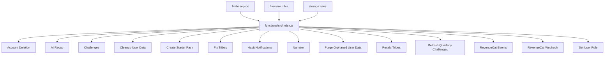
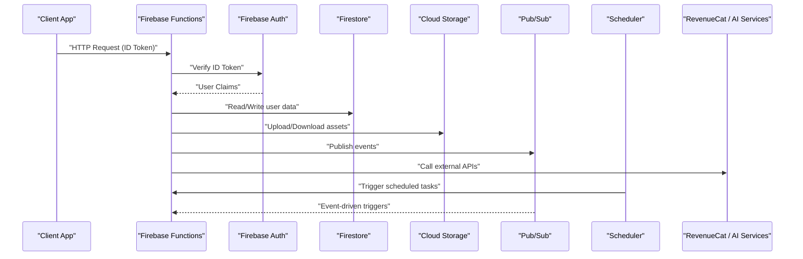
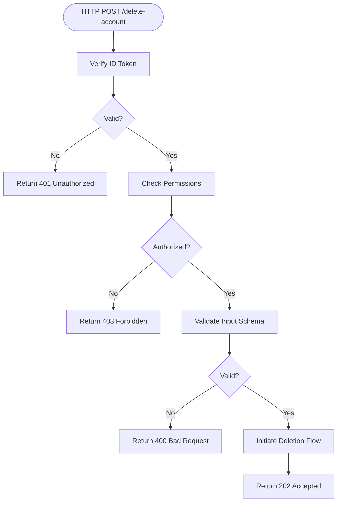
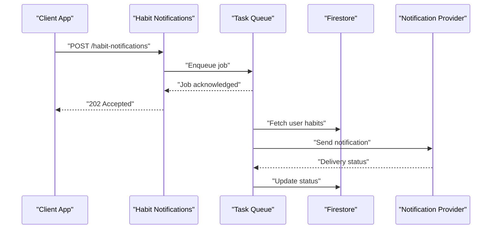
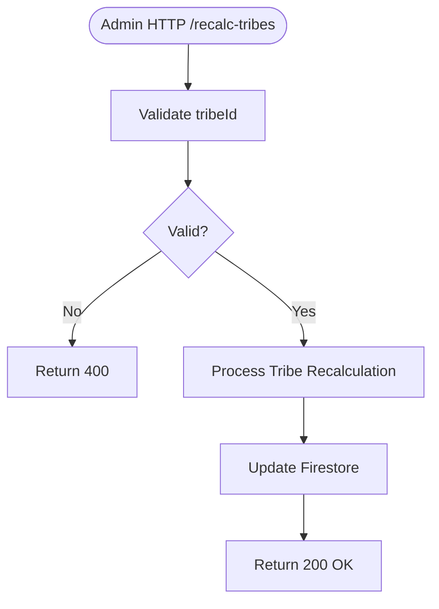
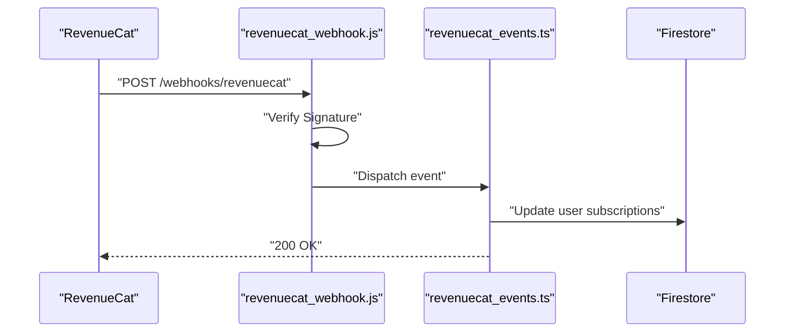
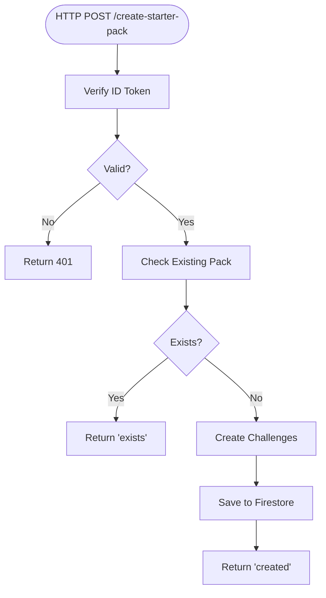
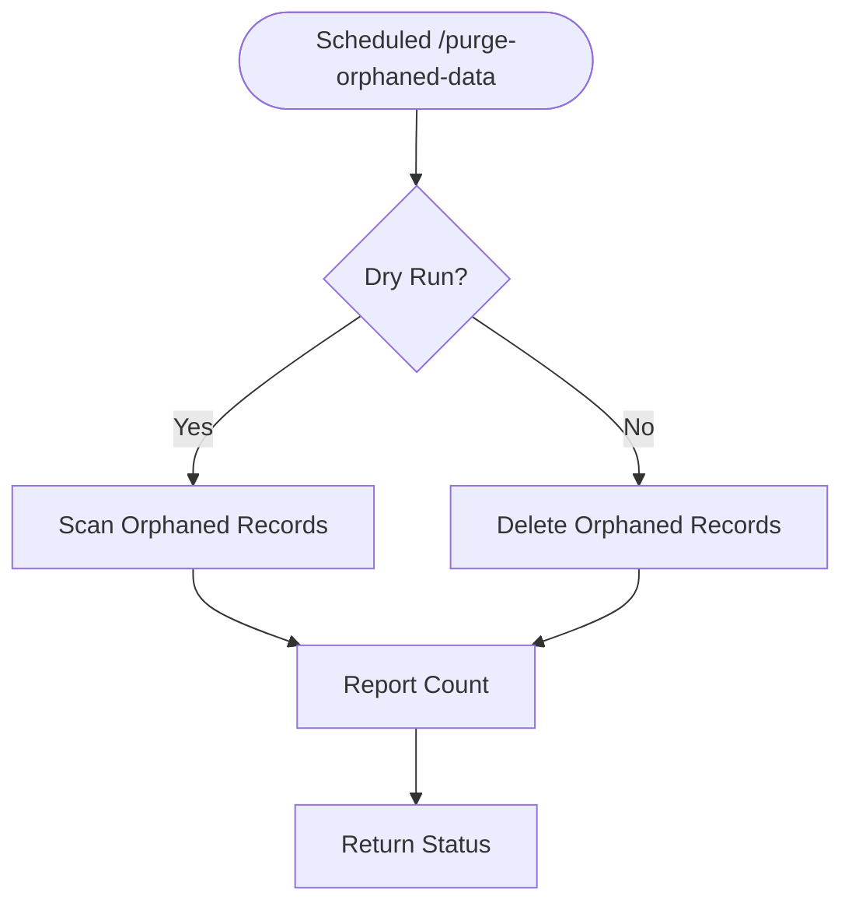
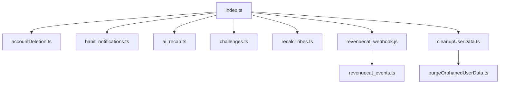

# Cloud Functions API

<cite>
**Referenced Files in This Document**
- [functions/src/index.ts](file://functions/src/index.ts)
- [functions/src/accountDeletion.ts](file://functions/src/accountDeletion.ts)
- [functions/src/ai_recap.ts](file://functions/src/ai_recap.ts)
- [functions/src/challenges.ts](file://functions/src/challenges.ts)
- [functions/src/cleanupUserData.ts](file://functions/src/cleanupUserData.ts)
- [functions/src/create_starter_pack.ts](file://functions/src/create_starter_pack.ts)
- [functions/src/fixTribes.ts](file://functions/src/fixTribes.ts)
- [functions/src/habit_notifications.ts](file://functions/src/habit_notifications.ts)
- [functions/src/narrator.ts](file://functions/src/narrator.ts)
- [functions/src/purgeOrphanedUserData.ts](file://functions/src/purgeOrphanedUserData.ts)
- [functions/src/rateLimiter.ts](file://functions/src/rateLimiter.ts)
- [functions/src/recalcTribes.ts](file://functions/src/recalcTribes.ts)
- [functions/src/refreshQuarterlyChallenges.ts](file://functions/src/refreshQuarterlyChallenges.ts)
- [functions/src/revenuecat_events.ts](file://functions/src/revenuecat_events.ts)
- [functions/src/revenuecat_webhook.js](file://functions/src/revenuecat_webhook.js)
- [functions/src/setUserRole.ts](file://functions/src/setUserRole.ts)
- [functions/package.json](file://functions/package.json)
- [functions/tsconfig.json](file://functions/tsconfig.json)
- [firebase.json](file://firebase.json)
- [firestore.rules](file://firestore.rules)
- [storage.rules](file://storage.rules)
</cite>

## Table of Contents
1. [Introduction](#introduction)
2. [Project Structure](#project-structure)
3. [Core Components](#core-components)
4. [Architecture Overview](#architecture-overview)
5. [Detailed Component Analysis](#detailed-component-analysis)
6. [Dependency Analysis](#dependency-analysis)
7. [Performance Considerations](#performance-considerations)
8. [Troubleshooting Guide](#troubleshooting-guide)
9. [Conclusion](#conclusion)
10. [Appendices](#appendices)

## Introduction
This document provides comprehensive API documentation for Firebase Cloud Functions exposed by the project. It covers HTTP-triggered endpoints, event-driven triggers, scheduled tasks, and real-time communication patterns. The scope includes account management, habit operations, social features (tribes), monetization handlers, and operational utilities. For each endpoint or trigger, we describe request/response schemas, authentication requirements, error handling patterns, rate limiting, security considerations, performance optimization strategies, deployment, testing, and monitoring approaches.

## Project Structure
The backend is implemented as a set of TypeScript and JavaScript functions under the functions directory, with an index that registers all exports. Configuration for Firebase CLI and rules are at the repository root.

**Diagram sources**
- [functions/src/index.ts](file://functions/src/index.ts)
- [firebase.json](file://firebase.json)
- [firestore.rules](file://firestore.rules)
- [storage.rules](file://storage.rules)

**Section sources**
- [functions/src/index.ts](file://functions/src/index.ts)
- [functions/package.json](file://functions/package.json)
- [functions/tsconfig.json](file://functions/tsconfig.json)
- [firebase.json](file://firebase.json)

## Core Components
This section outlines the primary functional modules and their responsibilities:

- Account Management
  - Account deletion lifecycle and data purging
  - User role assignment utilities
- Habit Operations
  - Habit notifications scheduling and dispatch
  - AI-powered recap generation
  - Challenge creation and refresh
- Social Features
  - Tribe recalculation and repair utilities
- Monetization
  - RevenueCat webhook processing and event ingestion
- Operational Utilities
  - Cleanup and purge routines
  - Rate limiting middleware
  - Seeding helpers for development/testing

Authentication and authorization:
- HTTP functions should validate Firebase ID tokens and enforce Firestore rules for resource access.
- Admin-only endpoints must verify admin claims or use service accounts where appropriate.

Error handling patterns:
- Use structured error responses with consistent codes and messages.
- Log errors with correlation IDs for tracing.

Rate limiting:
- Apply per-user and global rate limits using a shared limiter module.

Security considerations:
- Validate all inputs strictly.
- Enforce least privilege; avoid exposing sensitive operations via public HTTP endpoints.

Performance optimization:
- Batch writes to Firestore.
- Cache frequently accessed read data when safe.
- Use background tasks for long-running operations.

**Section sources**
- [functions/src/accountDeletion.ts](file://functions/src/accountDeletion.ts)
- [functions/src/setUserRole.ts](file://functions/src/setUserRole.ts)
- [functions/src/habit_notifications.ts](file://functions/src/habit_notifications.ts)
- [functions/src/ai_recap.ts](file://functions/src/ai_recap.ts)
- [functions/src/challenges.ts](file://functions/src/challenges.ts)
- [functions/src/recalcTribes.ts](file://functions/src/recalcTribes.ts)
- [functions/src/fixTribes.ts](file://functions/src/fixTribes.ts)
- [functions/src/revenuecat_events.ts](file://functions/src/revenuecat_events.ts)
- [functions/src/revenuecat_webhook.js](file://functions/src/revenuecat_webhook.js)
- [functions/src/cleanupUserData.ts](file://functions/src/cleanupUserData.ts)
- [functions/src/purgeOrphanedUserData.ts](file://functions/src/purgeOrphanedUserData.ts)
- [functions/src/rateLimiter.ts](file://functions/src/rateLimiter.ts)

## Architecture Overview
The system combines HTTP endpoints, event-driven triggers, and scheduled tasks orchestrated through Firebase Functions.

**Diagram sources**
- [functions/src/index.ts](file://functions/src/index.ts)
- [functions/src/revenuecat_webhook.js](file://functions/src/revenuecat_webhook.js)
- [functions/src/revenuecat_events.ts](file://functions/src/revenuecat_events.ts)
- [functions/src/habit_notifications.ts](file://functions/src/habit_notifications.ts)
- [functions/src/refreshQuarterlyChallenges.ts](file://functions/src/refreshQuarterlyChallenges.ts)

## Detailed Component Analysis

### HTTP Endpoints: Account Management
- Delete Account
  - Purpose: Initiate account deletion and schedule data cleanup.
  - Authentication: Requires valid Firebase ID token with user context.
  - Request schema:
    - idToken: string
    - reason?: string
  - Response schema:
    - status: "accepted" | "error"
    - message: string
    - jobId?: string
  - Error handling: Returns 401 on invalid token, 403 if insufficient permissions, 400 for malformed input, 500 for server errors.
  - Rate limiting: Enforced via shared limiter.
- Set User Role
  - Purpose: Assign roles to users (admin, reviewer, etc.).
  - Authentication: Admin-only; requires admin claims or service account.
  - Request schema:
    - uid: string
    - role: enum
  - Response schema:
    - success: boolean
    - message: string
  - Security: Restrict to admin endpoints; audit logs required.

**Diagram sources**
- [functions/src/accountDeletion.ts](file://functions/src/accountDeletion.ts)
- [functions/src/rateLimiter.ts](file://functions/src/rateLimiter.ts)

**Section sources**
- [functions/src/accountDeletion.ts](file://functions/src/accountDeletion.ts)
- [functions/src/setUserRole.ts](file://functions/src/setUserRole.ts)
- [functions/src/rateLimiter.ts](file://functions/src/rateLimiter.ts)

### HTTP Endpoints: Habit Operations
- Habit Notifications
  - Purpose: Schedule and send habit-related notifications.
  - Triggers: Scheduled tasks and event-driven updates.
  - Request schema (if HTTP):
    - userId: string
    - habitId: string
    - action: "schedule" | "send"
  - Response schema:
    - status: "scheduled" | "sent" | "error"
    - messageId?: string
  - Error handling: Retry policies for transient failures; dead-letter queue for persistent issues.
- AI Recap Generation
  - Purpose: Generate personalized recaps based on user activity.
  - Triggers: Event-driven on habit completion or scheduled daily.
  - Request schema (if HTTP):
    - userId: string
    - period: "daily" | "weekly"
  - Response schema:
    - status: "generated" | "queued" | "error"
    - recapId?: string
  - Performance: Use async queues; cache results for repeated requests.

**Diagram sources**
- [functions/src/habit_notifications.ts](file://functions/src/habit_notifications.ts)
- [functions/src/ai_recap.ts](file://functions/src/ai_recap.ts)

**Section sources**
- [functions/src/habit_notifications.ts](file://functions/src/habit_notifications.ts)
- [functions/src/ai_recap.ts](file://functions/src/ai_recap.ts)

### HTTP Endpoints: Social Features (Tribes)
- Recalculate Tribes
  - Purpose: Recompute tribe statistics and memberships.
  - Trigger: Scheduled task or admin HTTP call.
  - Request schema (HTTP):
    - tribeId?: string
  - Response schema:
    - status: "completed" | "in-progress" | "error"
    - affectedCount?: number
- Fix Tribes
  - Purpose: Repair inconsistent tribe data.
  - Trigger: Admin HTTP call.
  - Request schema (HTTP):
    - tribeId?: string
  - Response schema:
    - status: "fixed" | "skipped" | "error"
    - details?: object

**Diagram sources**
- [functions/src/recalcTribes.ts](file://functions/src/recalcTribes.ts)
- [functions/src/fixTribes.ts](file://functions/src/fixTribes.ts)

**Section sources**
- [functions/src/recalcTribes.ts](file://functions/src/recalcTribes.ts)
- [functions/src/fixTribes.ts](file://functions/src/fixTribes.ts)

### HTTP Endpoints: Monetization Handlers
- RevenueCat Webhook
  - Purpose: Ingest RevenueCat webhooks for subscription events.
  - Authentication: HMAC signature verification.
  - Request schema:
    - payload: object
    - headers: { "x-revenuecat-signature": string }
  - Response schema:
    - status: "processed" | "rejected" | "error"
    - eventId?: string
- RevenueCat Events
  - Purpose: Process internal events derived from RevenueCat payloads.
  - Trigger: Event-driven from webhook processor.
  - Request schema (internal):
    - eventType: string
    - eventData: object
  - Response schema:
    - status: "handled" | "failed"
    - error?: string

**Diagram sources**
- [functions/src/revenuecat_webhook.js](file://functions/src/revenuecat_webhook.js)
- [functions/src/revenuecat_events.ts](file://functions/src/revenuecat_events.ts)

**Section sources**
- [functions/src/revenuecat_webhook.js](file://functions/src/revenuecat_webhook.js)
- [functions/src/revenuecat_events.ts](file://functions/src/revenuecat_events.ts)

### HTTP Endpoints: Challenges
- Create Starter Pack
  - Purpose: Seed initial challenges for new users.
  - Authentication: Requires user ID token.
  - Request schema:
    - userId: string
    - archetype?: string
  - Response schema:
    - status: "created" | "exists" | "error"
    - challengeIds?: string[]
- Refresh Quarterly Challenges
  - Purpose: Periodically update challenge catalogs.
  - Trigger: Scheduled task.
  - Request schema (HTTP):
    - quarter: string
  - Response schema:
    - status: "refreshed" | "skipped" | "error"

**Diagram sources**
- [functions/src/create_starter_pack.ts](file://functions/src/create_starter_pack.ts)
- [functions/src/refreshQuarterlyChallenges.ts](file://functions/src/refreshQuarterlyChallenges.ts)

**Section sources**
- [functions/src/create_starter_pack.ts](file://functions/src/create_starter_pack.ts)
- [functions/src/refreshQuarterlyChallenges.ts](file://functions/src/refreshQuarterlyChallenges.ts)

### Operational Utilities
- Cleanup User Data
  - Purpose: Remove user-specific data upon deletion or archival.
  - Trigger: Event-driven or scheduled.
  - Request schema (HTTP):
    - userId: string
  - Response schema:
    - status: "cleaned" | "skipped" | "error"
- Purge Orphaned User Data
  - Purpose: Clean up orphaned records across collections.
  - Trigger: Scheduled task.
  - Request schema (HTTP):
    - dryRun?: boolean
  - Response schema:
    - status: "purged" | "dry-run" | "error"
    - count?: number
- Narrator
  - Purpose: Manage narrator interactions and state transitions.
  - Trigger: Event-driven or HTTP.
  - Request schema (HTTP):
    - userId: string
    - action: string
  - Response schema:
    - status: "updated" | "error"
    - nextState?: string

**Diagram sources**
- [functions/src/cleanupUserData.ts](file://functions/src/cleanupUserData.ts)
- [functions/src/purgeOrphanedUserData.ts](file://functions/src/purgeOrphanedUserData.ts)
- [functions/src/narrator.ts](file://functions/src/narrator.ts)

**Section sources**
- [functions/src/cleanupUserData.ts](file://functions/src/cleanupUserData.ts)
- [functions/src/purgeOrphanedUserData.ts](file://functions/src/purgeOrphanedUserData.ts)
- [functions/src/narrator.ts](file://functions/src/narrator.ts)

### WebSocket Functions
Real-time communication can be implemented using Firebase Functions with WebSockets or third-party providers. Ensure:
- Authentication via handshake with ID token validation.
- Room-based messaging with authorization checks.
- Rate limiting per connection and per message.
- Graceful disconnect handling and reconnection logic.

[No sources needed since this section provides general guidance]

### Event-Driven Triggers
Common triggers include:
- Firestore document changes for data synchronization.
- Auth events for user lifecycle management.
- Pub/Sub messages for decoupled processing.

Best practices:
- Idempotent handlers to prevent duplicate processing.
- Dead-letter queues for failed messages.
- Structured logging with trace IDs.

[No sources needed since this section provides general guidance]

### Scheduled Tasks
Examples:
- Daily recap generation.
- Quarterly challenge refresh.
- Periodic data purges and maintenance.

Configuration:
- Use Firebase Scheduler with cron expressions.
- Monitor execution logs and metrics.

[No sources needed since this section provides general guidance]

## Dependency Analysis
Functions depend on Firebase services and external APIs. Key dependencies include:
- Firebase Admin SDK for secure server-side operations.
- Firestore for data persistence.
- Cloud Storage for media assets.
- Pub/Sub for asynchronous messaging.
- External services like RevenueCat and AI providers.

**Diagram sources**
- [functions/src/index.ts](file://functions/src/index.ts)
- [functions/src/accountDeletion.ts](file://functions/src/accountDeletion.ts)
- [functions/src/habit_notifications.ts](file://functions/src/habit_notifications.ts)
- [functions/src/ai_recap.ts](file://functions/src/ai_recap.ts)
- [functions/src/challenges.ts](file://functions/src/challenges.ts)
- [functions/src/recalcTribes.ts](file://functions/src/recalcTribes.ts)
- [functions/src/revenuecat_webhook.js](file://functions/src/revenuecat_webhook.js)
- [functions/src/revenuecat_events.ts](file://functions/src/revenuecat_events.ts)
- [functions/src/cleanupUserData.ts](file://functions/src/cleanupUserData.ts)
- [functions/src/purgeOrphanedUserData.ts](file://functions/src/purgeOrphanedUserData.ts)

**Section sources**
- [functions/src/index.ts](file://functions/src/index.ts)
- [functions/package.json](file://functions/package.json)

## Performance Considerations
- Minimize cold starts by keeping dependencies lean and using pre-warming strategies.
- Batch database writes to reduce round trips.
- Implement caching for read-heavy endpoints.
- Use background tasks for long-running operations.
- Monitor function duration and memory usage; optimize accordingly.

[No sources needed since this section provides general guidance]

## Troubleshooting Guide
Common issues and resolutions:
- Authentication failures: Verify ID token validity and expiration.
- Permission errors: Check Firestore rules and admin claims.
- Rate limit exceeded: Adjust limits or implement backoff strategies.
- External API timeouts: Implement retries with exponential backoff.
- Data inconsistencies: Use idempotent handlers and reconciliation jobs.

Debugging steps:
- Enable detailed logging with correlation IDs.
- Use Firebase Emulator Suite for local testing.
- Inspect function logs and metrics in Firebase Console.

**Section sources**
- [functions/src/rateLimiter.ts](file://functions/src/rateLimiter.ts)
- [functions/src/revenuecat_webhook.js](file://functions/src/revenuecat_webhook.js)

## Conclusion
This documentation outlines the Firebase Cloud Functions architecture, endpoints, triggers, and operational procedures. By following the authentication, security, and performance guidelines, developers can build reliable and scalable backend services. Regular monitoring, testing, and maintenance ensure optimal functionality and user experience.

[No sources needed since this section summarizes without analyzing specific files]

## Appendices

### Deployment Checklist
- Review firebase.json configuration.
- Ensure environment variables are set.
- Deploy functions with proper profiles.
- Verify Firestore and Storage rules.

### Testing Procedures
- Unit tests for individual functions.
- Integration tests using Firebase Emulator Suite.
- Load testing for critical endpoints.

### Monitoring Approaches
- Configure alerts for error rates and latency.
- Track key metrics like invocation counts and durations.
- Set up log-based dashboards for observability.

**Section sources**
- [firebase.json](file://firebase.json)
- [functions/package.json](file://functions/package.json)
- [firestore.rules](file://firestore.rules)
- [storage.rules](file://storage.rules)