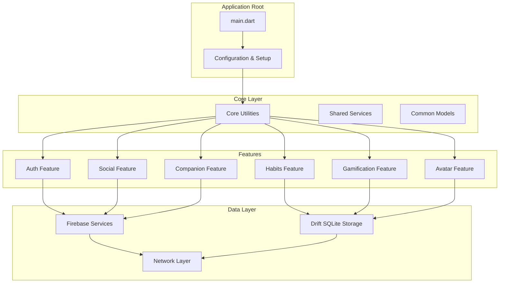
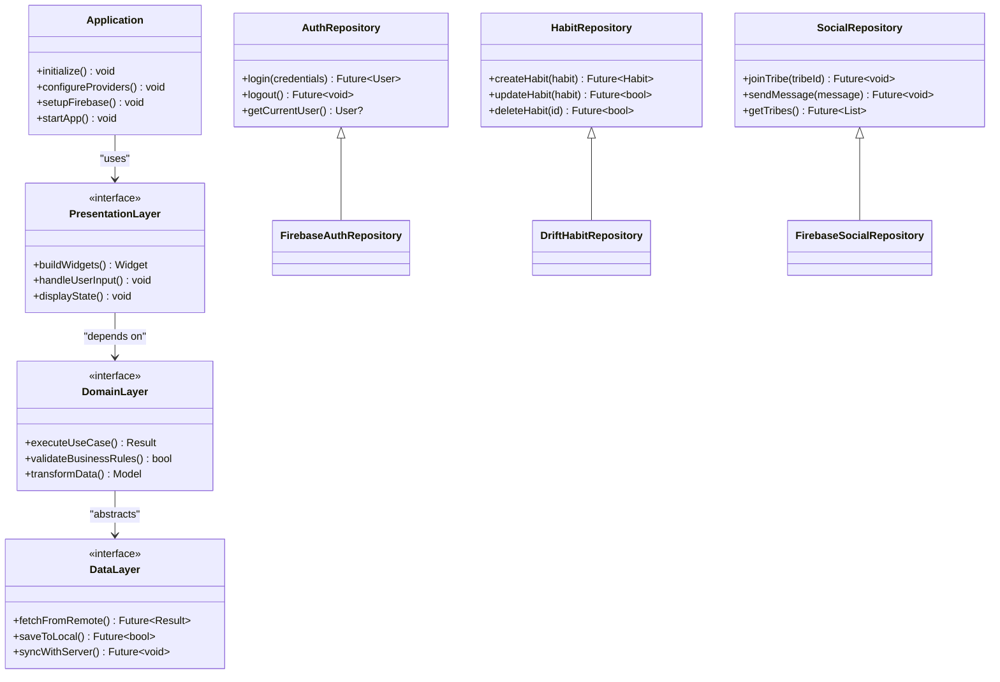
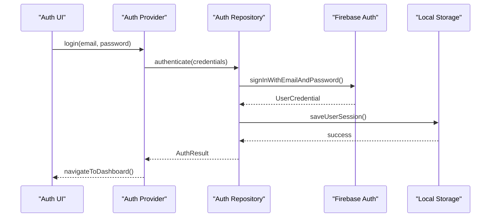
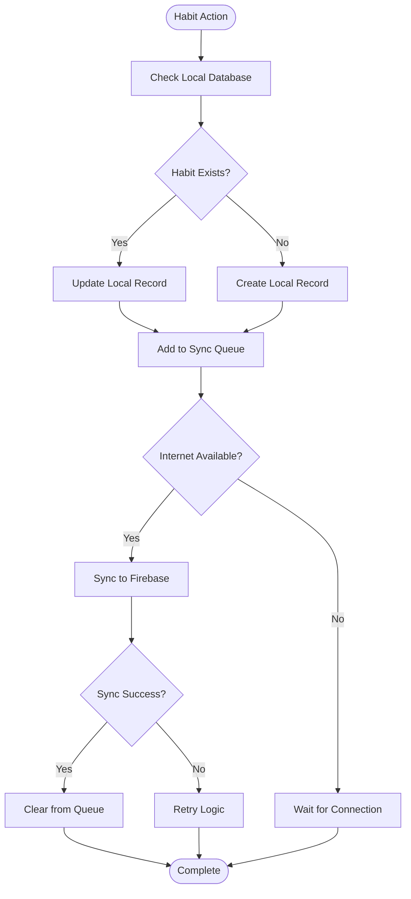
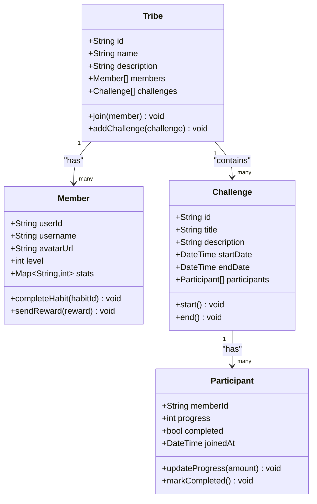
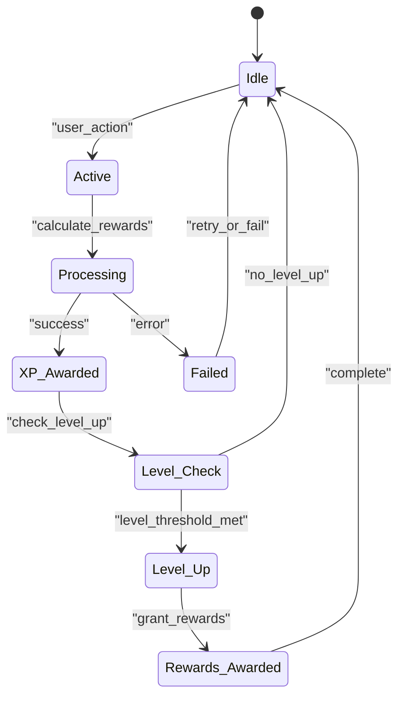
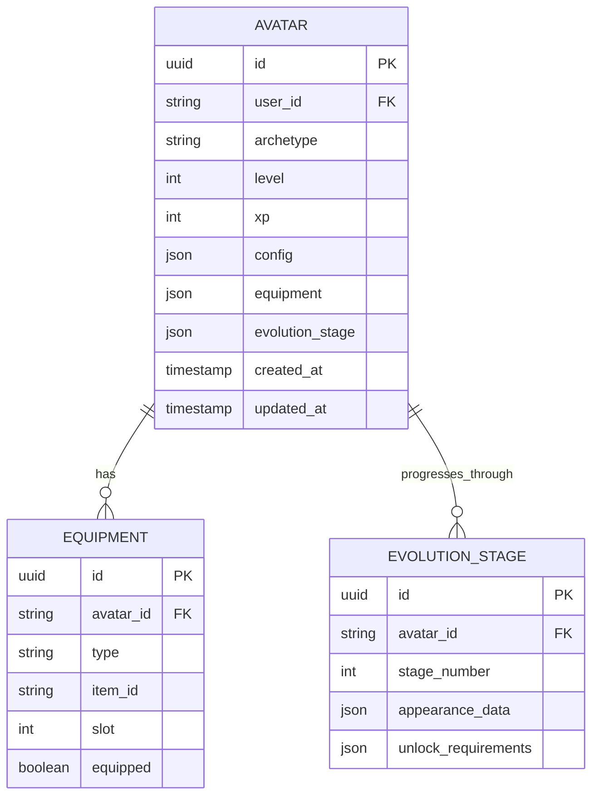
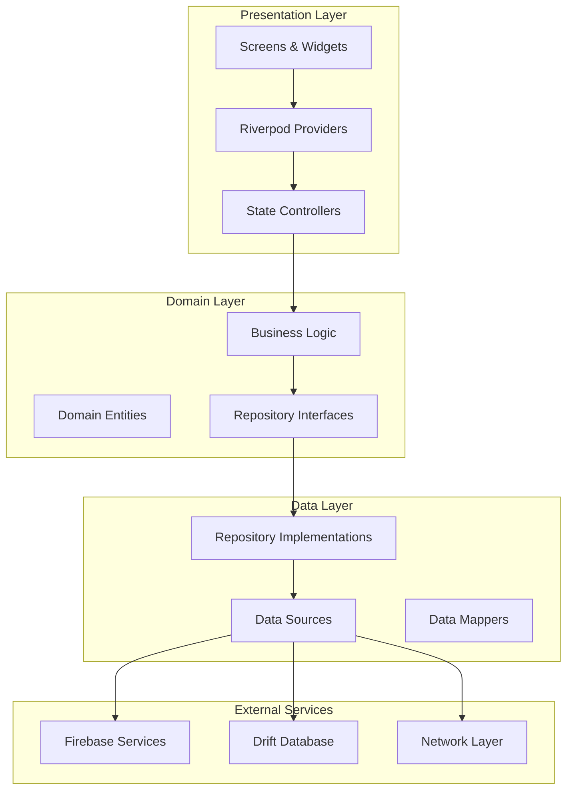
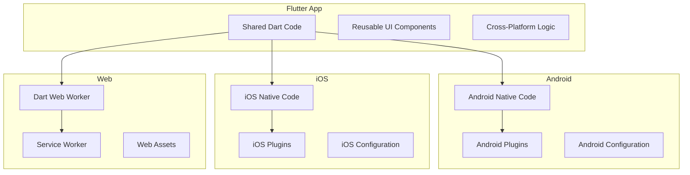

# Architecture Overview

<cite>
**Referenced Files in This Document**
- [main.dart](file://lib/main.dart)
- [ARCHITECTURE.md](file://docs/ARCHITECTURE.md)
- [project_structure.md](file://docs/project_structure.md)
- [pubspec.yaml](file://pubspec.yaml)
- [firebase.json](file://firebase.json)
- [firestore.rules](file://firestore.rules)
- [storage.rules](file://storage.rules)
- [drift_worker.dart](file://web/drift_worker.dart)
- [service-worker.js](file://web/service-worker.js)
- [index.html](file://web/index.html)
- [manifest.json](file://web/manifest.json)
- [offline.html](file://web/offline.html)
- [app_test.dart](file://integration_test/app_test.dart)
- [firebase_emulator_test.dart](file://integration_test/firebase_emulator_test.dart)
- [onboarding_flow_test.dart](file://integration_test/onboarding_flow_test.dart)
</cite>

## Table of Contents
1. [Introduction](#introduction)
2. [Project Structure](#project-structure)
3. [Core Components](#core-components)
4. [Architecture Overview](#architecture-overview)
5. [Detailed Component Analysis](#detailed-component-analysis)
6. [Dependency Analysis](#dependency-analysis)
7. [Performance Considerations](#performance-considerations)
8. [Troubleshooting Guide](#troubleshooting-guide)
9. [Conclusion](#conclusion)
10. [Appendices](#appendices)

## Introduction
This document provides a comprehensive architectural overview of the Emerge app, designed as a cross-platform Flutter application following clean architecture principles. The system is organized into presentation, domain, and data layers with feature-based modularization. It leverages Riverpod for dependency injection and state management, integrates Firebase services for authentication, real-time synchronization, and cloud storage, and uses Drift (SQLite) for robust local persistence. Real-time synchronization mechanisms ensure consistency between local and remote data sources. The architecture supports scalability, performance optimizations, and cross-platform compatibility across mobile and web platforms.

## Project Structure
The Emerge app follows a feature-based modular structure within the lib directory, organizing code by functional domains rather than technical layers. Each feature contains its own presentation, domain, and data layers, promoting loose coupling and high cohesion. The core directory houses shared utilities, configuration, and cross-cutting concerns.

**Diagram sources**
- [main.dart:1-50](file://lib/main.dart#L1-L50)
- [project_structure.md:10-30](file://docs/project_structure.md#L10-L30)

**Section sources**
- [main.dart:1-100](file://lib/main.dart#L1-L100)
- [project_structure.md:1-50](file://docs/project_structure.md#L1-L50)

## Core Components
The Emerge app's core components are built around several key architectural patterns:

### Clean Architecture Implementation
The application strictly adheres to clean architecture principles with clear separation between presentation, domain, and data layers. Each layer has distinct responsibilities and communicates through well-defined interfaces.

### Feature-Based Modularization
Each feature module encapsulates its own business logic, UI components, and data access patterns. This approach enables independent development, testing, and deployment of features while maintaining loose coupling between modules.

### Dependency Injection with Riverpod
Riverpod serves as the primary dependency injection framework, providing reactive state management and service location. Providers manage the lifecycle of services and ensure proper initialization order.

### State Management Strategies
The app employs multiple state management strategies including Riverpod providers for reactive state, ChangeNotifier for simple state updates, and value holders for immutable state representation.

**Section sources**
- [ARCHITECTURE.md:1-100](file://docs/ARCHITECTURE.md#L1-L100)
- [pubspec.yaml:1-50](file://pubspec.yaml#L1-L50)

## Architecture Overview
The Emerge app implements a layered architecture that separates concerns and promotes testability and maintainability.

**Diagram sources**
- [ARCHITECTURE.md:50-150](file://docs/ARCHITECTURE.md#L50-L150)
- [project_structure.md:30-80](file://docs/project_structure.md#L30-L80)

## Detailed Component Analysis

### Authentication System
The authentication system provides secure user identity management with support for multiple authentication providers and role-based access control.

**Diagram sources**
- [auth_repository_test.dart:1-50](file://test/features/auth/data/repositories/auth_repository_test.dart#L1-L50)
- [firebase_auth_repository.dart:1-100](file://lib/features/auth/data/repositories/firebase_auth_repository.dart#L1-L100)

### Habit Management System
The habit management system handles creation, tracking, and completion of user habits with local-first architecture and real-time synchronization.

**Diagram sources**
- [drift_habit_repository_test.dart:1-100](file://test/features/habits/data/repositories/drift_habit_repository_test.dart#L1-L100)
- [habit_repository_test.dart:1-80](file://test/features/habits/data/repositories/habit_repository_test.dart#L1-L80)

### Social Features System
The social features system enables community interactions through tribes, messaging, and collaborative challenges with real-time synchronization.

**Diagram sources**
- [social_mocks.dart:1-100](file://test/helpers/mocks/social_mocks.dart#L1-L100)
- [tribe_repository_test.dart:1-80](file://test/core/drift_repositories/drift_tribe_repository_test.dart#L1-L80)

### Gamification System
The gamification system provides XP, leveling, achievements, and rewards to motivate user engagement and habit formation.

**Diagram sources**
- [gamification_services_test.dart:1-100](file://test/features/gamification/domain/services/gamification_services_test.dart#L1-L100)
- [game_loop_engine_test.dart:1-80](file://test/core/game_loop/game_loop_engine_test.dart#L1-L80)

### Avatar System
The avatar system manages character customization, evolution stages, and visual representations that reflect user progress and achievements.

**Diagram sources**
- [avatar_data_test.dart:1-100](file://test/features/avatar/domain/models/avatar_data_test.dart#L1-L100)
- [avatar_config_test.dart:1-80](file://test/features/avatar/domain/models/avatar_config_test.dart#L1-L80)

## Dependency Analysis
The Emerge app maintains clear dependency boundaries and uses inversion of control to reduce coupling between components.

**Diagram sources**
- [ARCHITECTURE.md:100-200](file://docs/ARCHITECTURE.md#L100-L200)
- [project_structure.md:50-120](file://docs/project_structure.md#L50-L120)

**Section sources**
- [ARCHITECTURE.md:1-200](file://docs/ARCHITECTURE.md#L1-L200)
- [project_structure.md:1-120](file://docs/project_structure.md#L1-L120)

## Performance Considerations
The Emerge app implements several performance optimization strategies to ensure smooth user experience across different devices and network conditions.

### Local-First Architecture
The application prioritizes local data operations using Drift SQLite database, ensuring fast response times even when offline. Changes are synchronized with remote servers when connectivity is available.

### Efficient State Management
Riverpod providers are optimized for minimal rebuilds and efficient memory usage. State is structured immutably where possible to prevent unnecessary recompositions.

### Network Optimization
Firebase integration includes connection pooling, request batching, and intelligent caching strategies to minimize bandwidth usage and improve responsiveness.

### Memory Management
The app implements proper resource cleanup, image caching, and lazy loading of heavy assets to maintain optimal memory footprint.

## Troubleshooting Guide
Common issues and their solutions in the Emerge app architecture.

### Firebase Integration Issues
- **Authentication Failures**: Verify Firebase configuration and network connectivity
- **Real-time Sync Problems**: Check Firestore rules and security configurations
- **Storage Access Errors**: Validate storage rules and file permissions

### Database Synchronization Issues
- **Conflict Resolution**: Review merge strategies for concurrent modifications
- **Migration Failures**: Ensure proper versioning and backward compatibility
- **Performance Degradation**: Monitor query optimization and indexing

### Cross-Platform Compatibility
- **Web-Specific Issues**: Verify drift worker configuration and service worker setup
- **Mobile Platform Differences**: Test platform-specific behaviors and permissions
- **Asset Loading**: Ensure proper asset bundling for different platforms

**Section sources**
- [firebase_emulator_test.dart:1-100](file://integration_test/firebase_emulator_test.dart#L1-L100)
- [app_test.dart:1-80](file://integration_test/app_test.dart#L1-L80)

## Conclusion
The Emerge app demonstrates a well-architected Flutter application that successfully implements clean architecture principles with feature-based modularization. The combination of Riverpod for dependency injection, Firebase for cloud services, and Drift for local persistence creates a robust foundation for scalable habit-tracking functionality. The architecture supports cross-platform deployment while maintaining performance and user experience standards. The modular design enables independent feature development and testing, facilitating long-term maintainability and growth of the application.

## Appendices

### Cross-Platform Support
The application supports multiple platforms through Flutter's cross-platform capabilities with platform-specific optimizations.

**Diagram sources**
- [drift_worker.dart:1-50](file://web/drift_worker.dart#L1-L50)
- [service-worker.js:1-100](file://web/service-worker.js#L1-L100)
- [index.html:1-50](file://web/index.html#L1-L50)

### Security Considerations
The application implements comprehensive security measures including secure authentication, data encryption, and input validation.

### Testing Strategy
The app follows a comprehensive testing strategy covering unit tests, widget tests, integration tests, and end-to-end tests to ensure reliability and quality.