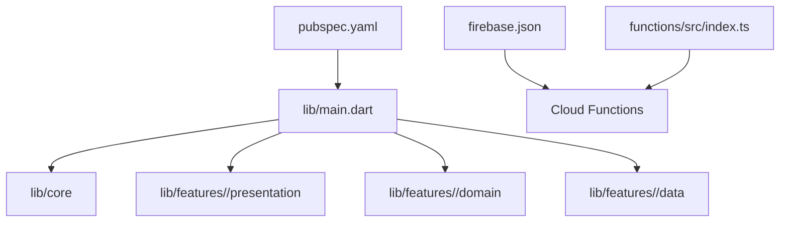
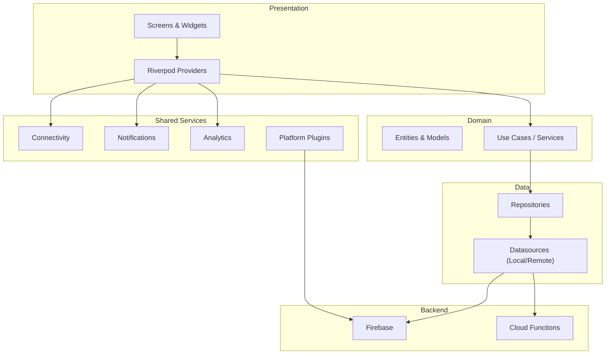
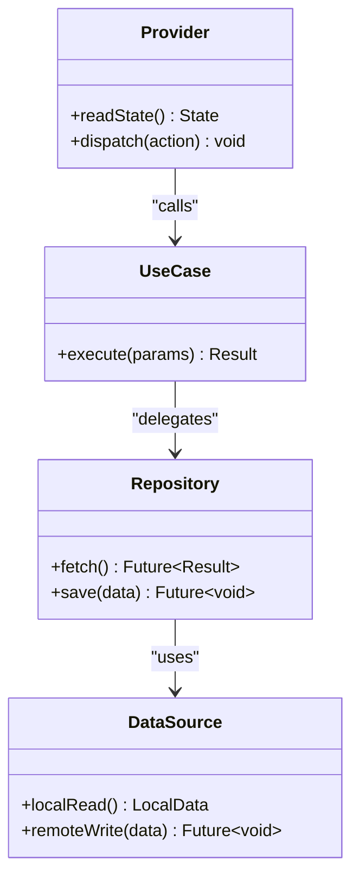
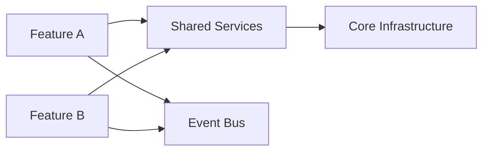
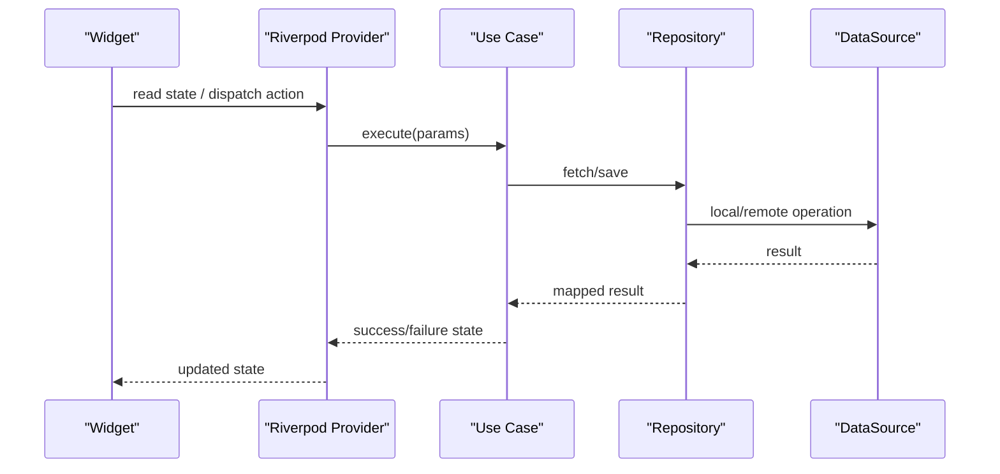
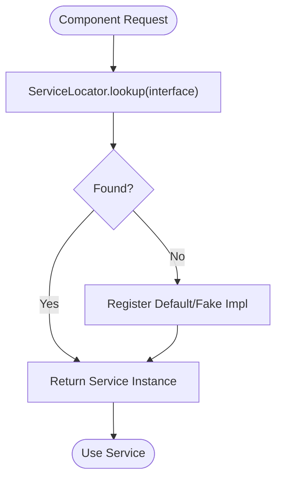
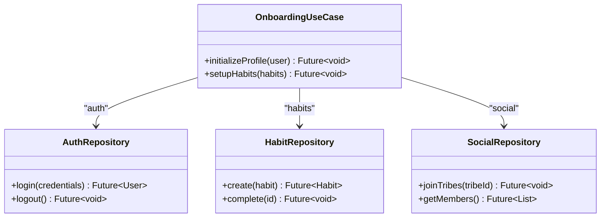
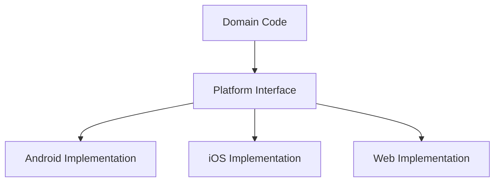
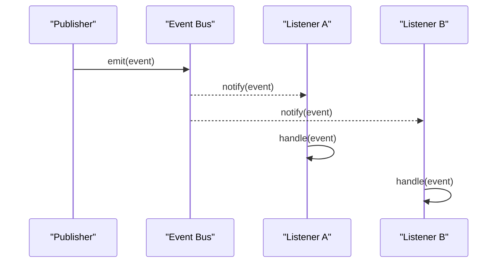
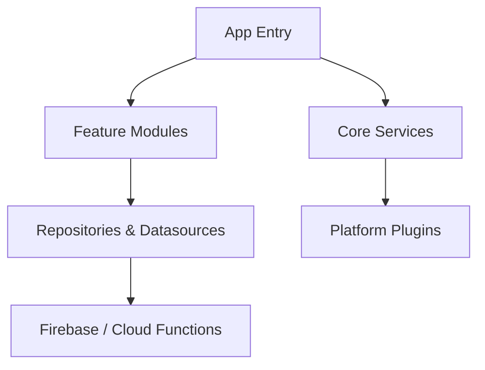

# Core Architecture Patterns

<cite>
**Referenced Files in This Document**
- [main.dart](file://lib/main.dart)
- [ARCHITECTURE.md](file://docs/ARCHITECTURE.md)
- [project_structure.md](file://docs/project_structure.md)
- [pubspec.yaml](file://pubspec.yaml)
- [firebase.json](file://firebase.json)
- [index.ts](file://functions/src/index.ts)
</cite>

## Table of Contents
1. [Introduction](#introduction)
2. [Project Structure](#project-structure)
3. [Core Components](#core-components)
4. [Architecture Overview](#architecture-overview)
5. [Detailed Component Analysis](#detailed-component-analysis)
6. [Dependency Analysis](#dependency-analysis)
7. [Performance Considerations](#performance-considerations)
8. [Troubleshooting Guide](#troubleshooting-guide)
9. [Conclusion](#conclusion)

## Introduction
This document explains the Emerge app’s core architecture patterns with a focus on clean architecture, feature-based modularity, dependency injection via Riverpod, service locator usage, repository abstractions, use case orchestration, plugin architecture for cross-platform capabilities, and event-driven communication across the system. It is intended for both technical and non-technical readers to understand how layers are separated, how features communicate through shared services, and how platform-specific functionality is integrated.

## Project Structure
The application follows a feature-based modular structure under lib/features, with each feature encapsulating its presentation (UI), domain (business logic and models), and data (repositories and datasources). Shared infrastructure lives under lib/core. The entry point initializes providers, configuration, and platform integrations.

**Diagram sources**
- [main.dart](file://lib/main.dart)
- [pubspec.yaml](file://pubspec.yaml)
- [firebase.json](file://firebase.json)
- [index.ts](file://functions/src/index.ts)

**Section sources**
- [project_structure.md](file://docs/project_structure.md)
- [ARCHITECTURE.md](file://docs/ARCHITECTURE.md)

## Core Components
- Clean Architecture Layers:
  - Presentation: UI widgets, screens, and Riverpod providers that bind state to views.
  - Domain: Entities, value objects, enums, and business rules; no framework dependencies.
  - Data: Repositories implementing domain interfaces, datasources for local and remote storage, and DTOs.
- Feature Modules: Each feature is self-contained with its own presentation, domain, and data subfolders.
- Dependency Injection: Riverpod providers expose repositories, services, and use cases to the presentation layer.
- Service Locator: Centralized access to shared services such as connectivity, notifications, analytics, and platform plugins.
- Repository Abstraction: Domain-facing contracts decouple UI from persistence and network details.
- Use Case Orchestration: Domain services or use cases coordinate multi-step operations across repositories and external APIs.
- Plugin Architecture: Platform-specific implementations abstracted behind interfaces for cross-platform behavior.
- Event-Driven Communication: Global events propagate state changes and user actions across features without tight coupling.

**Section sources**
- [ARCHITECTURE.md](file://docs/ARCHITECTURE.md)
- [project_structure.md](file://docs/project_structure.md)

## Architecture Overview
The system separates concerns into distinct layers and modules. Presentation depends on domain through providers; domain depends on data abstractions; data implements concrete datasources. Cross-cutting services are accessed via a service locator. Events enable loose coupling between features.

**Diagram sources**
- [ARCHITECTURE.md](file://docs/ARCHITECTURE.md)
- [pubspec.yaml](file://pubspec.yaml)
- [firebase.json](file://firebase.json)
- [index.ts](file://functions/src/index.ts)

## Detailed Component Analysis

### Clean Architecture Implementation
- Presentation Layer:
  - UI components consume Riverpod providers to read state and trigger actions.
  - Providers encapsulate business calls and map results to UI-friendly states.
- Domain Layer:
  - Pure Dart code defines entities, value objects, and business rules.
  - Use cases orchestrate workflows by calling repository methods.
- Data Layer:
  - Repositories implement domain interfaces and delegate to datasources.
  - Datasources handle local storage (e.g., Drift/Hive) and remote APIs (e.g., Firebase).

**Diagram sources**
- [ARCHITECTURE.md](file://docs/ARCHITECTURE.md)

**Section sources**
- [ARCHITECTURE.md](file://docs/ARCHITECTURE.md)

### Feature-Based Modular Structure
- Each feature folder contains:
  - presentation: screens, widgets, and Riverpod providers.
  - domain: entities, enums, and business services/use cases.
  - data: repositories and datasources.
- Features communicate via shared services and events rather than direct imports.

**Diagram sources**
- [project_structure.md](file://docs/project_structure.md)

**Section sources**
- [project_structure.md](file://docs/project_structure.md)

### Dependency Injection with Riverpod
- Providers define singletons or scoped instances for repositories, services, and use cases.
- Presentation binds to providers using consumer widgets or provider selectors.
- Testing leverages fake providers and overrides.

**Diagram sources**
- [ARCHITECTURE.md](file://docs/ARCHITECTURE.md)

**Section sources**
- [ARCHITECTURE.md](file://docs/ARCHITECTURE.md)

### Service Locator Pattern
- A central registry exposes shared services like connectivity, notifications, analytics, and platform plugins.
- Components request services by interface, enabling swapping implementations and mocking in tests.

**Diagram sources**
- [ARCHITECTURE.md](file://docs/ARCHITECTURE.md)

**Section sources**
- [ARCHITECTURE.md](file://docs/ARCHITECTURE.md)

### Repository Abstraction and Use Case Orchestration
- Repositories expose domain-level methods abstracting persistence and network calls.
- Use cases coordinate multiple repositories and external services to fulfill business requirements.

**Diagram sources**
- [ARCHITECTURE.md](file://docs/ARCHITECTURE.md)

**Section sources**
- [ARCHITECTURE.md](file://docs/ARCHITECTURE.md)

### Plugin Architecture for Cross-Platform Functionality
- Platform-specific features (e.g., notifications, file system, sensors) are abstracted behind interfaces.
- Implementations vary per platform while the domain remains unchanged.

**Diagram sources**
- [pubspec.yaml](file://pubspec.yaml)

**Section sources**
- [pubspec.yaml](file://pubspec.yaml)

### Event-Driven Communication Patterns
- Global events propagate state changes and user actions across features.
- Listeners subscribe to relevant events; publishers emit events without knowing subscribers.

**Diagram sources**
- [ARCHITECTURE.md](file://docs/ARCHITECTURE.md)

**Section sources**
- [ARCHITECTURE.md](file://docs/ARCHITECTURE.md)

## Dependency Analysis
- External Dependencies:
  - Flutter SDK and Dart runtime.
  - Firebase services for auth, database, and cloud functions.
  - Riverpod for dependency injection and state management.
  - Platform plugins for device capabilities.
- Internal Coupling:
  - Presentation depends on domain via providers.
  - Domain depends on data abstractions only.
  - Data depends on platform plugins and backend services.

**Diagram sources**
- [pubspec.yaml](file://pubspec.yaml)
- [firebase.json](file://firebase.json)
- [index.ts](file://functions/src/index.ts)

**Section sources**
- [pubspec.yaml](file://pubspec.yaml)
- [firebase.json](file://firebase.json)
- [index.ts](file://functions/src/index.ts)

## Performance Considerations
- Minimize rebuilds by using selective provider listeners and immutable state.
- Cache frequently accessed data locally and invalidate strategically.
- Batch network requests and leverage pagination for large datasets.
- Offload heavy computations to isolates or background tasks where appropriate.
- Profile memory usage and avoid retaining large objects in providers.

[No sources needed since this section provides general guidance]

## Troubleshooting Guide
- Common Issues:
  - Provider not found: Ensure proper registration in the root provider scope.
  - Circular dependencies: Refactor to break cycles via interfaces or lazy initialization.
  - Event listener leaks: Always dispose listeners when widgets are removed.
  - Platform plugin errors: Verify platform-specific setup and permissions.
- Debugging Tips:
  - Use provider logging to trace state changes.
  - Mock repositories in unit tests to isolate failures.
  - Validate connectivity and backend responses before UI updates.

**Section sources**
- [ARCHITECTURE.md](file://docs/ARCHITECTURE.md)

## Conclusion
Emerge’s architecture emphasizes clear separation of concerns, feature modularity, and robust dependency management. Clean architecture ensures testability and maintainability, while Riverpod and the service locator pattern provide flexible DI and shared service access. Repository abstractions and use case orchestration keep business logic cohesive. Plugin architecture enables cross-platform capabilities, and event-driven communication reduces coupling. Together, these patterns support scalable growth and reliable performance.

[No sources needed since this section summarizes without analyzing specific files]