# Feature Modules Structure

<cite>
**Referenced Files in This Document**
- [lib/main.dart](file://lib/main.dart)
- [lib/core/](file://lib/core/)
- [lib/features/](file://lib/features/)
- [docs/ARCHITECTURE.md](file://docs/ARCHITECTURE.md)
- [pubspec.yaml](file://pubspec.yaml)
- [android/app/build.gradle.kts](file://android/app/build.gradle.kts)
- [ios/Runner/Info.plist](file://ios/Runner/Info.plist)
</cite>

## Table of Contents
1. [Introduction](#introduction)
2. [Project Structure Overview](#project-structure-overview)
3. [Core Architecture Principles](#core-architecture-principles)
4. [Feature Module Organization](#feature-module-organization)
5. [Layered Architecture Pattern](#layered-architecture-pattern)
6. [Inter-Feature Communication](#inter-feature-communication)
7. [Shared Dependencies Management](#shared-dependencies-management)
8. [Feature Lifecycle and Initialization](#feature-lifecycle-and-initialization)
9. [Resource Isolation Strategies](#resource-isolation-strategies)
10. [New Feature Integration Guide](#new-feature-integration-guide)
11. [Feature Flagging and Conditional Loading](#feature-flagging-and-conditional-loading)
12. [Performance Considerations](#performance-considerations)
13. [Testing Strategy](#testing-strategy)
14. [Conclusion](#conclusion)

## Introduction

The Emerge app implements a sophisticated feature-based modular architecture that follows Clean Architecture principles and Flutter best practices. This architecture enables independent development, testing, and deployment of features while maintaining clear boundaries and consistent patterns across the application. The system is designed to support scalability, maintainability, and performance optimization for large-scale mobile applications.

The architecture separates concerns into distinct layers within each feature module: presentation (UI), domain (business logic), and data (persistence and external services). This separation ensures loose coupling between components while enabling tight cohesion within feature boundaries.

## Project Structure Overview

The Emerge app follows a feature-first organization pattern where each major functionality is encapsulated in its own module with clear internal structure:

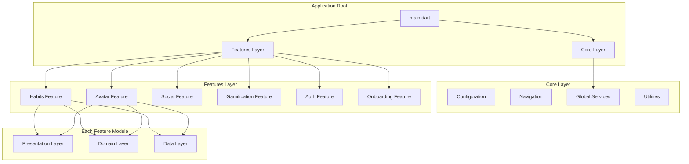

**Diagram sources**
- [lib/main.dart:1-50](file://lib/main.dart#L1-L50)
- [lib/core/](file://lib/core/)
- [lib/features/](file://lib/features/)

**Section sources**
- [lib/main.dart:1-100](file://lib/main.dart#L1-L100)
- [docs/ARCHITECTURE.md:1-200](file://docs/ARCHITECTURE.md#L1-L200)

## Core Architecture Principles

The Emerge app adheres to several key architectural principles that ensure maintainability and scalability:

### Separation of Concerns
Each feature module maintains strict separation between presentation, domain, and data layers. This prevents business logic from leaking into UI code and ensures testability.

### Dependency Inversion
Higher-level modules depend on abstractions rather than concrete implementations. This enables flexible swapping of implementations and facilitates mocking for testing.

### Single Responsibility Principle
Each class and module has a single, well-defined responsibility. This makes code easier to understand, test, and maintain.

### Open/Closed Principle
Modules are open for extension but closed for modification. New functionality can be added without changing existing code.

**Section sources**
- [docs/ARCHITECTURE.md:100-300](file://docs/ARCHITECTURE.md#L100-L300)

## Feature Module Organization

Each feature module in the Emerge app follows a consistent organizational pattern with three primary layers:

### Feature Directory Structure
```
lib/features/<feature_name>/
├── data/
│   ├── datasources/
│   ├── models/
│   └── repositories/
├── domain/
│   ├── entities/
│   ├── repositories/
│   └── services/
├── presentation/
│   ├── providers/
│   ├── screens/
│   └── widgets/
└── <feature>_module.dart
```

### Example Feature: Habits
The habits feature demonstrates the complete implementation pattern:

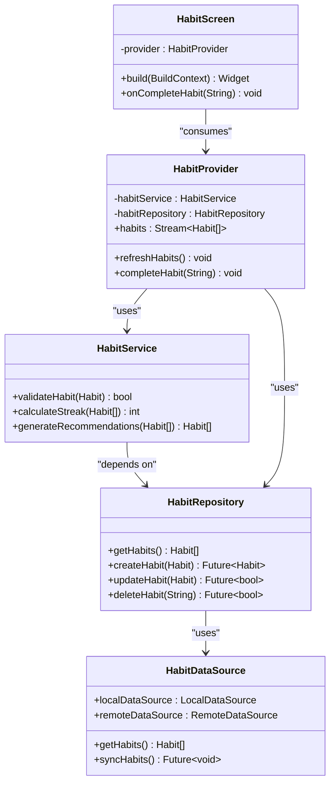

**Diagram sources**
- [lib/features/habits/data/repositories/habit_repository.dart:1-100](file://lib/features/habits/data/repositories/habit_repository.dart#L1-L100)
- [lib/features/habits/domain/services/habit_service.dart:1-150](file://lib/features/habits/domain/services/habit_service.dart#L1-L150)
- [lib/features/habits/presentation/providers/habit_provider.dart:1-200](file://lib/features/habits/presentation/providers/habit_provider.dart#L1-L200)

**Section sources**
- [lib/features/habits/](file://lib/features/habits/)
- [lib/features/avatar/](file://lib/features/avatar/)
- [lib/features/social/](file://lib/features/social/)

## Layered Architecture Pattern

Each feature module implements a three-layer architecture that promotes separation of concerns and testability:

### Presentation Layer
The presentation layer handles user interface logic and state management:

- **Providers**: State management using Riverpod or similar
- **Screens**: Full-screen UI components
- **Widgets**: Reusable UI components specific to the feature

### Domain Layer
The domain layer contains business logic and rules:

- **Entities**: Core business objects
- **Repositories**: Interfaces for data access
- **Services**: Business logic and use cases

### Data Layer
The data layer manages data persistence and external APIs:

- **Models**: Data structures for serialization
- **Datasources**: Local and remote data access
- **Repositories**: Concrete implementations of repository interfaces

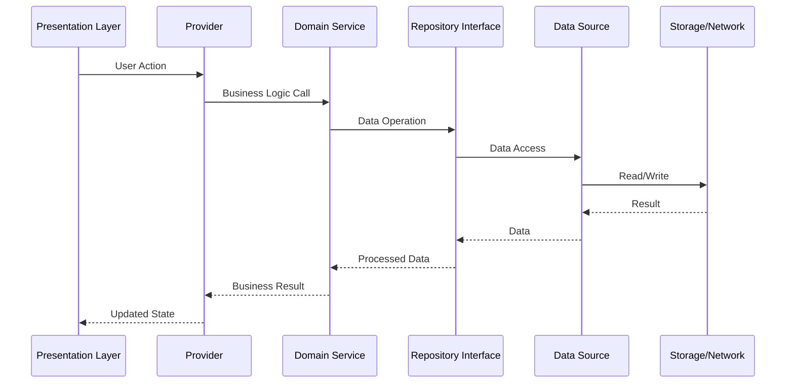

**Diagram sources**
- [lib/features/habits/presentation/providers/habit_provider.dart:1-200](file://lib/features/habits/presentation/providers/habit_provider.dart#L1-L200)
- [lib/features/habits/domain/services/habit_service.dart:1-150](file://lib/features/habits/domain/services/habit_service.dart#L1-L150)
- [lib/features/habits/data/repositories/habit_repository.dart:1-100](file://lib/features/habits/data/repositories/habit_repository.dart#L1-L100)

**Section sources**
- [lib/features/habits/presentation/](file://lib/features/habits/presentation/)
- [lib/features/habits/domain/](file://lib/features/habits/domain/)
- [lib/features/habits/data/](file://lib/features/habits/data/)

## Inter-Feature Communication

The Emerge app implements several mechanisms for inter-feature communication while maintaining loose coupling:

### Event Bus Pattern
Features communicate through a centralized event bus that allows decoupled messaging:

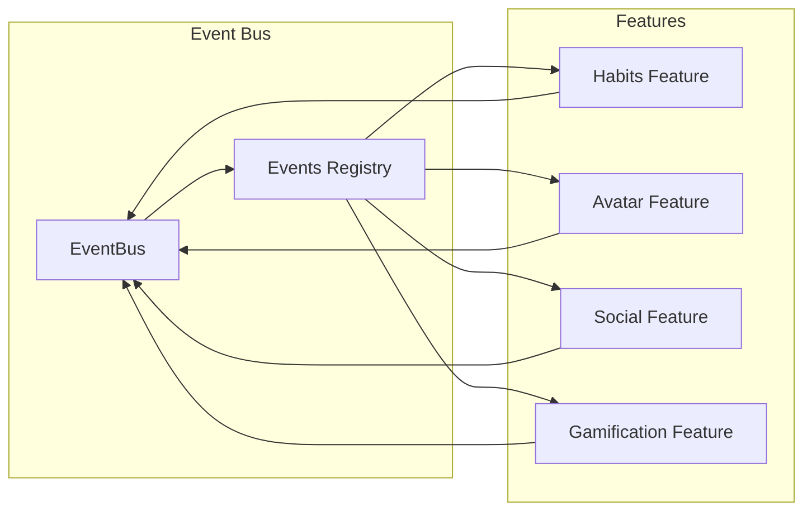

**Diagram sources**
- [lib/core/services/event_bus.dart:1-100](file://lib/core/services/event_bus.dart#L1-L100)
- [lib/features/habits/](file://lib/features/habits/)
- [lib/features/avatar/](file://lib/features/avatar/)

### Shared State Management
Common state is managed through global providers that multiple features can consume:

- **User State**: Authentication and user profile information
- **App Configuration**: Feature flags and app settings
- **Theme State**: App-wide theming and customization

### Dependency Injection
Features declare their dependencies through interfaces, allowing for flexible composition and testing:

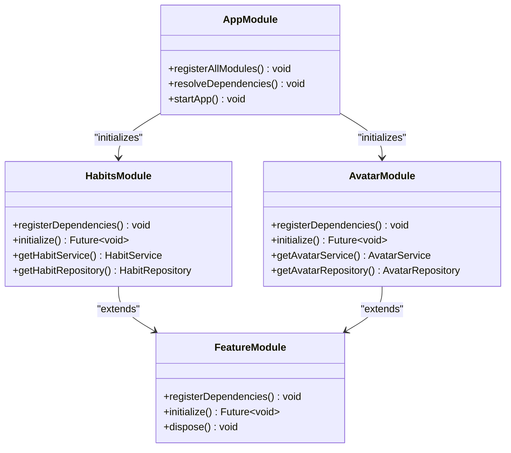

**Diagram sources**
- [lib/core/di/module.dart:1-150](file://lib/core/di/module.dart#L1-L150)
- [lib/features/habits/habits_module.dart:1-100](file://lib/features/habits/habits_module.dart#L1-L100)
- [lib/features/avatar/avatar_module.dart:1-100](file://lib/features/avatar/avatar_module.dart#L1-L100)

**Section sources**
- [lib/core/services/event_bus.dart:1-200](file://lib/core/services/event_bus.dart#L1-L200)
- [lib/core/di/](file://lib/core/di/)

## Shared Dependencies Management

The Emerge app uses a centralized dependency injection system to manage shared dependencies across features:

### Core Dependencies
Core services that are shared across all features:

- **Database**: SQLite/Drift for local storage
- **Network**: HTTP client for API calls
- **Storage**: SharedPreferences for app configuration
- **Authentication**: Firebase Auth integration
- **Analytics**: Crash reporting and analytics

### Feature-Specific Dependencies
Each feature manages its own dependencies while depending only on core abstractions:

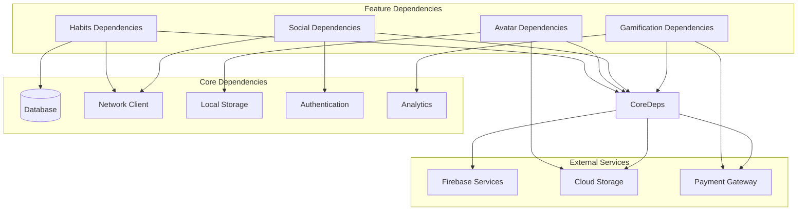

**Diagram sources**
- [lib/core/dependencies/](file://lib/core/dependencies/)
- [pubspec.yaml:1-100](file://pubspec.yaml#L1-L100)

**Section sources**
- [lib/core/dependencies/](file://lib/core/dependencies/)
- [pubspec.yaml:1-200](file://pubspec.yaml#L1-L200)

## Feature Lifecycle and Initialization

Each feature module follows a standardized lifecycle for initialization and cleanup:

### Module Registration
Features register themselves during app startup:

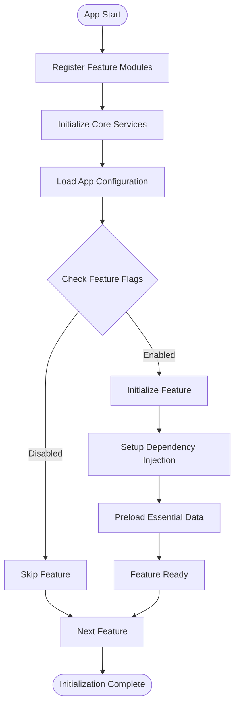

**Diagram sources**
- [lib/main.dart:1-150](file://lib/main.dart#L1-L150)
- [lib/core/bootstrap/app_bootstrap.dart:1-200](file://lib/core/bootstrap/app_bootstrap.dart#L1-L200)

### Initialization Order
Features initialize in a specific order to handle dependencies:

1. **Core Services**: Database, network, storage
2. **Authentication**: User session validation
3. **Configuration**: Feature flags and app settings
4. **Feature Modules**: Individual feature initialization
5. **Data Preloading**: Essential data for immediate use

### Cleanup and Resource Management
Features implement proper cleanup to prevent memory leaks:

- **Stream Disposal**: Proper disposal of reactive streams
- **Listener Removal**: Cleanup of event listeners
- **Resource Release**: Closing database connections and network clients

**Section sources**
- [lib/main.dart:1-200](file://lib/main.dart#L1-L200)
- [lib/core/bootstrap/app_bootstrap.dart:1-300](file://lib/core/bootstrap/app_bootstrap.dart#L1-L300)

## Resource Isolation Strategies

The Emerge app implements several strategies to isolate resources between features:

### Memory Isolation
- **Separate Providers**: Each feature has its own provider scope
- **State Encapsulation**: Feature state is not accessible outside the feature
- **Memory Leak Prevention**: Automatic cleanup of subscriptions and listeners

### Data Isolation
- **Database Schemas**: Separate tables/collections per feature
- **Cache Separation**: Distinct cache keys for different features
- **Serialization Boundaries**: Clear data format contracts between layers

### Network Isolation
- **API Versioning**: Each feature can have its own API version
- **Rate Limiting**: Per-feature rate limiting and quota management
- **Error Handling**: Feature-specific error handling and retry logic

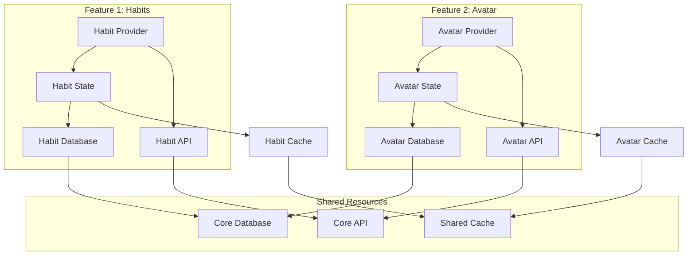

**Diagram sources**
- [lib/features/habits/presentation/providers/habit_provider.dart:1-200](file://lib/features/habits/presentation/providers/habit_provider.dart#L1-L200)
- [lib/features/avatar/presentation/providers/avatar_provider.dart:1-200](file://lib/features/avatar/presentation/providers/avatar_provider.dart#L1-L200)

**Section sources**
- [lib/features/habits/](file://lib/features/habits/)
- [lib/features/avatar/](file://lib/features/avatar/)

## New Feature Integration Guide

To add a new feature to the Emerge app, follow these steps:

### Step 1: Create Feature Structure
Create the basic directory structure following the established pattern:

```
lib/features/new_feature/
├── data/
│   ├── datasources/
│   ├── models/
│   └── repositories/
├── domain/
│   ├── entities/
│   ├── repositories/
│   └── services/
├── presentation/
│   ├── providers/
│   ├── screens/
│   └── widgets/
└── new_feature_module.dart
```

### Step 2: Implement Domain Layer
Define entities, repository interfaces, and business logic:

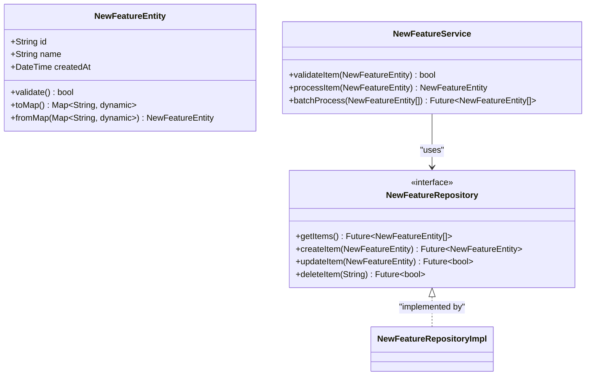

**Diagram sources**
- [lib/features/new_feature/domain/entities/new_feature_entity.dart:1-100](file://lib/features/new_feature/domain/entities/new_feature_entity.dart#L1-L100)
- [lib/features/new_feature/domain/repositories/new_feature_repository.dart:1-50](file://lib/features/new_feature/domain/repositories/new_feature_repository.dart#L1-L50)
- [lib/features/new_feature/domain/services/new_feature_service.dart:1-150](file://lib/features/new_feature/domain/services/new_feature_service.dart#L1-L150)

### Step 3: Implement Data Layer
Create data sources and repository implementations:

### Step 4: Implement Presentation Layer
Create providers, screens, and widgets:

### Step 5: Register Feature Module
Add the feature to the main module registration:

### Step 6: Add Tests
Create comprehensive tests for all layers:

**Section sources**
- [lib/features/habits/](file://lib/features/habits/)
- [lib/features/avatar/](file://lib/features/avatar/)

## Feature Flagging and Conditional Loading

The Emerge app implements a sophisticated feature flagging system that allows for conditional loading and runtime feature control:

### Feature Flag Architecture
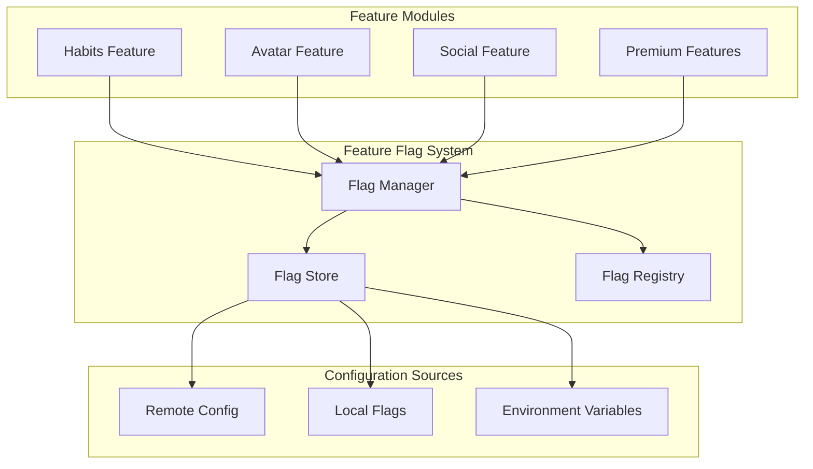

**Diagram sources**
- [lib/core/config/feature_flags.dart:1-200](file://lib/core/config/feature_flags.dart#L1-L200)
- [lib/core/config/flag_manager.dart:1-150](file://lib/core/config/flag_manager.dart#L1-L150)

### Implementation Pattern
Features check their flags before initialization:

```dart
// Feature initialization with flag checking
Future<void> initializeFeature() async {
  if (!await _featureFlagManager.isEnabled('new_feature')) {
    return; // Skip initialization
  }
  
  await _featureModule.initialize();
  await _featureModule.preloadData();
}
```

### Runtime Feature Control
Features can be enabled/disabled at runtime without app restart:

- **Development**: Enable/disable features during development
- **A/B Testing**: Test different feature variations
- **Gradual Rollout**: Slowly enable features for users
- **Emergency Shutdown**: Disable problematic features quickly

**Section sources**
- [lib/core/config/feature_flags.dart:1-300](file://lib/core/config/feature_flags.dart#L1-L300)
- [lib/core/config/flag_manager.dart:1-200](file://lib/core/config/flag_manager.dart#L1-L200)

## Performance Considerations

The Emerge app implements several performance optimization strategies for large feature sets:

### Lazy Loading
Features are loaded on-demand rather than at app startup:

- **Code Splitting**: Each feature is compiled separately
- **Deferred Imports**: Features load when first accessed
- **Progressive Enhancement**: Core features load first, others later

### Memory Management
- **Provider Scopes**: Each feature has isolated provider scopes
- **Automatic Cleanup**: Streams and listeners are automatically disposed
- **Image Caching**: Efficient image caching and memory management

### Database Optimization
- **Query Optimization**: Indexed queries and efficient data retrieval
- **Batch Operations**: Batch database operations for better performance
- **Connection Pooling**: Efficient database connection management

### Network Optimization
- **Request Caching**: Intelligent caching of API responses
- **Background Sync**: Background synchronization of data
- **Compression**: Request/response compression for large payloads

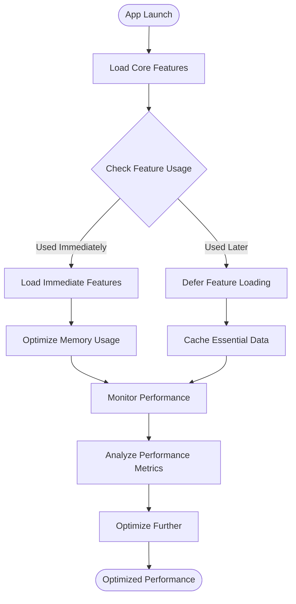

**Diagram sources**
- [lib/core/performance/performance_monitor.dart:1-200](file://lib/core/performance/performance_monitor.dart#L1-L200)
- [lib/core/cache/feature_cache.dart:1-150](file://lib/core/cache/feature_cache.dart#L1-L150)

**Section sources**
- [lib/core/performance/](file://lib/core/performance/)
- [lib/core/cache/](file://lib/core/cache/)

## Testing Strategy

The Emerge app implements comprehensive testing strategies for each feature module:

### Unit Testing
Each layer is tested independently:

- **Domain Tests**: Business logic and entity validation
- **Data Tests**: Repository and data source implementations
- **Presentation Tests**: Provider state and widget behavior

### Integration Testing
Cross-layer integration tests ensure proper communication:

- **Feature Integration**: Complete feature workflows
- **Dependency Injection**: Proper dependency resolution
- **Database Integration**: Real database operations

### Widget Testing
UI components are tested for visual correctness:

- **Widget Rendering**: Proper UI rendering
- **User Interactions**: Button clicks and form submissions
- **State Changes**: Correct state updates and UI reactions

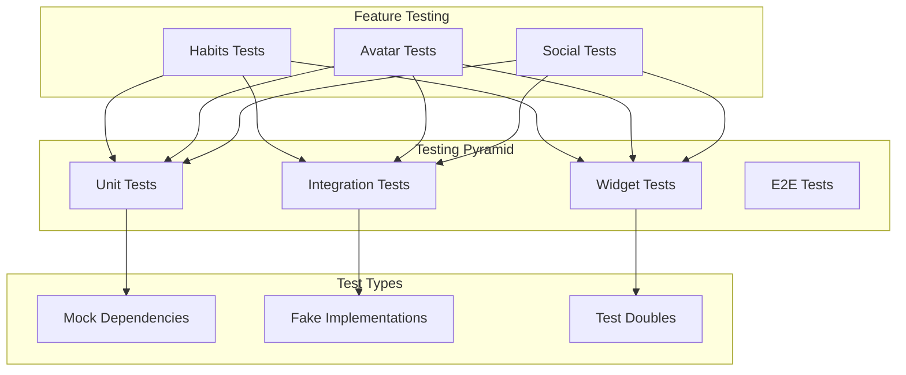

**Diagram sources**
- [test/features/habits/](file://test/features/habits/)
- [test/features/avatar/](file://test/features/avatar/)
- [test/helpers/mocks/](file://test/helpers/mocks/)

**Section sources**
- [test/features/](file://test/features/)
- [test/helpers/](file://test/helpers/)

## Conclusion

The Emerge app's feature-based modular architecture provides a robust foundation for scalable mobile application development. By following consistent patterns for feature organization, layered architecture, and dependency management, the application achieves excellent maintainability, testability, and performance characteristics.

Key benefits of this architecture include:

- **Independent Development**: Features can be developed, tested, and deployed independently
- **Clear Boundaries**: Well-defined interfaces between features prevent tight coupling
- **Scalability**: New features can be added without disrupting existing functionality
- **Performance**: Lazy loading and resource isolation optimize app performance
- **Testability**: Comprehensive testing strategies ensure code quality
- **Maintainability**: Consistent patterns make code easier to understand and modify

This architecture serves as a solid foundation for the continued growth and evolution of the Emerge app, supporting both current requirements and future enhancements.