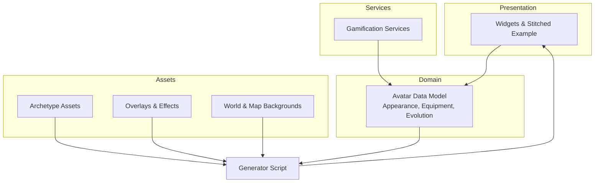
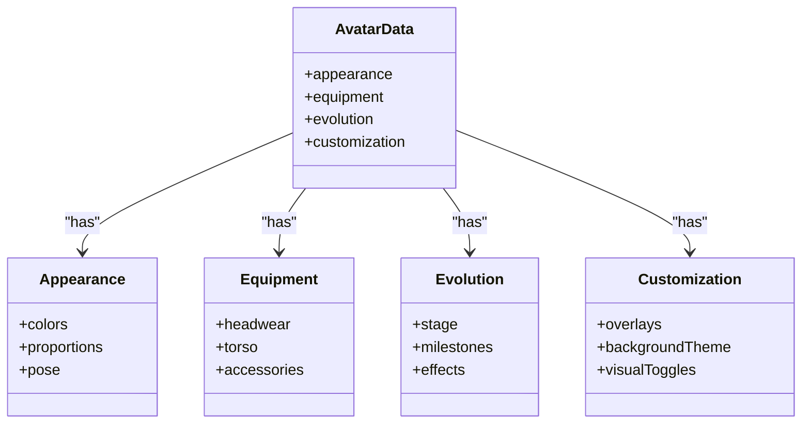
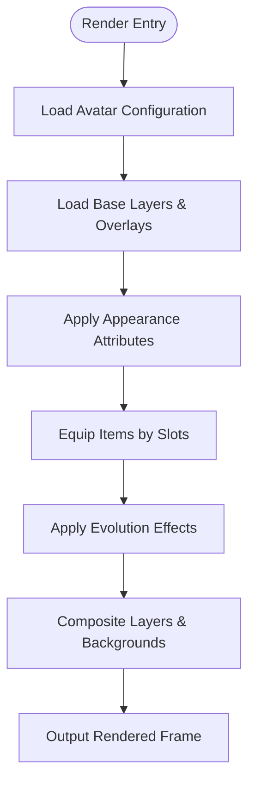
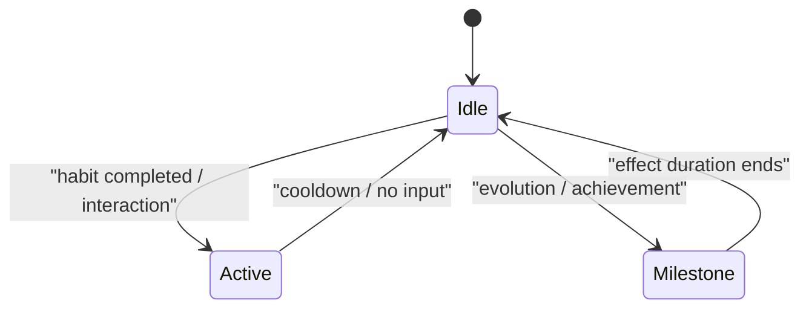
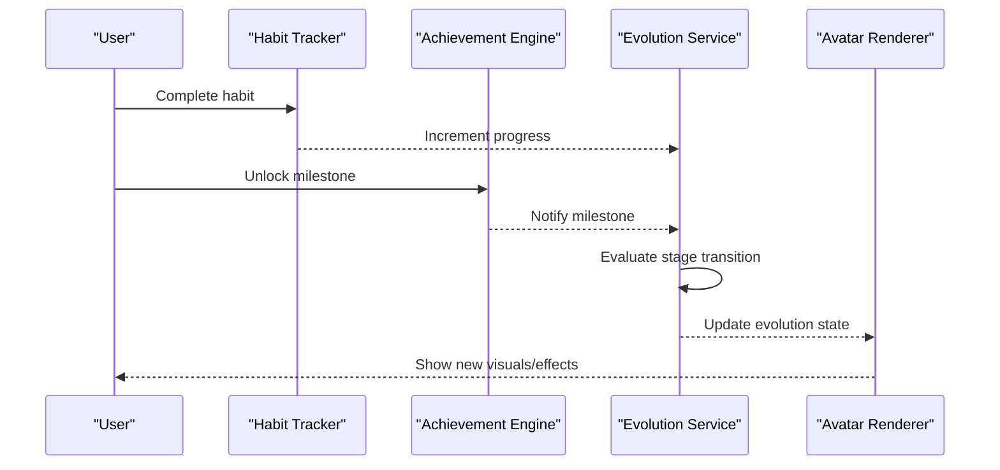
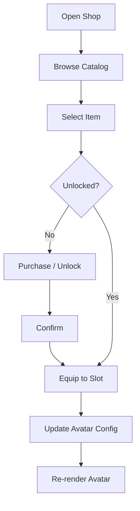
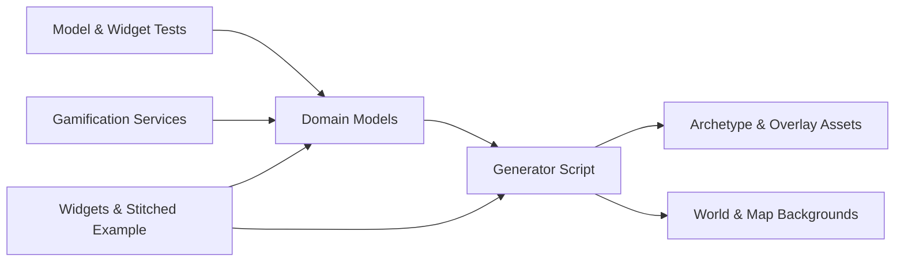

# Avatar & Evolution System

<cite>
**Referenced Files in This Document**
- [AVATAR_SYSTEM_DESIGN.md](file://docs/AVATAR_SYSTEM_DESIGN.md)
- [2026-06-27-avatar-system-design.md](file://docs/superpowers/specs/2026-06-27-avatar-system-design.md)
- [avatar_system_design.md](file://docs/superpowers/plans/2026-04-18-avatar-system-refactor.md)
- [evolution_overlays_and_effects.md](file://docs/asset_generation/evolution_overlays_and_effects.md)
- [evolution_stages.md](file://docs/asset_generation/evolution_stages.md)
- [item_shop.md](file://docs/asset_generation/item_shop.md)
- [athlete.md](file://docs/asset_generation/athlete.md)
- [creator.md](file://docs/asset_generation/creator.md)
- [scholar.md](file://docs/asset_generation/scholar.md)
- [stoic.md](file://docs/asset_generation/stoic.md)
- [zealot.md](file://docs/asset_generation/zealot.md)
- [world_backgrounds.md](file://docs/asset_generation/world_backgrounds.md)
- [world_map_backgrounds.md](file://docs/asset_generation/world_map_backgrounds.md)
- [world_backgrounds_video.md](file://docs/asset_generation/world_backgrounds_video.md)
- [stitch_avatar_code.html](file://stitch_welcome_to_emerge/avatar_system/code.html)
- [generate_complete_avatars.dart](file://tools/generate_complete_avatars.dart)
- [avatar_data_test.dart](file://test/features/avatar/domain/models/avatar_data_test.dart)
- [avatar_config_test.dart](file://test/features/avatar/domain/models/avatar_config_test.dart)
- [equipment_data_test.dart](file://test/features/avatar/domain/models/equipment_data_test.dart)
- [evolution_data_test.dart](file://test/features/avatar/domain/models/evolution_data_test.dart)
- [avatar_colors_test.dart](file://test/features/avatar/domain/models/avatar_colors_test.dart)
- [avatar_pose_test.dart](file://test/features/avatar/domain/models/avatar_pose_test.dart)
- [avatar_proportions_test.dart](file://test/features/avatar/domain/models/avatar_proportions_test.dart)
- [avatar_repository_test.dart](file://test/features/avatar/data/avatar_repository_test.dart)
- [fallback_initial_avatar_test.dart](file://test/core/presentation/widgets/fallback_initial_avatar_test.dart)
- [narrator_avatar_test.dart](file://test/features/narrator/narrator_avatar_test.dart)
- [evolving_silhouette_widget_test.dart](file://test/features/profile/evolving_silhouette_widget_test.dart)
</cite>

## Table of Contents
1. Introduction
2. Project Structure
3. Core Components
4. Architecture Overview
5. Detailed Component Analysis
6. Dependency Analysis
7. Performance Considerations
8. Troubleshooting Guide
9. Conclusion
10. Appendices

## Introduction
This document explains the avatar system and character evolution mechanics, focusing on the data model (appearance attributes, equipment slots, evolution stages, customization), procedural rendering, animation states, visual effects, evolution triggers (habits, achievements, progression), shop and equipping flows, and integration with gamification. It also provides guidance for configuration, custom styling, and performance optimization for rendering and memory management.

## Project Structure
The avatar system spans design specs, asset generation guides, tooling, tests, and UI stitching:
- Design and planning documents define the system’s goals, architecture, and evolution rules.
- Asset generation docs describe stage-specific visuals, overlays, and backgrounds.
- Tooling includes a generator script to produce complete avatar assets.
- Tests cover domain models, repositories, and presentation widgets.
- Stitched examples demonstrate end-to-end avatar usage in the app flow.

```mermaid
graph TB
subgraph "Design & Specs"
A["AVATAR_SYSTEM_DESIGN.md"]
B["2026-06-27-avatar-system-design.md"]
C["avatar_system_design.md"]
end
subgraph "Asset Generation"
D["evolution_stages.md"]
E["evolution_overlays_and_effects.md"]
F["item_shop.md"]
G["world_backgrounds.md"]
H["world_map_backgrounds.md"]
I["world_backgrounds_video.md"]
J["athlete.md"]
K["creator.md"]
L["scholar.md"]
M["stoic.md"]
N["zealot.md"]
end
subgraph "Tooling"
O["generate_complete_avatars.dart"]
end
subgraph "Tests"
P["avatar_data_test.dart"]
Q["avatar_config_test.dart"]
R["equipment_data_test.dart"]
S["evolution_data_test.dart"]
T["avatar_colors_test.dart"]
U["avatar_pose_test.dart"]
V["avatar_proportions_test.dart"]
W["avatar_repository_test.dart"]
X["fallback_initial_avatar_test.dart"]
Y["narrator_avatar_test.dart"]
Z["evolving_silhouette_widget_test.dart"]
end
subgraph "Stitched Example"
AA["stitch_avatar_code.html"]
end
A --> D
B --> D
C --> D
D --> O
E --> O
F --> O
G --> O
H --> O
I --> O
J --> O
K --> O
L --> O
M --> O
N --> O
P --> O
Q --> O
R --> O
S --> O
T --> O
U --> O
V --> O
W --> O
X --> O
Y --> O
Z --> O
AA --> O
```

**Diagram sources**
- [AVATAR_SYSTEM_DESIGN.md](file://docs/AVATAR_SYSTEM_DESIGN.md)
- [2026-06-27-avatar-system-design.md](file://docs/superpowers/specs/2026-06-27-avatar-system-design.md)
- [avatar_system_design.md](file://docs/superpowers/plans/2026-04-18-avatar-system-refactor.md)
- [evolution_stages.md](file://docs/asset_generation/evolution_stages.md)
- [evolution_overlays_and_effects.md](file://docs/asset_generation/evolution_overlays_and_effects.md)
- [item_shop.md](file://docs/asset_generation/item_shop.md)
- [world_backgrounds.md](file://docs/asset_generation/world_backgrounds.md)
- [world_map_backgrounds.md](file://docs/asset_generation/world_map_backgrounds.md)
- [world_backgrounds_video.md](file://docs/asset_generation/world_backgrounds_video.md)
- [athlete.md](file://docs/asset_generation/athlete.md)
- [creator.md](file://docs/asset_generation/creator.md)
- [scholar.md](file://docs/asset_generation/scholar.md)
- [stoic.md](file://docs/asset_generation/stoic.md)
- [zealot.md](file://docs/asset_generation/zealot.md)
- [generate_complete_avatars.dart](file://tools/generate_complete_avatars.dart)
- [avatar_data_test.dart](file://test/features/avatar/domain/models/avatar_data_test.dart)
- [avatar_config_test.dart](file://test/features/avatar/domain/models/avatar_config_test.dart)
- [equipment_data_test.dart](file://test/features/avatar/domain/models/equipment_data_test.dart)
- [evolution_data_test.dart](file://test/features/avatar/domain/models/evolution_data_test.dart)
- [avatar_colors_test.dart](file://test/features/avatar/domain/models/avatar_colors_test.dart)
- [avatar_pose_test.dart](file://test/features/avatar/domain/models/avatar_pose_test.dart)
- [avatar_proportions_test.dart](file://test/features/avatar/domain/models/avatar_proportions_test.dart)
- [avatar_repository_test.dart](file://test/features/avatar/data/avatar_repository_test.dart)
- [fallback_initial_avatar_test.dart](file://test/core/presentation/widgets/fallback_initial_avatar_test.dart)
- [narrator_avatar_test.dart](file://test/features/narrator/narrator_avatar_test.dart)
- [evolving_silhouette_widget_test.dart](file://test/features/profile/evolving_silhouette_widget_test.dart)
- [stitch_avatar_code.html](file://stitch_welcome_to_emerge/avatar_system/code.html)

**Section sources**
- [AVATAR_SYSTEM_DESIGN.md](file://docs/AVATAR_SYSTEM_DESIGN.md)
- [2026-06-27-avatar-system-design.md](file://docs/superpowers/specs/2026-06-27-avatar-system-design.md)
- [avatar_system_design.md](file://docs/superpowers/plans/2026-04-18-avatar-system-refactor.md)

## Core Components
- Avatar Data Model: Appearance attributes (colors, proportions, pose), equipment slots, evolution stages, and customization options are defined by domain models validated through tests.
- Procedural Rendering: The generator script composes layered assets based on configuration, including overlays and effects tied to evolution state.
- Animation States: Visual states reflect idle, active, and milestone-triggered animations; these are driven by configuration and effect layers.
- Evolution Mechanics: Progression is gated by habit completion, achievement milestones, and user progression metrics, updating stage and visual effects accordingly.
- Shop and Equipping: Item catalog and slot-based equipping allow cosmetic changes without altering core stats.
- Integration Points: Gamification services drive evolution triggers; world backgrounds and map backgrounds provide contextual environments.

Key implementation anchors:
- Domain model validation via tests ensures robustness of appearance, equipment, and evolution data.
- Generator orchestrates asset composition from archetype-specific assets and global overlays/effects.
- Stitched example demonstrates runtime configuration and rendering pipeline.

**Section sources**
- [avatar_data_test.dart](file://test/features/avatar/domain/models/avatar_data_test.dart)
- [avatar_config_test.dart](file://test/features/avatar/domain/models/avatar_config_test.dart)
- [equipment_data_test.dart](file://test/features/avatar/domain/models/equipment_data_test.dart)
- [evolution_data_test.dart](file://test/features/avatar/domain/models/evolution_data_test.dart)
- [avatar_colors_test.dart](file://test/features/avatar/domain/models/avatar_colors_test.dart)
- [avatar_pose_test.dart](file://test/features/avatar/domain/models/avatar_pose_test.dart)
- [avatar_proportions_test.dart](file://test/features/avatar/domain/models/avatar_proportions_test.dart)
- [generate_complete_avatars.dart](file://tools/generate_complete_avatars.dart)
- [stitch_avatar_code.html](file://stitch_welcome_to_emerge/avatar_system/code.html)

## Architecture Overview
The avatar system follows a layered architecture:
- Presentation Layer: Widgets and stitched examples render avatars using configuration and asset bundles.
- Domain Layer: Models represent appearance, equipment, and evolution state; tests validate constraints and transitions.
- Services/Providers: Gamification services supply progression signals that trigger evolution updates.
- Asset Pipeline: Archetype-specific assets and global overlays/effects are composed into final frames.

**Diagram sources**
- [AVATAR_SYSTEM_DESIGN.md](file://docs/AVATAR_SYSTEM_DESIGN.md)
- [2026-06-27-avatar-system-design.md](file://docs/superpowers/specs/2026-06-27-avatar-system-design.md)
- [avatar_system_design.md](file://docs/superpowers/plans/2026-04-18-avatar-system-refactor.md)
- [evolution_overlays_and_effects.md](file://docs/asset_generation/evolution_overlays_and_effects.md)
- [world_backgrounds.md](file://docs/asset_generation/world_backgrounds.md)
- [world_map_backgrounds.md](file://docs/asset_generation/world_map_backgrounds.md)
- [generate_complete_avatars.dart](file://tools/generate_complete_avatars.dart)

## Detailed Component Analysis

### Avatar Data Model
The data model encapsulates:
- Appearance attributes: colors, proportions, pose, and other cosmetic parameters.
- Equipment slots: headwear, torso, accessories, etc., each with identifiers and variants.
- Evolution stages: discrete levels reflecting progression, unlocking new visuals and effects.
- Customization options: toggles for overlays, effects, and background themes.

Validation and constraints are enforced through dedicated tests covering all aspects of the model.

**Diagram sources**
- [avatar_data_test.dart](file://test/features/avatar/domain/models/avatar_data_test.dart)
- [avatar_config_test.dart](file://test/features/avatar/domain/models/avatar_config_test.dart)
- [equipment_data_test.dart](file://test/features/avatar/domain/models/equipment_data_test.dart)
- [evolution_data_test.dart](file://test/features/avatar/domain/models/evolution_data_test.dart)
- [avatar_colors_test.dart](file://test/features/avatar/domain/models/avatar_colors_test.dart)
- [avatar_pose_test.dart](file://test/features/avatar/domain/models/avatar_pose_test.dart)
- [avatar_proportions_test.dart](file://test/features/avatar/domain/models/avatar_proportions_test.dart)

**Section sources**
- [avatar_data_test.dart](file://test/features/avatar/domain/models/avatar_data_test.dart)
- [avatar_config_test.dart](file://test/features/avatar/domain/models/avatar_config_test.dart)
- [equipment_data_test.dart](file://test/features/avatar/domain/models/equipment_data_test.dart)
- [evolution_data_test.dart](file://test/features/avatar/domain/models/evolution_data_test.dart)
- [avatar_colors_test.dart](file://test/features/avatar/domain/models/avatar_colors_test.dart)
- [avatar_pose_test.dart](file://test/features/avatar/domain/models/avatar_pose_test.dart)
- [avatar_proportions_test.dart](file://test/features/avatar/domain/models/avatar_proportions_test.dart)

### Procedural Rendering System
Rendering is driven by configuration and asset composition:
- Inputs: Avatar configuration (appearance, equipment, evolution, customization).
- Assets: Archetype-specific base layers, overlays, effects, and backgrounds.
- Output: Final rendered frame(s) suitable for display or animation.

The generator script orchestrates layering and effect application based on current state.

**Diagram sources**
- [generate_complete_avatars.dart](file://tools/generate_complete_avatars.dart)
- [evolution_overlays_and_effects.md](file://docs/asset_generation/evolution_overlays_and_effects.md)
- [world_backgrounds.md](file://docs/asset_generation/world_backgrounds.md)
- [world_map_backgrounds.md](file://docs/asset_generation/world_map_backgrounds.md)

**Section sources**
- [generate_complete_avatars.dart](file://tools/generate_complete_avatars.dart)
- [evolution_overlays_and_effects.md](file://docs/asset_generation/evolution_overlays_and_effects.md)
- [world_backgrounds.md](file://docs/asset_generation/world_backgrounds.md)
- [world_map_backgrounds.md](file://docs/asset_generation/world_map_backgrounds.md)

### Animation States and Visual Effects
Animation states reflect user activity and milestones:
- Idle state: default loop for non-active periods.
- Active state: triggered by habit completions or interactions.
- Milestone state: special effects upon evolution or achievement unlocks.

Effects include overlays, particle-like elements, and background transitions aligned with evolution stages.

**Diagram sources**
- [evolution_overlays_and_effects.md](file://docs/asset_generation/evolution_overlays_and_effects.md)
- [evolution_stages.md](file://docs/asset_generation/evolution_stages.md)

**Section sources**
- [evolution_overlays_and_effects.md](file://docs/asset_generation/evolution_overlays_and_effects.md)
- [evolution_stages.md](file://docs/asset_generation/evolution_stages.md)

### Evolution Mechanics
Evolution is tied to:
- Habit completion: consistent tracking increments progress toward next stage.
- Achievement milestones: specific thresholds unlock new visuals and effects.
- User progression: cumulative metrics influence stage transitions.

Triggers update the evolution state, which cascades into rendering changes and potential background shifts.

**Diagram sources**
- [evolution_stages.md](file://docs/asset_generation/evolution_stages.md)
- [evolution_overlays_and_effects.md](file://docs/asset_generation/evolution_overlays_and_effects.md)

**Section sources**
- [evolution_stages.md](file://docs/asset_generation/evolution_stages.md)
- [evolution_overlays_and_effects.md](file://docs/asset_generation/evolution_overlays_and_effects.md)

### Avatar Shop System and Item Equipping
The shop provides:
- Catalog of cosmetic items mapped to equipment slots.
- Purchase/unlock flows integrated with gamification rewards.
- Equipping interface that updates configuration and re-renders the avatar.

Equipping updates the equipment layer and may trigger visual effects if the item has associated overlays.

**Diagram sources**
- [item_shop.md](file://docs/asset_generation/item_shop.md)
- [generate_complete_avatars.dart](file://tools/generate_complete_avatars.dart)

**Section sources**
- [item_shop.md](file://docs/asset_generation/item_shop.md)
- [generate_complete_avatars.dart](file://tools/generate_complete_avatars.dart)

### Archetype-Specific Assets
Each archetype defines unique base assets and outfit sets:
- Athlete, Creator, Scholar, Stoic, Zealot archetypes have tailored visuals and progression themes.
- Outfit sets vary across stages, enabling distinct looks per evolution level.

These assets feed into the generator to compose final renders.

**Section sources**
- [athlete.md](file://docs/asset_generation/athlete.md)
- [creator.md](file://docs/asset_generation/creator.md)
- [scholar.md](file://docs/asset_generation/scholar.md)
- [stoic.md](file://docs/asset_generation/stoic.md)
- [zealot.md](file://docs/asset_generation/zealot.md)

### World Backgrounds and Map Environments
Backgrounds provide immersive contexts:
- World backgrounds support thematic scenes tied to evolution stages.
- Map backgrounds offer navigational environments with visual variety.
- Video backgrounds can enhance dynamic experiences when appropriate.

Background selection integrates with evolution state and customization preferences.

**Section sources**
- [world_backgrounds.md](file://docs/asset_generation/world_backgrounds.md)
- [world_map_backgrounds.md](file://docs/asset_generation/world_map_backgrounds.md)
- [world_backgrounds_video.md](file://docs/asset_generation/world_backgrounds_video.md)

### Integration with Broader Gamification System
- Habit tracking feeds evolution progress.
- Achievement engine unlocks milestones that alter visuals.
- Narrator and profile widgets showcase evolving silhouette and status.
- Stitched example demonstrates end-to-end configuration and rendering.

**Section sources**
- [narrator_avatar_test.dart](file://test/features/narrator/narrator_avatar_test.dart)
- [evolving_silhouette_widget_test.dart](file://test/features/profile/evolving_silhouette_widget_test.dart)
- [stitch_avatar_code.html](file://stitch_welcome_to_emerge/avatar_system/code.html)

## Dependency Analysis
The avatar system depends on:
- Domain models validated by tests for correctness.
- Asset pipelines driven by archetype and overlay specifications.
- Gamification services for progression triggers.
- Presentation components for rendering and interaction.

**Diagram sources**
- [avatar_data_test.dart](file://test/features/avatar/domain/models/avatar_data_test.dart)
- [avatar_config_test.dart](file://test/features/avatar/domain/models/avatar_config_test.dart)
- [equipment_data_test.dart](file://test/features/avatar/domain/models/equipment_data_test.dart)
- [evolution_data_test.dart](file://test/features/avatar/domain/models/evolution_data_test.dart)
- [generate_complete_avatars.dart](file://tools/generate_complete_avatars.dart)
- [evolution_overlays_and_effects.md](file://docs/asset_generation/evolution_overlays_and_effects.md)
- [world_backgrounds.md](file://docs/asset_generation/world_backgrounds.md)
- [world_map_backgrounds.md](file://docs/asset_generation/world_map_backgrounds.md)

**Section sources**
- [avatar_data_test.dart](file://test/features/avatar/domain/models/avatar_data_test.dart)
- [avatar_config_test.dart](file://test/features/avatar/domain/models/avatar_config_test.dart)
- [equipment_data_test.dart](file://test/features/avatar/domain/models/equipment_data_test.dart)
- [evolution_data_test.dart](file://test/features/avatar/domain/models/evolution_data_test.dart)
- [generate_complete_avatars.dart](file://tools/generate_complete_avatars.dart)
- [evolution_overlays_and_effects.md](file://docs/asset_generation/evolution_overlays_and_effects.md)
- [world_backgrounds.md](file://docs/asset_generation/world_backgrounds.md)
- [world_map_backgrounds.md](file://docs/asset_generation/world_map_backgrounds.md)

## Performance Considerations
- Asset caching: Preload archetype layers and common overlays to reduce repeated loading.
- Layer composition: Minimize heavy operations during rendering; batch effect applications.
- Memory management: Release unused background textures and effect layers after use.
- Animation efficiency: Use lightweight loops for idle states; reserve complex effects for milestones.
- Progressive rendering: Render base layers first, then apply overlays/effects incrementally.

[No sources needed since this section provides general guidance]

## Troubleshooting Guide
Common issues and resolutions:
- Missing assets: Ensure archetype and overlay files exist and paths are correct.
- Incorrect configuration: Validate appearance, equipment, and evolution fields against model constraints.
- Stuck animation states: Reset to idle after cooldown or input absence; verify milestone triggers.
- Background mismatch: Align background theme with evolution stage and customization settings.
- Shop equipping failures: Confirm item availability and slot compatibility before applying.

Debugging anchors:
- Test coverage for models and widgets helps identify misconfigurations early.
- Fallback initial avatar ensures graceful degradation when assets are unavailable.

**Section sources**
- [avatar_data_test.dart](file://test/features/avatar/domain/models/avatar_data_test.dart)
- [avatar_config_test.dart](file://test/features/avatar/domain/models/avatar_config_test.dart)
- [equipment_data_test.dart](file://test/features/avatar/domain/models/equipment_data_test.dart)
- [evolution_data_test.dart](file://test/features/avatar/domain/models/evolution_data_test.dart)
- [fallback_initial_avatar_test.dart](file://test/core/presentation/widgets/fallback_initial_avatar_test.dart)

## Conclusion
The avatar system combines a robust data model, procedural rendering, and evolution-driven visuals to create an engaging, personalized experience. By integrating habit tracking, achievements, and shop mechanics, it ties user progression directly to visual identity. Proper asset management, efficient rendering, and comprehensive testing ensure reliability and performance across devices.

[No sources needed since this section summarizes without analyzing specific files]

## Appendices
- Example configurations: Refer to stitched example for runtime setup and rendering calls.
- Custom styling: Adjust appearance attributes and overlays via configuration; validate with model tests.
- Integration patterns: Connect gamification services to evolution triggers; observe state transitions in tests.

**Section sources**
- [stitch_avatar_code.html](file://stitch_welcome_to_emerge/avatar_system/code.html)
- [avatar_data_test.dart](file://test/features/avatar/domain/models/avatar_data_test.dart)
- [avatar_config_test.dart](file://test/features/avatar/domain/models/avatar_config_test.dart)
- [equipment_data_test.dart](file://test/features/avatar/domain/models/equipment_data_test.dart)
- [evolution_data_test.dart](file://test/features/avatar/domain/models/evolution_data_test.dart)