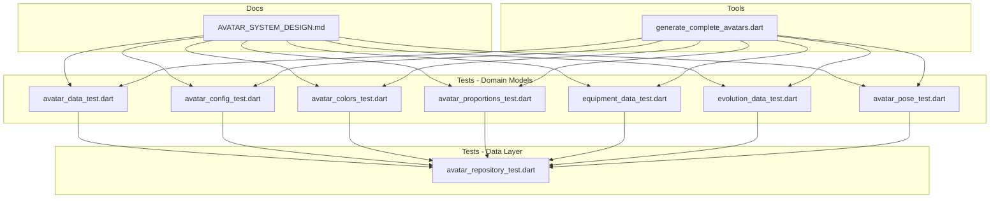
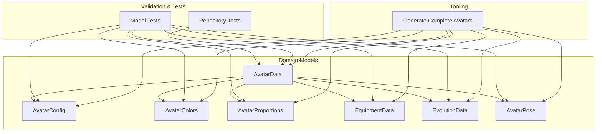
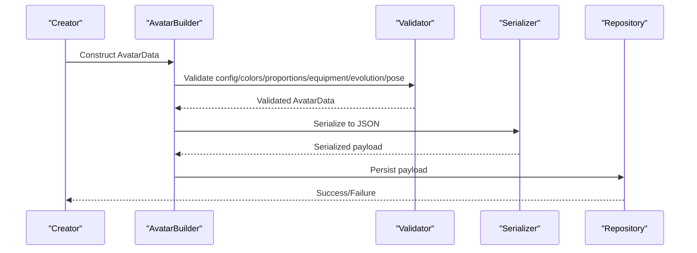
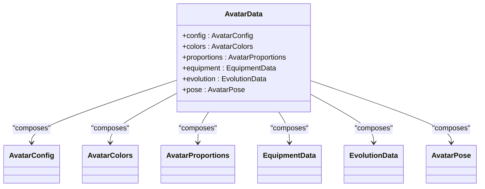

# Avatar Data Model & Configuration

<cite>
**Referenced Files in This Document**
- [AVATAR_SYSTEM_DESIGN.md](file://docs/AVATAR_SYSTEM_DESIGN.md)
- [avatar_data_test.dart](file://test/features/avatar/domain/models/avatar_data_test.dart)
- [avatar_config_test.dart](file://test/features/avatar/domain/models/avatar_config_test.dart)
- [avatar_colors_test.dart](file://test/features/avatar/domain/models/avatar_colors_test.dart)
- [avatar_proportions_test.dart](file://test/features/avatar/domain/models/avatar_proportions_test.dart)
- [equipment_data_test.dart](file://test/features/avatar/domain/models/equipment_data_test.dart)
- [evolution_data_test.dart](file://test/features/avatar/domain/models/evolution_data_test.dart)
- [avatar_pose_test.dart](file://test/features/avatar/domain/models/avatar_pose_test.dart)
- [avatar_repository_test.dart](file://test/features/avatar/data/avatar_repository_test.dart)
- [generate_complete_avatars.dart](file://tools/generate_complete_avatars.dart)
</cite>

## Table of Contents
1. [Introduction](#introduction)
2. [Project Structure](#project-structure)
3. [Core Components](#core-components)
4. [Architecture Overview](#architecture-overview)
5. [Detailed Component Analysis](#detailed-component-analysis)
6. [Dependency Analysis](#dependency-analysis)
7. [Performance Considerations](#performance-considerations)
8. [Troubleshooting Guide](#troubleshooting-guide)
9. [Conclusion](#conclusion)
10. [Appendices](#appendices)

## Introduction
This document explains the avatar data model and configuration system used by the application. It focuses on the core entities that define an avatar’s appearance, configuration, colors, proportions, equipment, and evolution state. It also covers validation rules, serialization patterns, visual layering for equipment, and strategies for creation, modification, persistence, migration, and version compatibility. The content is derived from the design documentation and the test suite that validates behavior and structure.

## Project Structure
The avatar feature spans domain models, tests, and tooling:
- Domain models are validated through dedicated unit tests under the avatar feature tests directory.
- Design specifications and conceptual guidance are captured in the docs directory.
- Tooling exists to generate complete avatar configurations for testing or seeding.

**Diagram sources**
- [AVATAR_SYSTEM_DESIGN.md](file://docs/AVATAR_SYSTEM_DESIGN.md)
- [avatar_data_test.dart](file://test/features/avatar/domain/models/avatar_data_test.dart)
- [avatar_config_test.dart](file://test/features/avatar/domain/models/avatar_config_test.dart)
- [avatar_colors_test.dart](file://test/features/avatar/domain/models/avatar_colors_test.dart)
- [avatar_proportions_test.dart](file://test/features/avatar/domain/models/avatar_proportions_test.dart)
- [equipment_data_test.dart](file://test/features/avatar/domain/models/equipment_data_test.dart)
- [evolution_data_test.dart](file://test/features/avatar/domain/models/evolution_data_test.dart)
- [avatar_pose_test.dart](file://test/features/avatar/domain/models/avatar_pose_test.dart)
- [avatar_repository_test.dart](file://test/features/avatar/data/avatar_repository_test.dart)
- [generate_complete_avatars.dart](file://tools/generate_complete_avatars.dart)

**Section sources**
- [AVATAR_SYSTEM_DESIGN.md](file://docs/AVATAR_SYSTEM_DESIGN.md)
- [avatar_data_test.dart](file://test/features/avatar/domain/models/avatar_data_test.dart)
- [avatar_config_test.dart](file://test/features/avatar/domain/models/avatar_config_test.dart)
- [avatar_colors_test.dart](file://test/features/avatar/domain/models/avatar_colors_test.dart)
- [avatar_proportions_test.dart](file://test/features/avatar/domain/models/avatar_proportions_test.dart)
- [equipment_data_test.dart](file://test/features/avatar/domain/models/equipment_data_test.dart)
- [evolution_data_test.dart](file://test/features/avatar/domain/models/evolution_data_test.dart)
- [avatar_pose_test.dart](file://test/features/avatar/domain/models/avatar_pose_test.dart)
- [avatar_repository_test.dart](file://test/features/avatar/data/avatar_repository_test.dart)
- [generate_complete_avatars.dart](file://tools/generate_complete_avatars.dart)

## Core Components
The avatar system centers around a set of cohesive data structures:
- AvatarData: The root entity representing a fully configured avatar instance.
- AvatarConfig: Global configuration controlling rendering, defaults, and constraints.
- AvatarColors: Color schemes applied across body parts, accessories, and effects.
- AvatarProportions: Body shape parameters including head-to-body ratio, limb lengths, and facial feature scales.
- EquipmentData: A collection of equipped items with slot assignments and layering metadata.
- EvolutionData: Progression state defining stages, unlocks, and visual transformations.
- AvatarPose: Pose configuration for animation frames and static poses.

These components are validated via unit tests and guided by the design specification. They collectively define how avatars look, behave, and evolve over time.

**Section sources**
- [AVATAR_SYSTEM_DESIGN.md](file://docs/AVATAR_SYSTEM_DESIGN.md)
- [avatar_data_test.dart](file://test/features/avatar/domain/models/avatar_data_test.dart)
- [avatar_config_test.dart](file://test/features/avatar/domain/models/avatar_config_test.dart)
- [avatar_colors_test.dart](file://test/features/avatar/domain/models/avatar_colors_test.dart)
- [avatar_proportions_test.dart](file://test/features/avatar/domain/models/avatar_proportions_test.dart)
- [equipment_data_test.dart](file://test/features/avatar/domain/models/equipment_data_test.dart)
- [evolution_data_test.dart](file://test/features/avatar/domain/models/evolution_data_test.dart)
- [avatar_pose_test.dart](file://test/features/avatar/domain/models/avatar_pose_test.dart)

## Architecture Overview
At a high level, the avatar system separates concerns between data models, validation, and persistence:
- Domain models encapsulate avatar state and behavior.
- Tests enforce correctness, constraints, and serialization round-trips.
- Repository tests validate storage and retrieval operations.
- Tools assist in generating valid avatar configurations for scenarios like seeding or demos.

**Diagram sources**
- [AVATAR_SYSTEM_DESIGN.md](file://docs/AVATAR_SYSTEM_DESIGN.md)
- [avatar_data_test.dart](file://test/features/avatar/domain/models/avatar_data_test.dart)
- [avatar_config_test.dart](file://test/features/avatar/domain/models/avatar_config_test.dart)
- [avatar_colors_test.dart](file://test/features/avatar/domain/models/avatar_colors_test.dart)
- [avatar_proportions_test.dart](file://test/features/avatar/domain/models/avatar_proportions_test.dart)
- [equipment_data_test.dart](file://test/features/avatar/domain/models/equipment_data_test.dart)
- [evolution_data_test.dart](file://test/features/avatar/domain/models/evolution_data_test.dart)
- [avatar_pose_test.dart](file://test/features/avatar/domain/models/avatar_pose_test.dart)
- [avatar_repository_test.dart](file://test/features/avatar/data/avatar_repository_test.dart)
- [generate_complete_avatars.dart](file://tools/generate_complete_avatars.dart)

## Detailed Component Analysis

### AvatarData
AvatarData is the central entity aggregating all avatar attributes. It composes configuration, colors, proportions, equipment, evolution, and pose into a single coherent snapshot. Validation ensures required fields are present and cross-field constraints are satisfied (e.g., compatible color palettes and proportion bounds). Serialization supports stable JSON representation for persistence and network transfer.

Key responsibilities:
- Composition of sub-models (config, colors, proportions, equipment, evolution, pose).
- Validation of internal consistency and external constraints.
- Serialization/deserialization with version awareness.

**Section sources**
- [avatar_data_test.dart](file://test/features/avatar/domain/models/avatar_data_test.dart)
- [AVATAR_SYSTEM_DESIGN.md](file://docs/AVATAR_SYSTEM_DESIGN.md)

### AvatarConfig
AvatarConfig defines global rendering and behavioral settings such as default themes, resolution hints, and feature toggles. It may include constraints like maximum item counts or allowed aspect ratios. Validation enforces sensible defaults and prevents invalid combinations.

Key responsibilities:
- Centralized configuration for rendering and behavior.
- Constraint enforcement for safe defaults.
- Versioned schema support for upgrades.

**Section sources**
- [avatar_config_test.dart](file://test/features/avatar/domain/models/avatar_config_test.dart)
- [AVATAR_SYSTEM_DESIGN.md](file://docs/AVATAR_SYSTEM_DESIGN.md)

### AvatarColors
AvatarColors encapsulates color schemes for skin, hair, eyes, clothing, and effects. It supports palette selection, theme adaptation, and accessibility considerations. Validation ensures color contrast and palette coherence.

Key responsibilities:
- Palette management across body parts and accessories.
- Theme-aware color mapping.
- Accessibility and contrast validation.

**Section sources**
- [avatar_colors_test.dart](file://test/features/avatar/domain/models/avatar_colors_test.dart)
- [AVATAR_SYSTEM_DESIGN.md](file://docs/AVATAR_SYSTEM_DESIGN.md)

### AvatarProportions
AvatarProportions controls body shape parameters such as head size, torso length, limb scaling, and facial feature dimensions. It includes normalization and clamping to maintain visual plausibility. Validation checks ranges and interdependencies (e.g., head-to-body ratio limits).

Key responsibilities:
- Proportion scaling and normalization.
- Range validation and clamping.
- Interdependent constraint checks.

**Section sources**
- [avatar_proportions_test.dart](file://test/features/avatar/domain/models/avatar_proportions_test.dart)
- [AVATAR_SYSTEM_DESIGN.md](file://docs/AVATAR_SYSTEM_DESIGN.md)

### EquipmentData
EquipmentData represents equipped items organized by slots (e.g., head, torso, hands, feet, accessories). Each item carries identifiers, variant metadata, and layering information. Compatibility rules ensure items fit their assigned slots and do not conflict visually or logically. Visual layering determines draw order and occlusion.

Key responsibilities:
- Slot-based item assignment.
- Compatibility validation per slot and item type.
- Layer ordering and occlusion handling.

**Section sources**
- [equipment_data_test.dart](file://test/features/avatar/domain/models/equipment_data_test.dart)
- [AVATAR_SYSTEM_DESIGN.md](file://docs/AVATAR_SYSTEM_DESIGN.md)

### EvolutionData
EvolutionData tracks progression stages, unlocks, and transformations. It may include stage thresholds, cosmetic changes, and ability unlocks. Validation ensures stage transitions are monotonic and consistent with defined rules.

Key responsibilities:
- Stage tracking and transition validation.
- Unlock management tied to progression.
- Cosmetic and functional transformation metadata.

**Section sources**
- [evolution_data_test.dart](file://test/features/avatar/domain/models/evolution_data_test.dart)
- [AVATAR_SYSTEM_DESIGN.md](file://docs/AVATAR_SYSTEM_DESIGN.md)

### AvatarPose
AvatarPose defines pose configurations for animations and static frames. It includes joint angles, keyframe references, and blend states. Validation ensures pose validity and compatibility with animation rigs.

Key responsibilities:
- Pose definition and keyframe references.
- Animation rig compatibility checks.
- Blend state management.

**Section sources**
- [avatar_pose_test.dart](file://test/features/avatar/domain/models/avatar_pose_test.dart)
- [AVATAR_SYSTEM_DESIGN.md](file://docs/AVATAR_SYSTEM_DESIGN.md)

### Data Flow and Persistence
Avatar creation flows through model construction, validation, and serialization before persistence. Repository tests demonstrate read/write operations and error handling. Generation tools produce complete configurations for testing or seeding.

**Diagram sources**
- [avatar_repository_test.dart](file://test/features/avatar/data/avatar_repository_test.dart)
- [generate_complete_avatars.dart](file://tools/generate_complete_avatars.dart)
- [avatar_data_test.dart](file://test/features/avatar/domain/models/avatar_data_test.dart)

**Section sources**
- [avatar_repository_test.dart](file://test/features/avatar/data/avatar_repository_test.dart)
- [generate_complete_avatars.dart](file://tools/generate_complete_avatars.dart)
- [avatar_data_test.dart](file://test/features/avatar/domain/models/avatar_data_test.dart)

## Dependency Analysis
The avatar models depend on each other compositionally:
- AvatarData aggregates AvatarConfig, AvatarColors, AvatarProportions, EquipmentData, EvolutionData, and AvatarPose.
- Tests validate each component independently and together.
- Repository tests validate persistence interactions.
- Generation tools construct full configurations using the same models.

**Diagram sources**
- [avatar_data_test.dart](file://test/features/avatar/domain/models/avatar_data_test.dart)
- [avatar_config_test.dart](file://test/features/avatar/domain/models/avatar_config_test.dart)
- [avatar_colors_test.dart](file://test/features/avatar/domain/models/avatar_colors_test.dart)
- [avatar_proportions_test.dart](file://test/features/avatar/domain/models/avatar_proportions_test.dart)
- [equipment_data_test.dart](file://test/features/avatar/domain/models/equipment_data_test.dart)
- [evolution_data_test.dart](file://test/features/avatar/domain/models/evolution_data_test.dart)
- [avatar_pose_test.dart](file://test/features/avatar/domain/models/avatar_pose_test.dart)

**Section sources**
- [avatar_data_test.dart](file://test/features/avatar/domain/models/avatar_data_test.dart)
- [avatar_config_test.dart](file://test/features/avatar/domain/models/avatar_config_test.dart)
- [avatar_colors_test.dart](file://test/features/avatar/domain/models/avatar_colors_test.dart)
- [avatar_proportions_test.dart](file://test/features/avatar/domain/models/avatar_proportions_test.dart)
- [equipment_data_test.dart](file://test/features/avatar/domain/models/equipment_data_test.dart)
- [evolution_data_test.dart](file://test/features/avatar/domain/models/evolution_data_test.dart)
- [avatar_pose_test.dart](file://test/features/avatar/domain/models/avatar_pose_test.dart)

## Performance Considerations
- Minimize object graph traversal during validation by caching computed properties where appropriate.
- Use efficient serialization formats and avoid unnecessary allocations when persisting large avatar datasets.
- Defer heavy computations (e.g., complex proportion recalculations) until needed.
- Batch updates to equipment and evolution state to reduce validation overhead.

[No sources needed since this section provides general guidance]

## Troubleshooting Guide
Common issues and resolutions:
- Invalid proportions: Ensure ratios fall within validated ranges; check interdependent constraints.
- Color palette conflicts: Verify theme compatibility and contrast requirements.
- Equipment slot mismatches: Confirm item-slot compatibility and layer ordering.
- Evolution stage inconsistencies: Enforce monotonic progression and unlock rules.
- Serialization errors: Validate schema versions and handle backward compatibility gracefully.

Use repository tests to verify persistence paths and error propagation. Leverage generation tools to reproduce problematic configurations deterministically.

**Section sources**
- [avatar_repository_test.dart](file://test/features/avatar/data/avatar_repository_test.dart)
- [avatar_data_test.dart](file://test/features/avatar/domain/models/avatar_data_test.dart)
- [avatar_config_test.dart](file://test/features/avatar/domain/models/avatar_config_test.dart)
- [avatar_colors_test.dart](file://test/features/avatar/domain/models/avatar_colors_test.dart)
- [avatar_proportions_test.dart](file://test/features/avatar/domain/models/avatar_proportions_test.dart)
- [equipment_data_test.dart](file://test/features/avatar/domain/models/equipment_data_test.dart)
- [evolution_data_test.dart](file://test/features/avatar/domain/models/evolution_data_test.dart)
- [avatar_pose_test.dart](file://test/features/avatar/domain/models/avatar_pose_test.dart)

## Conclusion
The avatar data model and configuration system provide a robust foundation for creating, customizing, and evolving avatars. Through well-defined entities, strict validation, and clear serialization patterns, the system supports rich customization while maintaining data integrity. Tests and design documentation guide implementation and maintenance, ensuring long-term compatibility and extensibility.

[No sources needed since this section summarizes without analyzing specific files]

## Appendices

### Avatar Creation Example Workflow
- Start with AvatarConfig defaults.
- Apply AvatarColors based on theme preferences.
- Set AvatarProportions within validated ranges.
- Assign EquipmentData to appropriate slots with compatibility checks.
- Initialize EvolutionData with starting stage.
- Configure AvatarPose for initial frame.
- Validate and serialize for persistence.

**Section sources**
- [generate_complete_avatars.dart](file://tools/generate_complete_avatars.dart)
- [avatar_data_test.dart](file://test/features/avatar/domain/models/avatar_data_test.dart)

### Modification and Persistence
- Load existing AvatarData from repository.
- Mutate desired fields (e.g., update colors or proportions).
- Re-validate to ensure constraints remain satisfied.
- Serialize updated state and persist via repository.
- Handle errors and rollback if necessary.

**Section sources**
- [avatar_repository_test.dart](file://test/features/avatar/data/avatar_repository_test.dart)
- [avatar_data_test.dart](file://test/features/avatar/domain/models/avatar_data_test.dart)

### Data Migration Strategies and Version Compatibility
- Maintain explicit schema versions in serialized payloads.
- Implement migration functions to transform older schemas to newer ones.
- Validate post-migration data against current constraints.
- Provide fallback defaults for missing fields.
- Test migrations thoroughly using representative datasets.

**Section sources**
- [AVATAR_SYSTEM_DESIGN.md](file://docs/AVATAR_SYSTEM_DESIGN.md)
- [avatar_repository_test.dart](file://test/features/avatar/data/avatar_repository_test.dart)