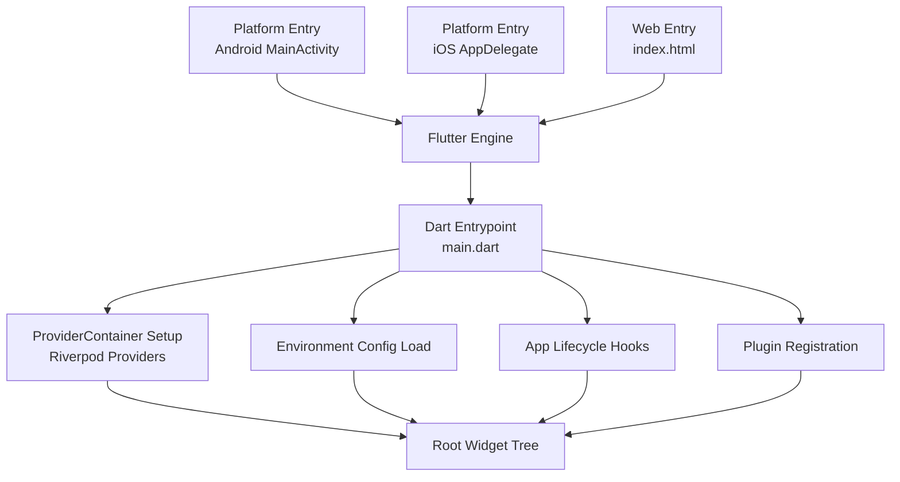
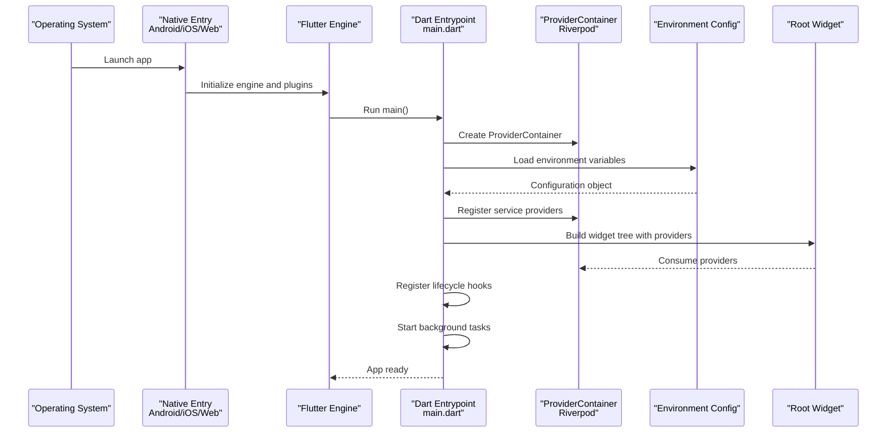
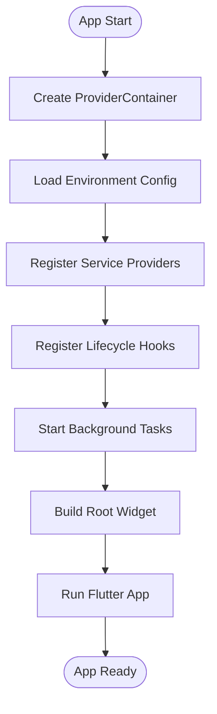
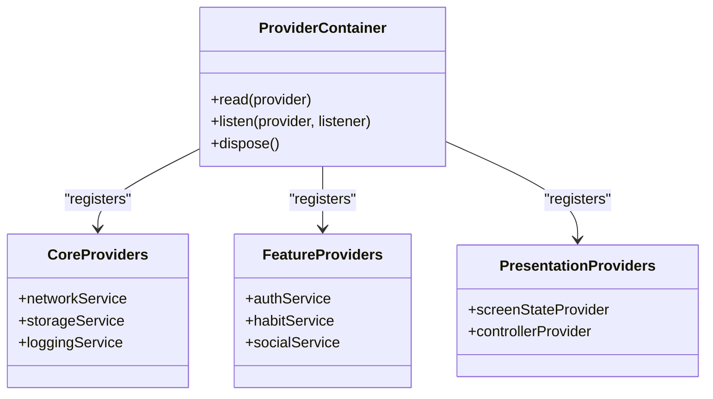
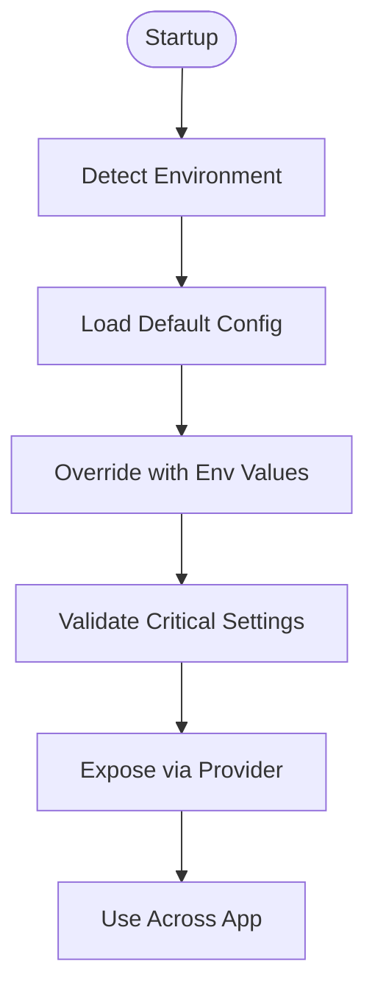
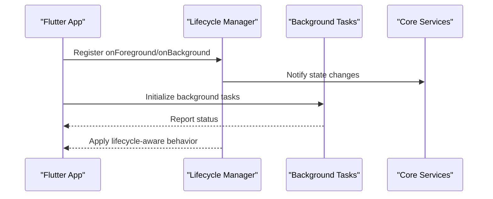
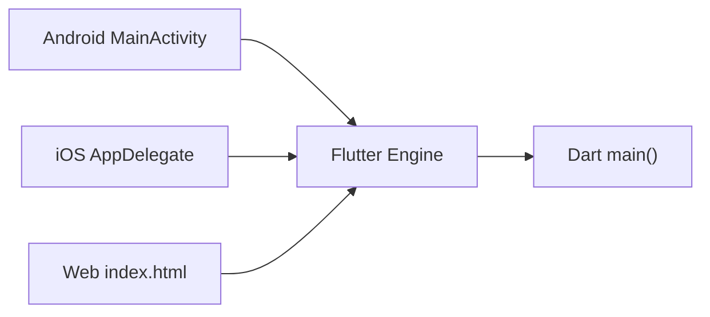
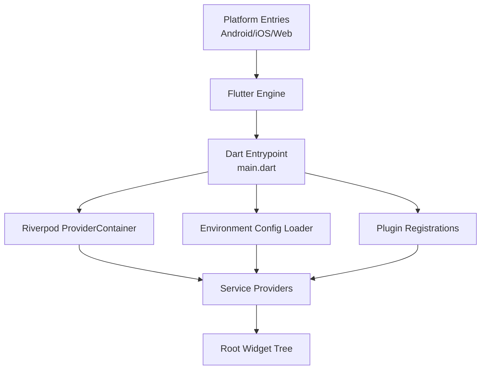

# Application Bootstrap & Initialization

<cite>
**Referenced Files in This Document**
- [main.dart](file://lib/main.dart)
- [pubspec.yaml](file://pubspec.yaml)
- [android/app/src/main/kotlin/com/emerge/emerge_app/MainActivity.kt](file://android/app/src/main/kotlin/com/emerge/emerge_app/MainActivity.kt)
- [ios/Runner/AppDelegate.swift](file://ios/Runner/AppDelegate.swift)
- [web/index.html](file://web/index.html)
</cite>

## Table of Contents
1. [Introduction](#introduction)
2. [Project Structure](#project-structure)
3. [Core Components](#core-components)
4. [Architecture Overview](#architecture-overview)
5. [Detailed Component Analysis](#detailed-component-analysis)
6. [Dependency Analysis](#dependency-analysis)
7. [Performance Considerations](#performance-considerations)
8. [Troubleshooting Guide](#troubleshooting-guide)
9. [Conclusion](#conclusion)

## Introduction
This document explains how the Emerge app boots and initializes across platforms. It covers the main entry point, Flutter application setup, initial configuration loading, dependency injection with Riverpod providers, environment-specific configurations, feature flags, runtime initialization sequences, app lifecycle management, background task initialization, and plugin registration. It also provides guidance on adding new services to the dependency graph and troubleshooting common initialization issues.

## Project Structure
At a high level, the bootstrap process is orchestrated by the Dart entry point and platform-specific native hooks:
- The Dart entry point configures the Flutter app, sets up the dependency container (Riverpod), loads environment-specific configuration, and renders the root widget.
- Platform entry points initialize plugins and register any native integrations before handing control to Flutter.

**Diagram sources**
- [android/app/src/main/kotlin/com/emerge/emerge_app/MainActivity.kt](file://android/app/src/main/kotlin/com/emerge/emerge_app/MainActivity.kt)
- [ios/Runner/AppDelegate.swift](file://ios/Runner/AppDelegate.swift)
- [web/index.html](file://web/index.html)
- [main.dart](file://lib/main.dart)

**Section sources**
- [main.dart](file://lib/main.dart)
- [pubspec.yaml](file://pubspec.yaml)
- [android/app/src/main/kotlin/com/emerge/emerge_app/MainActivity.kt](file://android/app/src/main/kotlin/com/emerge/emerge_app/MainActivity.kt)
- [ios/Runner/AppDelegate.swift](file://ios/Runner/AppDelegate.swift)
- [web/index.html](file://web/index.html)

## Core Components
- Main entrypoint: Initializes Flutter, configures global settings, and starts the provider-based dependency graph.
- Dependency injection: Uses Riverpod’s ProviderContainer to manage services and state. Providers are organized hierarchically for clarity and testability.
- Environment configuration: Loads environment-specific values (e.g., API endpoints, feature flags) early in startup.
- App lifecycle: Registers callbacks for foreground/background transitions and handles cold/warm start scenarios.
- Plugin registration: Ensures required plugins are initialized before use.

Key responsibilities:
- Create and configure the ProviderContainer once at app startup.
- Register core services (networking, storage, analytics, etc.) as providers.
- Load environment configuration and expose it via providers.
- Initialize background tasks and platform integrations.
- Render the root widget tree that consumes providers.

**Section sources**
- [main.dart](file://lib/main.dart)
- [pubspec.yaml](file://pubspec.yaml)

## Architecture Overview
The bootstrap sequence follows a layered approach:
1. Platform entry points hand off to the Flutter engine.
2. The Dart entrypoint sets up the dependency container and loads configuration.
3. Providers are registered and resolved.
4. The root widget tree is built using the configured providers.
5. Lifecycle hooks and background tasks are started.

**Diagram sources**
- [android/app/src/main/kotlin/com/emerge/emerge_app/MainActivity.kt](file://android/app/src/main/kotlin/com/emerge/emerge_app/MainActivity.kt)
- [ios/Runner/AppDelegate.swift](file://ios/Runner/AppDelegate.swift)
- [web/index.html](file://web/index.html)
- [main.dart](file://lib/main.dart)

## Detailed Component Analysis

### Main Entrypoint and Flutter App Setup
Responsibilities:
- Configure Flutter app-level settings (theme, debug options).
- Instantiate the dependency container and register providers.
- Load environment configuration and feature flags.
- Attach lifecycle listeners and start background tasks.
- Build and run the root widget tree.

Initialization order:
1. Create ProviderContainer.
2. Load environment configuration.
3. Register core providers (services, repositories, features).
4. Attach lifecycle hooks.
5. Start background tasks.
6. Build root widget and run the app.

**Diagram sources**
- [main.dart](file://lib/main.dart)

**Section sources**
- [main.dart](file://lib/main.dart)

### Dependency Injection Container Setup with Riverpod Providers
Patterns:
- Use a single ProviderContainer at app startup.
- Organize providers into logical groups (core, features, presentation).
- Expose shared services via top-level providers.
- Use family/scoped providers where appropriate for per-screen or per-feature instances.

Provider hierarchy:
- Core layer: networking, storage, logging, analytics.
- Feature layers: auth, habits, social, gamification, avatar, etc.
- Presentation layer: UI state providers and controllers.

Adding a new service:
- Implement the service class.
- Create a provider that constructs and returns the service instance.
- Register the provider in the appropriate group.
- Inject the provider where needed.

**Diagram sources**
- [main.dart](file://lib/main.dart)

**Section sources**
- [main.dart](file://lib/main.dart)

### Environment-Specific Configurations and Feature Flags
Approach:
- Load environment variables from platform-specific sources (build variants, runtime args, or config files).
- Normalize configuration into a single object accessible via providers.
- Expose feature flags through providers to toggle behavior at runtime.

Configuration flow:
- Detect environment (debug, profile, release).
- Load defaults and override with environment-specific values.
- Validate critical settings (endpoints, keys).
- Provide configuration via a read-only provider.

**Diagram sources**
- [main.dart](file://lib/main.dart)

**Section sources**
- [main.dart](file://lib/main.dart)

### App Lifecycle Management and Background Task Initialization
Lifecycle hooks:
- Handle app foreground/background transitions.
- Manage resource cleanup on dispose.
- Ensure long-running tasks respect lifecycle states.

Background tasks:
- Initialize sync engines, notification handlers, and periodic jobs.
- Defer heavy work until the app is in a suitable state.

**Diagram sources**
- [main.dart](file://lib/main.dart)

**Section sources**
- [main.dart](file://lib/main.dart)

### Plugin Registration and Platform Integration
Responsibilities:
- Ensure required plugins are initialized before use.
- Configure platform-specific settings (permissions, notifications, analytics).
- Bridge native capabilities to Dart via plugins.

Platform entries:
- Android: MainActivity initializes Flutter and registers plugins.
- iOS: AppDelegate initializes Flutter and registers plugins.
- Web: index.html bootstraps the Flutter web runtime.

**Diagram sources**
- [android/app/src/main/kotlin/com/emerge/emerge_app/MainActivity.kt](file://android/app/src/main/kotlin/com/emerge/emerge_app/MainActivity.kt)
- [ios/Runner/AppDelegate.swift](file://ios/Runner/AppDelegate.swift)
- [web/index.html](file://web/index.html)
- [main.dart](file://lib/main.dart)

**Section sources**
- [android/app/src/main/kotlin/com/emerge/emerge_app/MainActivity.kt](file://android/app/src/main/kotlin/com/emerge/emerge_app/MainActivity.kt)
- [ios/Runner/AppDelegate.swift](file://ios/Runner/AppDelegate.swift)
- [web/index.html](file://web/index.html)
- [main.dart](file://lib/main.dart)

## Dependency Analysis
The bootstrap depends on:
- Flutter engine and platform entries.
- Riverpod for dependency injection and state management.
- Environment configuration loader.
- Plugins for platform integrations.

**Diagram sources**
- [android/app/src/main/kotlin/com/emerge/emerge_app/MainActivity.kt](file://android/app/src/main/kotlin/com/emerge/emerge_app/MainActivity.kt)
- [ios/Runner/AppDelegate.swift](file://ios/Runner/AppDelegate.swift)
- [web/index.html](file://web/index.html)
- [main.dart](file://lib/main.dart)

**Section sources**
- [pubspec.yaml](file://pubspec.yaml)
- [main.dart](file://lib/main.dart)

## Performance Considerations
- Minimize synchronous work in the main thread during startup.
- Defer non-critical initialization until after the first frame.
- Use lazy providers to avoid unnecessary instantiation.
- Cache expensive computations and reuse instances via providers.
- Profile startup time and identify bottlenecks in provider resolution.

[No sources needed since this section provides general guidance]

## Troubleshooting Guide
Common issues and resolutions:
- Provider not found: Ensure the provider is registered in the correct scope and that the ProviderContainer is passed down correctly.
- Environment config missing: Verify environment variables are loaded and validated; add fallbacks for development.
- Plugin initialization errors: Check platform entries for proper plugin registration and permissions.
- Lifecycle-related crashes: Guard against null states in lifecycle callbacks and ensure resources are disposed properly.
- Background tasks not starting: Confirm lifecycle state allows background execution and that tasks are scheduled after app readiness.

Debugging steps:
- Log provider registration order and resolution times.
- Inspect environment configuration values at startup.
- Use platform logs to verify native plugin initialization.
- Add error boundaries around critical initialization code.

**Section sources**
- [main.dart](file://lib/main.dart)

## Conclusion
The Emerge app’s bootstrap process is structured around a clear separation of concerns: platform entries initialize the Flutter engine, the Dart entrypoint sets up the dependency container and configuration, and the root widget tree consumes providers. By following consistent patterns for provider registration, environment configuration, and lifecycle management, the app achieves a robust and maintainable initialization sequence. Adding new services involves implementing the service, creating a provider, and registering it within the appropriate hierarchy.

[No sources needed since this section summarizes without analyzing specific files]