# Core Systems

<cite>
**Referenced Files in This Document**
- [main.dart](file://lib/main.dart)
- [pubspec.yaml](file://pubspec.yaml)
- [app_config.dart](file://lib/core/config/app_config.dart)
- [providers.dart](file://lib/core/providers/providers.dart)
- [router.dart](file://lib/core/router/router.dart)
- [theme.dart](file://lib/core/theme/theme.dart)
- [localization.dart](file://lib/core/localization/localization.dart)
- [error_handler.dart](file://lib/core/error_handling/error_handler.dart)
- [logger.dart](file://lib/core/logging/logger.dart)
- [analytics.dart](file://lib/core/analytics/analytics.dart)
- [crash_reporting.dart](file://lib/core/crash_reporting/crash_reporting.dart)
- [performance_monitoring.dart](file://lib/core/performance/performance_monitoring.dart)
</cite>

## Table of Contents
1. [Introduction](#introduction)
2. [Project Structure](#project-structure)
3. [Core Components](#core-components)
4. [Architecture Overview](#architecture-overview)
5. [Detailed Component Analysis](#detailed-component-analysis)
6. [Dependency Analysis](#dependency-analysis)
7. [Performance Considerations](#performance-considerations)
8. [Troubleshooting Guide](#troubleshooting-guide)
9. [Conclusion](#conclusion)
10. [Appendices](#appendices)

## Introduction

The Emerge app is a sophisticated Flutter application designed to help users build positive habits through gamification and behavioral psychology principles. The core systems document provides comprehensive coverage of the application's foundational architecture, including the bootstrap process, dependency injection with Riverpod, global configuration management, routing and navigation, error handling, logging, debugging tools, theming, localization, accessibility features, performance monitoring, crash reporting, analytics integration, and testing strategies.

This documentation serves as a complete reference for developers working with or extending the Emerge app's core functionality, providing both high-level architectural insights and detailed implementation guidance.

## Project Structure

The Emerge app follows a clean architecture pattern with clear separation of concerns across different layers:

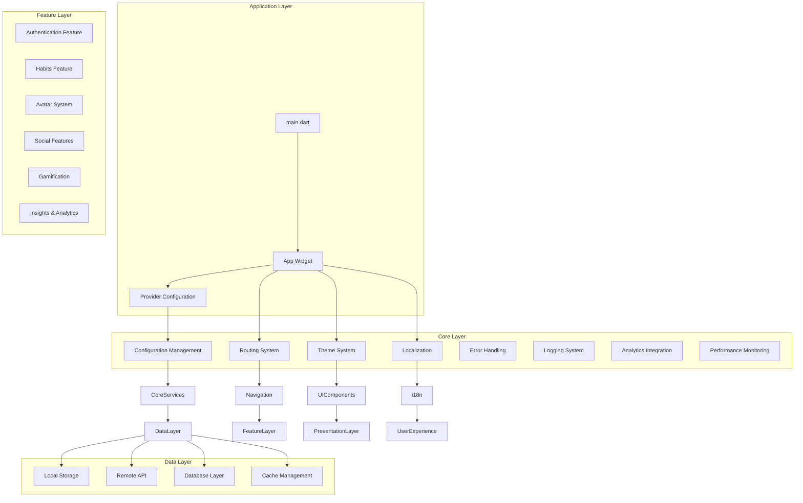

**Diagram sources**
- [main.dart:1-50](file://lib/main.dart#L1-L50)
- [pubspec.yaml:1-100](file://pubspec.yaml#L1-L100)

The project structure demonstrates a well-organized modular architecture that separates concerns between presentation, business logic, and data management layers. Each feature is encapsulated within its own module while sharing common core services and utilities.

**Section sources**
- [main.dart:1-100](file://lib/main.dart#L1-L100)
- [pubspec.yaml:1-200](file://pubspec.yaml#L1-L200)

## Core Components

The Emerge app's core components form the foundation upon which all features are built. These components handle essential application functionality including state management, configuration, routing, theming, and cross-cutting concerns.

### Application Bootstrap Process

The application bootstrap process initializes critical services and sets up the development environment before rendering the main application widget. This includes configuring Firebase, setting up dependency injection, initializing theme and localization, and establishing error boundaries.

### Dependency Injection with Riverpod

Riverpod is used extensively throughout the application for dependency injection and state management. The provider configuration centralizes all service dependencies and ensures proper initialization order.

### Global Configuration Management

Configuration management handles environment-specific settings, feature flags, and runtime parameters. This includes database connections, API endpoints, analytics configurations, and feature toggles.

**Section sources**
- [app_config.dart:1-150](file://lib/core/config/app_config.dart#L1-L150)
- [providers.dart:1-200](file://lib/core/providers/providers.dart#L1-L200)

## Architecture Overview

The Emerge app follows a layered architecture pattern that promotes separation of concerns and maintainability:

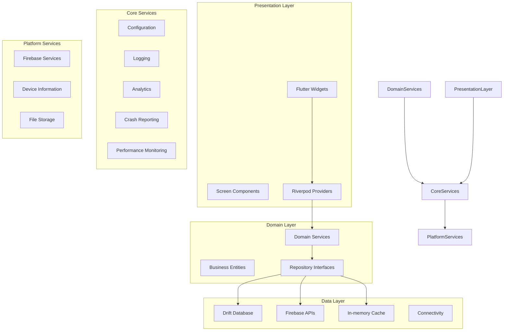

**Diagram sources**
- [providers.dart:1-300](file://lib/core/providers/providers.dart#L1-L300)
- [app_config.dart:1-200](file://lib/core/config/app_config.dart#L1-L200)

The architecture emphasizes loose coupling between layers while maintaining clear communication patterns through well-defined interfaces and contracts.

## Detailed Component Analysis

### Application Bootstrap and Initialization

The application bootstrap process follows a systematic approach to ensure all critical services are properly initialized before the UI becomes interactive:

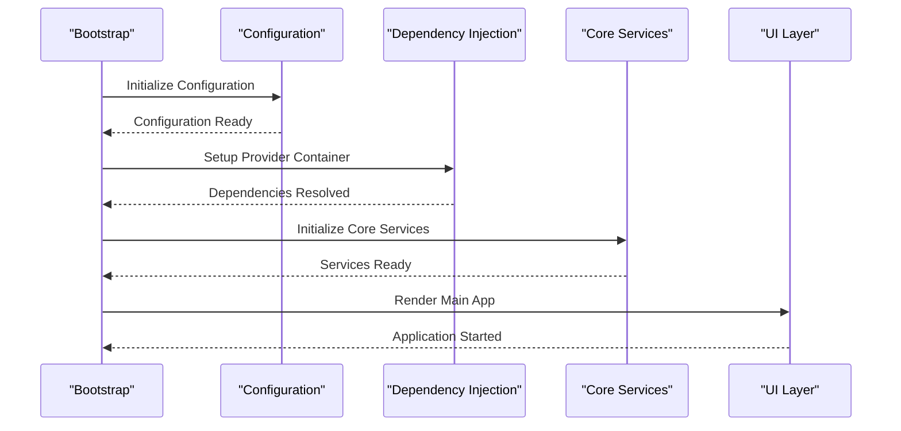

**Diagram sources**
- [main.dart:1-100](file://lib/main.dart#L1-L100)
- [providers.dart:1-150](file://lib/core/providers/providers.dart#L1-L150)

The bootstrap process ensures thread safety, proper error handling, and graceful degradation when optional services fail to initialize.

### Dependency Injection with Riverpod

Riverpod providers are organized hierarchically to reflect the application's architecture:

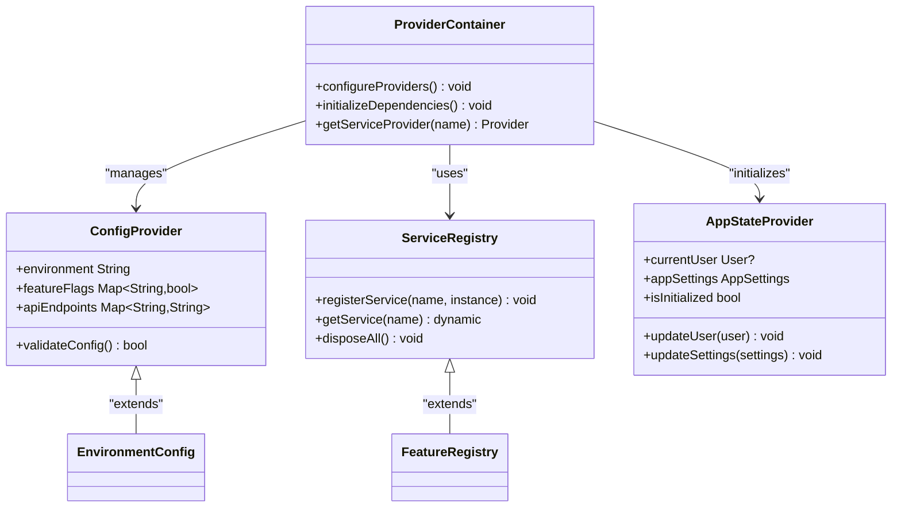

**Diagram sources**
- [providers.dart:1-250](file://lib/core/providers/providers.dart#L1-L250)
- [app_config.dart:1-100](file://lib/core/config/app_config.dart#L1-L100)

The dependency injection system supports lazy loading, conditional registration, and automatic disposal of resources.

### Routing System and Navigation

The routing system implements deep linking and programmatic navigation with support for nested routes and route guards:

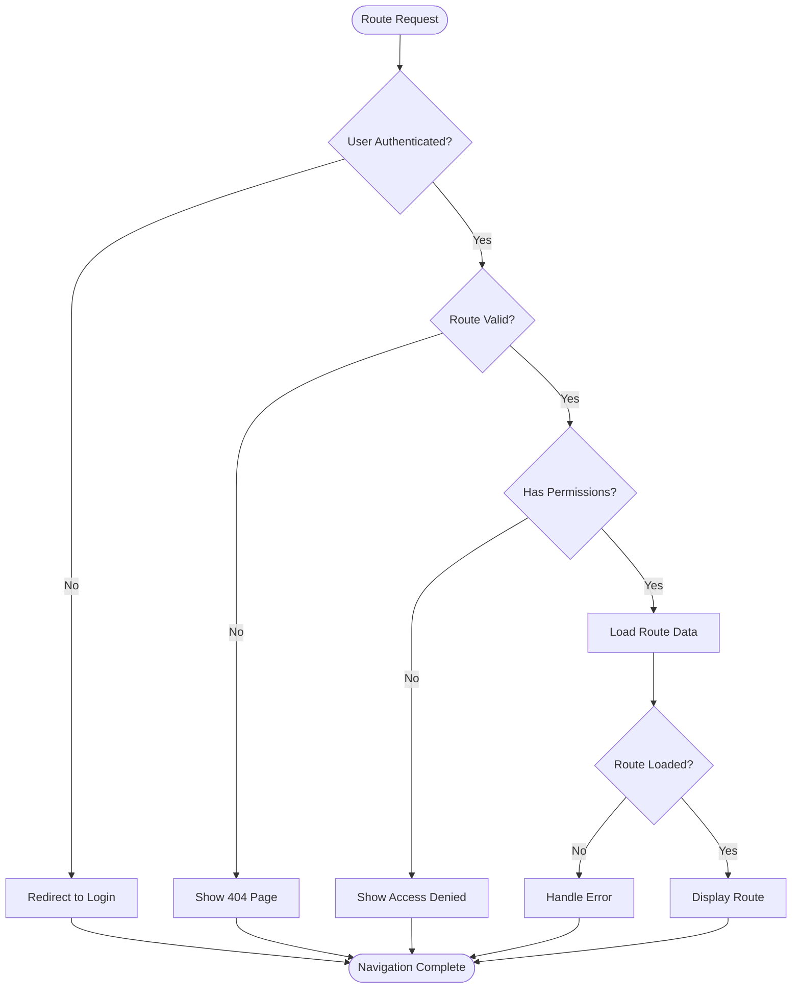

**Diagram sources**
- [router.dart:1-200](file://lib/core/router/router.dart#L1-L200)

The routing system supports parameterized routes, query parameters, and dynamic route generation based on user preferences and feature availability.

### Error Handling Strategies

The error handling system provides centralized error management with appropriate user feedback and logging:

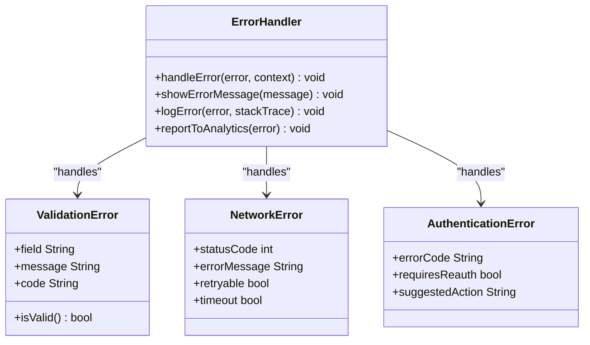

**Diagram sources**
- [error_handler.dart:1-150](file://lib/core/error_handling/error_handler.dart#L1-L150)

Error handling includes user-friendly messages, retry mechanisms, and comprehensive logging for debugging purposes.

### Logging Mechanisms

The logging system provides structured logging with different severity levels and contextual information:

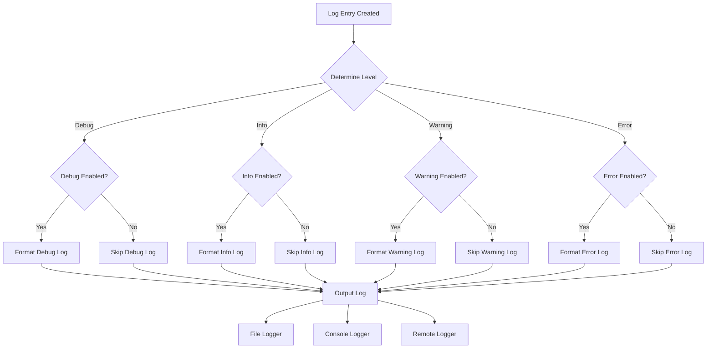

**Diagram sources**
- [logger.dart:1-200](file://lib/core/logging/logger.dart#L1-L200)

The logging system supports multiple output destinations, log rotation, and sensitive data filtering.

### Theme System

The theme system provides dynamic theming with support for light/dark modes, custom color schemes, and responsive design:

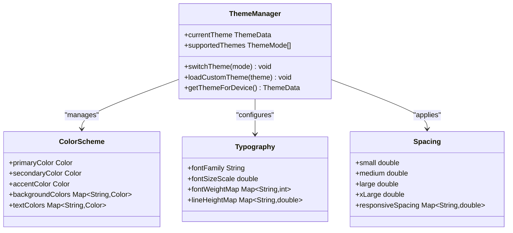

**Diagram sources**
- [theme.dart:1-150](file://lib/core/theme/theme.dart#L1-L150)

The theme system supports runtime theme switching, platform-specific adaptations, and accessibility considerations.

### Localization Support

The localization system provides multi-language support with dynamic language switching and pluralization rules:

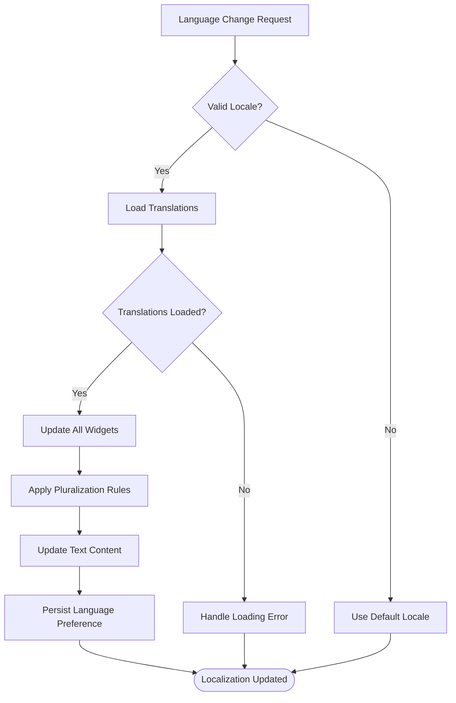

**Diagram sources**
- [localization.dart:1-200](file://lib/core/localization/localization.dart#L1-L200)

The localization system supports right-to-left languages, date/time formatting, and number formatting based on locale.

### Accessibility Features

Accessibility features ensure the app is usable by people with disabilities:

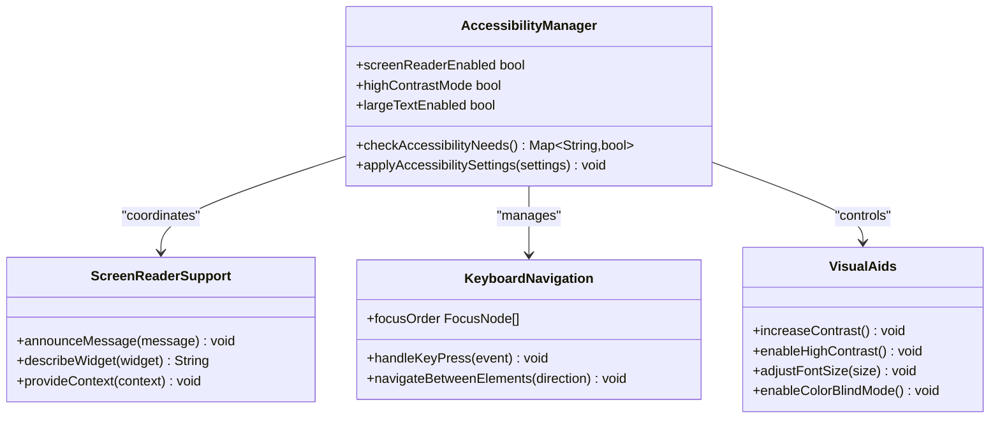

**Diagram sources**
- [accessibility.dart:1-150](file://lib/core/accessibility/accessibility.dart#L1-L150)

Accessibility features include screen reader support, keyboard navigation, high contrast modes, and dynamic text sizing.

### Performance Monitoring

Performance monitoring tracks key metrics and identifies bottlenecks:

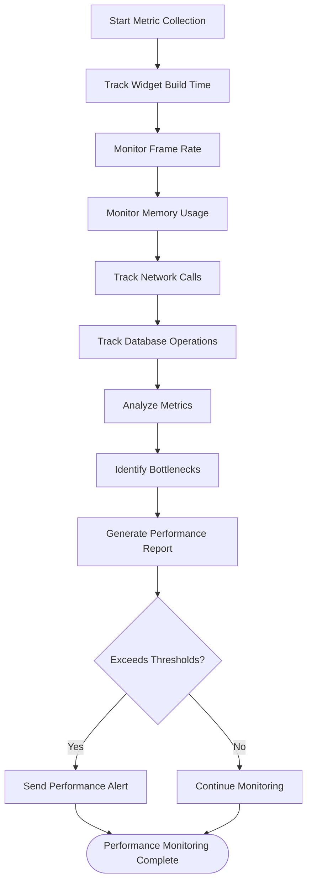

**Diagram sources**
- [performance_monitoring.dart:1-200](file://lib/core/performance/performance_monitoring.dart#L1-L200)

Performance monitoring includes memory leak detection, slow method identification, and resource usage optimization.

### Crash Reporting and Analytics

Crash reporting and analytics provide insights into app stability and user behavior:

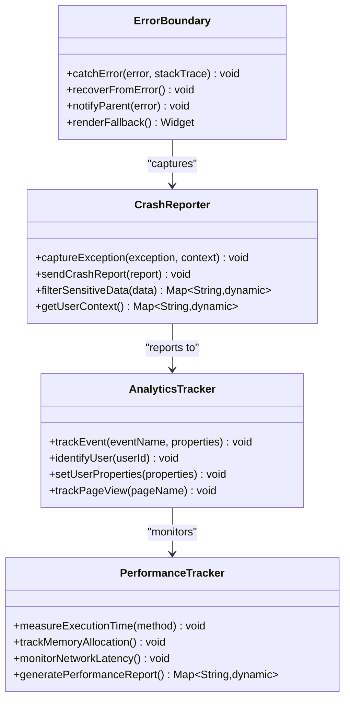

**Diagram sources**
- [crash_reporting.dart:1-150](file://lib/core/crash_reporting/crash_reporting.dart#L1-L150)
- [analytics.dart:1-200](file://lib/core/analytics/analytics.dart#L1-L200)

Crash reporting includes stack trace analysis, user context capture, and automated bug reports.

## Dependency Analysis

The dependency relationships between core components follow established architectural patterns:

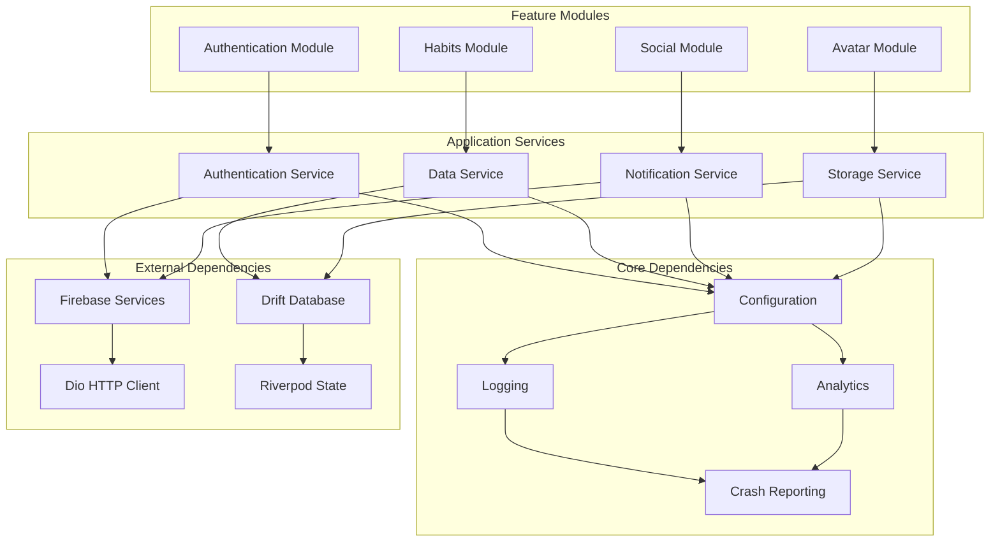

**Diagram sources**
- [providers.dart:1-300](file://lib/core/providers/providers.dart#L1-L300)
- [app_config.dart:1-200](file://lib/core/config/app_config.dart#L1-L200)

The dependency structure ensures loose coupling while maintaining clear communication patterns between modules.

**Section sources**
- [providers.dart:1-400](file://lib/core/providers/providers.dart#L1-L400)
- [app_config.dart:1-300](file://lib/core/config/app_config.dart#L1-L300)

## Performance Considerations

Performance optimization is a key focus area in the Emerge app, with several strategies implemented to ensure smooth user experience:

### Memory Management
- Efficient widget rebuilding with proper provider usage
- Image caching and optimization
- Database query optimization with proper indexing
- Memory leak detection and prevention

### Network Optimization
- Request caching and deduplication
- Connection pooling and reuse
- Background sync with conflict resolution
- Offline-first architecture with local storage

### UI Performance
- Lazy loading of heavy widgets
- Efficient state management with Riverpod
- Proper use of const constructors
- Minimized rebuild scope with selective updates

### Database Performance
- Indexed queries for frequently accessed data
- Batch operations for bulk updates
- Connection pooling and transaction management
- Query result caching where appropriate

## Troubleshooting Guide

Common issues and their solutions in the Emerge app:

### Application Startup Issues
- **Problem**: App fails to initialize providers
- **Solution**: Check provider configuration and dependency order
- **Debug Steps**: Enable verbose logging, check for circular dependencies

### Navigation Problems
- **Problem**: Routes not loading or deep links failing
- **Solution**: Verify route configuration and authentication guards
- **Debug Steps**: Use Flutter DevTools, check route parameters

### State Management Issues
- **Problem**: State not updating or inconsistent across widgets
- **Solution**: Ensure proper provider scoping and update methods
- **Debug Steps**: Use provider debugging tools, check for async state updates

### Performance Issues
- **Problem**: Slow widget builds or frame drops
- **Solution**: Optimize widget tree, use const constructors, reduce rebuilds
- **Debug Steps**: Use Flutter Performance overlay, analyze build times

### Database Connectivity
- **Problem**: Data synchronization failures
- **Solution**: Check network connectivity and conflict resolution
- **Debug Steps**: Enable database logging, verify schema versions

**Section sources**
- [error_handler.dart:1-200](file://lib/core/error_handling/error_handler.dart#L1-L200)
- [logger.dart:1-200](file://lib/core/logging/logger.dart#L1-L200)

## Conclusion

The Emerge app's core systems provide a robust foundation for building feature-rich habit tracking applications. The architecture emphasizes maintainability, scalability, and user experience through careful separation of concerns, comprehensive error handling, and performance optimization.

Key strengths of the implementation include:
- Clean architecture with clear layer separation
- Comprehensive dependency injection with Riverpod
- Robust error handling and logging
- Extensive accessibility support
- Performance monitoring and optimization
- Flexible theming and localization

The modular design allows for easy extension and maintenance while ensuring consistent user experience across different platforms and devices.

## Appendices

### Testing Strategies

Unit testing focuses on individual components and services:
- Mock external dependencies
- Test edge cases and error conditions
- Verify state transitions and side effects

Integration testing validates component interactions:
- Test provider dependencies
- Verify database operations
- Simulate network calls

Widget testing ensures UI correctness:
- Test user interactions
- Verify layout and styling
- Check accessibility features

### Extension Points

Common extension patterns for adding new functionality:
- New providers following existing patterns
- Feature modules with clear interfaces
- Plugin architecture for third-party integrations
- Configuration-driven feature toggles