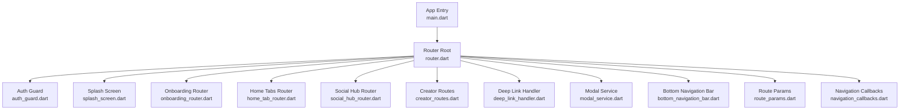
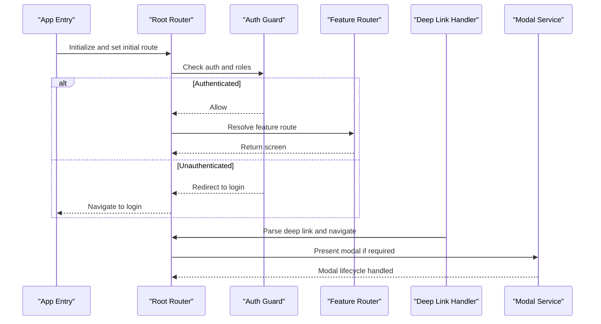
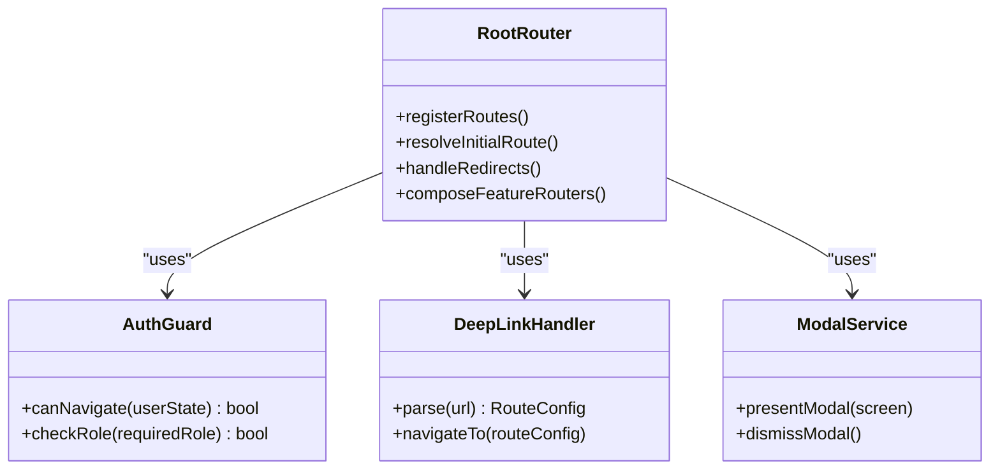
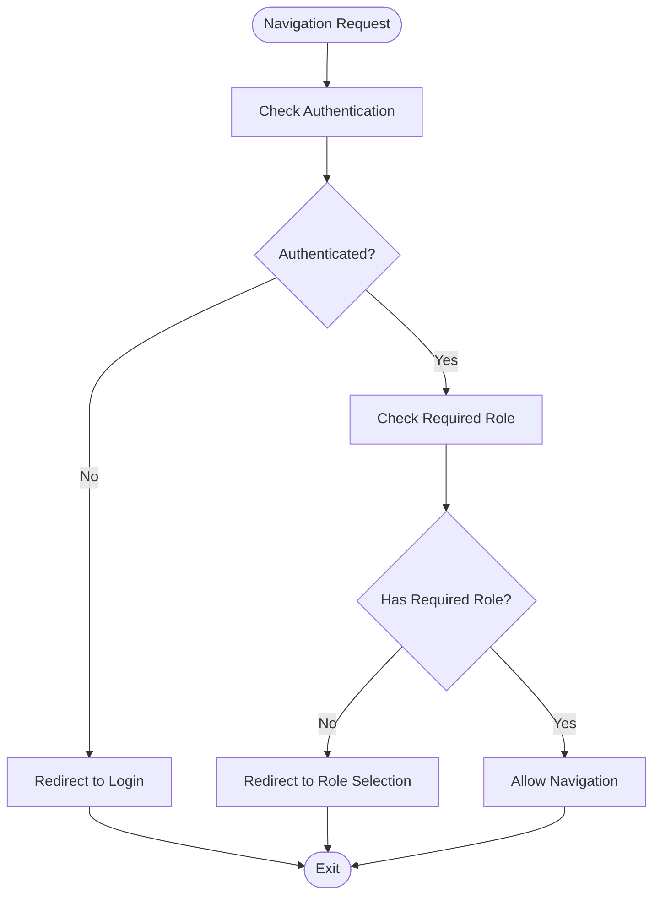
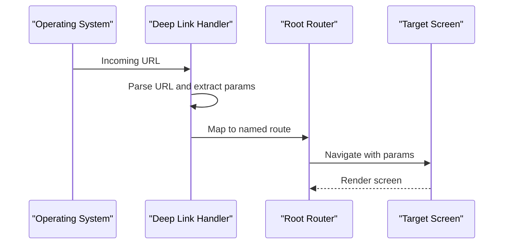
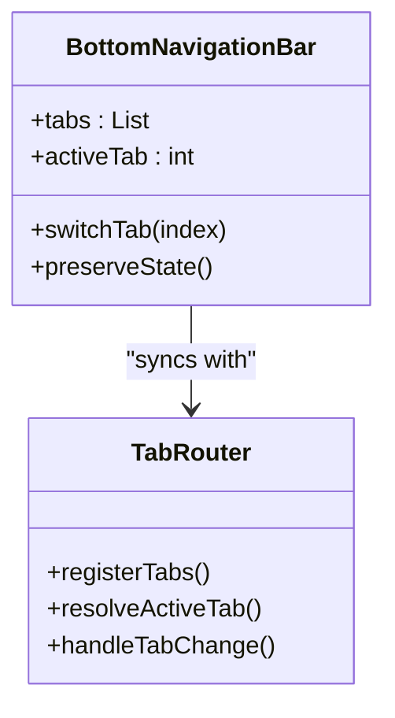
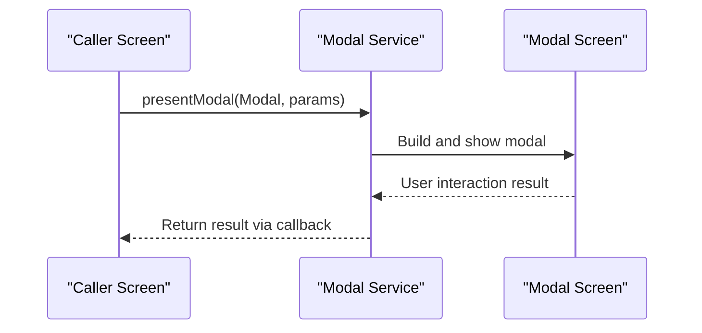
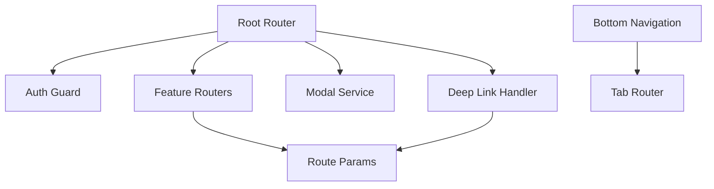

# Routing & Navigation System

<cite>
**Referenced Files in This Document**
- [main.dart](file://lib/main.dart)
- [app_config.dart](file://lib/core/config/app_config.dart)
- [router.dart](file://lib/core/router/router.dart)
- [auth_guard.dart](file://lib/core/router/auth_guard.dart)
- [splash_screen.dart](file://lib/features/splash/presentation/screens/splash_screen.dart)
- [onboarding_router.dart](file://lib/features/onboarding/presentation/routing/onboarding_router.dart)
- [home_tab_router.dart](file://lib/features/home/presentation/routing/home_tab_router.dart)
- [social_hub_router.dart](file://lib/features/social/presentation/routing/social_hub_router.dart)
- [creator_routes.dart](file://lib/features/creator/presentation/routing/creator_routes.dart)
- [bottom_navigation_bar.dart](file://lib/core/widgets/bottom_navigation_bar.dart)
- [modal_service.dart](file://lib/core/services/modal_service.dart)
- [deep_link_handler.dart](file://lib/core/services/deep_link_handler.dart)
- [route_params.dart](file://lib/core/router/route_params.dart)
- [navigation_callbacks.dart](file://lib/core/router/navigation_callbacks.dart)
</cite>

## Table of Contents
1. [Introduction](#introduction)
2. [Project Structure](#project-structure)
3. [Core Components](#core-components)
4. [Architecture Overview](#architecture-overview)
5. [Detailed Component Analysis](#detailed-component-analysis)
6. [Dependency Analysis](#dependency-analysis)
7. [Performance Considerations](#performance-considerations)
8. [Troubleshooting Guide](#troubleshooting-guide)
9. [Conclusion](#conclusion)
10. [Appendices](#appendices)

## Introduction
This document explains the Emerge app’s routing and navigation system. It covers route configuration structure, named routes, deep linking, navigation patterns between features, parameter passing, state preservation during navigation, conditional routing based on authentication status, role-based access control, dynamic route generation, integration with bottom navigation and tab switching, modal presentations, and guidance for adding new routes, handling navigation callbacks, and debugging issues.

## Project Structure
The routing and navigation system is organized around a central router that composes feature-specific routers and guards. The entry point initializes configuration, sets up deep links, and boots the root navigator. Feature modules encapsulate their own routes and tabs, while shared services handle modals and navigation callbacks.

**Diagram sources**
- [main.dart:1-LIMIT:1-200](file://lib/main.dart#L1-L200)
- [router.dart:1-LIMIT:1-200](file://lib/core/router/router.dart#L1-L200)
- [auth_guard.dart:1-LIMIT:1-200](file://lib/core/router/auth_guard.dart#L1-L200)
- [splash_screen.dart:1-LIMIT:1-200](file://lib/features/splash/presentation/screens/splash_screen.dart#L1-L200)
- [onboarding_router.dart:1-LIMIT:1-200](file://lib/features/onboarding/presentation/routing/onboarding_router.dart#L1-L200)
- [home_tab_router.dart:1-LIMIT:1-200](file://lib/features/home/presentation/routing/home_tab_router.dart#L1-L200)
- [social_hub_router.dart:1-LIMIT:1-200](file://lib/features/social/presentation/routing/social_hub_router.dart#L1-L200)
- [creator_routes.dart:1-LIMIT:1-200](file://lib/features/creator/presentation/routing/creator_routes.dart#L1-L200)
- [deep_link_handler.dart:1-LIMIT:1-200](file://lib/core/services/deep_link_handler.dart#L1-L200)
- [modal_service.dart:1-LIMIT:1-200](file://lib/core/services/modal_service.dart#L1-L200)
- [bottom_navigation_bar.dart:1-LIMIT:1-200](file://lib/core/widgets/bottom_navigation_bar.dart#L1-L200)
- [route_params.dart:1-LIMIT:1-200](file://lib/core/router/route_params.dart#L1-L200)
- [navigation_callbacks.dart:1-LIMIT:1-200](file://lib/core/router/navigation_callbacks.dart#L1-L200)

**Section sources**
- [main.dart:1-LIMIT:1-200](file://lib/main.dart#L1-L200)
- [router.dart:1-LIMIT:1-200](file://lib/core/router/router.dart#L1-L200)

## Core Components
- Central Router: Defines top-level routes, guards, and composition of feature routers. It resolves initial routes and handles redirects based on auth state and roles.
- Auth Guard: Intercepts navigation to enforce authentication and role-based access control before allowing route transitions.
- Deep Link Handler: Parses incoming URLs or app links and navigates to the appropriate route with parameters.
- Modal Service: Provides a centralized API to present modal screens over the current route stack.
- Bottom Navigation Bar: Integrates with tabbed navigation to switch between primary feature tabs while preserving state.
- Route Params: Strongly typed definitions for route parameters passed across screens.
- Navigation Callbacks: Hooks for pre/post navigation events, analytics, and side effects.

Key responsibilities:
- Named route registration and resolution
- Conditional redirection (e.g., authenticated vs unauthenticated users)
- Role-based access checks
- Parameter validation and type safety
- State preservation across tab switches
- Deep link parsing and dispatching

**Section sources**
- [router.dart:1-LIMIT:1-200](file://lib/core/router/router.dart#L1-L200)
- [auth_guard.dart:1-LIMIT:1-200](file://lib/core/router/auth_guard.dart#L1-L200)
- [deep_link_handler.dart:1-LIMIT:1-200](file://lib/core/services/deep_link_handler.dart#L1-L200)
- [modal_service.dart:1-LIMIT:1-200](file://lib/core/services/modal_service.dart#L1-L200)
- [bottom_navigation_bar.dart:1-LIMIT:1-200](file://lib/core/widgets/bottom_navigation_bar.dart#L1-L200)
- [route_params.dart:1-LIMIT:1-200](file://lib/core/router/route_params.dart#L1-L200)
- [navigation_callbacks.dart:1-LIMIT:1-200](file://lib/core/router/navigation_callbacks.dart#L1-L200)

## Architecture Overview
The routing architecture follows a layered approach:
- Entry layer initializes configuration and starts the root navigator.
- Router layer defines named routes and composes feature routers.
- Guard layer enforces authentication and role-based access.
- Feature layers encapsulate their own routes and tabs.
- Services layer provides deep linking and modal presentation utilities.
- UI layer integrates bottom navigation and preserves tab state.

**Diagram sources**
- [main.dart:1-LIMIT:1-200](file://lib/main.dart#L1-L200)
- [router.dart:1-LIMIT:1-200](file://lib/core/router/router.dart#L1-L200)
- [auth_guard.dart:1-LIMIT:1-200](file://lib/core/router/auth_guard.dart#L1-L200)
- [deep_link_handler.dart:1-LIMIT:1-200](file://lib/core/services/deep_link_handler.dart#L1-L200)
- [modal_service.dart:1-LIMIT:1-200](file://lib/core/services/modal_service.dart#L1-L200)

## Detailed Component Analysis

### Central Router
Responsibilities:
- Define named routes for all features
- Compose feature routers and guards
- Handle initial route resolution and redirects
- Integrate deep link handler and modal service

Implementation highlights:
- Centralized route map with named paths
- Guard chain for auth and role checks
- Dynamic route generation for parameterized paths
- Integration points for bottom navigation and tabs

**Diagram sources**
- [router.dart:1-LIMIT:1-200](file://lib/core/router/router.dart#L1-L200)
- [auth_guard.dart:1-LIMIT:1-200](file://lib/core/router/auth_guard.dart#L1-L200)
- [deep_link_handler.dart:1-LIMIT:1-200](file://lib/core/services/deep_link_handler.dart#L1-L200)
- [modal_service.dart:1-LIMIT:1-200](file://lib/core/services/modal_service.dart#L1-L200)

**Section sources**
- [router.dart:1-LIMIT:1-200](file://lib/core/router/router.dart#L1-L200)

### Auth Guard and Role-Based Access Control
Responsibilities:
- Enforce authentication before navigating to protected routes
- Validate user roles against required roles for specific routes
- Redirect unauthorized users to appropriate screens (e.g., login or role selection)

Behavioral flow:
- Intercept navigation requests
- Evaluate user state and roles
- Allow or redirect based on policy

**Diagram sources**
- [auth_guard.dart:1-LIMIT:1-200](file://lib/core/router/auth_guard.dart#L1-L200)

**Section sources**
- [auth_guard.dart:1-LIMIT:1-200](file://lib/core/router/auth_guard.dart#L1-L200)

### Deep Linking Setup
Responsibilities:
- Parse incoming URLs or app links into route configurations
- Extract parameters and validate them
- Navigate to the target route with resolved parameters
- Handle fallbacks for invalid or unsupported links

Integration points:
- Root router listens for deep link events
- Deep link handler maps URL patterns to named routes
- Route params ensure type safety for parameters

**Diagram sources**
- [deep_link_handler.dart:1-LIMIT:1-200](file://lib/core/services/deep_link_handler.dart#L1-L200)
- [router.dart:1-LIMIT:1-200](file://lib/core/router/router.dart#L1-L200)
- [route_params.dart:1-LIMIT:1-200](file://lib/core/router/route_params.dart#L1-L200)

**Section sources**
- [deep_link_handler.dart:1-LIMIT:1-200](file://lib/core/services/deep_link_handler.dart#L1-L200)
- [route_params.dart:1-LIMIT:1-200](file://lib/core/router/route_params.dart#L1-L200)

### Bottom Navigation and Tab Switching
Responsibilities:
- Provide persistent bottom navigation bar
- Switch between feature tabs while preserving state
- Sync active tab with route state
- Support programmatic tab changes

State preservation:
- Use keep-alive strategies for tab content
- Maintain scroll positions and unsaved data
- Avoid unnecessary rebuilds when switching tabs

**Diagram sources**
- [bottom_navigation_bar.dart:1-LIMIT:1-200](file://lib/core/widgets/bottom_navigation_bar.dart#L1-L200)
- [home_tab_router.dart:1-LIMIT:1-200](file://lib/features/home/presentation/routing/home_tab_router.dart#L1-L200)

**Section sources**
- [bottom_navigation_bar.dart:1-LIMIT:1-200](file://lib/core/widgets/bottom_navigation_bar.dart#L1-L200)
- [home_tab_router.dart:1-LIMIT:1-200](file://lib/features/home/presentation/routing/home_tab_router.dart#L1-L200)

### Modal Presentations
Responsibilities:
- Present modal screens over the current route stack
- Manage modal lifecycle (open, close, dismiss)
- Pass parameters to modal screens and receive results
- Coordinate with navigation callbacks for analytics and side effects

**Diagram sources**
- [modal_service.dart:1-LIMIT:1-200](file://lib/core/services/modal_service.dart#L1-L200)

**Section sources**
- [modal_service.dart:1-LIMIT:1-200](file://lib/core/services/modal_service.dart#L1-L200)

### Feature Routers
Each feature module encapsulates its own routing logic:
- Onboarding Router: Manages onboarding steps and progress
- Social Hub Router: Handles social-related screens and tabs
- Creator Routes: Defines creator-specific flows and permissions

These routers integrate with the central router through composition and guard chains.

**Section sources**
- [onboarding_router.dart:1-LIMIT:1-200](file://lib/features/onboarding/presentation/routing/onboarding_router.dart#L1-L200)
- [social_hub_router.dart:1-LIMIT:1-200](file://lib/features/social/presentation/routing/social_hub_router.dart#L1-L200)
- [creator_routes.dart:1-LIMIT:1-200](file://lib/features/creator/presentation/routing/creator_routes.dart#L1-L200)

## Dependency Analysis
The routing system has clear dependencies:
- Root router depends on auth guard, deep link handler, and modal service
- Feature routers depend on shared services and route params
- Bottom navigation depends on tab router for state synchronization
- Deep link handler depends on route params for validation

Potential circular dependencies are avoided by separating concerns into distinct modules and using dependency injection where necessary.

**Diagram sources**
- [router.dart:1-LIMIT:1-200](file://lib/core/router/router.dart#L1-L200)
- [auth_guard.dart:1-LIMIT:1-200](file://lib/core/router/auth_guard.dart#L1-L200)
- [deep_link_handler.dart:1-LIMIT:1-200](file://lib/core/services/deep_link_handler.dart#L1-L200)
- [modal_service.dart:1-LIMIT:1-200](file://lib/core/services/modal_service.dart#L1-L200)
- [bottom_navigation_bar.dart:1-LIMIT:1-200](file://lib/core/widgets/bottom_navigation_bar.dart#L1-L200)
- [home_tab_router.dart:1-LIMIT:1-200](file://lib/features/home/presentation/routing/home_tab_router.dart#L1-L200)
- [route_params.dart:1-LIMIT:1-200](file://lib/core/router/route_params.dart#L1-L200)

**Section sources**
- [router.dart:1-LIMIT:1-200](file://lib/core/router/router.dart#L1-L200)

## Performance Considerations
- Lazy loading of feature routes to reduce initial load time
- Keep-alive strategies for tab content to preserve state without rebuilding
- Efficient deep link parsing with minimal overhead
- Modal presentation should avoid blocking the main thread
- Route parameter validation should be lightweight and cached where possible

[No sources needed since this section provides general guidance]

## Troubleshooting Guide
Common issues and resolutions:
- Route not found: Verify named route registration and path patterns
- Auth redirect loops: Ensure auth guard correctly evaluates user state
- Deep link failures: Check URL parsing and parameter validation
- Modal not closing: Confirm modal lifecycle management and callbacks
- Tab state loss: Verify keep-alive implementation and state persistence

Debugging tips:
- Log navigation events using navigation callbacks
- Inspect route parameters for correctness
- Test deep links with various URL formats
- Use dev tools to monitor route transitions and modal states

**Section sources**
- [navigation_callbacks.dart:1-LIMIT:1-200](file://lib/core/router/navigation_callbacks.dart#L1-L200)
- [deep_link_handler.dart:1-LIMIT:1-200](file://lib/core/services/deep_link_handler.dart#L1-L200)
- [modal_service.dart:1-LIMIT:1-200](file://lib/core/services/modal_service.dart#L1-L200)

## Conclusion
The Emerge app’s routing and navigation system provides a robust, modular, and extensible foundation for managing complex navigation flows. With centralized routing, strong guards, deep linking support, and integrated modal and tab management, developers can implement new features efficiently while maintaining consistent user experiences. Following the guidelines in this document ensures reliable navigation behavior and optimal performance.

[No sources needed since this section summarizes without analyzing specific files]

## Appendices

### Adding a New Route
Steps to add a new route:
1. Define the route name and path in the central router
2. Implement the screen widget for the route
3. Add any required parameters in route params
4. Register the route in the appropriate feature router
5. Test navigation from existing routes and deep links

### Handling Navigation Callbacks
Use navigation callbacks to:
- Track analytics events
- Perform cleanup or side effects
- Update global state based on navigation
- Log navigation history for debugging

### Debugging Navigation Issues
Tools and techniques:
- Enable verbose logging for route transitions
- Use route inspection tools to verify current state
- Test edge cases like back navigation and deep links
- Validate parameter types and values

[No sources needed since this section provides general guidance]