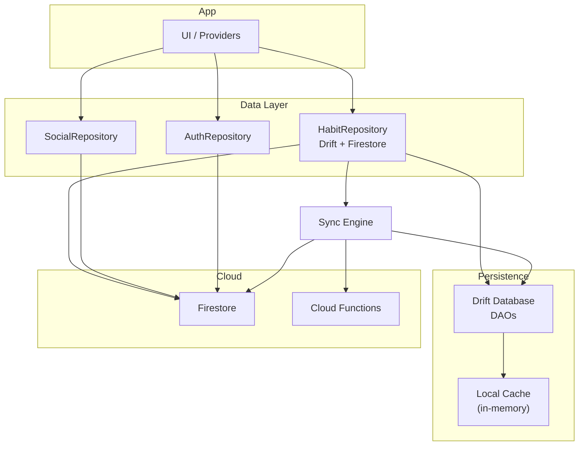
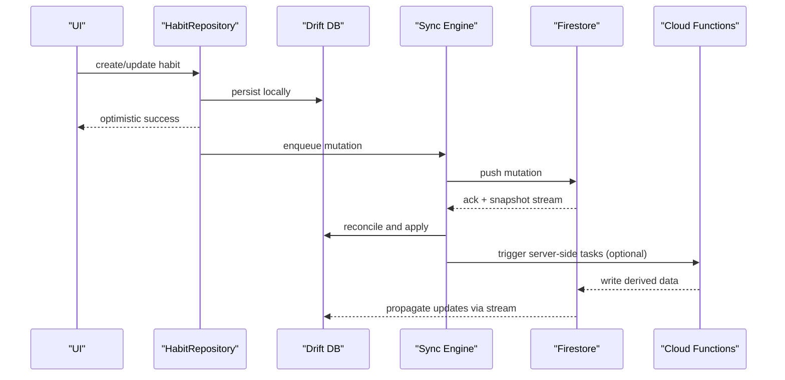
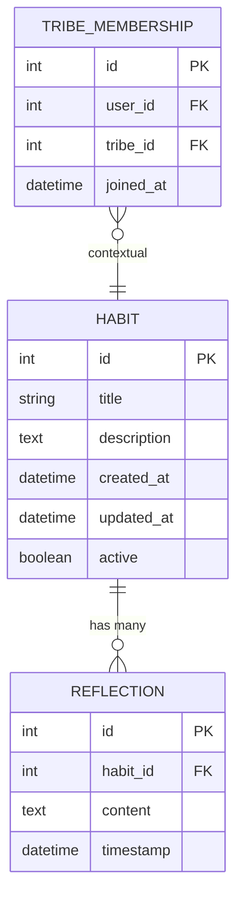
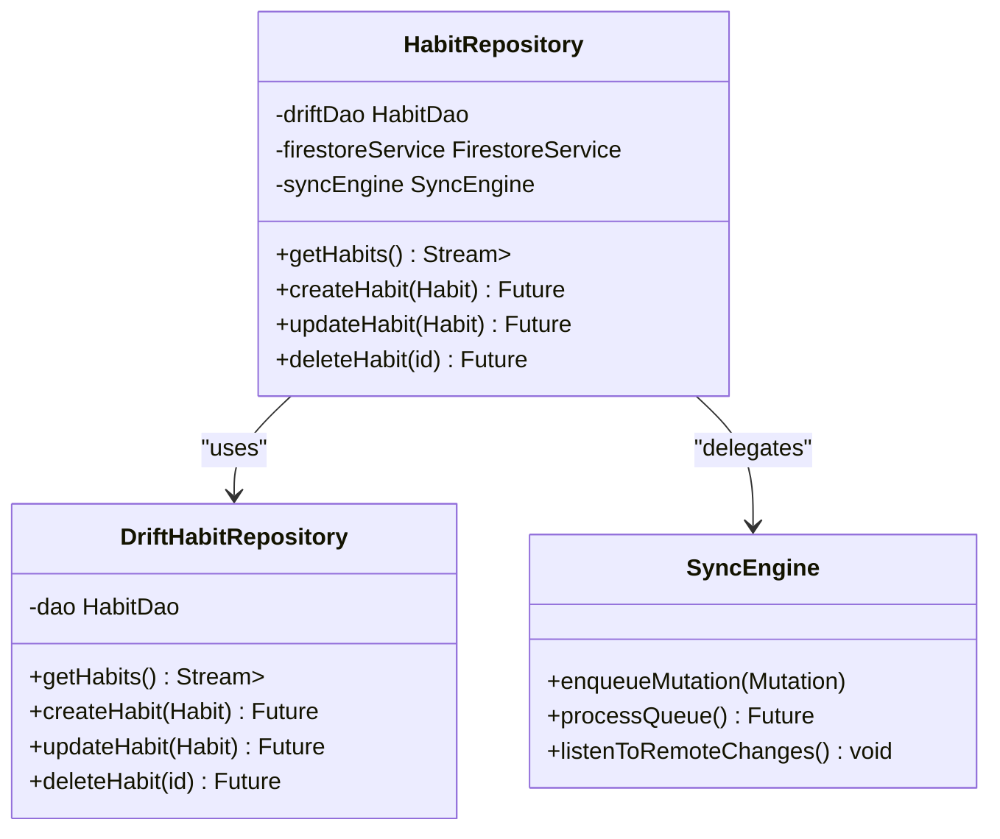
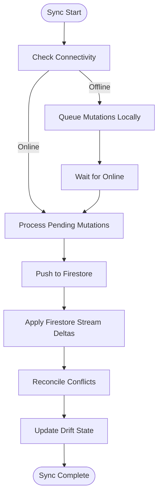
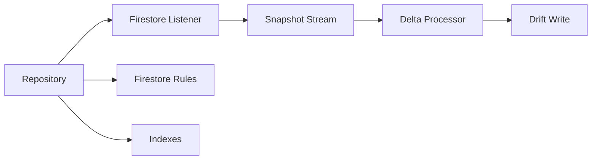
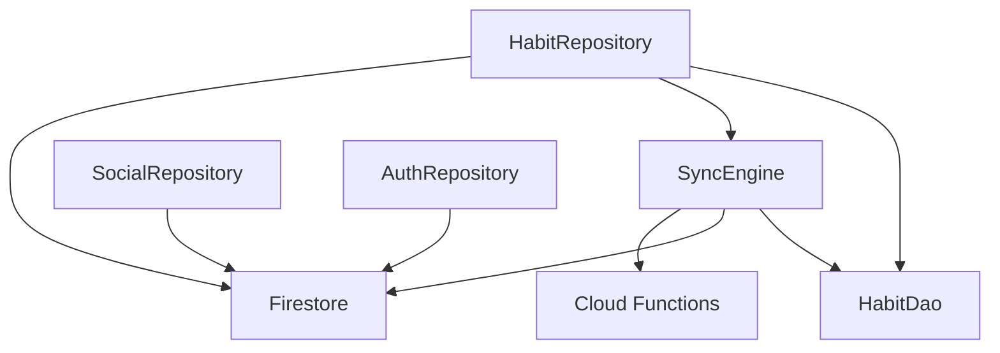

# Data Layer & Synchronization

<cite>
**Referenced Files in This Document**
- [lib/core/drift/database.dart](file://lib/core/drift/database.dart)
- [lib/core/drift/daos/habit_dao.dart](file://lib/core/drift/daos/habit_dao.dart)
- [lib/core/drift/daos/reflection_dao.dart](file://lib/core/drift/daos/reflection_dao.dart)
- [lib/core/drift/daos/tribe_membership_dao.dart](file://lib/core/drift/daos/tribe_membership_dao.dart)
- [lib/core/drift/migrations.dart](file://lib/core/drift/migrations.dart)
- [lib/core/sync/sync_engine.dart](file://lib/core/sync/sync_engine.dart)
- [lib/core/sync/enhanced_sync_engine.dart](file://lib/core/sync/enhanced_sync_engine.dart)
- [lib/core/sync/sync_trigger_service.dart](file://lib/core/sync/sync_trigger_service.dart)
- [lib/core/sync/providers.dart](file://lib/core/sync/providers.dart)
- [lib/features/habits/data/repositories/habit_repository.dart](file://lib/features/habits/data/repositories/habit_repository.dart)
- [lib/features/habits/data/repositories/drift_habit_repository.dart](file://lib/features/habits/data/repositories/drift_habit_repository.dart)
- [lib/features/social/data/repositories/social_repository.dart](file://lib/features/social/data/repositories/social_repository.dart)
- [lib/features/auth/data/repositories/auth_repository.dart](file://lib/features/auth/data/repositories/auth_repository.dart)
- [firestore.indexes.json](file://firestore.indexes.json)
- [firestore.rules](file://firestore.rules)
- [functions/src/index.ts](file://functions/src/index.ts)
- [functions/src/cleanupUserData.js](file://functions/src/cleanupUserData.js)
- [functions/src/accountDeletion.js](file://functions/src/accountDeletion.js)
- [scripts/purge_orphaned_data.js](file://scripts/purge_orphaned_data.js)
- [web/drift_worker.dart](file://web/drift_worker.dart)
- [pubspec.yaml](file://pubspec.yaml)
</cite>

## Table of Contents
1. [Introduction](#introduction)
2. [Project Structure](#project-structure)
3. [Core Components](#core-components)
4. [Architecture Overview](#architecture-overview)
5. [Detailed Component Analysis](#detailed-component-analysis)
6. [Dependency Analysis](#dependency-analysis)
7. [Performance Considerations](#performance-considerations)
8. [Troubleshooting Guide](#troubleshooting-guide)
9. [Conclusion](#conclusion)
10. [Appendices](#appendices)

## Introduction
This document explains the data layer architecture and synchronization mechanisms for the application. It covers the Drift database schema, entity relationships, query optimization strategies, Firebase Firestore integration, real-time synchronization, conflict resolution, offline-first design, caching strategies, background sync processes, repository pattern implementation, data transformation layers, validation rules, custom repositories, migration scripts, performance tuning, security, encryption, backup, and disaster recovery procedures.

## Project Structure
The data layer is organized around:
- Local persistence with Drift (SQLite)
- Remote persistence with Firebase Firestore
- A synchronization engine that reconciles local and remote state
- Repository abstractions that encapsulate data sources and transformations
- Background services to trigger and manage sync operations

**Diagram sources**
- [lib/core/drift/database.dart](file://lib/core/drift/database.dart)
- [lib/core/drift/daos/habit_dao.dart](file://lib/core/drift/daos/habit_dao.dart)
- [lib/core/drift/daos/reflection_dao.dart](file://lib/core/drift/daos/reflection_dao.dart)
- [lib/core/drift/daos/tribe_membership_dao.dart](file://lib/core/drift/daos/tribe_membership_dao.dart)
- [lib/core/sync/sync_engine.dart](file://lib/core/sync/sync_engine.dart)
- [lib/core/sync/enhanced_sync_engine.dart](file://lib/core/sync/enhanced_sync_engine.dart)
- [lib/core/sync/sync_trigger_service.dart](file://lib/core/sync/sync_trigger_service.dart)
- [lib/features/habits/data/repositories/habit_repository.dart](file://lib/features/habits/data/repositories/habit_repository.dart)
- [lib/features/habits/data/repositories/drift_habit_repository.dart](file://lib/features/habits/data/repositories/drift_habit_repository.dart)
- [lib/features/social/data/repositories/social_repository.dart](file://lib/features/social/data/repositories/social_repository.dart)
- [lib/features/auth/data/repositories/auth_repository.dart](file://lib/features/auth/data/repositories/auth_repository.dart)
- [firestore.indexes.json](file://firestore.indexes.json)
- [firestore.rules](file://firestore.rules)
- [functions/src/index.ts](file://functions/src/index.ts)

**Section sources**
- [pubspec.yaml](file://pubspec.yaml)

## Core Components
- Drift Database and DAOs: Define typed tables and strongly-typed queries for habits, reflections, tribe membership, and more.
- Repositories: Abstract data access behind a consistent API, combining local Drift reads/writes with remote Firestore operations.
- Sync Engine: Orchestrates bidirectional synchronization, conflict detection/resolution, and background execution.
- Trigger Service: Observes app lifecycle and connectivity changes to schedule sync tasks.
- Firestore Integration: Real-time listeners, indexes, and security rules ensure efficient and secure cloud data access.
- Cloud Functions: Server-side processing for cleanup, seeding, and reconciliation tasks.

**Section sources**
- [lib/core/drift/database.dart](file://lib/core/drift/database.dart)
- [lib/core/drift/daos/habit_dao.dart](file://lib/core/drift/daos/habit_dao.dart)
- [lib/core/drift/daos/reflection_dao.dart](file://lib/core/drift/daos/reflection_dao.dart)
- [lib/core/drift/daos/tribe_membership_dao.dart](file://lib/core/drift/daos/tribe_membership_dao.dart)
- [lib/core/sync/sync_engine.dart](file://lib/core/sync/sync_engine.dart)
- [lib/core/sync/enhanced_sync_engine.dart](file://lib/core/sync/enhanced_sync_engine.dart)
- [lib/core/sync/sync_trigger_service.dart](file://lib/core/sync/sync_trigger_service.dart)
- [lib/features/habits/data/repositories/habit_repository.dart](file://lib/features/habits/data/repositories/habit_repository.dart)
- [lib/features/habits/data/repositories/drift_habit_repository.dart](file://lib/features/habits/data/repositories/drift_habit_repository.dart)
- [lib/features/social/data/repositories/social_repository.dart](file://lib/features/social/data/repositories/social_repository.dart)
- [lib/features/auth/data/repositories/auth_repository.dart](file://lib/features/auth/data/repositories/auth_repository.dart)
- [firestore.indexes.json](file://firestore.indexes.json)
- [firestore.rules](file://firestore.rules)
- [functions/src/index.ts](file://functions/src/index.ts)

## Architecture Overview
The system follows an offline-first approach:
- All writes go to Drift first, then are queued for sync.
- Firestore streams drive updates back into Drift.
- The sync engine resolves conflicts using timestamps and deterministic rules.
- Background triggers keep data in sync when connectivity is available.

**Diagram sources**
- [lib/features/habits/data/repositories/drift_habit_repository.dart](file://lib/features/habits/data/repositories/drift_habit_repository.dart)
- [lib/core/drift/database.dart](file://lib/core/drift/database.dart)
- [lib/core/sync/sync_engine.dart](file://lib/core/sync/sync_engine.dart)
- [lib/core/sync/enhanced_sync_engine.dart](file://lib/core/sync/enhanced_sync_engine.dart)
- [firestore.indexes.json](file://firestore.indexes.json)
- [functions/src/index.ts](file://functions/src/index.ts)

## Detailed Component Analysis

### Drift Schema and DAOs
- Tables include habits, reflections, and tribe membership entities.
- DAOs expose typed methods for CRUD and complex queries.
- Migrations handle schema evolution safely.

**Diagram sources**
- [lib/core/drift/database.dart](file://lib/core/drift/database.dart)
- [lib/core/drift/daos/habit_dao.dart](file://lib/core/drift/daos/habit_dao.dart)
- [lib/core/drift/daos/reflection_dao.dart](file://lib/core/drift/daos/reflection_dao.dart)
- [lib/core/drift/daos/tribe_membership_dao.dart](file://lib/core/drift/daos/tribe_membership_dao.dart)

Key responsibilities:
- HabitDao: insert, update, delete, query by filters, batch operations.
- ReflectionDao: append reflections linked to habits, time-range queries.
- TribeMembershipDao: manage memberships and related queries.

Optimization strategies:
- Indexed columns for frequent filters (e.g., updated_at, active).
- Batched inserts/updates to reduce transaction overhead.
- Parameterized queries to avoid SQL injection and enable query plan reuse.

**Section sources**
- [lib/core/drift/database.dart](file://lib/core/drift/database.dart)
- [lib/core/drift/daos/habit_dao.dart](file://lib/core/drift/daos/habit_dao.dart)
- [lib/core/drift/daos/reflection_dao.dart](file://lib/core/drift/daos/reflection_dao.dart)
- [lib/core/drift/daos/tribe_membership_dao.dart](file://lib/core/drift/daos/tribe_membership_dao.dart)
- [lib/core/drift/migrations.dart](file://lib/core/drift/migrations.dart)

### Repository Pattern Implementation
Repositories abstract data sources and provide a unified API:
- HabitRepository: orchestrates Drift and Firestore for habits.
- SocialRepository: manages social features via Firestore.
- AuthRepository: handles authentication state and user profile data.

**Diagram sources**
- [lib/features/habits/data/repositories/habit_repository.dart](file://lib/features/habits/data/repositories/habit_repository.dart)
- [lib/features/habits/data/repositories/drift_habit_repository.dart](file://lib/features/habits/data/repositories/drift_habit_repository.dart)
- [lib/core/sync/sync_engine.dart](file://lib/core/sync/sync_engine.dart)

Validation and transformation:
- Input validation before persistence (e.g., required fields, constraints).
- Domain model mapping between DTOs, Drift entities, and Firestore documents.
- Conflict markers and versioning to support safe merges.

**Section sources**
- [lib/features/habits/data/repositories/habit_repository.dart](file://lib/features/habits/data/repositories/habit_repository.dart)
- [lib/features/habits/data/repositories/drift_habit_repository.dart](file://lib/features/habits/data/repositories/drift_habit_repository.dart)
- [lib/features/social/data/repositories/social_repository.dart](file://lib/features/social/data/repositories/social_repository.dart)
- [lib/features/auth/data/repositories/auth_repository.dart](file://lib/features/auth/data/repositories/auth_repository.dart)

### Synchronization Engine
The sync engine coordinates:
- Mutation queue: persists pending changes and retries on failure.
- Remote listeners: subscribes to Firestore streams and applies deltas.
- Conflict resolution: uses timestamps, last-write-wins, or merge strategies per field.
- Background scheduling: runs sync tasks when online and idle.

**Diagram sources**
- [lib/core/sync/sync_engine.dart](file://lib/core/sync/sync_engine.dart)
- [lib/core/sync/enhanced_sync_engine.dart](file://lib/core/sync/enhanced_sync_engine.dart)
- [lib/core/sync/sync_trigger_service.dart](file://lib/core/sync/sync_trigger_service.dart)

Background triggers:
- App lifecycle events (foreground/background).
- Connectivity changes.
- Periodic scheduled jobs.

**Section sources**
- [lib/core/sync/sync_engine.dart](file://lib/core/sync/sync_engine.dart)
- [lib/core/sync/enhanced_sync_engine.dart](file://lib/core/sync/enhanced_sync_engine.dart)
- [lib/core/sync/sync_trigger_service.dart](file://lib/core/sync/sync_trigger_service.dart)

### Firebase Firestore Integration
- Real-time listeners subscribe to collections/documents relevant to the current user.
- Indexes defined in firestore.indexes.json optimize common queries.
- Security rules enforce read/write permissions at document and collection levels.

**Diagram sources**
- [lib/features/habits/data/repositories/habit_repository.dart](file://lib/features/habits/data/repositories/habit_repository.dart)
- [firestore.indexes.json](file://firestore.indexes.json)
- [firestore.rules](file://firestore.rules)

Conflict resolution strategy:
- Use updated_at timestamps to detect conflicts.
- Merge non-conflicting fields; escalate conflicting fields to server functions if needed.
- Maintain operation logs for auditability.

**Section sources**
- [firestore.indexes.json](file://firestore.indexes.json)
- [firestore.rules](file://firestore.rules)

### Offline-First Architecture and Caching
- Drift serves as the source of truth for UI while offline.
- In-memory cache reduces redundant computations for derived views.
- Mutation queue ensures durability across app restarts.

Caching strategies:
- Eager load frequently accessed entities.
- Lazy load heavy associations.
- Invalidate caches on mutations or remote updates.

**Section sources**
- [lib/core/drift/database.dart](file://lib/core/drift/database.dart)
- [lib/core/sync/sync_engine.dart](file://lib/core/sync/sync_engine.dart)

### Custom Repositories Example
A custom repository typically:
- Validates inputs.
- Persists locally via Drift.
- Enqueues mutations for sync.
- Subscribes to remote streams and applies deltas.
- Exposes typed streams for UI consumption.

Example references:
- Habit repository implementation shows how to combine Drift and Firestore.
- Social repository demonstrates collection-level operations and real-time updates.

**Section sources**
- [lib/features/habits/data/repositories/drift_habit_repository.dart](file://lib/features/habits/data/repositories/drift_habit_repository.dart)
- [lib/features/social/data/repositories/social_repository.dart](file://lib/features/social/data/repositories/social_repository.dart)

### Migration Scripts
- Drift migrations define incremental schema changes.
- Seed scripts populate initial data for development/testing.
- Cleanup scripts remove orphaned data and maintain consistency.

References:
- Drift migrations file defines versioned schema transitions.
- Cleanup and account deletion functions handle server-side data hygiene.

**Section sources**
- [lib/core/drift/migrations.dart](file://lib/core/drift/migrations.dart)
- [functions/src/cleanupUserData.js](file://functions/src/cleanupUserData.js)
- [functions/src/accountDeletion.js](file://functions/src/accountDeletion.js)
- [scripts/purge_orphaned_data.js](file://scripts/purge_orphaned_data.js)

### Performance Tuning
- Query optimization:
  - Use indexed fields in WHERE clauses.
  - Limit result sets with pagination.
  - Avoid N+1 queries by batching.
- Sync efficiency:
  - Debounce rapid mutations.
  - Coalesce overlapping updates.
  - Prefer targeted document updates over full rewrites.
- Drift performance:
  - Use transactions for multi-step writes.
  - Enable WAL mode where appropriate.
  - Profile slow queries and add indexes.

**Section sources**
- [firestore.indexes.json](file://firestore.indexes.json)
- [lib/core/drift/database.dart](file://lib/core/drift/database.dart)
- [lib/core/sync/sync_engine.dart](file://lib/core/sync/sync_engine.dart)

### Data Security, Encryption, Backup, Disaster Recovery
- Security:
  - Firestore rules restrict access based on user identity and ownership.
  - Validate all inputs at repository boundaries.
  - Use HTTPS and Firebase App Check to mitigate abuse.
- Encryption:
  - Encrypt sensitive fields client-side before storing in Drift or Firestore.
  - Manage keys securely using platform keychains.
- Backup:
  - Export Firestore backups regularly.
  - Snapshot Drift databases for critical states.
- Disaster recovery:
  - Implement restore procedures from backups.
  - Use idempotent operations to avoid duplicates during recovery.
  - Audit logs to trace data lineage and resolve inconsistencies.

**Section sources**
- [firestore.rules](file://firestore.rules)
- [functions/src/index.ts](file://functions/src/index.ts)

## Dependency Analysis
The data layer components interact as follows:

**Diagram sources**
- [lib/features/habits/data/repositories/habit_repository.dart](file://lib/features/habits/data/repositories/habit_repository.dart)
- [lib/core/drift/daos/habit_dao.dart](file://lib/core/drift/daos/habit_dao.dart)
- [lib/core/sync/sync_engine.dart](file://lib/core/sync/sync_engine.dart)
- [lib/features/social/data/repositories/social_repository.dart](file://lib/features/social/data/repositories/social_repository.dart)
- [lib/features/auth/data/repositories/auth_repository.dart](file://lib/features/auth/data/repositories/auth_repository.dart)
- [functions/src/index.ts](file://functions/src/index.ts)

Coupling and cohesion:
- Repositories encapsulate both local and remote concerns, improving cohesion.
- Sync engine centralizes synchronization logic, reducing coupling across features.
- DAOs isolate SQL details, enabling independent evolution of persistence.

Potential circular dependencies:
- Ensure repositories do not import sync internals directly; use interfaces where possible.
- Keep feature modules decoupled from core sync implementation through abstractions.

External dependencies:
- Drift for SQLite persistence.
- Firebase Firestore for cloud storage and real-time updates.
- Cloud Functions for server-side processing.

**Section sources**
- [lib/features/habits/data/repositories/habit_repository.dart](file://lib/features/habits/data/repositories/habit_repository.dart)
- [lib/core/drift/daos/habit_dao.dart](file://lib/core/drift/daos/habit_dao.dart)
- [lib/core/sync/sync_engine.dart](file://lib/core/sync/sync_engine.dart)
- [lib/features/social/data/repositories/social_repository.dart](file://lib/features/social/data/repositories/social_repository.dart)
- [lib/features/auth/data/repositories/auth_repository.dart](file://lib/features/auth/data/repositories/auth_repository.dart)
- [functions/src/index.ts](file://functions/src/index.ts)

## Performance Considerations
- Minimize network calls by batching and debouncing.
- Use streaming listeners selectively to avoid excessive updates.
- Optimize Drift queries with proper indexing and query plans.
- Monitor memory usage for large datasets; implement pagination.
- Profile sync throughput and adjust concurrency limits.

[No sources needed since this section provides general guidance]

## Troubleshooting Guide
Common issues and resolutions:
- Sync stalls:
  - Verify connectivity and retry policies.
  - Inspect mutation queue for failed operations.
- Conflicts:
  - Review conflict resolution rules and timestamps.
  - Log conflicting fields for manual reconciliation.
- Slow queries:
  - Add Firestore indexes and Drift indices.
  - Refactor queries to reduce joins and filtering.
- Data inconsistency:
  - Run cleanup functions to purge orphaned data.
  - Validate referential integrity in Drift.

Operational utilities:
- Purge orphaned data script.
- Account deletion function to ensure GDPR compliance.
- Cleanup user data function to maintain database health.

**Section sources**
- [scripts/purge_orphaned_data.js](file://scripts/purge_orphaned_data.js)
- [functions/src/accountDeletion.js](file://functions/src/accountDeletion.js)
- [functions/src/cleanupUserData.js](file://functions/src/cleanupUserData.js)

## Conclusion
The data layer combines Drift for robust local persistence with Firestore for scalable cloud storage and real-time synchronization. The repository pattern abstracts complexity, while the sync engine ensures consistency and resilience. With careful indexing, validation, and security measures, the system delivers a reliable offline-first experience and efficient cloud integration.

[No sources needed since this section summarizes without analyzing specific files]

## Appendices

### Web Worker Support
Drift web worker configuration enables asynchronous database operations on the web platform.

**Section sources**
- [web/drift_worker.dart](file://web/drift_worker.dart)

### Dependencies
Review project dependencies for Drift, Firebase, and sync libraries.

**Section sources**
- [pubspec.yaml](file://pubspec.yaml)