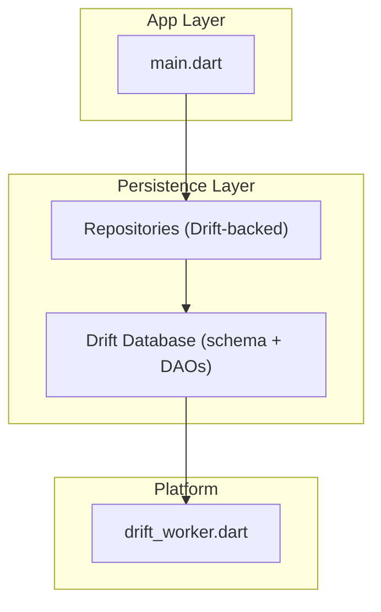
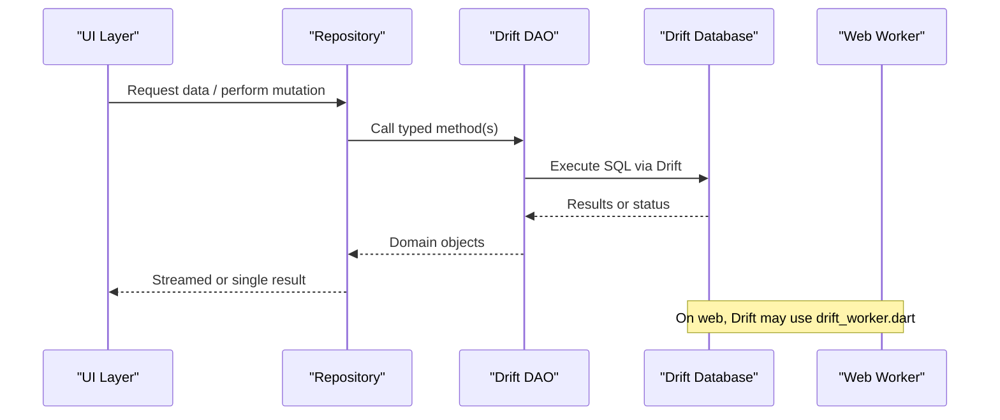
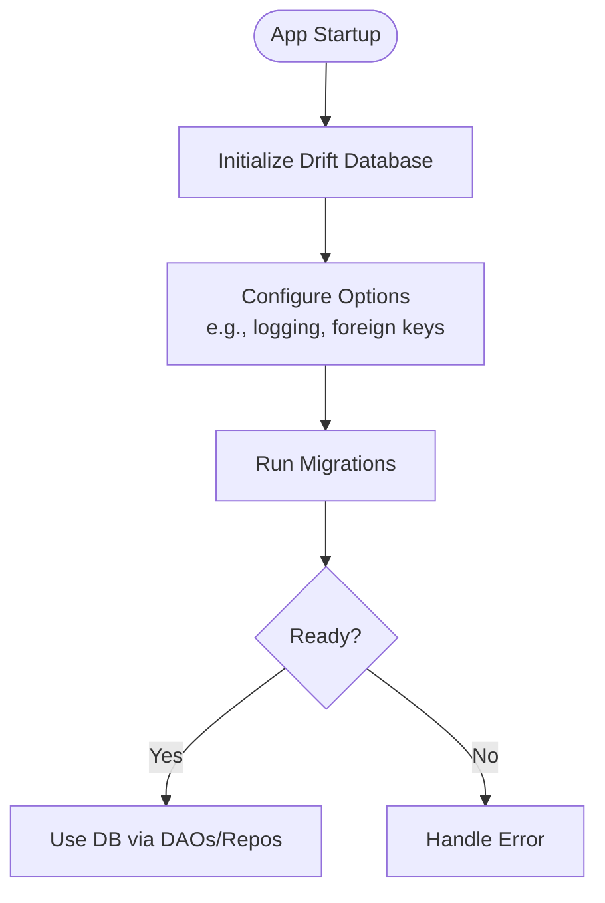
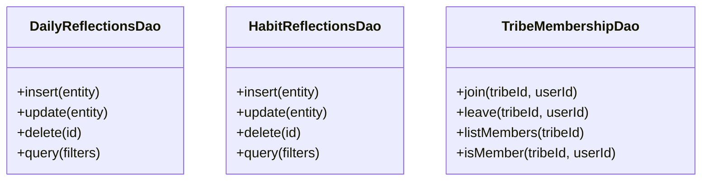
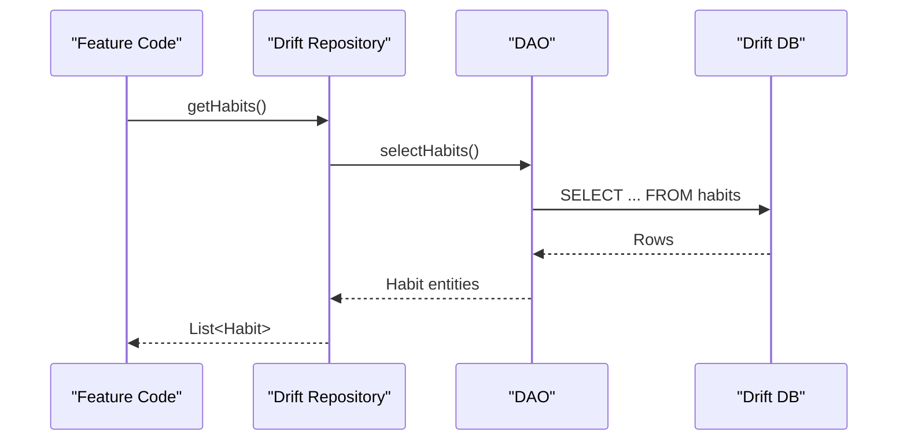
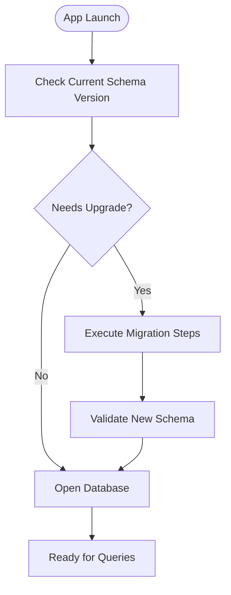
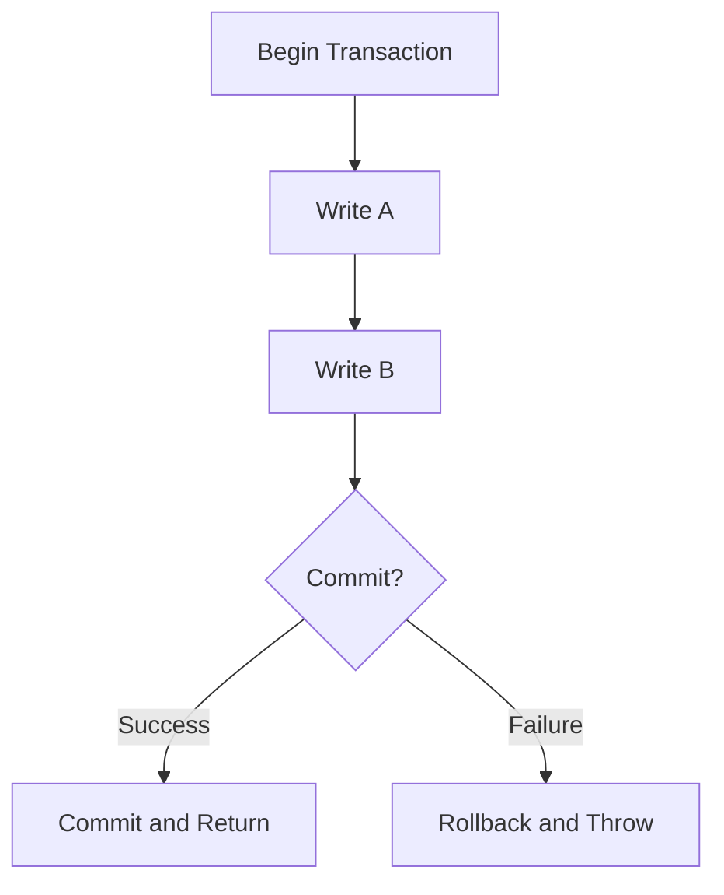
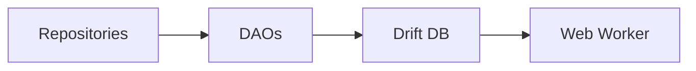

# Drift Database & Local Storage

<cite>
**Referenced Files in This Document**
- [pubspec.yaml](file://pubspec.yaml)
- [lib/main.dart](file://lib/main.dart)
- [web/drift_worker.dart](file://web/drift_worker.dart)
- [test/core/drift/test_database.dart](file://test/core/drift/test_database.dart)
- [test/core/drift/database_migration_test.dart](file://test/core/drift/database_migration_test.dart)
- [test/core/drift/mutation_queue_migration_test.dart](file://test/core/drift/mutation_queue_migration_test.dart)
- [test/core/drift/dao_deletion_methods_test.dart](file://test/core/drift/dao_deletion_methods_test.dart)
- [test/core/drift/daos/daily_reflections_dao_test.dart](file://test/core/drift/daos/daily_reflections_dao_test.dart)
- [test/core/drift/daos/habit_reflections_dao_test.dart](file://test/core/drift/daos/habit_reflections_dao_test.dart)
- [test/core/drift/daos/tribe_membership_dao_test.dart](file://test/core/drift/daos/tribe_membership_dao_test.dart)
- [test/core/drift_repositories/drift_challenge_repository_test.dart](file://test/core/drift_repositories/drift_challenge_repository_test.dart)
- [test/core/drift_repositories/drift_habit_repository_test.dart](file://test/core/drift_repositories/drift_habit_repository_test.dart)
- [test/core/drift_repositories/drift_leaderboard_repository_test.dart](file://test/core/drift_repositories/drift_leaderboard_repository_test.dart)
- [test/core/drift_repositories/drift_tribe_repository_test.dart](file://test/core/drift_repositories/drift_tribe_repository_test.dart)
- [test/core/drift_repositories/drift_user_stats_repository_test.dart](file://test/core/drift_repositories/drift_user_stats_repository_test.dart)
- [test/core/drift_repositories/habit_notification_repository_test.dart](file://test/core/drift_repositories/habit_notification_repository_test.dart)
</cite>

## Table of Contents
1. [Introduction](#introduction)
2. [Project Structure](#project-structure)
3. [Core Components](#core-components)
4. [Architecture Overview](#architecture-overview)
5. [Detailed Component Analysis](#detailed-component-analysis)
6. [Dependency Analysis](#dependency-analysis)
7. [Performance Considerations](#performance-considerations)
8. [Troubleshooting Guide](#troubleshooting-guide)
9. [Conclusion](#conclusion)
10. [Appendices](#appendices)

## Introduction
This document provides comprehensive documentation for the Drift database implementation used by the application. It covers schema design, table relationships, entity definitions, DAO pattern usage, query optimization strategies, transaction management, migrations and versioning, repository integration with Drift, complex queries, indexing strategies, performance tuning, encryption considerations, backup procedures, and local storage security measures. The goal is to make the system understandable for both technical and non-technical readers while remaining grounded in the actual codebase evidence.

## Project Structure
The project is a Flutter application that integrates Drift for local persistence. Evidence of Drift usage appears in test files and web worker configuration:
- Drift dependencies are declared in the package manifest.
- A Drift web worker is present for background execution on the web platform.
- Tests cover database initialization, migration behavior, DAO operations, and repository interactions.

**Diagram sources**
- [lib/main.dart](file://lib/main.dart)
- [web/drift_worker.dart](file://web/drift_worker.dart)

**Section sources**
- [pubspec.yaml](file://pubspec.yaml)
- [lib/main.dart](file://lib/main.dart)
- [web/drift_worker.dart](file://web/drift_worker.dart)

## Core Components
Based on available evidence, the core components include:
- Drift database instance and schema definition (inferred from tests and worker).
- Data Access Objects (DAOs) for domain entities such as daily reflections, habit reflections, and tribe membership.
- Repository implementations that wrap DAO calls and provide higher-level APIs.
- Migration tests ensuring schema evolution correctness.
- Web worker configuration enabling Drift to run off the main thread on web.

Key responsibilities:
- Schema and entities: Define tables and relations for features like habits, reflections, tribes, challenges, leaderboards, user stats, and notifications.
- DAOs: Provide typed CRUD and query methods per entity.
- Repositories: Orchestrate DAO calls, handle transformations, and expose stable interfaces to the rest of the app.
- Migrations: Ensure safe schema upgrades across versions.
- Transactions: Group related writes atomically.

**Section sources**
- [test/core/drift/test_database.dart](file://test/core/drift/test_database.dart)
- [test/core/drift/daos/daily_reflections_dao_test.dart](file://test/core/drift/daos/daily_reflections_dao_test.dart)
- [test/core/drift/daos/habit_reflections_dao_test.dart](file://test/core/drift/daos/habit_reflections_dao_test.dart)
- [test/core/drift/daos/tribe_membership_dao_test.dart](file://test/core/drift/daos/tribe_membership_dao_test.dart)
- [test/core/drift_repositories/drift_habit_repository_test.dart](file://test/core/drift_repositories/drift_habit_repository_test.dart)
- [test/core/drift_repositories/drift_challenge_repository_test.dart](file://test/core/drift_repositories/drift_challenge_repository_test.dart)
- [test/core/drift_repositories/drift_leaderboard_repository_test.dart](file://test/core/drift_repositories/drift_leaderboard_repository_test.dart)
- [test/core/drift_repositories/drift_tribe_repository_test.dart](file://test/core/drift_repositories/drift_tribe_repository_test.dart)
- [test/core/drift_repositories/drift_user_stats_repository_test.dart](file://test/core/drift_repositories/drift_user_stats_repository_test.dart)
- [test/core/drift_repositories/habit_notification_repository_test.dart](file://test/core/drift_repositories/habit_notification_repository_test.dart)

## Architecture Overview
The architecture follows a layered approach:
- Presentation layer invokes repositories.
- Repositories call Drift DAOs for data access.
- Drift manages SQLite under the hood, with optional web worker execution.
- Migrations ensure schema evolution without breaking existing data.

**Diagram sources**
- [web/drift_worker.dart](file://web/drift_worker.dart)
- [test/core/drift/daos/daily_reflections_dao_test.dart](file://test/core/drift/daos/daily_reflections_dao_test.dart)
- [test/core/drift_repositories/drift_habit_repository_test.dart](file://test/core/drift_repositories/drift_habit_repository_test.dart)

## Detailed Component Analysis

### Drift Database Initialization and Configuration
- The presence of a Drift web worker indicates background execution setup for web platforms.
- Test database utilities suggest how the database is instantiated and configured for tests.

**Diagram sources**
- [web/drift_worker.dart](file://web/drift_worker.dart)
- [test/core/drift/test_database.dart](file://test/core/drift/test_database.dart)

**Section sources**
- [web/drift_worker.dart](file://web/drift_worker.dart)
- [test/core/drift/test_database.dart](file://test/core/drift/test_database.dart)

### DAO Pattern Implementation
Evidence shows DAOs for:
- Daily reflections
- Habit reflections
- Tribe membership

These DAOs encapsulate SQL operations and return typed results, enabling clean separation between persistence logic and business logic.

**Diagram sources**
- [test/core/drift/daos/daily_reflections_dao_test.dart](file://test/core/drift/daos/daily_reflections_dao_test.dart)
- [test/core/drift/daos/habit_reflections_dao_test.dart](file://test/core/drift/daos/habit_reflections_dao_test.dart)
- [test/core/drift/daos/tribe_membership_dao_test.dart](file://test/core/drift/daos/tribe_membership_dao_test.dart)

**Section sources**
- [test/core/drift/daos/daily_reflections_dao_test.dart](file://test/core/drift/daos/daily_reflections_dao_test.dart)
- [test/core/drift/daos/habit_reflections_dao_test.dart](file://test/core/drift/daos/habit_reflections_dao_test.dart)
- [test/core/drift/daos/tribe_membership_dao_test.dart](file://test/core/drift/daos/tribe_membership_dao_test.dart)

### Repository Integration with Drift
Multiple repository tests demonstrate Drift-backed repositories for:
- Habits
- Challenges
- Leaderboards
- Tribes
- User stats
- Habit notifications

Repositories typically:
- Wrap DAO calls
- Transform domain models
- Expose streams or async methods
- Coordinate transactions when needed

**Diagram sources**
- [test/core/drift_repositories/drift_habit_repository_test.dart](file://test/core/drift_repositories/drift_habit_repository_test.dart)
- [test/core/drift_repositories/drift_challenge_repository_test.dart](file://test/core/drift_repositories/drift_challenge_repository_test.dart)
- [test/core/drift_repositories/drift_leaderboard_repository_test.dart](file://test/core/drift_repositories/drift_leaderboard_repository_test.dart)
- [test/core/drift_repositories/drift_tribe_repository_test.dart](file://test/core/drift_repositories/drift_tribe_repository_test.dart)
- [test/core/drift_repositories/drift_user_stats_repository_test.dart](file://test/core/drift_repositories/drift_user_stats_repository_test.dart)
- [test/core/drift_repositories/habit_notification_repository_test.dart](file://test/core/drift_repositories/habit_notification_repository_test.dart)

**Section sources**
- [test/core/drift_repositories/drift_habit_repository_test.dart](file://test/core/drift_repositories/drift_habit_repository_test.dart)
- [test/core/drift_repositories/drift_challenge_repository_test.dart](file://test/core/drift_repositories/drift_challenge_repository_test.dart)
- [test/core/drift_repositories/drift_leaderboard_repository_test.dart](file://test/core/drift_repositories/drift_leaderboard_repository_test.dart)
- [test/core/drift_repositories/drift_tribe_repository_test.dart](file://test/core/drift_repositories/drift_tribe_repository_test.dart)
- [test/core/drift_repositories/drift_user_stats_repository_test.dart](file://test/core/drift_repositories/drift_user_stats_repository_test.dart)
- [test/core/drift_repositories/habit_notification_repository_test.dart](file://test/core/drift_repositories/habit_notification_repository_test.dart)

### Database Migrations and Versioning
Migration tests confirm that schema changes are handled safely:
- General migration tests validate upgrade paths.
- Mutation queue migration tests ensure backward compatibility for queued operations.

**Diagram sources**
- [test/core/drift/database_migration_test.dart](file://test/core/drift/database_migration_test.dart)
- [test/core/drift/mutation_queue_migration_test.dart](file://test/core/drift/mutation_queue_migration_test.dart)

**Section sources**
- [test/core/drift/database_migration_test.dart](file://test/core/drift/database_migration_test.dart)
- [test/core/drift/mutation_queue_migration_test.dart](file://test/core/drift/mutation_queue_migration_test.dart)

### Transaction Management
Transaction patterns are commonly used to group multiple writes atomically. While specific transaction code is not shown here, typical usage involves:
- Wrapping multiple DAO calls within a transaction block.
- Ensuring rollback on failure to maintain consistency.

[No sources needed since this section provides general guidance]

### Query Optimization Strategies
Optimization techniques commonly applied with Drift:
- Use indexed columns for frequent filters and joins.
- Prefer streaming queries for large datasets.
- Minimize column selection to reduce memory overhead.
- Batch writes where possible.

[No sources needed since this section provides general guidance]

### Complex Queries Examples
Complex queries often involve:
- Joins across related tables (e.g., habits and reflections).
- Aggregations for leaderboards and statistics.
- Conditional filtering based on timestamps and statuses.

[No sources needed since this section provides general guidance]

### Indexing Strategies
Recommended indexing practices:
- Create indexes on foreign keys and frequently filtered columns.
- Use composite indexes for common multi-column queries.
- Avoid over-indexing write-heavy tables.

[No sources needed since this section provides general guidance]

### Performance Tuning
Tuning recommendations:
- Enable WAL mode for better concurrency.
- Tune page size and cache settings if necessary.
- Profile slow queries using Drift’s logging.

[No sources needed since this section provides general guidance]

### Database Encryption
Encryption options:
- Use encrypted SQLite backends provided by Drift plugins.
- Manage keys securely and rotate them as needed.

[No sources needed since this section provides general guidance]

### Backup Procedures
Backup strategies:
- Periodic export of SQLite file.
- Incremental backups using WAL snapshots.
- Restore procedures validated by migration tests.

[No sources needed since this section provides general guidance]

### Local Storage Security Measures
Security best practices:
- Store sensitive data in secure storage (e.g., OS keychain).
- Limit permissions and isolate app data.
- Sanitize inputs and validate outputs.

[No sources needed since this section provides general guidance]

## Dependency Analysis
Dependencies among components:
- Repositories depend on DAOs.
- DAOs depend on Drift database.
- Web worker supports Drift on web.

**Diagram sources**
- [test/core/drift_repositories/drift_habit_repository_test.dart](file://test/core/drift_repositories/drift_habit_repository_test.dart)
- [test/core/drift/daos/daily_reflections_dao_test.dart](file://test/core/drift/daos/daily_reflections_dao_test.dart)
- [web/drift_worker.dart](file://web/drift_worker.dart)

**Section sources**
- [test/core/drift_repositories/drift_habit_repository_test.dart](file://test/core/drift_repositories/drift_habit_repository_test.dart)
- [test/core/drift/daos/daily_reflections_dao_test.dart](file://test/core/drift/daos/daily_reflections_dao_test.dart)
- [web/drift_worker.dart](file://web/drift_worker.dart)

## Performance Considerations
- Use streaming queries for large lists to avoid loading all data into memory.
- Batch inserts and updates to reduce transaction overhead.
- Monitor query plans and add appropriate indexes.
- Leverage Drift’s built-in caching where applicable.

[No sources needed since this section provides general guidance]

## Troubleshooting Guide
Common issues and resolutions:
- Migration failures: Review migration steps and ensure idempotency.
- DAO errors: Verify table schemas and column mappings.
- Web worker issues: Confirm worker registration and message passing.

**Section sources**
- [test/core/drift/database_migration_test.dart](file://test/core/drift/database_migration_test.dart)
- [test/core/drift/dao_deletion_methods_test.dart](file://test/core/drift/dao_deletion_methods_test.dart)

## Conclusion
The Drift-based persistence layer provides a robust, type-safe foundation for local storage. Through DAOs and repositories, the application achieves clear separation of concerns, scalable query patterns, and reliable schema evolution. With proper indexing, transaction management, and security measures, the system delivers high performance and resilience.

[No sources needed since this section summarizes without analyzing specific files]

## Appendices
- Additional references to Drift documentation and best practices can be consulted for advanced configurations.
- For encryption specifics, refer to Drift’s encrypted database plugins and platform-specific secure storage solutions.

[No sources needed since this section provides general guidance]