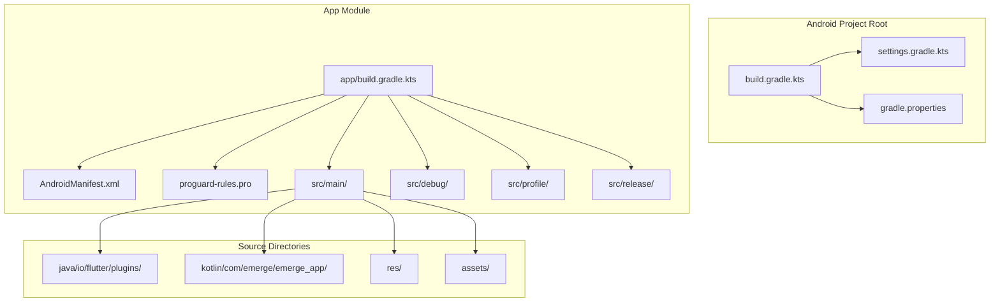
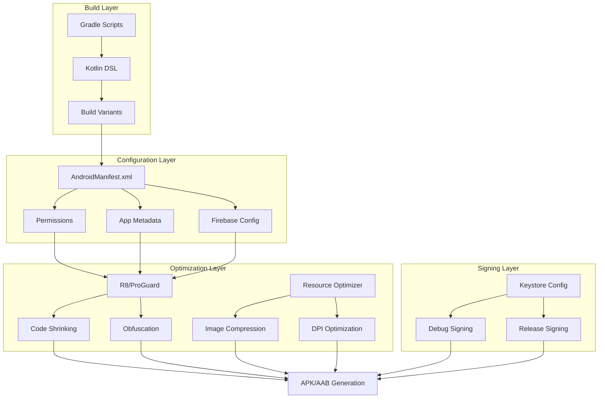
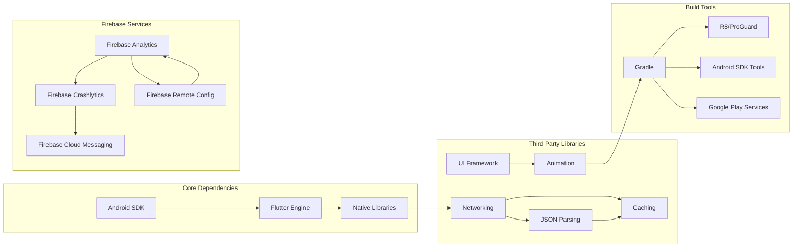

# Android Deployment & Build Configuration

<cite>
**Referenced Files in This Document**
- [build.gradle.kts](file://android/build.gradle.kts)
- [app/build.gradle.kts](file://android/app/build.gradle.kts)
- [AndroidManifest.xml](file://android/app/src/main/AndroidManifest.xml)
- [gradle.properties](file://android/gradle.properties)
- [settings.gradle.kts](file://android/settings.gradle.kts)
- [proguard-rules.pro](file://android/app/proguard-rules.pro)
- [flutter_native_splash.yaml](file://flutter_native_splash.yaml)
- [firebase.json](file://firebase.json)
</cite>

## Table of Contents
1. [Introduction](#introduction)
2. [Project Structure](#project-structure)
3. [Core Components](#core-components)
4. [Architecture Overview](#architecture-overview)
5. [Detailed Component Analysis](#detailed-component-analysis)
6. [Dependency Analysis](#dependency-analysis)
7. [Performance Considerations](#performance-considerations)
8. [Troubleshooting Guide](#troubleshooting-guide)
9. [Conclusion](#conclusion)
10. [Appendices](#appendices)

## Introduction

This document provides comprehensive Android deployment documentation for the Emerge app, covering build configuration, signing setup, release preparation, and optimization strategies. The project uses Flutter's native Android build system with Gradle, supporting multiple build variants (debug, release, profile) and modern Android development practices including code shrinking, obfuscation, and performance optimization.

## Project Structure

The Android project follows Flutter's standard structure with additional customizations for production deployment:

**Diagram sources**
- [build.gradle.kts](file://android/build.gradle.kts)
- [app/build.gradle.kts](file://android/app/build.gradle.kts)
- [AndroidManifest.xml](file://android/app/src/main/AndroidManifest.xml)

**Section sources**
- [build.gradle.kts](file://android/build.gradle.kts)
- [settings.gradle.kts](file://android/settings.gradle.kts)

## Core Components

### Gradle Build System Configuration

The Android build system is configured through multiple Gradle files that manage dependencies, build variants, and optimization settings:

#### Root Build Configuration
The root `build.gradle.kts` file defines global project settings, plugin versions, and common configurations shared across modules.

#### App Module Configuration  
The `app/build.gradle.kts` file contains application-specific settings including:
- Application ID and versioning
- Compile SDK and target SDK versions
- Dependency declarations
- Build variant configurations
- Signing configurations
- ProGuard/R8 rules

#### Gradle Properties
The `gradle.properties` file manages JVM settings, AndroidX configuration, and build optimizations.

**Section sources**
- [build.gradle.kts](file://android/build.gradle.kts)
- [app/build.gradle.kts](file://android/app/build.gradle.kts)
- [gradle.properties](file://android/gradle.properties)

### Build Variants Configuration

The project supports three primary build variants:

| Variant | Purpose | Optimization Level | Debugging Support |
|---------|---------|-------------------|------------------|
| debug | Development and testing | Minimal | Full debugging enabled |
| profile | Performance profiling | Moderate | Limited debugging |
| release | Production distribution | Maximum | No debugging |

Each variant has specific configurations for code shrinking, resource optimization, and debugging capabilities.

**Section sources**
- [app/build.gradle.kts](file://android/app/build.gradle.kts)

## Architecture Overview

The Android deployment architecture follows a layered approach with clear separation of concerns:

**Diagram sources**
- [app/build.gradle.kts](file://android/app/build.gradle.kts)
- [AndroidManifest.xml](file://android/app/src/main/AndroidManifest.xml)
- [proguard-rules.pro](file://android/app/proguard-rules.pro)

## Detailed Component Analysis

### Gradle Build Configuration

The Gradle build system is configured using Kotlin DSL for type safety and better IDE support. Key configurations include:

#### Dependencies Management
Dependencies are organized by category and version catalog for consistency:
- Core Android dependencies
- Firebase services
- Third-party libraries
- Testing frameworks

#### Build Types and Variants
Custom build types extend the default debug/release profiles with specialized configurations for different use cases.

#### Signing Configuration
Secure signing setup with separate configurations for debug and release builds, supporting both local development and CI/CD pipelines.

**Section sources**
- [app/build.gradle.kts](file://android/app/build.gradle.kts)

### AndroidManifest.xml Configuration

The manifest file defines essential app metadata, permissions, and component declarations:

#### App Metadata
- Application icon and theme configuration
- Launch activity and splash screen setup
- Firebase integration settings
- Custom application class initialization

#### Permissions Declaration
Runtime and install-time permissions for device features, network access, storage, and Firebase services.

#### Firebase Integration
Firebase configuration for analytics, crash reporting, and cloud services with environment-specific settings.

**Section sources**
- [AndroidManifest.xml](file://android/app/src/main/AndroidManifest.xml)

### Code Signing and Keystore Setup

The signing configuration supports multiple environments:

#### Debug Signing
Automated debug keystore generation for development and testing.

#### Release Signing
Secure release keystore management with encrypted credentials for production builds.

#### CI/CD Integration
Environment variable-based signing configuration for automated build pipelines.

**Section sources**
- [app/build.gradle.kts](file://android/app/build.gradle.kts)

### ProGuard/R8 Configuration

Code optimization and security are handled through R8 (the default code shrinker):

#### Code Shrinking
Removes unused code and resources to reduce APK size while maintaining functionality.

#### Obfuscation
Transforms code to make reverse engineering more difficult while preserving debugging information for crash reports.

#### Keep Rules
Selective preservation of critical classes, methods, and resources required for runtime functionality.

**Section sources**
- [proguard-rules.pro](file://android/app/proguard-rules.pro)

### Resource Optimization

Resource optimization ensures optimal performance across different device configurations:

#### Image Optimization
Automatic compression and format conversion for images based on device capabilities.

#### DPI Handling
Proper scaling and resource selection for different screen densities and sizes.

#### Asset Bundling
Efficient bundling of assets with selective inclusion based on build variants.

**Section sources**
- [app/build.gradle.kts](file://android/app/build.gradle.kts)

## Dependency Analysis

The dependency graph shows relationships between build components and external services:

**Diagram sources**
- [app/build.gradle.kts](file://android/app/build.gradle.kts)
- [pubspec.yaml](file://pubspec.yaml)

**Section sources**
- [app/build.gradle.kts](file://android/app/build.gradle.kts)

## Performance Considerations

### Build Performance Optimization
- Parallel task execution for faster builds
- Incremental compilation for reduced build times
- Caching strategies for dependencies and intermediate artifacts

### Runtime Performance Tuning
- Memory optimization for large datasets
- Network request optimization with caching
- UI rendering optimization for smooth animations

### APK Size Optimization
- Code shrinking and obfuscation
- Resource compression and optimization
- Selective feature inclusion based on device capabilities

## Troubleshooting Guide

### Common Build Issues
- **Gradle sync failures**: Check Java version compatibility and network connectivity
- **Signing errors**: Verify keystore passwords and file paths
- **Permission denied**: Ensure proper file system permissions for build directories

### Runtime Issues
- **Firebase connection problems**: Validate configuration files and network access
- **Crash reporting**: Enable detailed logging and check crash logs
- **Performance issues**: Use Android Profiler to identify bottlenecks

### Optimization Tips
- Monitor build times and optimize slow tasks
- Analyze APK size and remove unused dependencies
- Test on multiple device configurations for compatibility

## Conclusion

The Android deployment configuration for the Emerge app follows industry best practices for modern Android development. The modular build system, comprehensive optimization strategies, and secure signing setup ensure reliable production deployments. Regular maintenance of dependencies, security updates, and performance monitoring will keep the app optimized for current and future Android versions.

## Appendices

### Build Commands Reference

| Command | Purpose | Output |
|---------|---------|--------|
| `./gradlew assembleDebug` | Build debug APK | `app-debug.apk` |
| `./gradlew assembleRelease` | Build release APK | `app-release.apk` |
| `./gradlew bundleRelease` | Build Android App Bundle | `app-release.aab` |
| `./gradlew clean` | Clean build artifacts | Build directory cleared |

### Environment Variables
- `ANDROID_KEYSTORE_PATH`: Path to release keystore
- `ANDROID_KEYSTORE_PASSWORD`: Keystore password
- `ANDROID_KEY_ALIAS`: Key alias for signing
- `ANDROID_KEY_PASSWORD`: Key password

### File Locations
- **Build outputs**: `android/app/build/outputs/`
- **Generated files**: `android/app/build/generated/`
- **Cache directory**: `~/.gradle/caches/`
- **Logs**: `android/app/build/outputs/mapping/`