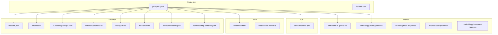
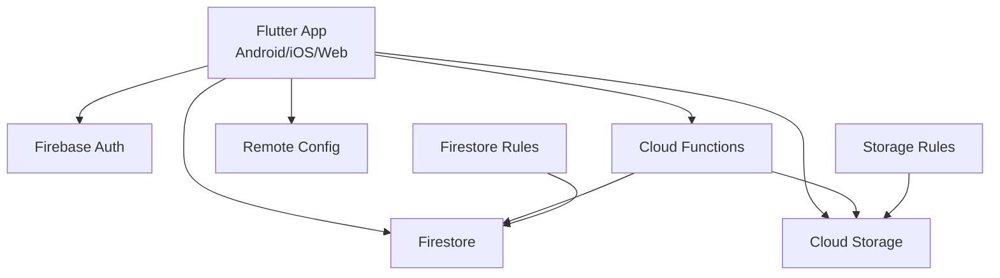
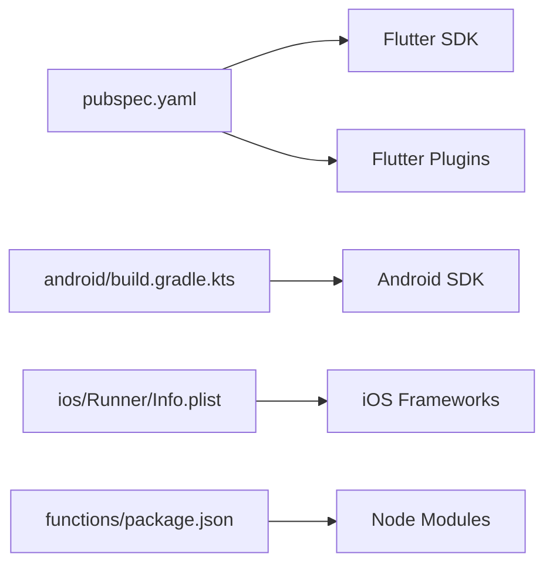

# Deployment & Production Setup

<cite>
**Referenced Files in This Document**
- [pubspec.yaml](file://pubspec.yaml)
- [firebase.json](file://firebase.json)
- [.firebaserc](file://.firebaserc)
- [android/build.gradle.kts](file://android/build.gradle.kts)
- [android/app/build.gradle.kts](file://android/app/build.gradle.kts)
- [android/gradle.properties](file://android/gradle.properties)
- [android/local.properties](file://android/local.properties)
- [android/app/proguard-rules.pro](file://android/app/proguard-rules.pro)
- [ios/Runner/Info.plist](file://ios/Runner/Info.plist)
- [web/index.html](file://web/index.html)
- [web/service-worker.js](file://web/service-worker.js)
- [functions/package.json](file:functions/package.json)
- [functions/src/index.ts](file:functions/src/index.ts)
- [functions/tsconfig.json](file:functions/tsconfig.json)
- [storage.rules](file://storage.rules)
- [firestore.rules](file://firestore.rules)
- [firestore.indexes.json](file://firestore.indexes.json)
- [remoteconfig.template.json](file://remoteconfig.template.json)
- [scripts/test_firebase_connection.dart](file://scripts/test_firebase_connection.dart)
- [integration_test/firebase_emulator_test.dart](file:integration_test/firebase_emulator_test.dart)
- [scripts/test_firebase_emulator.dart](file://scripts/test_firebase_emulator.dart)
- [tools/serve_web.js](file://tools/serve_web.js)
- [flutter_native_splash.yaml](file://flutter_native_splash.yaml)
- [analysis_options.yaml](file://analysis_options.yaml)
- [devtools_options.yaml](file://devtools_options.yaml)
- [beta_testers.csv](file://beta_testers.csv)
- [set_env.ps1](file://set_env.ps1)
- [set_env_final.ps1](file://set_env_final.ps1)
</cite>

## Table of Contents
1. [Introduction](#introduction)
2. [Project Structure](#project-structure)
3. [Core Components](#core-components)
4. [Architecture Overview](#architecture-overview)
5. [Detailed Component Analysis](#detailed-component-analysis)
6. [Dependency Analysis](#dependency-analysis)
7. [Performance Considerations](#performance-considerations)
8. [Troubleshooting Guide](#troubleshooting-guide)
9. [Conclusion](#conclusion)
10. [Appendices](#appendices)

## Introduction
This document provides a comprehensive guide to deploying and operating the application across Android, iOS, and Web platforms. It covers build configuration, signing, optimization, release preparation, Firebase deployment, Cloud Functions setup, environment configuration, app store submission, beta distribution, over-the-air updates, monitoring/analytics, crash reporting, performance monitoring, CI/CD automation, security hardening, and production troubleshooting.

## Project Structure
The project is a Flutter application with platform-specific directories for Android and iOS, a web target, and a Firebase backend defined by functions, rules, and configuration files. Build and runtime configurations are centralized in Gradle (Android), Xcode/Flutter configs (iOS), and web assets.

**Diagram sources**
- [pubspec.yaml](file://pubspec.yaml)
- [android/build.gradle.kts](file://android/build.gradle.kts)
- [android/app/build.gradle.kts](file://android/app/build.gradle.kts)
- [android/gradle.properties](file://android/gradle.properties)
- [android/local.properties](file://android/local.properties)
- [android/app/proguard-rules.pro](file://android/app/proguard-rules.pro)
- [ios/Runner/Info.plist](file://ios/Runner/Info.plist)
- [web/index.html](file://web/index.html)
- [web/service-worker.js](file://web/service-worker.js)
- [firebase.json](file://firebase.json)
- [.firebaserc](file://.firebaserc)
- [functions/package.json](file:functions/package.json)
- [functions/src/index.ts](file:functions/src/index.ts)
- [storage.rules](file://storage.rules)
- [firestore.rules](file://firestore.rules)
- [firestore.indexes.json](file://firestore.indexes.json)
- [remoteconfig.template.json](file://remoteconfig.template.json)

**Section sources**
- [pubspec.yaml](file://pubspec.yaml)
- [firebase.json](file://firebase.json)
- [.firebaserc](file://.firebaserc)
- [android/build.gradle.kts](file://android/build.gradle.kts)
- [android/app/build.gradle.kts](file://android/app/build.gradle.kts)
- [android/gradle.properties](file://android/gradle.properties)
- [android/local.properties](file://android/local.properties)
- [android/app/proguard-rules.pro](file://android/app/proguard-rules.pro)
- [ios/Runner/Info.plist](file://ios/Runner/Info.plist)
- [web/index.html](file://web/index.html)
- [web/service-worker.js](file://web/service-worker.js)
- [functions/package.json](file:functions/package.json)
- [functions/src/index.ts](file:functions/src/index.ts)
- [storage.rules](file://storage.rules)
- [firestore.rules](file://firestore.rules)
- [firestore.indexes.json](file://firestore.indexes.json)
- [remoteconfig.template.json](file://remoteconfig.template.json)

## Core Components
- Flutter app entry and dependencies: managed via pubspec.yaml.
- Android build and signing: Gradle scripts and properties.
- iOS app metadata and entitlements: Info.plist and Xcode workspace.
- Web assets and service worker: index.html and service-worker.js.
- Firebase configuration: firebase.json, .firebaserc, storage/firestore rules, remote config template.
- Cloud Functions: TypeScript source and package configuration.

Key responsibilities:
- Build variants (debug/profile/release) and optimizations per platform.
- Signing artifacts and keystore management for Android; provisioning profiles/certificates for iOS.
- Environment variables and feature flags via Remote Config and local env scripts.
- Backend deployment and rule enforcement for secure data access.

**Section sources**
- [pubspec.yaml](file://pubspec.yaml)
- [android/build.gradle.kts](file://android/build.gradle.kts)
- [android/app/build.gradle.kts](file://android/app/build.gradle.kts)
- [android/gradle.properties](file://android/gradle.properties)
- [android/local.properties](file://android/local.properties)
- [android/app/proguard-rules.pro](file://android/app/proguard-rules.pro)
- [ios/Runner/Info.plist](file://ios/Runner/Info.plist)
- [web/index.html](file://web/index.html)
- [web/service-worker.js](file://web/service-worker.js)
- [firebase.json](file://firebase.json)
- [.firebaserc](file://.firebaserc)
- [functions/package.json](file:functions/package.json)
- [functions/src/index.ts](file:functions/src/index.ts)
- [storage.rules](file://storage.rules)
- [firestore.rules](file://firestore.rules)
- [firestore.indexes.json](file://firestore.indexes.json)
- [remoteconfig.template.json](file://remoteconfig.template.json)

## Architecture Overview
The app integrates with Firebase services (Auth, Firestore, Storage, Functions, Remote Config). Cloud Functions handle server-side logic and integrations. Rules enforce security at the data layer. Web uses a service worker for caching and offline behavior.

**Diagram sources**
- [firebase.json](file://firebase.json)
- [.firebaserc](file://.firebaserc)
- [functions/src/index.ts](file:functions/src/index.ts)
- [firestore.rules](file://firestore.rules)
- [storage.rules](file://storage.rules)
- [remoteconfig.template.json](file://remoteconfig.template.json)

## Detailed Component Analysis

### Android Build, Signing, and Release
- Build script: android/app/build.gradle.kts defines applicationId, versioning, compileOptions, signingConfigs, and buildTypes.
- Signing: Configure keystore and aliases securely; use gradle.properties for non-secret properties and local.properties for sensitive paths.
- ProGuard/R8: android/app/proguard-rules.pro contains keep rules for release builds.
- Gradle properties: android/gradle.properties sets JVM args and build flags.
- Local properties: android/local.properties points to SDK locations.

Release checklist:
- Generate signed APK/AAB using release variant.
- Verify minification and resource shrinking settings.
- Validate that secrets are not embedded in code or configs.

**Section sources**
- [android/app/build.gradle.kts](file://android/app/build.gradle.kts)
- [android/build.gradle.kts](file://android/build.gradle.kts)
- [android/gradle.properties](file://android/gradle.properties)
- [android/local.properties](file://android/local.properties)
- [android/app/proguard-rules.pro](file://android/app/proguard-rules.pro)

### iOS Build, Signing, and Release
- App metadata and permissions: ios/Runner/Info.plist defines bundle identifiers, capabilities, and usage descriptions.
- Signing: Use Xcode or command-line tools to manage certificates and provisioning profiles.
- Build variants: Debug/Release configured via Xcode schemes and Flutter’s iOS build pipeline.

Release checklist:
- Ensure correct bundle ID and entitlements.
- Archive and distribute via TestFlight or App Store Connect.
- Validate that no debug symbols or secrets are included.

**Section sources**
- [ios/Runner/Info.plist](file://ios/Runner/Info.plist)

### Web Build and Service Worker
- Entry point: web/index.html serves the Flutter web app.
- Service worker: web/service-worker.js handles caching strategies and offline fallback.
- Assets and manifest: ensure proper caching headers and versioning.

Release checklist:
- Build optimized web output.
- Configure CDN/cache policies.
- Validate service worker behavior and offline pages.

**Section sources**
- [web/index.html](file://web/index.html)
- [web/service-worker.js](file://web/service-worker.js)

### Firebase Configuration and Deployment
- Project selection: .firebaserc selects the active Firebase project.
- Hosting and CLI config: firebase.json defines hosting, rewrites, and function mappings.
- Remote Config: remoteconfig.template.json provides default values for feature flags and runtime settings.

Deployment steps:
- Initialize and link Firebase project.
- Deploy functions and rules.
- Upload Remote Config defaults.

**Section sources**
- [.firebaserc](file://.firebaserc)
- [firebase.json](file://firebase.json)
- [remoteconfig.template.json](file://remoteconfig.template.json)

### Cloud Functions Setup and Deployment
- Package configuration: functions/package.json lists dependencies and scripts.
- Source entry: functions/src/index.ts exports functions and routes.
- TypeScript compilation: functions/tsconfig.json defines compiler options.

Deployment steps:
- Install dependencies and build functions if needed.
- Deploy functions via Firebase CLI.
- Verify function endpoints and logs.

**Section sources**
- [functions/package.json](file:functions/package.json)
- [functions/src/index.ts](file:functions/src/index.ts)
- [functions/tsconfig.json](file:functions/tsconfig.json)

### Security Rules and Indexes
- Firestore rules: firestore.rules define read/write permissions and validation.
- Storage rules: storage.rules control file access and size limits.
- Indexes: firestore.indexes.json declares composite indexes for queries.

Best practices:
- Enforce least privilege.
- Validate input shapes.
- Predefine indexes to avoid cold-start penalties.

**Section sources**
- [firestore.rules](file://firestore.rules)
- [storage.rules](file://storage.rules)
- [firestore.indexes.json](file://firestore.indexes.json)

### Environment Configuration and Feature Flags
- Local env scripts: set_env.ps1 and set_env_final.ps1 configure environment variables for development and testing.
- Remote Config: remoteconfig.template.json supplies runtime toggles and feature flags.
- Connection tests: scripts/test_firebase_connection.dart validates connectivity.

Operational guidance:
- Keep secrets out of repository; use CI/CD secret stores.
- Use Remote Config for safe rollouts and A/B tests.
- Validate environment before deployment.

**Section sources**
- [set_env.ps1](file://set_env.ps1)
- [set_env_final.ps1](file://set_env_final.ps1)
- [remoteconfig.template.json](file://remoteconfig.template.json)
- [scripts/test_firebase_connection.dart](file://scripts/test_firebase_connection.dart)

### Testing and Emulation
- Integration tests: integration_test/firebase_emulator_test.dart exercises flows against emulators.
- Emulator helpers: scripts/test_firebase_emulator.dart assists running and verifying emulator state.
- Unit/widget tests: located under test/ directory for feature coverage.

Release readiness:
- Run full test suites locally and in CI.
- Validate emulator-based integration tests.
- Gate releases on passing tests.

**Section sources**
- [integration_test/firebase_emulator_test.dart](file:integration_test/firebase_emulator_test.dart)
- [scripts/test_firebase_emulator.dart](file://scripts/test_firebase_emulator.dart)

### Web Serving and Local Development
- Local web server: tools/serve_web.js serves static assets for development.
- Native splash: flutter_native_splash.yaml configures launch screens.

Development tips:
- Use local server for quick iteration.
- Ensure splash and icons render correctly across devices.

**Section sources**
- [tools/serve_web.js](file://tools/serve_web.js)
- [flutter_native_splash.yaml](file://flutter_native_splash.yaml)

### Code Quality and Diagnostics
- Static analysis: analysis_options.yaml enforces linting and style rules.
- DevTools: devtools_options.yaml configures diagnostics and profiling tools.

Quality gates:
- Fail CI on analysis errors.
- Use DevTools for performance and memory profiling.

**Section sources**
- [analysis_options.yaml](file://analysis_options.yaml)
- [devtools_options.yaml](file://devtools_options.yaml)

## Dependency Analysis
Flutter dependencies and plugins are declared in pubspec.yaml. Platform-specific dependencies are resolved through Gradle (Android) and CocoaPods/Xcode (iOS). Firebase SDKs are integrated via Flutter plugins and Node packages for Cloud Functions.

**Diagram sources**
- [pubspec.yaml](file://pubspec.yaml)
- [android/build.gradle.kts](file://android/build.gradle.kts)
- [ios/Runner/Info.plist](file://ios/Runner/Info.plist)
- [functions/package.json](file:functions/package.json)

**Section sources**
- [pubspec.yaml](file://pubspec.yaml)
- [android/build.gradle.kts](file://android/build.gradle.kts)
- [ios/Runner/Info.plist](file://ios/Runner/Info.plist)
- [functions/package.json](file:functions/package.json)

## Performance Considerations
- Android: Enable R8/ProGuard, minimize resources, and verify native libraries.
- iOS: Strip symbols for release, optimize assets, and review framework sizes.
- Web: Minify JS/CSS, enable gzip/brotli, and tune service worker caching.
- Firebase: Use efficient queries, predefine indexes, and leverage Remote Config for feature gating.
- Monitoring: Integrate analytics and crash reporting; profile CPU/memory/network.

[No sources needed since this section provides general guidance]

## Troubleshooting Guide
Common issues and resolutions:
- Build failures: Check Gradle versions, Java/Kotlin compatibility, and iOS toolchain.
- Signing errors: Validate keystore/passwords and certificate expiration.
- Firebase connection: Use scripts/test_firebase_connection.dart to validate credentials and network.
- Function deployment: Review functions/package.json dependencies and tsconfig settings.
- Rules denials: Inspect firestore.rules and storage.rules for overly restrictive conditions.
- Web caching: Clear service worker cache and verify versioned assets.

**Section sources**
- [scripts/test_firebase_connection.dart](file://scripts/test_firebase_connection.dart)
- [functions/package.json](file:functions/package.json)
- [functions/tsconfig.json](file:functions/tsconfig.json)
- [firestore.rules](file://firestore.rules)
- [storage.rules](file://storage.rules)

## Conclusion
This guide consolidates the essential steps and best practices for building, securing, and deploying the app across Android, iOS, and Web. By following the outlined procedures for signing, optimization, Firebase deployment, and monitoring, teams can achieve reliable releases and maintain high performance in production.

[No sources needed since this section summarizes without analyzing specific files]

## Appendices

### App Store Submission and Beta Distribution
- Android: Prepare signed AAB, fill store listing, and submit via Play Console. Use internal testing tracks for early feedback.
- iOS: Archive in Xcode, upload to App Store Connect, and distribute via TestFlight for beta testers.
- Beta list: Maintain beta_testers.csv for tracking tester emails and roles.

**Section sources**
- [beta_testers.csv](file://beta_testers.csv)

### Over-the-Air Updates
- Web: Update service-worker.js and asset versions to trigger cache refresh.
- Mobile: Use platform mechanisms (e.g., Play In-App Updates, App Store updates) as OTA is limited; consider feature flags via Remote Config for dynamic behavior.

**Section sources**
- [web/service-worker.js](file://web/service-worker.js)
- [remoteconfig.template.json](file://remoteconfig.template.json)

### CI/CD Pipeline Examples
- Steps:
  - Checkout code and install Flutter/Dart.
  - Resolve dependencies (pub get, npm install for functions).
  - Run analysis and unit tests.
  - Build Android AAB and iOS archive.
  - Deploy Firebase functions and rules.
  - Upload artifacts to Play Store/App Store/TestFlight.
- Secrets: Store keys and tokens in CI/CD secret stores; never commit them.

[No sources needed since this section provides general guidance]

### Security Hardening Checklist
- Remove secrets from code and configs.
- Enforce least privilege in Firestore/Storage rules.
- Enable Firebase App Check for client verification.
- Pin dependency versions and audit vulnerabilities.
- Use HTTPS and secure headers for web hosting.

[No sources needed since this section provides general guidance]

### Monitoring, Analytics, Crash Reporting, and Performance
- Analytics: Instrument events via Firebase Analytics.
- Crash reporting: Enable Crashlytics for mobile; capture unhandled exceptions and stack traces.
- Performance: Use Firebase Performance Monitoring and DevTools for profiling.
- Logging: Centralize logs in Cloud Functions and monitor via Firebase console.

[No sources needed since this section provides general guidance]