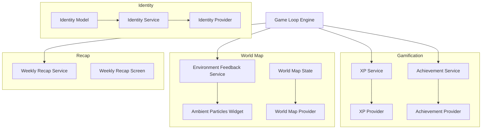
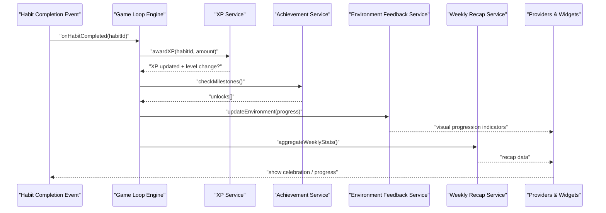
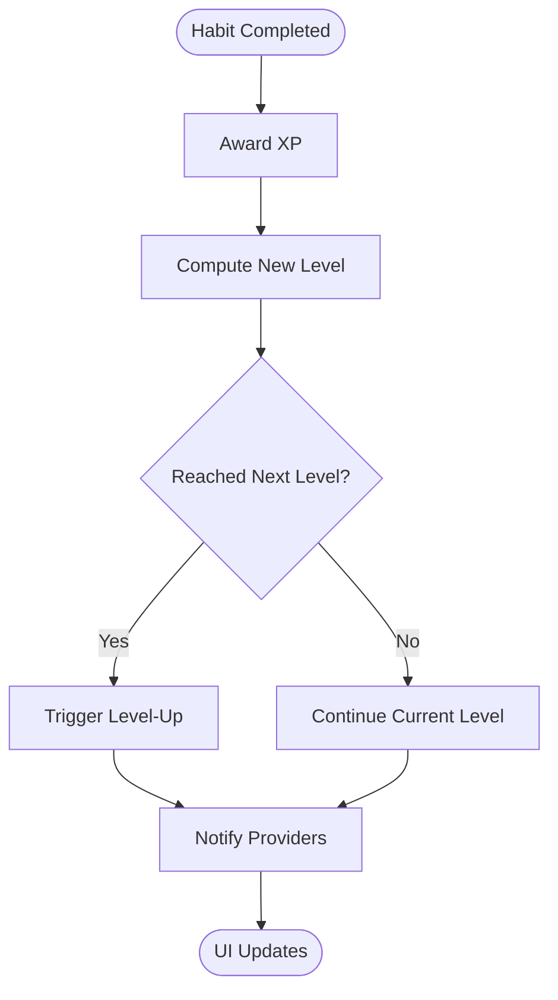
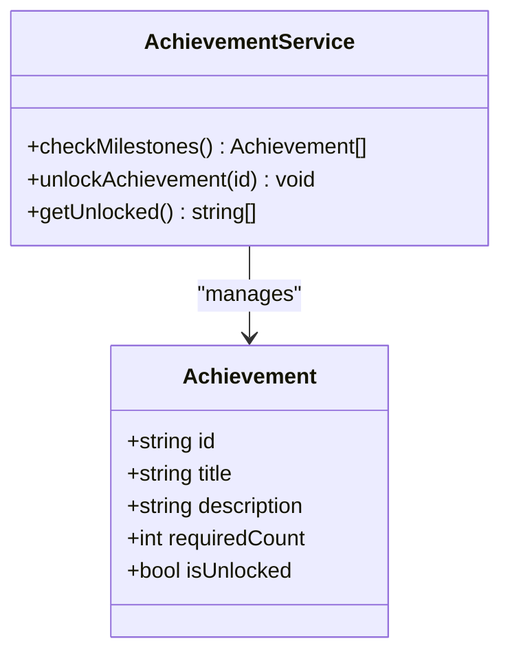
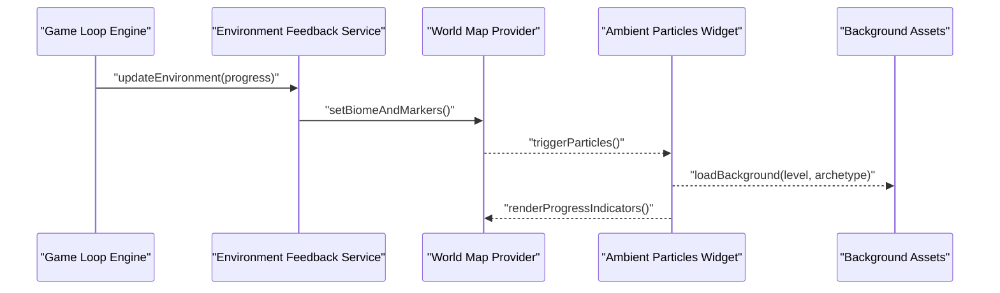
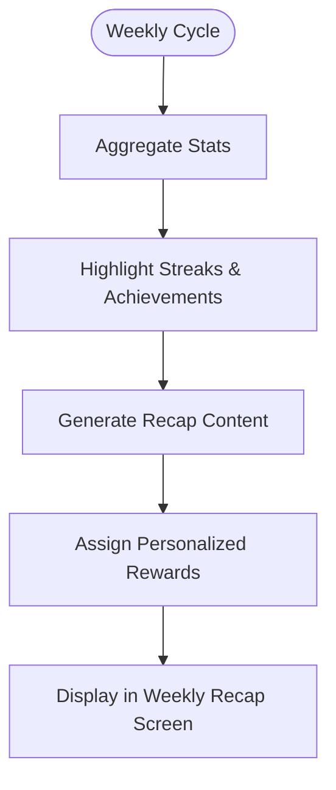
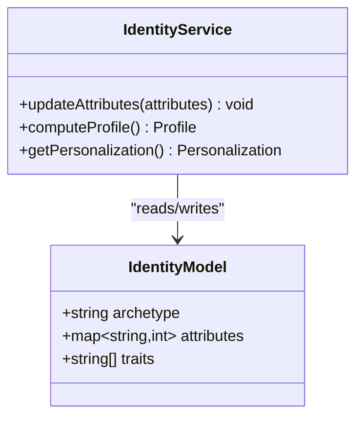
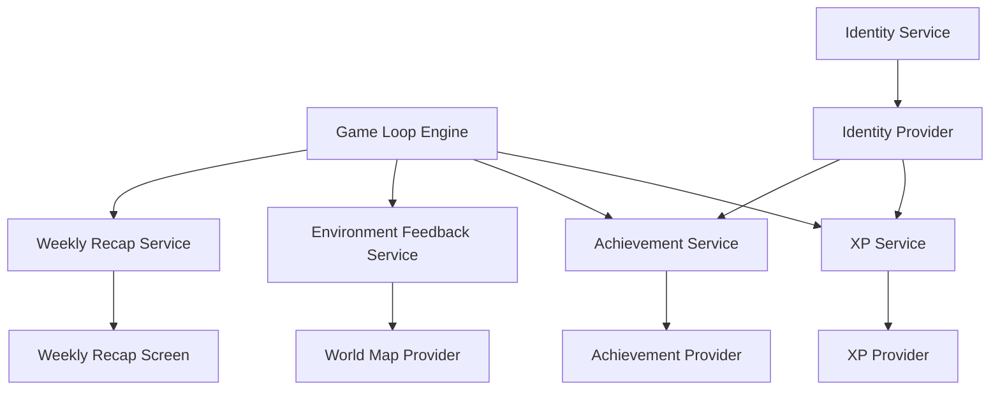

# Gamification Engine

<cite>
**Referenced Files in This Document**
- [README.md](file://README.md)
- [lib/features/gamification/domain/models/xp_level_model.dart](file://lib/features/gamification/domain/models/xp_level_model.dart)
- [lib/features/gamification/domain/services/xp_service.dart](file://lib/features/gamification/domain/services/xp_service.dart)
- [lib/features/gamification/domain/services/achievement_service.dart](file://lib/features/gamification/domain/services/achievement_service.dart)
- [lib/features/gamification/presentation/providers/xp_provider.dart](file://lib/features/gamification/presentation/providers/xp_provider.dart)
- [lib/features/gamification/presentation/providers/achievement_provider.dart](file://lib/features/gamification/presentation/providers/achievement_provider.dart)
- [lib/features/world_map/domain/models/world_map_state.dart](file://lib/features/world_map/domain/models/world_map_state.dart)
- [lib/features/world_map/domain/services/environment_feedback_service.dart](file://lib/features/world_map/domain/services/environment_feedback_service.dart)
- [lib/features/world_map/presentation/widgets/ambient_particles_widget.dart](file://lib/features/world_map/presentation/widgets/ambient_particles_widget.dart)
- [lib/features/world_map/presentation/providers/world_map_provider.dart](file://lib/features/world_map/presentation/providers/world_map_provider.dart)
- [lib/features/recap/domain/services/weekly_recap_service.dart](file://lib/features/recap/domain/services/weekly_recap_service.dart)
- [lib/features/recap/presentation/screens/weekly_recap_screen.dart](file://lib/features/recap/presentation/screens/weekly_recap_screen.dart)
- [lib/features/profile/domain/models/identity_model.dart](file://lib/features/profile/domain/models/identity_model.dart)
- [lib/features/profile/domain/services/identity_service.dart](file://lib/features/profile/domain/services/identity_service.dart)
- [lib/features/profile/presentation/providers/identity_provider.dart](file://lib/features/profile/presentation/providers/identity_provider.dart)
- [lib/core/game_loop/game_loop_engine.dart](file://lib/core/game_loop/game_loop_engine.dart)
- [assets/images/backgrounds/city/background_city.png](file://assets/images/backgrounds/city/background_city.png)
- [assets/images/backgrounds/forest/background_forest.png](file://assets/images/backgrounds/forest/background_forest.png)
- [assets/images/backgrounds/mountain/background_mountain.png](file://assets/images/backgrounds/mountain/background_mountain.png)
- [assets/images/backgrounds/ocean/background_ocean.png](file://assets/images/backgrounds/ocean/background_ocean.png)
- [assets/images/backgrounds/volcanic/background_volcanic.png](file://assets/images/backgrounds/volcanic/background_volcanic.png)
- [assets/images/levels/athlete/level_1.png](file://assets/images/levels/athlete/level_1.png)
- [assets/images/levels/creator/level_1.png](file://assets/images/levels/creator/level_1.png)
- [assets/images/levels/explorer/level_1.png](file://assets/images/levels/explorer/level_1.png)
- [assets/images/levels/scholar/level_1.png](file://assets/images/levels/scholar/level_1.png)
- [assets/images/levels/stoic/level_1.png](file://assets/images/levels/stoic/level_1.png)
- [assets/images/levels/zealot/level_1.png](file://assets/images/levels/zealot/level_1.png)
</cite>

## Table of Contents
1. [Introduction](#introduction)
2. [Project Structure](#project-structure)
3. [Core Components](#core-components)
4. [Architecture Overview](#architecture-overview)
5. [Detailed Component Analysis](#detailed-component-analysis)
6. [Dependency Analysis](#dependency-analysis)
7. [Performance Considerations](#performance-considerations)
8. [Troubleshooting Guide](#troubleshooting-guide)
9. [Conclusion](#conclusion)
10. [Appendices](#appendices)

## Introduction
This document explains the gamification engine that powers user engagement and motivation in the application. It covers the XP system, leveling mechanics, achievement tracking, world map environmental feedback and ambient particles, weekly recap and milestone celebrations, personalized rewards, and the identity system for attribute mapping, personality traits, and behavioral profiling. It also provides examples of custom gamification rules, reward configurations, and integration with habit completion events, along with psychological principles behind the design and effectiveness metrics.

## Project Structure
The gamification engine spans domain services, presentation providers, and assets:
- Domain models and services define core logic (XP, achievements, world map state, identity).
- Presentation layers expose reactive state via providers and screens.
- Assets include background environments and level visuals tied to archetypes.

**Diagram sources**
- [lib/features/gamification/domain/services/xp_service.dart](file://lib/features/gamification/domain/services/xp_service.dart)
- [lib/features/gamification/domain/services/achievement_service.dart](file://lib/features/gamification/domain/services/achievement_service.dart)
- [lib/features/gamification/presentation/providers/xp_provider.dart](file://lib/features/gamification/presentation/providers/xp_provider.dart)
- [lib/features/gamification/presentation/providers/achievement_provider.dart](file://lib/features/gamification/presentation/providers/achievement_provider.dart)
- [lib/features/world_map/domain/models/world_map_state.dart](file://lib/features/world_map/domain/models/world_map_state.dart)
- [lib/features/world_map/domain/services/environment_feedback_service.dart](file://lib/features/world_map/domain/services/environment_feedback_service.dart)
- [lib/features/world_map/presentation/widgets/ambient_particles_widget.dart](file://lib/features/world_map/presentation/widgets/ambient_particles_widget.dart)
- [lib/features/world_map/presentation/providers/world_map_provider.dart](file://lib/features/world_map/presentation/providers/world_map_provider.dart)
- [lib/features/recap/domain/services/weekly_recap_service.dart](file://lib/features/recap/domain/services/weekly_recap_service.dart)
- [lib/features/recap/presentation/screens/weekly_recap_screen.dart](file://lib/features/recap/presentation/screens/weekly_recap_screen.dart)
- [lib/features/profile/domain/models/identity_model.dart](file://lib/features/profile/domain/models/identity_model.dart)
- [lib/features/profile/domain/services/identity_service.dart](file://lib/features/profile/domain/services/identity_service.dart)
- [lib/features/profile/presentation/providers/identity_provider.dart](file://lib/features/profile/presentation/providers/identity_provider.dart)
- [lib/core/game_loop/game_loop_engine.dart](file://lib/core/game_loop/game_loop_engine.dart)

**Section sources**
- [README.md](file://README.md)

## Core Components
- XP System and Leveling: Tracks experience points, calculates levels, and updates progress toward next level thresholds.
- Achievement Tracking: Monitors milestones, unlocks badges, and triggers celebratory events.
- World Map System: Renders environment visuals, applies feedback based on user progress, and animates ambient particles.
- Weekly Recap: Summarizes activity, highlights streaks, and surfaces personalized rewards.
- Identity System: Maps attributes, captures personality traits, and profiles behavior to tailor experiences.

**Section sources**
- [lib/features/gamification/domain/services/xp_service.dart](file://lib/features/gamification/domain/services/xp_service.dart)
- [lib/features/gamification/domain/models/xp_level_model.dart](file://lib/features/gamification/domain/models/xp_level_model.dart)
- [lib/features/gamification/domain/services/achievement_service.dart](file://lib/features/gamification/domain/services/achievement_service.dart)
- [lib/features/world_map/domain/models/world_map_state.dart](file://lib/features/world_map/domain/models/world_map_map_state.dart)
- [lib/features/world_map/domain/services/environment_feedback_service.dart](file://lib/features/world_map/domain/services/environment_feedback_service.dart)
- [lib/features/recap/domain/services/weekly_recap_service.dart](file://lib/features/recap/domain/services/weekly_recap_service.dart)
- [lib/features/profile/domain/models/identity_model.dart](file://lib/features/profile/domain/models/identity_model.dart)
- [lib/features/profile/domain/services/identity_service.dart](file://lib/features/profile/domain/services/identity_service.dart)

## Architecture Overview
The game loop orchestrates habit completions and drives gamification updates. Services compute XP, achievements, and world map states; providers expose state to UI; widgets render ambient effects and backgrounds.

**Diagram sources**
- [lib/core/game_loop/game_loop_engine.dart](file://lib/core/game_loop/game_loop_engine.dart)
- [lib/features/gamification/domain/services/xp_service.dart](file://lib/features/gamification/domain/services/xp_service.dart)
- [lib/features/gamification/domain/services/achievement_service.dart](file://lib/features/gamification/domain/services/achievement_service.dart)
- [lib/features/world_map/domain/services/environment_feedback_service.dart](file://lib/features/world_map/domain/services/environment_feedback_service.dart)
- [lib/features/recap/domain/services/weekly_recap_service.dart](file://lib/features/recap/domain/services/weekly_recap_service.dart)

## Detailed Component Analysis

### XP System and Leveling Mechanics
- Responsibilities: Award XP for habit completions, compute current level, determine progress to next level, and broadcast level-up events.
- Data model: XP level configuration includes thresholds per level and archetype-specific scaling.
- Integration: Consumed by the game loop upon habit completion; updates provider state for UI.

**Diagram sources**
- [lib/features/gamification/domain/services/xp_service.dart](file://lib/features/gamification/domain/services/xp_service.dart)
- [lib/features/gamification/domain/models/xp_level_model.dart](file://lib/features/gamification/domain/models/xp_level_model.dart)
- [lib/features/gamification/presentation/providers/xp_provider.dart](file://lib/features/gamification/presentation/providers/xp_provider.dart)

**Section sources**
- [lib/features/gamification/domain/services/xp_service.dart](file://lib/features/gamification/domain/services/xp_service.dart)
- [lib/features/gamification/domain/models/xp_level_model.dart](file://lib/features/gamification/domain/models/xp_level_model.dart)
- [lib/features/gamification/presentation/providers/xp_provider.dart](file://lib/features/gamification/presentation/providers/xp_provider.dart)

### Achievement Tracking and Milestone Celebrations
- Responsibilities: Track cumulative actions, streaks, and special conditions; unlock achievements; trigger celebrations.
- Configuration: Achievement definitions include criteria, rewards, and display metadata.
- Integration: Evaluated after XP updates; feeds into recap summaries and visual feedback.

**Diagram sources**
- [lib/features/gamification/domain/services/achievement_service.dart](file://lib/features/gamification/domain/services/achievement_service.dart)

**Section sources**
- [lib/features/gamification/domain/services/achievement_service.dart](file://lib/features/gamification/domain/services/achievement_service.dart)
- [lib/features/gamification/presentation/providers/achievement_provider.dart](file://lib/features/gamification/presentation/providers/achievement_provider.dart)

### World Map System: Environmental Feedback and Ambient Particles
- Responsibilities: Render world backgrounds, apply environmental feedback based on progress, animate ambient particles, and update visual progression indicators.
- State: World map state tracks biome selection, progress markers, and particle effects.
- Assets: Background images and level visuals are mapped to archetypes and levels.

**Diagram sources**
- [lib/features/world_map/domain/models/world_map_state.dart](file://lib/features/world_map/domain/models/world_map_state.dart)
- [lib/features/world_map/domain/services/environment_feedback_service.dart](file://lib/features/world_map/domain/services/environment_feedback_service.dart)
- [lib/features/world_map/presentation/providers/world_map_provider.dart](file://lib/features/world_map/presentation/providers/world_map_provider.dart)
- [lib/features/world_map/presentation/widgets/ambient_particles_widget.dart](file://lib/features/world_map/presentation/widgets/ambient_particles_widget.dart)
- [assets/images/backgrounds/city/background_city.png](file://assets/images/backgrounds/city/background_city.png)
- [assets/images/backgrounds/forest/background_forest.png](file://assets/images/backgrounds/forest/background_forest.png)
- [assets/images/backgrounds/mountain/background_mountain.png](file://assets/images/backgrounds/mountain/background_mountain.png)
- [assets/images/backgrounds/ocean/background_ocean.png](file://assets/images/backgrounds/ocean/background_ocean.png)
- [assets/images/backgrounds/volcanic/background_volcanic.png](file://assets/images/backgrounds/volcanic/background_volcanic.png)
- [assets/images/levels/athlete/level_1.png](file://assets/images/levels/athlete/level_1.png)
- [assets/images/levels/creator/level_1.png](file://assets/images/levels/creator/level_1.png)
- [assets/images/levels/explorer/level_1.png](file://assets/images/levels/explorer/level_1.png)
- [assets/images/levels/scholar/level_1.png](file://assets/images/levels/scholar/level_1.png)
- [assets/images/levels/stoic/level_1.png](file://assets/images/levels/stoic/level_1.png)
- [assets/images/levels/zealot/level_1.png](file://assets/images/levels/zealot/level_1.png)

**Section sources**
- [lib/features/world_map/domain/models/world_map_state.dart](file://lib/features/world_map/domain/models/world_map_state.dart)
- [lib/features/world_map/domain/services/environment_feedback_service.dart](file://lib/features/world_map/domain/services/environment_feedback_service.dart)
- [lib/features/world_map/presentation/providers/world_map_provider.dart](file://lib/features/world_map/presentation/providers/world_map_provider.dart)
- [lib/features/world_map/presentation/widgets/ambient_particles_widget.dart](file://lib/features/world_map/presentation/widgets/ambient_particles_widget.dart)

### Weekly Recap System and Personalized Rewards
- Responsibilities: Aggregate weekly stats, highlight streaks and achievements, generate recap content, and surface personalized rewards.
- Integration: Triggered periodically or on demand; consumed by recap screen for visualization.

**Diagram sources**
- [lib/features/recap/domain/services/weekly_recap_service.dart](file://lib/features/recap/domain/services/weekly_recap_service.dart)
- [lib/features/recap/presentation/screens/weekly_recap_screen.dart](file://lib/features/recap/presentation/screens/weekly_recap_screen.dart)

**Section sources**
- [lib/features/recap/domain/services/weekly_recap_service.dart](file://lib/features/recap/domain/services/weekly_recap_service.dart)
- [lib/features/recap/presentation/screens/weekly_recap_screen.dart](file://lib/features/recap/presentation/screens/weekly_recap_screen.dart)

### Identity System: Attribute Mapping, Personality Traits, Behavioral Profiling
- Responsibilities: Maintain identity model with attributes and traits; compute behavioral profiles; personalize gamification experiences.
- Integration: Used by XP and achievement systems to tailor difficulty and rewards; exposed via providers for UI personalization.

**Diagram sources**
- [lib/features/profile/domain/models/identity_model.dart](file://lib/features/profile/domain/models/identity_model.dart)
- [lib/features/profile/domain/services/identity_service.dart](file://lib/features/profile/domain/services/identity_service.dart)
- [lib/features/profile/presentation/providers/identity_provider.dart](file://lib/features/profile/presentation/providers/identity_provider.dart)

**Section sources**
- [lib/features/profile/domain/models/identity_model.dart](file://lib/features/profile/domain/models/identity_model.dart)
- [lib/features/profile/domain/services/identity_service.dart](file://lib/features/profile/domain/services/identity_service.dart)
- [lib/features/profile/presentation/providers/identity_provider.dart](file://lib/features/profile/presentation/providers/identity_provider.dart)

### Custom Gamification Rules and Reward Configurations
- Example rule patterns:
  - Streak multiplier: Increase XP gain after consecutive days of completion.
  - Archetype bonus: Apply archetype-specific XP multipliers based on identity traits.
  - Achievement gating: Unlock advanced worlds only after specific achievement thresholds.
- Reward configuration:
  - Badge definitions with titles, descriptions, and unlock conditions.
  - Visual rewards mapped to level visuals and background biomes.
- Integration with habit completion:
  - Hook into habit completion events to award XP, check achievements, and update world map state.

[No sources needed since this section provides general guidance]

### Psychological Principles Behind the Design
- Progress feedback: Immediate XP updates and level transitions reinforce effort.
- Goal gradient effect: Visible progress bars and world map markers increase motivation near milestones.
- Peak-end rule: Celebrations at level-ups and recap summaries enhance positive recall.
- Social proof: Achievements and tribe stats encourage continued engagement.
- Anchoring and defaults: Starter packs and initial XP set expectations and reduce friction.

[No sources needed since this section provides general guidance]

## Dependency Analysis
The game loop coordinates services and providers, minimizing coupling between UI and domain logic.

**Diagram sources**
- [lib/core/game_loop/game_loop_engine.dart](file://lib/core/game_loop/game_loop_engine.dart)
- [lib/features/gamification/domain/services/xp_service.dart](file://lib/features/gamification/domain/services/xp_service.dart)
- [lib/features/gamification/domain/services/achievement_service.dart](file://lib/features/gamification/domain/services/achievement_service.dart)
- [lib/features/world_map/domain/services/environment_feedback_service.dart](file://lib/features/world_map/domain/services/environment_feedback_service.dart)
- [lib/features/recap/domain/services/weekly_recap_service.dart](file://lib/features/recap/domain/services/weekly_recap_service.dart)
- [lib/features/profile/domain/services/identity_service.dart](file://lib/features/profile/domain/services/identity_service.dart)

**Section sources**
- [lib/core/game_loop/game_loop_engine.dart](file://lib/core/game_loop/game_loop_engine.dart)

## Performance Considerations
- Batch updates: Group XP and achievement checks to avoid excessive provider rebuilds.
- Lazy loading: Load background assets and particles on demand to reduce memory usage.
- Efficient state: Use immutable models and minimal diffs in providers to optimize rendering.
- Caching: Cache recap computations and achievement results where appropriate.

[No sources needed since this section provides general guidance]

## Troubleshooting Guide
- Symptom: No XP awarded after habit completion.
  - Check game loop hooks and XP service calls.
  - Verify provider state updates and UI subscriptions.
- Symptom: Achievements not unlocking.
  - Validate achievement criteria and counters.
  - Ensure milestone checks run post-XP updates.
- Symptom: World map visuals not updating.
  - Confirm environment feedback service receives progress changes.
  - Inspect asset paths and biome mappings.
- Symptom: Weekly recap missing data.
  - Review aggregation logic and time windows.
  - Ensure recap screen subscribes to service outputs.

[No sources needed since this section provides general guidance]

## Conclusion
The gamification engine integrates XP, achievements, world map feedback, weekly recaps, and identity-based personalization to create a cohesive motivational system. By aligning with psychological principles and optimizing performance, it delivers engaging experiences that sustain long-term habit formation.

[No sources needed since this section summarizes without analyzing specific files]

## Appendices
- Example configurations:
  - XP thresholds per level and archetype scaling factors.
  - Achievement definitions with unlock conditions and rewards.
  - World map biome mappings to levels and progress markers.
- Effectiveness metrics:
  - Daily active users, streak retention, level-up frequency, achievement unlock rates, and recap engagement.

[No sources needed since this section provides general guidance]