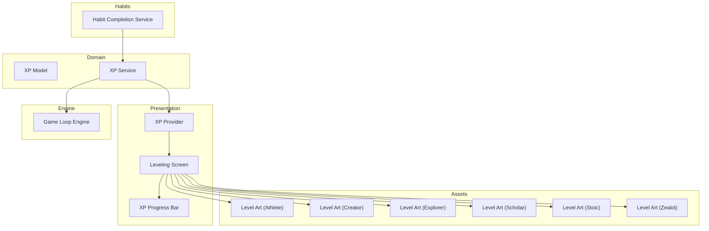
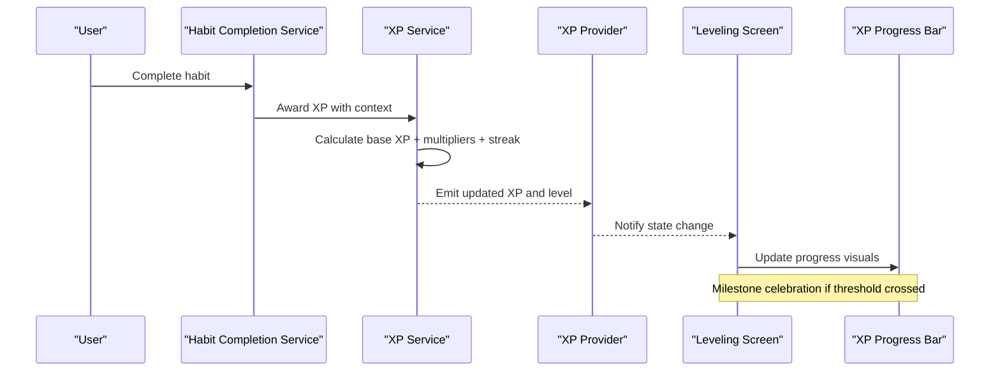
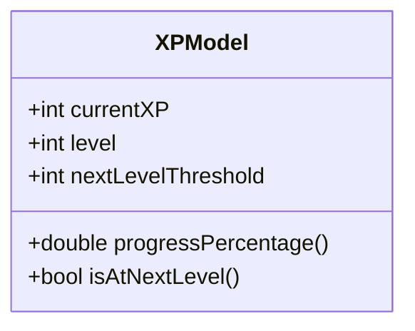
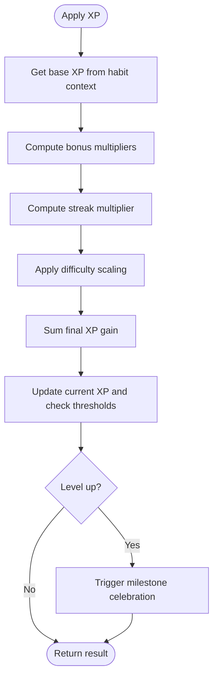
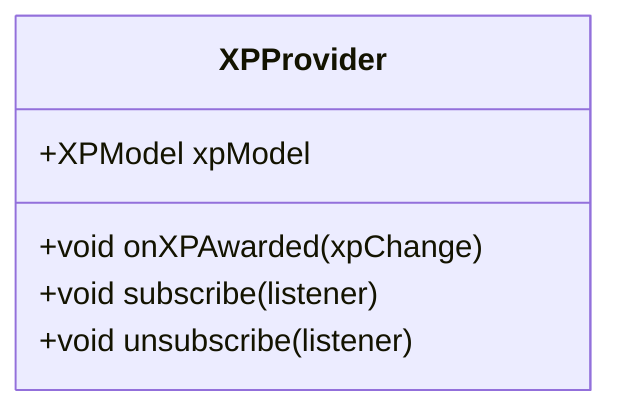
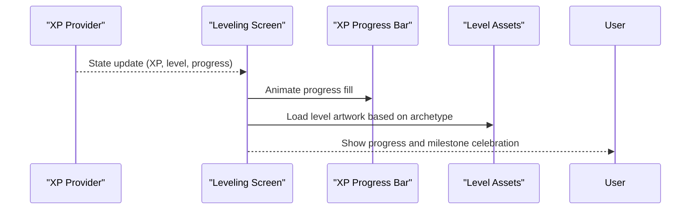
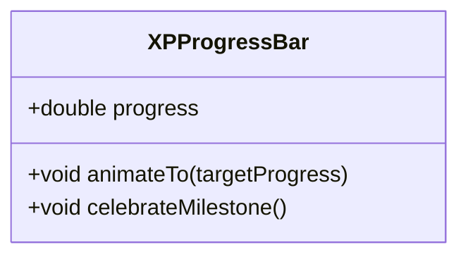
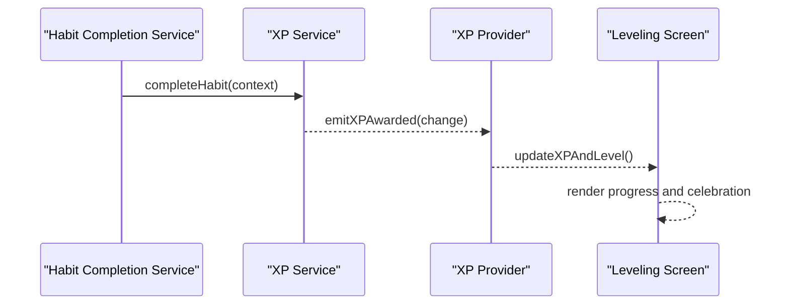
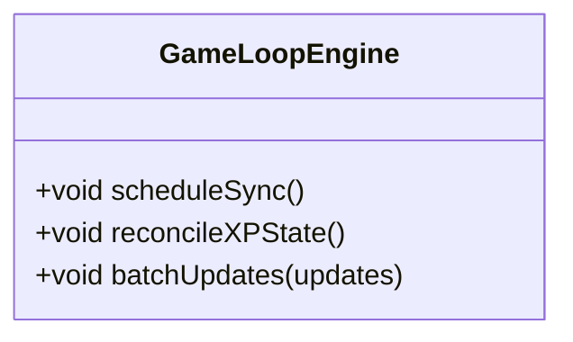
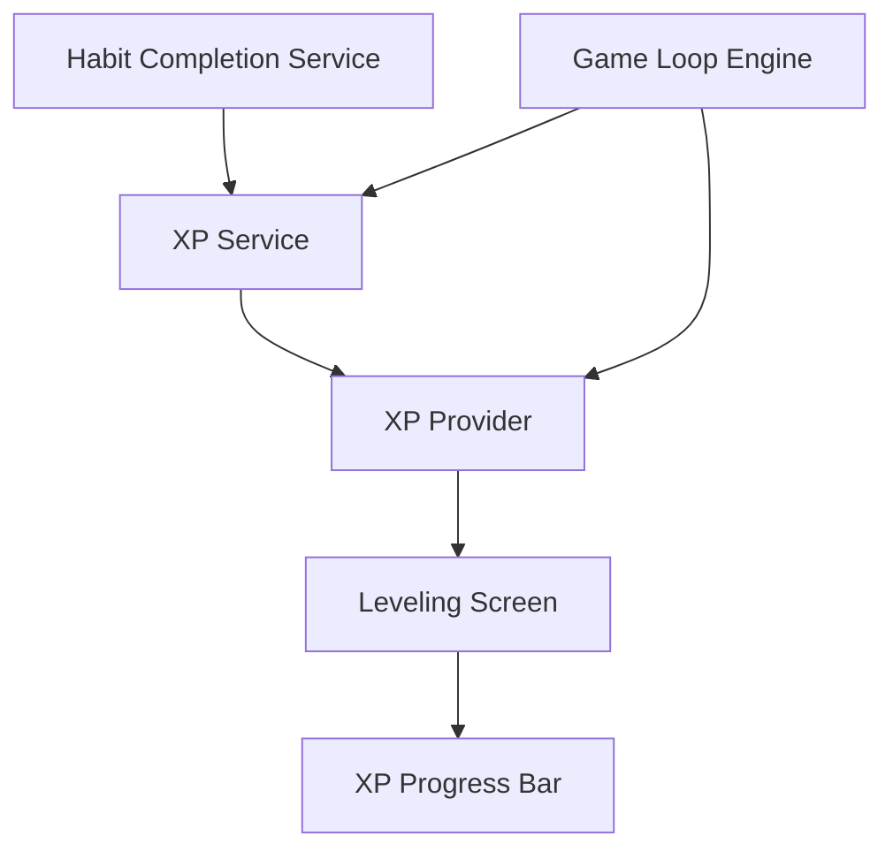

# XP & Leveling System

<cite>
**Referenced Files in This Document**
- [lib/features/gamification/domain/models/xp_model.dart](file://lib/features/gamification/domain/models/xp_model.dart)
- [lib/features/gamification/domain/services/xp_service.dart](file://lib/features/gamification/domain/services/xp_service.dart)
- [lib/features/gamification/presentation/providers/xp_provider.dart](file://lib/features/gamification/presentation/providers/xp_provider.dart)
- [lib/features/gamification/presentation/screens/leveling_screen.dart](file://lib/features/gamification/presentation/screens/leveling_screen.dart)
- [lib/features/gamification/presentation/widgets/xp_progress_bar.dart](file://lib/features/gamification/presentation/widgets/xp_progress_bar.dart)
- [lib/features/habits/domain/services/habit_completion_service.dart](file://lib/features/habits/domain/services/habit_completion_service.dart)
- [lib/core/game_loop/game_loop_engine.dart](file://lib/core/game_loop/game_loop_engine.dart)
- [assets/images/levels/athlete/level_01.png](file://assets/images/levels/athlete/level_01.png)
- [assets/images/levels/creator/level_01.png](file://assets/images/levels/creator/level_01.png)
- [assets/images/levels/explorer/level_01.png](file://assets/images/levels/explorer/level_01.png)
- [assets/images/levels/scholar/level_01.png](file://assets/images/levels/scholar/level_01.png)
- [assets/images/levels/stoic/level_01.png](file://assets/images/levels/stoic/level_01.png)
- [assets/images/levels/zealot/level_01.png](file://assets/images/levels/zealot/level_01.png)
</cite>

## Table of Contents
1. [Introduction](#introduction)
2. [Project Structure](#project-structure)
3. [Core Components](#core-components)
4. [Architecture Overview](#architecture-overview)
5. [Detailed Component Analysis](#detailed-component-analysis)
6. [Dependency Analysis](#dependency-analysis)
7. [Performance Considerations](#performance-considerations)
8. [Troubleshooting Guide](#troubleshooting-guide)
9. [Conclusion](#conclusion)
10. [Appendices](#appendices)

## Introduction
This document explains the XP and leveling system that drives user progression in the application. It covers how experience points are calculated from habit completions, how levels are determined using thresholds and curves, and how UI components visualize progress and feedback. It also details bonus multipliers, streak bonuses, milestone celebrations, reward distribution, and performance considerations for real-time updates and caching.

## Project Structure
The XP and leveling system spans domain models, services, presentation providers, and UI screens/widgets. Habit completion events trigger XP gains through a service layer, which updates state via a provider and renders progress on the leveling screen with animated indicators.

**Diagram sources**
- [lib/features/gamification/domain/models/xp_model.dart](file://lib/features/gamification/domain/models/xp_model.dart)
- [lib/features/gamification/domain/services/xp_service.dart](file://lib/features/gamification/domain/services/xp_service.dart)
- [lib/features/gamification/presentation/providers/xp_provider.dart](file://lib/features/gamification/presentation/providers/xp_provider.dart)
- [lib/features/gamification/presentation/screens/leveling_screen.dart](file://lib/features/gamification/presentation/screens/leveling_screen.dart)
- [lib/features/gamification/presentation/widgets/xp_progress_bar.dart](file://lib/features/gamification/presentation/widgets/xp_progress_bar.dart)
- [lib/features/habits/domain/services/habit_completion_service.dart](file://lib/features/habits/domain/services/habit_completion_service.dart)
- [lib/core/game_loop/game_loop_engine.dart](file://lib/core/game_loop/game_loop_engine.dart)
- [assets/images/levels/athlete/level_01.png](file://assets/images/levels/athlete/level_01.png)
- [assets/images/levels/creator/level_01.png](file://assets/images/levels/creator/level_01.png)
- [assets/images/levels/explorer/level_01.png](file://assets/images/levels/explorer/level_01.png)
- [assets/images/levels/scholar/level_01.png](file://assets/images/levels/scholar/level_01.png)
- [assets/images/levels/stoic/level_01.png](file://assets/images/levels/stoic/level_01.png)
- [assets/images/levels/zealot/level_01.png](file://assets/images/levels/zealot/level_01.png)

**Section sources**
- [lib/features/gamification/domain/models/xp_model.dart](file://lib/features/gamification/domain/models/xp_model.dart)
- [lib/features/gamification/domain/services/xp_service.dart](file://lib/features/gamification/domain/services/xp_service.dart)
- [lib/features/gamification/presentation/providers/xp_provider.dart](file://lib/features/gamification/presentation/providers/xp_provider.dart)
- [lib/features/gamification/presentation/screens/leveling_screen.dart](file://lib/features/gamification/presentation/screens/leveling_screen.dart)
- [lib/features/gamification/presentation/widgets/xp_progress_bar.dart](file://lib/features/gamification/presentation/widgets/xp_progress_bar.dart)
- [lib/features/habits/domain/services/habit_completion_service.dart](file://lib/features/habits/domain/services/habit_completion_service.dart)
- [lib/core/game_loop/game_loop_engine.dart](file://lib/core/game_loop/game_loop_engine.dart)

## Core Components
- XP Model: Defines the data structures for current XP, level, thresholds, and derived metrics such as next-level requirement and progress percentage.
- XP Service: Implements the calculation engine for XP gains, including base values, multipliers, streak bonuses, and difficulty scaling. It exposes methods to apply XP changes and compute level transitions.
- XP Provider: Manages reactive state for XP and level, broadcasting updates to UI layers when XP changes occur.
- Leveling Screen: Displays the current level, progress bar, milestone notifications, and unlockable rewards.
- XP Progress Bar: Visualizes progress toward the next level with animations and contextual feedback.
- Habit Completion Service: Emits completion events that feed into the XP service to award XP.
- Game Loop Engine: Coordinates periodic updates and ensures consistent XP calculations across sessions.

**Section sources**
- [lib/features/gamification/domain/models/xp_model.dart](file://lib/features/gamification/domain/models/xp_model.dart)
- [lib/features/gamification/domain/services/xp_service.dart](file://lib/features/gamification/domain/services/xp_service.dart)
- [lib/features/gamification/presentation/providers/xp_provider.dart](file://lib/features/gamification/presentation/providers/xp_provider.dart)
- [lib/features/gamification/presentation/screens/leveling_screen.dart](file://lib/features/gamification/presentation/screens/leveling_screen.dart)
- [lib/features/gamification/presentation/widgets/xp_progress_bar.dart](file://lib/features/gamification/presentation/widgets/xp_progress_bar.dart)
- [lib/features/habits/domain/services/habit_completion_service.dart](file://lib/features/habits/domain/services/habit_completion_service.dart)
- [lib/core/game_loop/game_loop_engine.dart](file://lib/core/game_loop/game_loop_engine.dart)

## Architecture Overview
The system follows a layered architecture:
- Domain layer defines models and services for XP logic.
- Presentation layer consumes state via providers and renders UI.
- Habit completion events originate from the habits feature and flow into the XP service.
- The game loop engine orchestrates background tasks and synchronization.

**Diagram sources**
- [lib/features/habits/domain/services/habit_completion_service.dart](file://lib/features/habits/domain/services/habit_completion_service.dart)
- [lib/features/gamification/domain/services/xp_service.dart](file://lib/features/gamification/domain/services/xp_service.dart)
- [lib/features/gamification/presentation/providers/xp_provider.dart](file://lib/features/gamification/presentation/providers/xp_provider.dart)
- [lib/features/gamification/presentation/screens/leveling_screen.dart](file://lib/features/gamification/presentation/screens/leveling_screen.dart)
- [lib/features/gamification/presentation/widgets/xp_progress_bar.dart](file://lib/features/gamification/presentation/widgets/xp_progress_bar.dart)

## Detailed Component Analysis

### XP Model
- Purpose: Encapsulates current XP, level, thresholds, and computed progress metrics.
- Key responsibilities:
  - Store total XP and current level.
  - Provide next-level threshold and progress percentage.
  - Support serialization for persistence and sync.

**Diagram sources**
- [lib/features/gamification/domain/models/xp_model.dart](file://lib/features/gamification/domain/models/xp_model.dart)

**Section sources**
- [lib/features/gamification/domain/models/xp_model.dart](file://lib/features/gamification/domain/models/xp_model.dart)

### XP Service
- Purpose: Calculates XP gains and determines level transitions based on rules and context.
- Calculation algorithm:
  - Base XP per habit type or difficulty.
  - Multipliers for bonuses (e.g., early completion, quality).
  - Streak multiplier based on consecutive completions.
  - Difficulty scaling factor applied to base XP.
  - Final XP = Base × Multipliers × Streak × Difficulty.
- Level thresholds:
  - Uses a curve function to determine required XP for each level.
  - Computes next-level threshold and progress percentage.
- Methods:
  - Apply XP changes and return new level if threshold exceeded.
  - Compute effective multiplier and streak bonus from context.
  - Validate inputs and handle edge cases (negative XP, overflow).

**Diagram sources**
- [lib/features/gamification/domain/services/xp_service.dart](file://lib/features/gamification/domain/services/xp_service.dart)

**Section sources**
- [lib/features/gamification/domain/services/xp_service.dart](file://lib/features/gamification/domain/services/xp_service.dart)

### XP Provider
- Purpose: Holds reactive state for XP and level, broadcasting updates to UI.
- Responsibilities:
  - Listen to XP service events.
  - Update model instances and notify listeners.
  - Debounce rapid updates to avoid excessive re-renders.

**Diagram sources**
- [lib/features/gamification/presentation/providers/xp_provider.dart](file://lib/features/gamification/presentation/providers/xp_provider.dart)

**Section sources**
- [lib/features/gamification/presentation/providers/xp_provider.dart](file://lib/features/gamification/presentation/providers/xp_provider.dart)

### Leveling Screen
- Purpose: Displays current level, progress toward next level, milestones, and rewards.
- Features:
  - Renders progress bar with animated fill.
  - Shows milestone notifications and unlockable features.
  - Integrates with assets for level-specific visuals.

**Diagram sources**
- [lib/features/gamification/presentation/screens/leveling_screen.dart](file://lib/features/gamification/presentation/screens/leveling_screen.dart)
- [lib/features/gamification/presentation/widgets/xp_progress_bar.dart](file://lib/features/gamification/presentation/widgets/xp_progress_bar.dart)
- [assets/images/levels/athlete/level_01.png](file://assets/images/levels/athlete/level_01.png)
- [assets/images/levels/creator/level_01.png](file://assets/images/levels/creator/level_01.png)
- [assets/images/levels/explorer/level_01.png](file://assets/images/levels/explorer/level_01.png)
- [assets/images/levels/scholar/level_01.png](file://assets/images/levels/scholar/level_01.png)
- [assets/images/levels/stoic/level_01.png](file://assets/images/levels/stoic/level_01.png)
- [assets/images/levels/zealot/level_01.png](file://assets/images/levels/zealot/level_01.png)

**Section sources**
- [lib/features/gamification/presentation/screens/leveling_screen.dart](file://lib/features/gamification/presentation/screens/leveling_screen.dart)
- [lib/features/gamification/presentation/widgets/xp_progress_bar.dart](file://lib/features/gamification/presentation/widgets/xp_progress_bar.dart)

### XP Progress Bar
- Purpose: Visualizes progress toward the next level with smooth animations.
- Behavior:
  - Animates fill based on progress percentage.
  - Provides visual feedback on milestone achievements.
  - Supports theme-aware styling and accessibility labels.

**Diagram sources**
- [lib/features/gamification/presentation/widgets/xp_progress_bar.dart](file://lib/features/gamification/presentation/widgets/xp_progress_bar.dart)

**Section sources**
- [lib/features/gamification/presentation/widgets/xp_progress_bar.dart](file://lib/features/gamification/presentation/widgets/xp_progress_bar.dart)

### Habit Completion Integration
- Purpose: Bridges habit completions to XP awards.
- Flow:
  - Habit completion service emits an event with context (habit type, difficulty, timing).
  - XP service calculates XP gain using the algorithm.
  - Provider updates state and triggers UI refresh.

**Diagram sources**
- [lib/features/habits/domain/services/habit_completion_service.dart](file://lib/features/habits/domain/services/habit_completion_service.dart)
- [lib/features/gamification/domain/services/xp_service.dart](file://lib/features/gamification/domain/services/xp_service.dart)
- [lib/features/gamification/presentation/providers/xp_provider.dart](file://lib/features/gamification/presentation/providers/xp_provider.dart)
- [lib/features/gamification/presentation/screens/leveling_screen.dart](file://lib/features/gamification/presentation/screens/leveling_screen.dart)

**Section sources**
- [lib/features/habits/domain/services/habit_completion_service.dart](file://lib/features/habits/domain/services/habit_completion_service.dart)
- [lib/features/gamification/domain/services/xp_service.dart](file://lib/features/gamification/domain/services/xp_service.dart)
- [lib/features/gamification/presentation/providers/xp_provider.dart](file://lib/features/gamification/presentation/providers/xp_provider.dart)
- [lib/features/gamification/presentation/screens/leveling_screen.dart](file://lib/features/gamification/presentation/screens/leveling_screen.dart)

### Game Loop Engine Coordination
- Purpose: Ensures consistent XP calculations and synchronization across sessions.
- Responsibilities:
  - Periodically reconcile local XP state with persisted data.
  - Batch updates to reduce UI churn.
  - Handle offline scenarios and conflict resolution.

**Diagram sources**
- [lib/core/game_loop/game_loop_engine.dart](file://lib/core/game_loop/game_loop_engine.dart)

**Section sources**
- [lib/core/game_loop/game_loop_engine.dart](file://lib/core/game_loop/game_loop_engine.dart)

## Dependency Analysis
The XP system depends on habit completion events and provides state to UI layers. The game loop engine coordinates background tasks and persistence.

**Diagram sources**
- [lib/features/habits/domain/services/habit_completion_service.dart](file://lib/features/habits/domain/services/habit_completion_service.dart)
- [lib/features/gamification/domain/services/xp_service.dart](file://lib/features/gamification/domain/services/xp_service.dart)
- [lib/features/gamification/presentation/providers/xp_provider.dart](file://lib/features/gamification/presentation/providers/xp_provider.dart)
- [lib/features/gamification/presentation/screens/leveling_screen.dart](file://lib/features/gamification/presentation/screens/leveling_screen.dart)
- [lib/features/gamification/presentation/widgets/xp_progress_bar.dart](file://lib/features/gamification/presentation/widgets/xp_progress_bar.dart)
- [lib/core/game_loop/game_loop_engine.dart](file://lib/core/game_loop/game_loop_engine.dart)

**Section sources**
- [lib/features/habits/domain/services/habit_completion_service.dart](file://lib/features/habits/domain/services/habit_completion_service.dart)
- [lib/features/gamification/domain/services/xp_service.dart](file://lib/features/gamification/domain/services/xp_service.dart)
- [lib/features/gamification/presentation/providers/xp_provider.dart](file://lib/features/gamification/presentation/providers/xp_provider.dart)
- [lib/features/gamification/presentation/screens/leveling_screen.dart](file://lib/features/gamification/presentation/screens/leveling_screen.dart)
- [lib/features/gamification/presentation/widgets/xp_progress_bar.dart](file://lib/features/gamification/presentation/widgets/xp_progress_bar.dart)
- [lib/core/game_loop/game_loop_engine.dart](file://lib/core/game_loop/game_loop_engine.dart)

## Performance Considerations
- Real-time updates:
  - Debounce XP provider updates to minimize re-renders during rapid completions.
  - Use incremental animations for progress bars to maintain frame rate.
- Caching strategies:
  - Cache XP thresholds and multipliers locally to avoid recomputation.
  - Persist XP state incrementally and reconcile via the game loop engine.
- Memory management:
  - Avoid holding large arrays of historical XP events; aggregate where possible.
  - Unsubscribe listeners when screens are disposed to prevent leaks.
- Network and sync:
  - Batch XP changes before syncing to reduce network calls.
  - Implement optimistic updates with rollback on failure.

[No sources needed since this section provides general guidance]

## Troubleshooting Guide
- Common issues:
  - Incorrect XP totals after restart: Ensure reconciliation runs on app launch and persists correctly.
  - UI not updating: Verify provider subscriptions and debouncing settings.
  - Streak bonuses not applying: Check streak computation logic and reset conditions.
  - Milestone celebrations missing: Confirm threshold crossing detection and animation triggers.
- Debugging steps:
  - Log XP changes and level transitions in the XP service.
  - Inspect provider state updates and listener registration.
  - Validate habit completion context passed to the XP service.

**Section sources**
- [lib/features/gamification/domain/services/xp_service.dart](file://lib/features/gamification/domain/services/xp_service.dart)
- [lib/features/gamification/presentation/providers/xp_provider.dart](file://lib/features/gamification/presentation/providers/xp_provider.dart)
- [lib/features/habits/domain/services/habit_completion_service.dart](file://lib/features/habits/domain/services/habit_completion_service.dart)

## Conclusion
The XP and leveling system integrates habit completions with a robust calculation engine, reactive state management, and engaging UI feedback. By leveraging multipliers, streak bonuses, and difficulty scaling, it creates a compelling progression curve. Proper performance tuning and caching ensure smooth real-time updates, while milestone celebrations enhance user motivation.

[No sources needed since this section summarizes without analyzing specific files]

## Appendices
- Example custom XP rules:
  - Adjust base XP per habit category.
  - Introduce time-based multipliers (e.g., morning streaks).
  - Add achievement-based bonuses for rare completions.
- Difficulty scaling:
  - Map habit complexity to scaling factors.
  - Allow users to adjust difficulty dynamically for personalized curves.
- Unlockable features:
  - Tie level thresholds to new content or cosmetic unlocks.
  - Display unlock previews to encourage progression.

[No sources needed since this section provides general guidance]