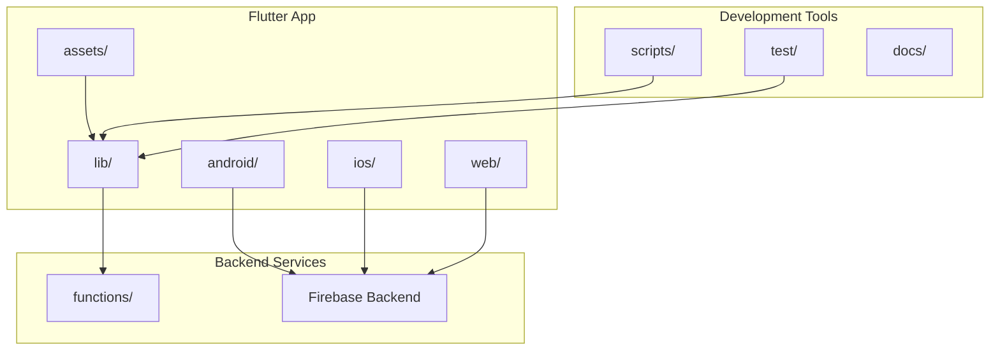
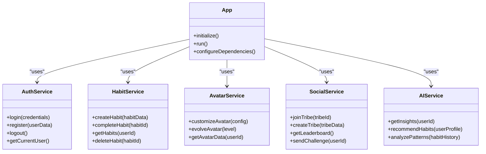
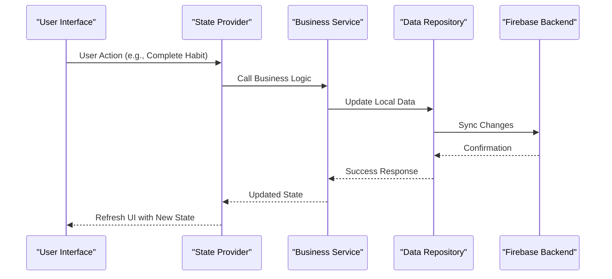
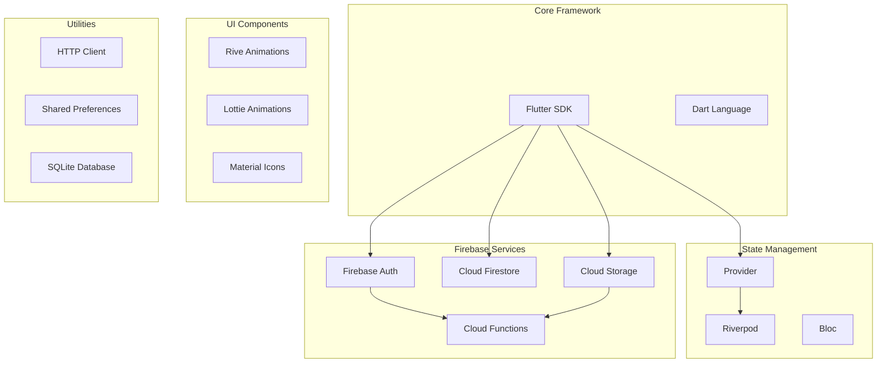

# Getting Started

<cite>
**Referenced Files in This Document**
- [README.md](file://README.md)
- [pubspec.yaml](file://pubspec.yaml)
- [lib/main.dart](file://lib/main.dart)
- [firebase.json](file://firebase.json)
- [android/app/src/main/AndroidManifest.xml](file://android/app/src/main/AndroidManifest.xml)
- [ios/Runner/Info.plist](file://ios/Runner/Info.plist)
- [functions/package.json](file://functions/package.json)
- [firestore.rules](file://firestore.rules)
- [storage.rules](file://storage.rules)
- [.firebaserc](file://.firebaserc)
</cite>

## Table of Contents
1. [Introduction](#introduction)
2. [Project Structure](#project-structure)
3. [Core Components](#core-components)
4. [Architecture Overview](#architecture-overview)
5. [Detailed Component Analysis](#detailed-component-analysis)
6. [Dependency Analysis](#dependency-analysis)
7. [Performance Considerations](#performance-considerations)
8. [Troubleshooting Guide](#troubleshooting-guide)
9. [Conclusion](#conclusion)

## Introduction

Emerge is a gamified habit formation application that transforms personal development into an engaging adventure. The app combines habit tracking with avatar evolution, tribal communities, and AI-powered insights to create a compelling user experience that motivates users to build lasting positive habits.

### Key Features

- **Avatar Evolution System**: Users' avatars evolve and change appearance as they complete habits and achieve milestones
- **Tribal Communities**: Join or create tribes to share progress, compete, and support each other
- **AI-Powered Insights**: Intelligent recommendations and personalized feedback based on user behavior patterns
- **Gamification Elements**: XP system, levels, challenges, and rewards to maintain engagement
- **Multi-Platform Support**: Available on Android, iOS, and Web platforms

## Project Structure

The Emerge app follows a modern Flutter architecture with feature-based organization:



**Diagram sources**
- [lib/main.dart:1-50](file://lib/main.dart#L1-L50)
- [functions/package.json:1-30](file://functions/package.json#L1-L30)

### Directory Organization

- **`lib/`**: Main Flutter application code organized by features
- **`android/`**: Android-specific configurations and native code
- **`ios/`**: iOS-specific configurations and native code  
- **`web/`**: Web platform specific files
- **`functions/`**: Firebase Cloud Functions for backend logic
- **`assets/`**: Images, sounds, animations, and other media resources
- **`scripts/`**: Development and utility scripts
- **`tests/`**: Unit and integration tests

**Section sources**
- [lib/main.dart:1-100](file://lib/main.dart#L1-L100)
- [pubspec.yaml:1-50](file://pubspec.yaml#L1-L50)

## Core Components

### Application Entry Point

The main application entry point initializes core services and sets up the Flutter environment:

- **App Initialization**: Configures dependencies, theme, and routing
- **Firebase Integration**: Sets up authentication, database, and storage services
- **State Management**: Initializes providers and state management systems
- **Platform Detection**: Handles platform-specific configurations

### Feature Modules

The app is organized into distinct feature modules:

- **Authentication**: User registration, login, and profile management
- **Habits**: Habit creation, tracking, and completion workflows
- **Avatar System**: Avatar customization, evolution, and rendering
- **Social/Tribes**: Community features, leaderboards, and social interactions
- **AI Insights**: Machine learning powered recommendations and analytics
- **Gamification**: XP system, achievements, and reward mechanisms

**Section sources**
- [lib/main.dart:1-200](file://lib/main.dart#L1-L200)

## Architecture Overview

Emerge follows a clean architecture pattern with clear separation of concerns:



**Diagram sources**
- [lib/main.dart:1-150](file://lib/main.dart#L1-L150)

### Data Flow Architecture



**Diagram sources**
- [lib/main.dart:1-100](file://lib/main.dart#L1-L100)

## Detailed Component Analysis

### Installation Requirements

#### Prerequisites

Before setting up the Emerge app, ensure you have the following installed:

- **Flutter SDK**: Version 3.0 or higher
- **Dart SDK**: Version 3.0 or higher  
- **Android Studio**: For Android development
- **Xcode**: For iOS development (macOS only)
- **Firebase CLI**: For Firebase configuration
- **Git**: For version control

#### Platform-Specific Dependencies

**Android Setup:**
- Android SDK API level 21+
- Android Studio with Android SDK
- Java JDK 11 or higher
- Android Emulator or physical device

**iOS Setup:**
- macOS with Xcode 14+
- iOS deployment target 13.0+
- CocoaPods for dependency management
- iOS Simulator or physical device

**Web Setup:**
- Modern web browser
- Node.js for development server

**Section sources**
- [pubspec.yaml:1-100](file://pubspec.yaml#L1-L100)
- [android/app/build.gradle.kts:1-50](file://android/app/build.gradle.kts#L1-L50)

### Firebase Configuration

#### Creating a Firebase Project

1. **Create Firebase Project**:
   - Go to Firebase Console
   - Click "Add Project"
   - Follow the setup wizard
   - Enable required services

2. **Enable Required Services**:
   - Authentication (Email/Password, Google, Apple)
   - Firestore Database
   - Storage
   - Cloud Functions
   - Hosting (for web)

3. **Download Configuration Files**:
   - `google-services.json` for Android
   - `GoogleService-Info.plist` for iOS
   - Web configuration for browser

#### Setting Up Firebase Locally

```bash
# Install Firebase CLI
npm install -g firebase-tools

# Login to Firebase
firebase login

# Initialize Firebase in project
firebase init

# Select features:
# - Firestore
# - Storage
# - Functions
# - Hosting
```

**Section sources**
- [firebase.json:1-50](file://firebase.json#L1-L50)
- [.firebaserc:1-20](file://.firebaserc#L1-L20)

### Development Environment Setup

#### Step-by-Step Installation

1. **Clone the Repository**:
```bash
git clone https://github.com/emerge-app/emerge.git
cd emerge
```

2. **Install Dependencies**:
```bash
flutter pub get
```

3. **Setup Firebase Configuration**:
   - Place `google-services.json` in `android/app/`
   - Place `GoogleService-Info.plist` in `ios/Runner/`
   - Configure Firebase options in app settings

4. **Run Firebase Emulators** (Optional):
```bash
firebase emulators:start
```

5. **Build and Run**:
```bash
# Android
flutter run -t lib/main.dart --flavor dev

# iOS
flutter run -t lib/main.dart --flavor dev

# Web
flutter run -t lib/main.dart -d chrome
```

#### Environment Variables

Create a `.env` file with your Firebase configuration:

```bash
FIREBASE_PROJECT_ID=your-project-id
FIREBASE_API_KEY=your-api-key
FIREBASE_AUTH_DOMAIN=your-auth-domain
FIREBASE_STORAGE_BUCKET=your-storage-bucket
FIREBASE_MESSAGING_SENDER_ID=your-sender-id
FIREBASE_APP_ID=your-app-id
```

**Section sources**
- [lib/main.dart:1-150](file://lib/main.dart#L1-L150)

### Basic Usage Examples

#### Running the App

Once setup is complete, you can run the app on different platforms:

```bash
# Run on connected Android device
flutter run

# Run on iOS simulator
flutter run -d ios

# Run on web browser
flutter run -d chrome

# Run with debug flags
flutter run --debug --verbose
```

#### First-Time User Flow

1. **Onboarding Process**:
   - Welcome screen with app introduction
   - Avatar selection and customization
   - Interest and goal setting
   - Tribe invitation or creation

2. **Habit Creation**:
   - Navigate to habit creation screen
   - Define habit name, frequency, and reminders
   - Set goals and milestones
   - Choose associated rewards

3. **Daily Tracking**:
   - View today's habit timeline
   - Mark habits as complete
   - Track streaks and progress
   - Earn XP and level up

#### Core Navigation

The app uses a bottom navigation bar with these main sections:

- **Home**: Dashboard with daily habits and timeline
- **Habits**: Full list of all habits with filtering
- **Avatar**: Customization and evolution status
- **Social**: Tribe community and leaderboards
- **Profile**: Settings and account management

**Section sources**
- [lib/main.dart:1-200](file://lib/main.dart#L1-L200)

## Dependency Analysis

### External Dependencies

The app relies on several key external packages:



**Diagram sources**
- [pubspec.yaml:1-150](file://pubspec.yaml#L1-L150)

### Internal Dependencies

The app follows a modular architecture with clear dependency boundaries:

- **Core Layer**: Shared utilities, models, and base classes
- **Feature Layers**: Independent feature modules with minimal coupling
- **Presentation Layer**: UI components and screens
- **Data Layer**: Repositories and data sources

**Section sources**
- [pubspec.yaml:1-200](file://pubspec.yaml#L1-L200)

## Performance Considerations

### Optimization Strategies

- **Lazy Loading**: Load features and data on demand
- **Image Optimization**: Use appropriate formats and compression
- **Database Indexing**: Optimize Firestore queries with proper indexing
- **Caching Strategy**: Implement local caching for frequently accessed data
- **Code Splitting**: Separate large features into loadable modules

### Memory Management

- Proper disposal of streams and subscriptions
- Efficient image handling and caching
- Minimize widget rebuilds with proper state management
- Use const constructors where possible

## Troubleshooting Guide

### Common Setup Issues

**Flutter Environment Problems:**
- Ensure Flutter path is correctly configured
- Check Dart SDK version compatibility
- Verify Android/iOS development tools are installed

**Firebase Configuration Errors:**
- Verify package names match Firebase configuration
- Check SHA fingerprints for Android
- Ensure correct bundle identifiers for iOS

**Build Failures:**
- Clean build directory: `flutter clean`
- Remove and reinstall dependencies: `rm -rf .dart_tool && flutter pub get`
- Check for conflicting package versions

### Debugging Tips

- Use Flutter DevTools for performance profiling
- Enable verbose logging during development
- Test on both emulator and physical devices
- Check Firebase console for error logs

**Section sources**
- [lib/main.dart:1-100](file://lib/main.dart#L1-L100)

## Conclusion

The Emerge habit formation app provides a comprehensive solution for building lasting habits through gamification and social engagement. With its modern Flutter architecture, Firebase backend, and rich feature set, it offers developers a solid foundation for creating engaging productivity applications.

The setup process, while requiring multiple steps, ensures a robust development environment that supports rapid iteration and testing. The modular architecture makes it easy to extend functionality and maintain code quality as the application grows.

For new developers, start with the basic setup and familiarize yourself with the core features before diving into customizations. The extensive documentation and well-organized codebase provide excellent starting points for understanding the application's architecture and capabilities.