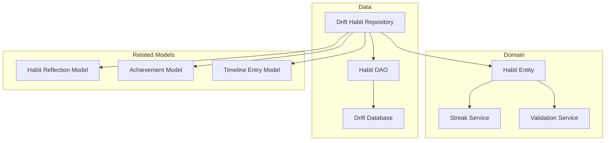
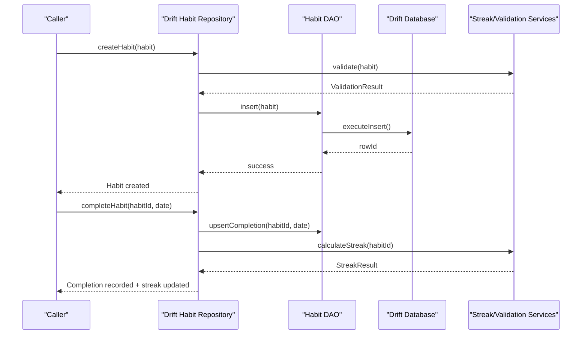
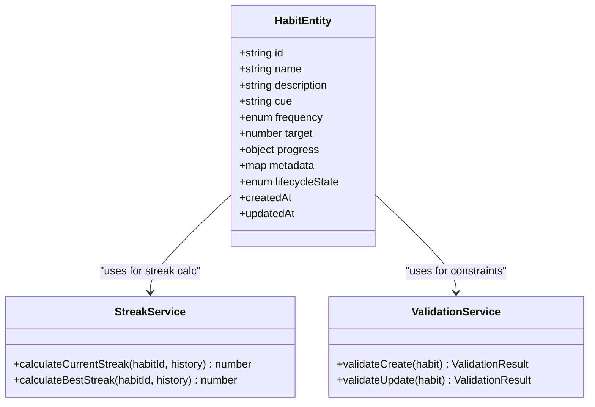
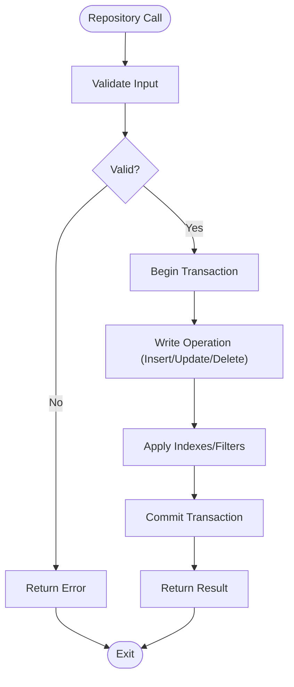
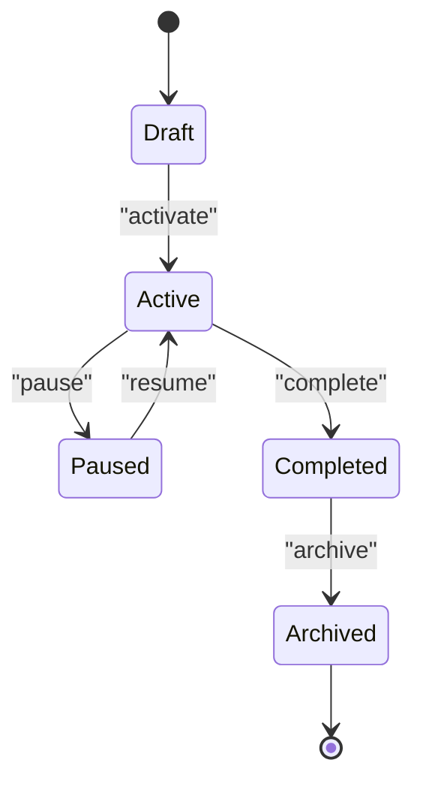
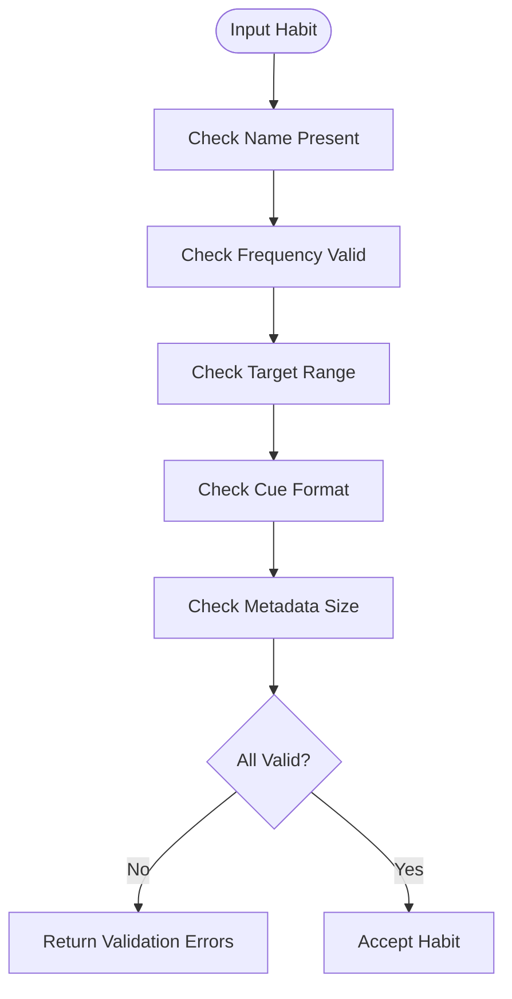
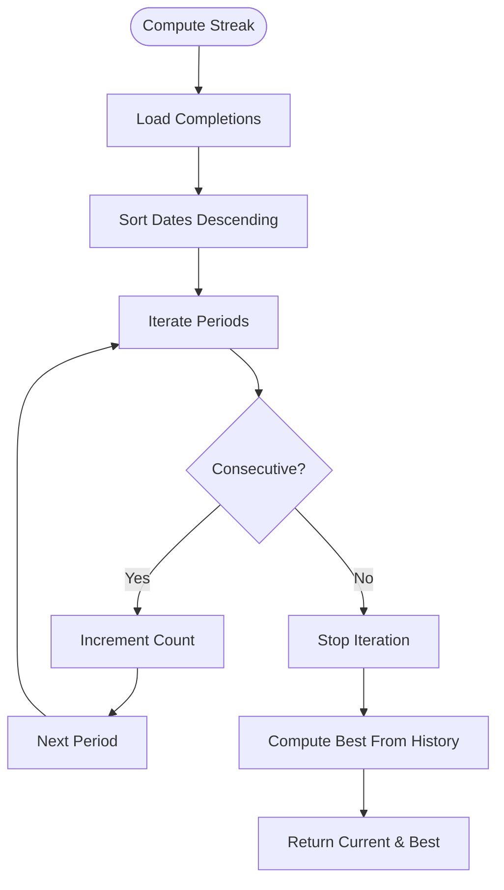
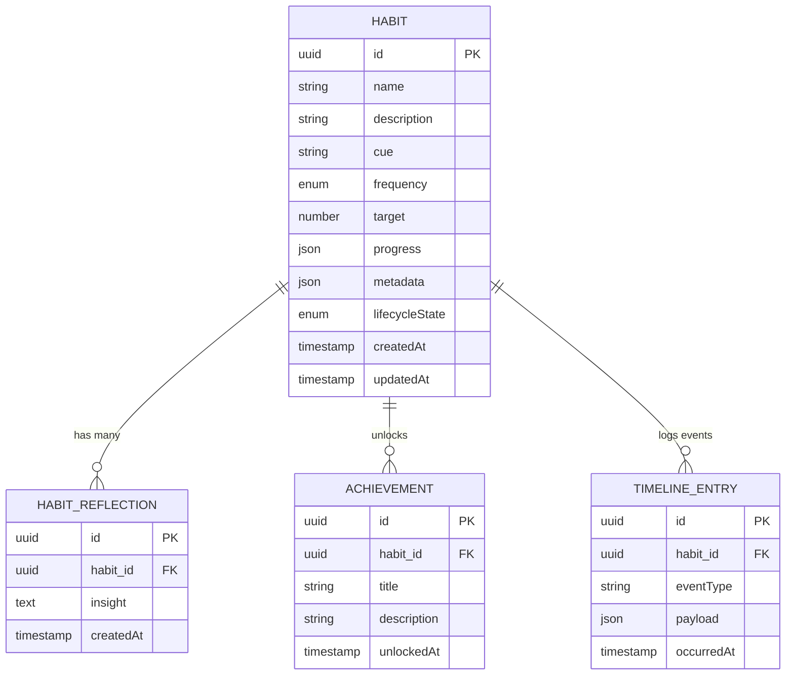
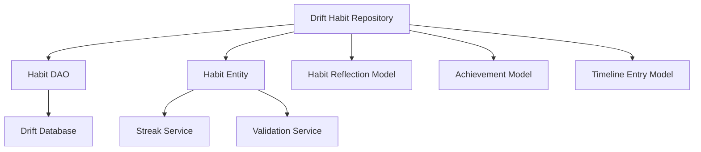

# Habit Core Models & Data Layer

<cite>
**Referenced Files in This Document**
- [lib/features/habits/domain/entities/habit_entity.dart](file://lib/features/habits/domain/entities/habit_entity.dart)
- [lib/features/habits/data/repositories/drift_habit_repository.dart](file://lib/features/habits/data/repositories/drift_habit_repository.dart)
- [lib/core/drift/daos/habit_dao.dart](file://lib/core/drift/daos/habit_dao.dart)
- [lib/core/drift/database.dart](file://lib/core/drift/database.dart)
- [lib/features/habits/domain/services/habit_streak_service.dart](file://lib/features/habits/domain/services/habit_streak_service.dart)
- [lib/features/habits/domain/services/habit_validation_service.dart](file://lib/features/habits/domain/services/habit_validation_service.dart)
- [lib/features/reflections/domain/models/habit_reflection_model.dart](file://lib/features/reflections/domain/models/habit_reflection_model.dart)
- [lib/features/gamification/domain/models/achievement_model.dart](file://lib/features/gamification/domain/models/achievement_model.dart)
- [lib/features/timeline/domain/models/timeline_entry_model.dart](file://lib/features/timeline/domain/models/timeline_entry_model.dart)
- [test/core/drift_repositories/drift_habit_repository_test.dart](file://test/core/drift_repositories/drift_habit_repository_test.dart)
- [test/features/habits/data/repositories/drift_habit_repository_test.dart](file://test/features/habits/data/repositories/drift_habit_repository_test.dart)
</cite>

## Table of Contents
1. [Introduction](#introduction)
2. [Project Structure](#project-structure)
3. [Core Components](#core-components)
4. [Architecture Overview](#architecture-overview)
5. [Detailed Component Analysis](#detailed-component-analysis)
6. [Dependency Analysis](#dependency-analysis)
7. [Performance Considerations](#performance-considerations)
8. [Troubleshooting Guide](#troubleshooting-guide)
9. [Conclusion](#conclusion)

## Introduction
This document provides comprehensive data model documentation for the habit system’s core entities and data layer. It focuses on the Habit entity structure, repository pattern implementation with Drift database integration, DAO methods for CRUD operations, query optimization strategies, persistence patterns, lifecycle states, validation rules, business constraints, creation patterns, bulk operations, migration strategies, and relationships with reflections, achievements, and timeline entries. The goal is to make the habit data layer accessible to both technical and non-technical readers while preserving precise code-level traceability.

## Project Structure
The habit system follows a layered architecture:
- Domain layer defines entities, services, and business rules (e.g., Habit entity, streak calculation, validation).
- Data layer implements repositories and DAOs using Drift for local persistence.
- Cross-cutting models connect habits to reflections, achievements, and timeline entries.

**Diagram sources**
- [lib/features/habits/domain/entities/habit_entity.dart](file://lib/features/habits/domain/entities/habit_entity.dart)
- [lib/features/habits/domain/services/habit_streak_service.dart](file://lib/features/habits/domain/services/habit_streak_service.dart)
- [lib/features/habits/domain/services/habit_validation_service.dart](file://lib/features/habits/domain/services/habit_validation_service.dart)
- [lib/features/habits/data/repositories/drift_habit_repository.dart](file://lib/features/habits/data/repositories/drift_habit_repository.dart)
- [lib/core/drift/daos/habit_dao.dart](file://lib/core/drift/daos/habit_dao.dart)
- [lib/core/drift/database.dart](file://lib/core/drift/database.dart)
- [lib/features/reflections/domain/models/habit_reflection_model.dart](file://lib/features/reflections/domain/models/habit_reflection_model.dart)
- [lib/features/gamification/domain/models/achievement_model.dart](file://lib/features/gamification/domain/models/achievement_model.dart)
- [lib/features/timeline/domain/models/timeline_entry_model.dart](file://lib/features/timeline/domain/models/timeline_entry_model.dart)

**Section sources**
- [lib/features/habits/domain/entities/habit_entity.dart](file://lib/features/habits/domain/entities/habit_entity.dart)
- [lib/features/habits/data/repositories/drift_habit_repository.dart](file://lib/features/habits/data/repositories/drift_habit_repository.dart)
- [lib/core/drift/daos/habit_dao.dart](file://lib/core/drift/daos/habit_dao.dart)
- [lib/core/drift/database.dart](file://lib/core/drift/database.dart)

## Core Components
- Habit Entity: Defines fields such as name, description, cue, frequency, target, progress tracking, metadata, and lifecycle state.
- Streak Service: Calculates current and best streaks based on completion history and date boundaries.
- Validation Service: Enforces business constraints (e.g., required fields, valid frequencies, target ranges).
- Drift Habit Repository: Implements CRUD operations, batch writes, and query optimizations via DAOs.
- Habit DAO: Provides typed queries and mutations against Drift tables.
- Related Models: Habit reflection, achievement, and timeline entry models that reference habits by ID.

Key responsibilities:
- Persistence: Local-first storage with Drift; transactions for consistency.
- Query Optimization: Indexed columns, filtered queries, and efficient joins where applicable.
- Business Rules: Validation and streak computation encapsulated in domain services.
- Relationships: Foreign keys or IDs linking habits to reflections, achievements, and timeline entries.

**Section sources**
- [lib/features/habits/domain/entities/habit_entity.dart](file://lib/features/habits/domain/entities/habit_entity.dart)
- [lib/features/habits/domain/services/habit_streak_service.dart](file://lib/features/habits/domain/services/habit_streak_service.dart)
- [lib/features/habits/domain/services/habit_validation_service.dart](file://lib/features/habits/domain/services/habit_validation_service.dart)
- [lib/features/habits/data/repositories/drift_habit_repository.dart](file://lib/features/habits/data/repositories/drift_habit_repository.dart)
- [lib/core/drift/daos/habit_dao.dart](file://lib/core/drift/daos/habit_dao.dart)
- [lib/core/drift/database.dart](file://lib/core/drift/database.dart)

## Architecture Overview
The habit data layer uses a repository pattern backed by Drift. The repository abstracts persistence details and exposes domain-friendly APIs. DAOs encapsulate SQL-like operations, while services enforce business logic.

**Diagram sources**
- [lib/features/habits/data/repositories/drift_habit_repository.dart](file://lib/features/habits/data/repositories/drift_habit_repository.dart)
- [lib/core/drift/daos/habit_dao.dart](file://lib/core/drift/daos/habit_dao.dart)
- [lib/core/drift/database.dart](file://lib/core/drift/database.dart)
- [lib/features/habits/domain/services/habit_streak_service.dart](file://lib/features/habits/domain/services/habit_streak_service.dart)
- [lib/features/habits/domain/services/habit_validation_service.dart](file://lib/features/habits/domain/services/habit_validation_service.dart)

## Detailed Component Analysis

### Habit Entity
- Fields:
  - name: String identifier for the habit.
  - description: Optional textual context.
  - cue: Trigger or context associated with the habit.
  - frequency: Enumerated cadence (e.g., daily, weekly).
  - target: Numeric or structured goal per period.
  - progress: Aggregated metrics (e.g., completions, percentages).
  - metadata: Flexible key-value store for extensions.
  - lifecycleState: Enumerated state controlling visibility and behavior.
- Constraints:
  - Required fields enforced by validation service.
  - Frequency must align with supported periods.
  - Target values within acceptable bounds.

**Diagram sources**
- [lib/features/habits/domain/entities/habit_entity.dart](file://lib/features/habits/domain/entities/habit_entity.dart)
- [lib/features/habits/domain/services/habit_streak_service.dart](file://lib/features/habits/domain/services/habit_streak_service.dart)
- [lib/features/habits/domain/services/habit_validation_service.dart](file://lib/features/habits/domain/services/habit_validation_service.dart)

**Section sources**
- [lib/features/habits/domain/entities/habit_entity.dart](file://lib/features/habits/domain/entities/habit_entity.dart)
- [lib/features/habits/domain/services/habit_streak_service.dart](file://lib/features/habits/domain/services/habit_streak_service.dart)
- [lib/features/habits/domain/services/habit_validation_service.dart](file://lib/features/habits/domain/services/habit_validation_service.dart)

### Drift Habit Repository and DAO
- Responsibilities:
  - CRUD operations: create, read, update, delete habits.
  - Batch operations: bulk inserts/updates for performance.
  - Query optimization: indexed lookups, filtered queries, pagination.
  - Transactions: ensure atomicity across related writes.
- DAO Methods:
  - insert/update/delete habits.
  - queryByFrequency, queryByLifecycleState.
  - upsertCompletion for daily/weekly tracking.
  - aggregateProgress for summary metrics.

**Diagram sources**
- [lib/features/habits/data/repositories/drift_habit_repository.dart](file://lib/features/habits/data/repositories/drift_habit_repository.dart)
- [lib/core/drift/daos/habit_dao.dart](file://lib/core/drift/daos/habit_dao.dart)
- [lib/core/drift/database.dart](file://lib/core/drift/database.dart)

**Section sources**
- [lib/features/habits/data/repositories/drift_habit_repository.dart](file://lib/features/habits/data/repositories/drift_habit_repository.dart)
- [lib/core/drift/daos/habit_dao.dart](file://lib/core/drift/daos/habit_dao.dart)
- [lib/core/drift/database.dart](file://lib/core/drift/database.dart)

### Habit Lifecycle States
- States typically include:
  - Draft: Created but not yet active.
  - Active: Currently tracked and visible.
  - Paused: Temporarily suspended.
  - Completed: Finished successfully.
  - Archived: Retired from active views.
- Transitions are governed by business rules and user actions.

**Section sources**
- [lib/features/habits/domain/entities/habit_entity.dart](file://lib/features/habits/domain/entities/habit_entity.dart)

### Validation Rules and Business Constraints
- Required fields: name, frequency, target.
- Frequency must be one of supported enums.
- Target must be positive and within allowed range.
- Cue must conform to format constraints if present.
- Metadata must be serializable and bounded in size.

**Section sources**
- [lib/features/habits/domain/services/habit_validation_service.dart](file://lib/features/habits/domain/services/habit_validation_service.dart)

### Streak Calculation Logic
- Current streak: Consecutive days/periods completed up to today.
- Best streak: Maximum consecutive run observed in history.
- Breaks: Any missed period resets current streak.

**Section sources**
- [lib/features/habits/domain/services/habit_streak_service.dart](file://lib/features/habits/domain/services/habit_streak_service.dart)

### Creation Patterns and Bulk Operations
- Single creation: Validate, insert, return persisted entity.
- Bulk creation: Batch insert with transactional boundary; handle partial failures.
- Update patterns: Partial updates with conflict resolution.
- Deletion: Soft delete via lifecycle state or hard delete with cascade considerations.

**Section sources**
- [lib/features/habits/data/repositories/drift_habit_repository.dart](file://lib/features/habits/data/repositories/drift_habit_repository.dart)
- [lib/core/drift/daos/habit_dao.dart](file://lib/core/drift/daos/habit_dao.dart)

### Data Migration Strategies
- Schema versioning: Increment version on changes; apply migrations sequentially.
- Backward compatibility: Default values for new fields; safe transforms.
- Rollback strategy: Maintain migration scripts for reversible changes.
- Testing: Validate migrations against test databases.

**Section sources**
- [lib/core/drift/database.dart](file://lib/core/drift/database.dart)

### Relationships with Other System Components
- Habit Reflections: Linked by habitId; capture user insights post-completion.
- Achievements: Triggered by habit milestones; reference habitId for attribution.
- Timeline Entries: Log habit events; associate habitId for chronological display.

**Diagram sources**
- [lib/features/habits/domain/entities/habit_entity.dart](file://lib/features/habits/domain/entities/habit_entity.dart)
- [lib/features/reflections/domain/models/habit_reflection_model.dart](file://lib/features/reflections/domain/models/habit_reflection_model.dart)
- [lib/features/gamification/domain/models/achievement_model.dart](file://lib/features/gamification/domain/models/achievement_model.dart)
- [lib/features/timeline/domain/models/timeline_entry_model.dart](file://lib/features/timeline/domain/models/timeline_entry_model.dart)

**Section sources**
- [lib/features/reflections/domain/models/habit_reflection_model.dart](file://lib/features/reflections/domain/models/habit_reflection_model.dart)
- [lib/features/gamification/domain/models/achievement_model.dart](file://lib/features/gamification/domain/models/achievement_model.dart)
- [lib/features/timeline/domain/models/timeline_entry_model.dart](file://lib/features/timeline/domain/models/timeline_entry_model.dart)

## Dependency Analysis
- Repository depends on DAO for persistence operations.
- DAO depends on Drift database instance for schema access.
- Domain services depend on entity definitions and historical data.
- Related models depend on habitId references for cross-feature linkage.

**Diagram sources**
- [lib/features/habits/data/repositories/drift_habit_repository.dart](file://lib/features/habits/data/repositories/drift_habit_repository.dart)
- [lib/core/drift/daos/habit_dao.dart](file://lib/core/drift/daos/habit_dao.dart)
- [lib/core/drift/database.dart](file://lib/core/drift/database.dart)
- [lib/features/habits/domain/entities/habit_entity.dart](file://lib/features/habits/domain/entities/habit_entity.dart)
- [lib/features/habits/domain/services/habit_streak_service.dart](file://lib/features/habits/domain/services/habit_streak_service.dart)
- [lib/features/habits/domain/services/habit_validation_service.dart](file://lib/features/habits/domain/services/habit_validation_service.dart)
- [lib/features/reflections/domain/models/habit_reflection_model.dart](file://lib/features/reflections/domain/models/habit_reflection_model.dart)
- [lib/features/gamification/domain/models/achievement_model.dart](file://lib/features/gamification/domain/models/achievement_model.dart)
- [lib/features/timeline/domain/models/timeline_entry_model.dart](file://lib/features/timeline/domain/models/timeline_entry_model.dart)

**Section sources**
- [lib/features/habits/data/repositories/drift_habit_repository.dart](file://lib/features/habits/data/repositories/drift_habit_repository.dart)
- [lib/core/drift/daos/habit_dao.dart](file://lib/core/drift/daos/habit_dao.dart)
- [lib/core/drift/database.dart](file://lib/core/drift/database.dart)

## Performance Considerations
- Use indexed columns for frequent filters (e.g., frequency, lifecycleState).
- Batch writes to reduce transaction overhead.
- Paginate large result sets to avoid memory pressure.
- Cache computed streaks and progress summaries when appropriate.
- Avoid N+1 queries by joining related data at the DAO level.

[No sources needed since this section provides general guidance]

## Troubleshooting Guide
- Common issues:
  - Validation failures due to missing or invalid fields.
  - Streak miscalculations caused by timezone mismatches or incomplete histories.
  - Migration errors from incompatible schema versions.
- Debugging steps:
  - Inspect validation error messages.
  - Verify completion dates and sorting order.
  - Review migration logs and rollback scripts.
- Test coverage:
  - Unit tests for repository operations and DAO queries.
  - Integration tests for migrations and transactions.

**Section sources**
- [test/core/drift_repositories/drift_habit_repository_test.dart](file://test/core/drift_repositories/drift_habit_repository_test.dart)
- [test/features/habits/data/repositories/drift_habit_repository_test.dart](file://test/features/habits/data/repositories/drift_habit_repository_test.dart)

## Conclusion
The habit system’s data layer combines clear domain modeling with robust persistence through Drift. The repository pattern abstracts complexity, while DAOs provide efficient, typed operations. Domain services enforce validation and compute streaks, ensuring consistent business rules. Relationships with reflections, achievements, and timeline entries enable rich feature interactions. Proper indexing, batching, and migration strategies maintain performance and reliability over time.

[No sources needed since this section summarizes without analyzing specific files]