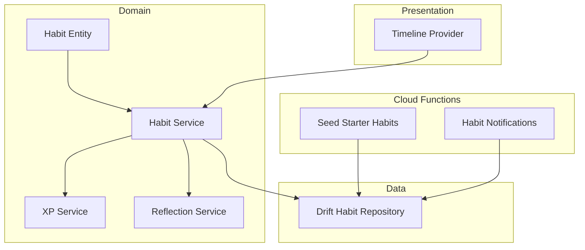
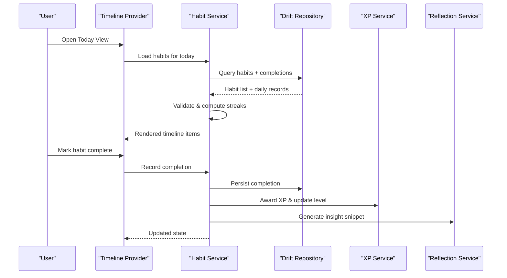
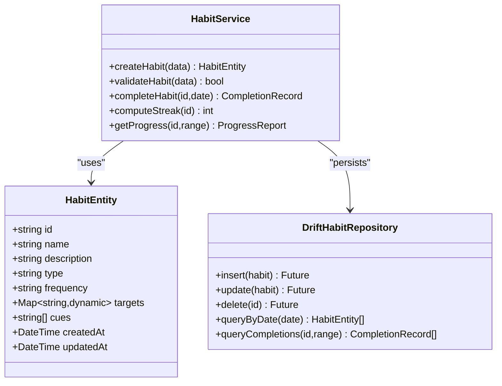
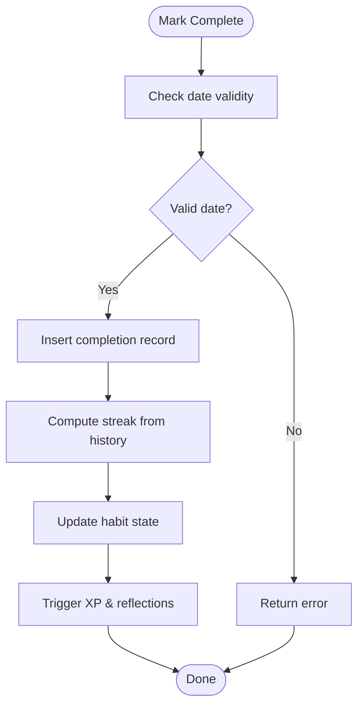
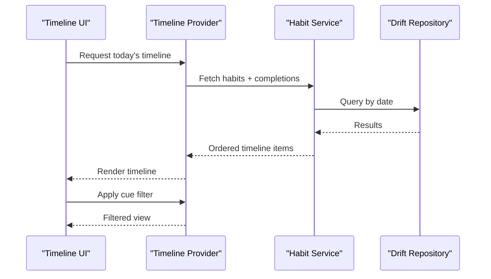
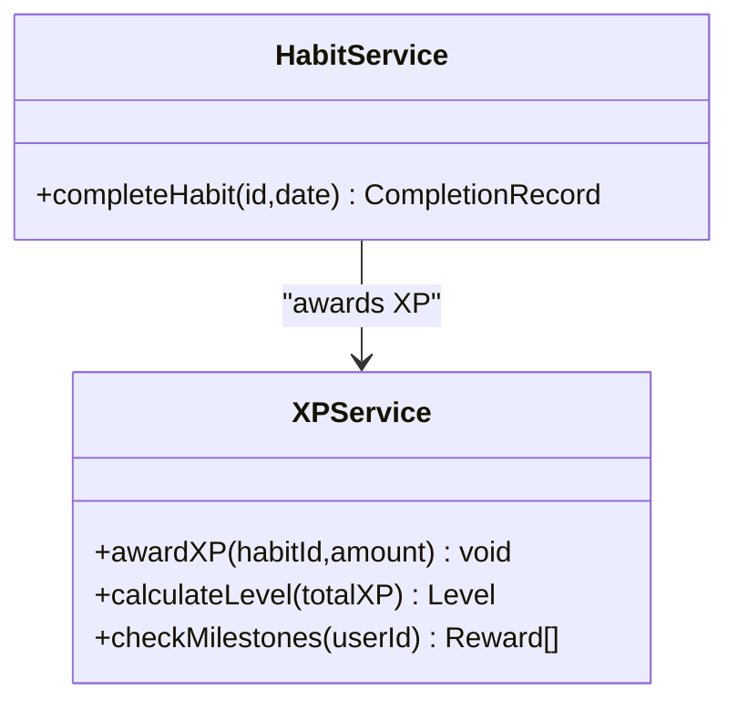
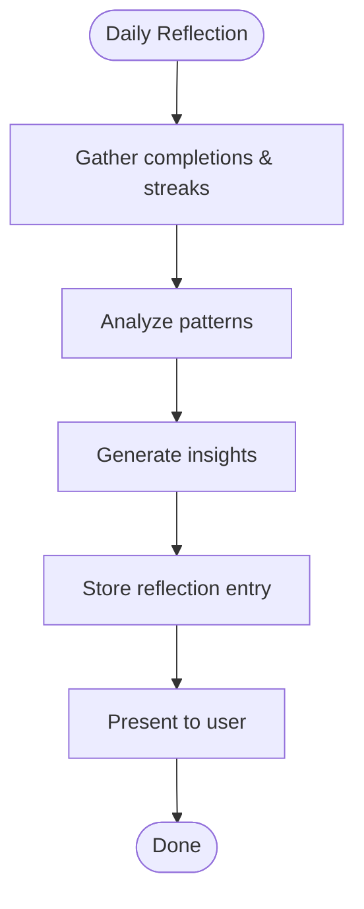
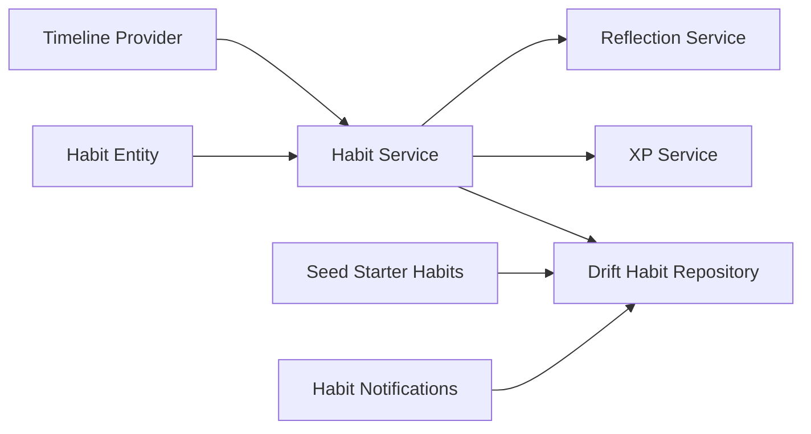

# Habit Management System

<cite>
**Referenced Files in This Document**
- [README.md](file://README.md)
- [pubspec.yaml](file://pubspec.yaml)
- [lib/main.dart](file://lib/main.dart)
- [lib/features/habits/domain/entities/habit_entity.dart](file://lib/features/habits/domain/entities/habit_entity.dart)
- [lib/features/habits/domain/services/habit_service.dart](file://lib/features/habits/domain/services/habit_service.dart)
- [lib/features/habits/data/repositories/drift_habit_repository.dart](file://lib/features/habits/data/repositories/drift_habit_repository.dart)
- [lib/features/timeline/presentation/providers/timeline_provider.dart](file://lib/features/timeline/presentation/providers/timeline_provider.dart)
- [lib/features/gamification/domain/services/xp_service.dart](file://lib/features/gamification/domain/services/xp_service.dart)
- [lib/features/reflections/domain/services/reflection_service.dart](file://lib/features/reflections/domain/services/reflection_service.dart)
- [lib/features/health/domain/services/health_integration_service.dart](file://lib/features/health/domain/services/health_integration_service.dart)
- [functions/src/seed_starter_habits.ts](file://functions/src/seed_starter_habits.ts)
- [functions/src/habit_notifications.js](file://functions/src/habit_notifications.js)
</cite>

## Table of Contents
1. [Introduction](#introduction)
2. [Project Structure](#project-structure)
3. [Core Components](#core-components)
4. [Architecture Overview](#architecture-overview)
5. [Detailed Component Analysis](#detailed-component-analysis)
6. [Dependency Analysis](#dependency-analysis)
7. [Performance Considerations](#performance-considerations)
8. [Troubleshooting Guide](#troubleshooting-guide)
9. [Conclusion](#conclusion)
10. [Appendices](#appendices)

## Introduction
This document explains the habit management system within the Emerge app, focusing on how habits are created, tracked, and managed throughout their lifecycle. It covers the habit data model, validation rules, streak calculation, completion tracking, progress visualization, timeline organization, cue-based triggering, smart defaults generation, gamification integration (XP, levels, rewards), reflection and behavioral analysis, and integrations with external health data sources. The goal is to make the system understandable for both technical and non-technical readers while providing actionable guidance for developers and product teams.

## Project Structure
The habit system spans multiple layers:
- Domain entities define the core habit model and related concepts.
- Services implement business logic such as streak computation, completion tracking, and reflection insights.
- Repositories persist data locally using Drift and synchronize with cloud services.
- Presentation providers manage state for the timeline and UI interactions.
- Cloud functions handle seeding starter habits and notifications.

**Diagram sources**
- [lib/features/habits/domain/entities/habit_entity.dart](file://lib/features/habits/domain/entities/habit_entity.dart)
- [lib/features/habits/domain/services/habit_service.dart](file://lib/features/habits/domain/services/habit_service.dart)
- [lib/features/habits/data/repositories/drift_habit_repository.dart](file://lib/features/habits/data/repositories/drift_habit_repository.dart)
- [lib/features/timeline/presentation/providers/timeline_provider.dart](file://lib/features/timeline/presentation/providers/timeline_provider.dart)
- [lib/features/gamification/domain/services/xp_service.dart](file://lib/features/gamification/domain/services/xp_service.dart)
- [lib/features/reflections/domain/services/reflection_service.dart](file://lib/features/reflections/domain/services/reflection_service.dart)
- [functions/src/seed_starter_habits.ts](file://functions/src/seed_starter_habits.ts)
- [functions/src/habit_notifications.js](file://functions/src/habit_notifications.js)

**Section sources**
- [README.md](file://README.md)
- [pubspec.yaml](file://pubspec.yaml)
- [lib/main.dart](file://lib/main.dart)

## Core Components
- Habit Entity: Defines the structure and constraints for a habit, including type, frequency, cues, targets, and metadata.
- Habit Service: Implements creation, validation, completion, streak calculation, and progress aggregation.
- Drift Habit Repository: Persists habits and daily completions locally; supports queries for timelines and analytics.
- Timeline Provider: Manages chronological display of habits and cues for today’s view.
- XP Service: Computes experience points and level progression based on habit activity.
- Reflection Service: Generates daily insights, pattern recognition, and behavioral summaries.
- Health Integration Service: Bridges external health data sources to enrich habit tracking.
- Cloud Functions: Seed starter habits and send habit-related notifications.

**Section sources**
- [lib/features/habits/domain/entities/habit_entity.dart](file://lib/features/habits/domain/entities/habit_entity.dart)
- [lib/features/habits/domain/services/habit_service.dart](file://lib/features/habits/domain/services/habit_service.dart)
- [lib/features/habits/data/repositories/drift_habit_repository.dart](file://lib/features/habits/data/repositories/drift_habit_repository.dart)
- [lib/features/timeline/presentation/providers/timeline_provider.dart](file://lib/features/timeline/presentation/providers/timeline_provider.dart)
- [lib/features/gamification/domain/services/xp_service.dart](file://lib/features/gamification/domain/services/xp_service.dart)
- [lib/features/reflections/domain/services/reflection_service.dart](file://lib/features/reflections/domain/services/reflection_service.dart)
- [lib/features/health/domain/services/health_integration_service.dart](file://lib/features/health/domain/services/health_integration_service.dart)
- [functions/src/seed_starter_habits.ts](file://functions/src/seed_starter_habits.ts)
- [functions/src/habit_notifications.js](file://functions/src/habit_notifications.js)

## Architecture Overview
The habit system follows a layered architecture:
- Domain layer defines entities and services that encapsulate business rules.
- Data layer persists information via Drift and synchronizes with backend services.
- Presentation layer uses providers to render timelines and user interactions.
- Cloud functions support seeding and notifications.

**Diagram sources**
- [lib/features/timeline/presentation/providers/timeline_provider.dart](file://lib/features/timeline/presentation/providers/timeline_provider.dart)
- [lib/features/habits/domain/services/habit_service.dart](file://lib/features/habits/domain/services/habit_service.dart)
- [lib/features/habits/data/repositories/drift_habit_repository.dart](file://lib/features/habits/data/repositories/drift_habit_repository.dart)
- [lib/features/gamification/domain/services/xp_service.dart](file://lib/features/gamification/domain/services/xp_service.dart)
- [lib/features/reflections/domain/services/reflection_service.dart](file://lib/features/reflections/domain/services/reflection_service.dart)

## Detailed Component Analysis

### Habit Data Model and Validation
- Habit entity includes fields for name, description, type, frequency, target metrics, cues, scheduling, and metadata.
- Validation ensures required fields are present, frequencies are valid, and targets are consistent with habit type.
- Smart defaults generate sensible values when creating new habits (e.g., default frequency, suggested cues).

**Diagram sources**
- [lib/features/habits/domain/entities/habit_entity.dart](file://lib/features/habits/domain/entities/habit_entity.dart)
- [lib/features/habits/domain/services/habit_service.dart](file://lib/features/habits/domain/services/habit_service.dart)
- [lib/features/habits/data/repositories/drift_habit_repository.dart](file://lib/features/habits/data/repositories/drift_habit_repository.dart)

**Section sources**
- [lib/features/habits/domain/entities/habit_entity.dart](file://lib/features/habits/domain/entities/habit_entity.dart)
- [lib/features/habits/domain/services/habit_service.dart](file://lib/features/habits/domain/services/habit_service.dart)
- [lib/features/habits/data/repositories/drift_habit_repository.dart](file://lib/features/habits/data/repositories/drift_habit_repository.dart)

### Streak Calculation and Completion Tracking
- Streak calculation counts consecutive days of completion for a habit, resetting on gaps unless protected by grace rules.
- Completion tracking records each successful action with timestamps and optional notes.
- Progress reports aggregate completion rates over ranges (daily, weekly, monthly).

**Diagram sources**
- [lib/features/habits/domain/services/habit_service.dart](file://lib/features/habits/domain/services/habit_service.dart)
- [lib/features/habits/data/repositories/drift_habit_repository.dart](file://lib/features/habits/data/repositories/drift_habit_repository.dart)

**Section sources**
- [lib/features/habits/domain/services/habit_service.dart](file://lib/features/habits/domain/services/habit_service.dart)
- [lib/features/habits/data/repositories/drift_habit_repository.dart](file://lib/features/habits/data/repositories/drift_habit_repository.dart)

### Timeline System and Cue-Based Triggering
- Timeline organizes habits chronologically for today’s view, grouping by time slots or cue sequences.
- Cue-based triggering associates habits with environmental or temporal cues to prompt action.
- Timeline provider manages state for rendering and updates when completions occur.

**Diagram sources**
- [lib/features/timeline/presentation/providers/timeline_provider.dart](file://lib/features/timeline/presentation/providers/timeline_provider.dart)
- [lib/features/habits/domain/services/habit_service.dart](file://lib/features/habits/domain/services/habit_service.dart)
- [lib/features/habits/data/repositories/drift_habit_repository.dart](file://lib/features/habits/data/repositories/drift_habit_repository.dart)

**Section sources**
- [lib/features/timeline/presentation/providers/timeline_provider.dart](file://lib/features/timeline/presentation/providers/timeline_provider.dart)
- [lib/features/habits/domain/services/habit_service.dart](file://lib/features/habits/domain/services/habit_service.dart)

### Gamification Integration: XP, Levels, and Rewards
- XP service awards experience points upon habit completion and calculates level progression thresholds.
- Rewards can be unlocked based on milestones, streaks, or cumulative achievements.
- Integration with habit service ensures XP updates are consistent with completion events.

**Diagram sources**
- [lib/features/gamification/domain/services/xp_service.dart](file://lib/features/gamification/domain/services/xp_service.dart)
- [lib/features/habits/domain/services/habit_service.dart](file://lib/features/habits/domain/services/habit_service.dart)

**Section sources**
- [lib/features/gamification/domain/services/xp_service.dart](file://lib/features/gamification/domain/services/xp_service.dart)
- [lib/features/habits/domain/services/habit_service.dart](file://lib/features/habits/domain/services/habit_service.dart)

### Reflection System: Daily Insights and Behavioral Analysis
- Reflection service generates daily insights based on completion patterns, streaks, and contextual cues.
- Pattern recognition identifies trends, optimal times, and potential barriers.
- Behavioral analysis aggregates metrics to suggest adjustments and personalized recommendations.

**Diagram sources**
- [lib/features/reflections/domain/services/reflection_service.dart](file://lib/features/reflections/domain/services/reflection_service.dart)

**Section sources**
- [lib/features/reflections/domain/services/reflection_service.dart](file://lib/features/reflections/domain/services/reflection_service.dart)

### Custom Habit Types and Advanced Tracking Options
- Custom habit types extend base entity with specialized fields and validation rules.
- Advanced tracking options include granular metrics, optional notes, and integration hooks for external data.
- Habit service validates and processes custom configurations consistently.

**Section sources**
- [lib/features/habits/domain/entities/habit_entity.dart](file://lib/features/habits/domain/entities/habit_entity.dart)
- [lib/features/habits/domain/services/habit_service.dart](file://lib/features/habits/domain/services/habit_service.dart)

### Integration with External Health Data Sources
- Health integration service connects to external APIs to import relevant metrics (e.g., steps, sleep).
- Data is mapped to habit targets and used to enrich progress visualization and insights.
- Robust error handling ensures resilience against API failures.

**Section sources**
- [lib/features/health/domain/services/health_integration_service.dart](file://lib/features/health/domain/services/health_integration_service.dart)

### Smart Defaults Generation
- When creating habits, smart defaults propose frequency, cues, and targets based on habit type and user context.
- Defaults reduce friction during onboarding and encourage realistic goal setting.

**Section sources**
- [lib/features/habits/domain/services/habit_service.dart](file://lib/features/habits/domain/services/habit_service.dart)
- [functions/src/seed_starter_habits.ts](file://functions/src/seed_starter_habits.ts)

## Dependency Analysis
The habit system has clear dependencies between domain, data, presentation, and cloud layers. The following diagram highlights key relationships:

**Diagram sources**
- [lib/features/habits/domain/entities/habit_entity.dart](file://lib/features/habits/domain/entities/habit_entity.dart)
- [lib/features/habits/domain/services/habit_service.dart](file://lib/features/habits/domain/services/habit_service.dart)
- [lib/features/habits/data/repositories/drift_habit_repository.dart](file://lib/features/habits/data/repositories/drift_habit_repository.dart)
- [lib/features/timeline/presentation/providers/timeline_provider.dart](file://lib/features/timeline/presentation/providers/timeline_provider.dart)
- [lib/features/gamification/domain/services/xp_service.dart](file://lib/features/gamification/domain/services/xp_service.dart)
- [lib/features/reflections/domain/services/reflection_service.dart](file://lib/features/reflections/domain/services/reflection_service.dart)
- [functions/src/seed_starter_habits.ts](file://functions/src/seed_starter_habits.ts)
- [functions/src/habit_notifications.js](file://functions/src/habit_notifications.js)

**Section sources**
- [lib/features/habits/domain/entities/habit_entity.dart](file://lib/features/habits/domain/entities/habit_entity.dart)
- [lib/features/habits/domain/services/habit_service.dart](file://lib/features/habits/domain/services/habit_service.dart)
- [lib/features/habits/data/repositories/drift_habit_repository.dart](file://lib/features/habits/data/repositories/drift_habit_repository.dart)
- [lib/features/timeline/presentation/providers/timeline_provider.dart](file://lib/features/timeline/presentation/providers/timeline_provider.dart)
- [lib/features/gamification/domain/services/xp_service.dart](file://lib/features/gamification/domain/services/xp_service.dart)
- [lib/features/reflections/domain/services/reflection_service.dart](file://lib/features/reflections/domain/services/reflection_service.dart)
- [functions/src/seed_starter_habits.ts](file://functions/src/seed_starter_habits.ts)
- [functions/src/habit_notifications.js](file://functions/src/habit_notifications.js)

## Performance Considerations
- Use efficient queries in Drift repository to minimize data transfer and improve timeline rendering speed.
- Cache frequently accessed habit states locally to reduce recomputation.
- Batch XP and reflection updates to avoid excessive writes.
- Implement lazy loading for large datasets and paginate results where necessary.

[No sources needed since this section provides general guidance]

## Troubleshooting Guide
Common issues and resolutions:
- Validation errors during habit creation: Ensure all required fields are present and follow expected formats.
- Streak inconsistencies: Verify completion records are correctly timestamped and contiguous.
- Timeline not updating: Confirm provider state refreshes after completion events.
- XP not awarded: Check XP service thresholds and habit completion triggers.
- Reflection insights missing: Validate data availability and pattern recognition logic.

**Section sources**
- [lib/features/habits/domain/services/habit_service.dart](file://lib/features/habits/domain/services/habit_service.dart)
- [lib/features/gamification/domain/services/xp_service.dart](file://lib/features/gamification/domain/services/xp_service.dart)
- [lib/features/reflections/domain/services/reflection_service.dart](file://lib/features/reflections/domain/services/reflection_service.dart)

## Conclusion
The habit management system in Emerge integrates robust data modeling, validation, streak calculation, completion tracking, timeline organization, cue-based triggering, smart defaults, gamification, reflections, and health integrations. By adhering to the layered architecture and leveraging local persistence with cloud support, the system delivers a responsive and insightful user experience. Continuous optimization and testing will further enhance reliability and performance.

[No sources needed since this section summarizes without analyzing specific files]

## Appendices
- Example custom habit types: Extend the habit entity with specialized fields and validation rules.
- Advanced tracking options: Include granular metrics, optional notes, and external data hooks.
- Integration examples: Connect to health APIs to enrich habit data and insights.

[No sources needed since this section provides general guidance]