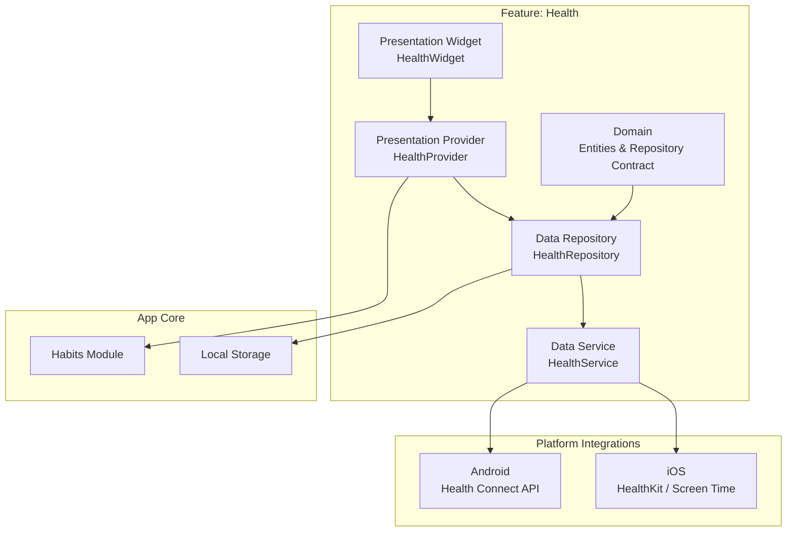
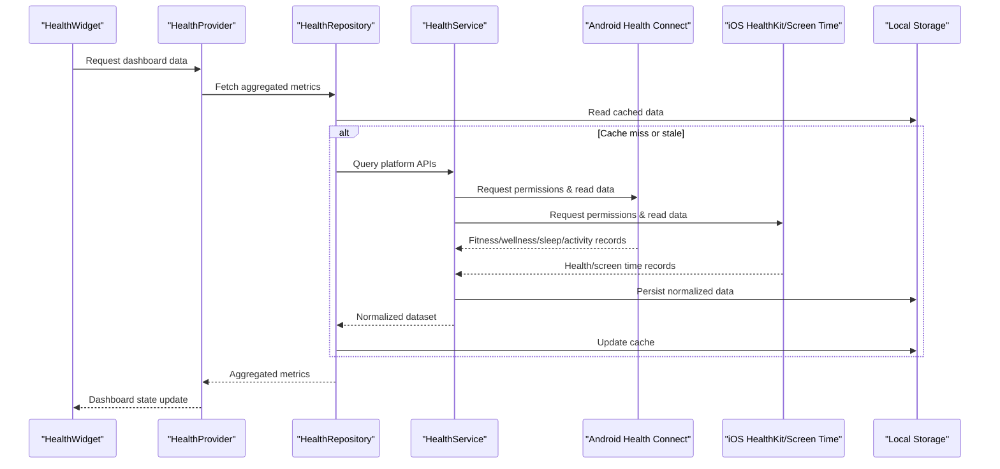
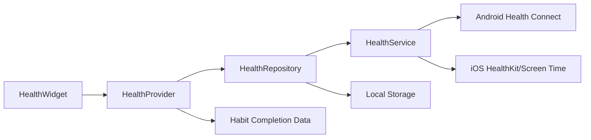

# Health & Screen Time Integration

<cite>
**Referenced Files in This Document**
- [health_screen_time_integration.md](file://docs/superpowers/plans/2026-06-09-health-screen-time-integration.md)
- [health_screen_time_integration_design.md](file://docs/superpowers/specs/2026-06-09-health-screen-time-integration-design.md)
- [health_repository_test.dart](file://test/features/health/domain/health_repository_test.dart)
- [health_repository.dart](file://lib/features/health/data/repositories/health_repository.dart)
- [health_service.dart](file://lib/features/health/data/services/health_service.dart)
- [health_provider.dart](file://lib/features/health/presentation/providers/health_provider.dart)
- [health_widget.dart](file://lib/features/health/presentation/widgets/health_widget.dart)
- [android_manifest.xml](file://android/app/src/main/AndroidManifest.xml)
- [ios_info_plist.plist](file://ios/Runner/Info.plist)
</cite>

## Table of Contents
1. [Introduction](#introduction)
2. [Project Structure](#project-structure)
3. [Core Components](#core-components)
4. [Architecture Overview](#architecture-overview)
5. [Detailed Component Analysis](#detailed-component-analysis)
6. [Dependency Analysis](#dependency-analysis)
7. [Performance Considerations](#performance-considerations)
8. [Troubleshooting Guide](#troubleshooting-guide)
9. [Conclusion](#conclusion)
10. [Appendices](#appendices)

## Introduction
This document explains the health data integration and screen time monitoring features for the application. It covers how the app integrates with platform health APIs (including Health Connect on Android), reads fitness, wellness, sleep, and activity data, and monitors screen time to provide digital wellbeing insights. It also documents data synchronization, privacy controls, permission management, the health dashboard, trend analysis, and correlation with habit completion rates. Platform-specific implementations for Android and iOS are addressed, along with data security and compliance considerations.

## Project Structure
The health and screen time feature is organized under a dedicated feature module with clear separation between domain, data, and presentation layers:
- Domain layer defines entities and repository contracts for health data.
- Data layer implements repositories and services that interface with platform APIs and local storage.
- Presentation layer provides providers and widgets to display health dashboards and insights.

**Diagram sources**
- [health_repository.dart](file://lib/features/health/data/repositories/health_repository.dart)
- [health_service.dart](file://lib/features/health/data/services/health_service.dart)
- [health_provider.dart](file://lib/features/health/presentation/providers/health_provider.dart)
- [health_widget.dart](file://lib/features/health/presentation/widgets/health_widget.dart)

**Section sources**
- [health_screen_time_integration.md](file://docs/superpowers/plans/2026-06-09-health-screen-time-integration.md)
- [health_screen_time_integration_design.md](file://docs/superpowers/specs/2026-06-09-health-screen-time-integration-design.md)

## Core Components
- Health Repository: Abstracts health data access, exposing methods to query fitness, wellness, sleep, and activity metrics; coordinates with platform services and persists normalized data locally.
- Health Service: Implements platform-specific integrations (Android Health Connect, iOS HealthKit/Screen Time), handles permissions, batching, and error handling.
- Health Provider: Manages state for health dashboards, aggregates metrics, and exposes streams or reactive updates to UI components.
- Health Widget: Renders the health dashboard, charts, trends, and correlations with habit completion.

Key responsibilities:
- Permission requests and user consent flows.
- Data synchronization across platforms and local storage.
- Aggregation and trend computation for daily/weekly/monthly views.
- Correlation analysis linking health metrics to habit completion rates.

**Section sources**
- [health_repository.dart](file://lib/features/health/data/repositories/health_repository.dart)
- [health_service.dart](file://lib/features/health/data/services/health_service.dart)
- [health_provider.dart](file://lib/features/health/presentation/providers/health_provider.dart)
- [health_widget.dart](file://lib/features/health/presentation/widgets/health_widget.dart)

## Architecture Overview
The architecture follows a layered approach with clear separation of concerns:
- Presentation layer consumes provider state to render dashboards and insights.
- Repository abstracts data sources and ensures consistent interfaces.
- Service encapsulates platform-specific integrations and manages permissions and synchronization.
- Local storage caches normalized data for offline access and performance.

**Diagram sources**
- [health_widget.dart](file://lib/features/health/presentation/widgets/health_widget.dart)
- [health_provider.dart](file://lib/features/health/presentation/providers/health_provider.dart)
- [health_repository.dart](file://lib/features/health/data/repositories/health_repository.dart)
- [health_service.dart](file://lib/features/health/data/services/health_service.dart)
- [android_manifest.xml](file://android/app/src/main/AndroidManifest.xml)
- [ios_info_plist.plist](file://ios/Runner/Info.plist)

## Detailed Component Analysis

### Health Repository
Responsibilities:
- Define repository contract for health data operations.
- Coordinate caching strategies and invalidation.
- Normalize platform-specific data into unified models.
- Expose queries for fitness, wellness, sleep, activity, and screen time metrics.

Complexity considerations:
- Batched queries reduce API calls and improve performance.
- Caching minimizes redundant network/platform requests.
- Error handling ensures graceful degradation when permissions are denied.

**Section sources**
- [health_repository_test.dart](file://test/features/health/domain/health_repository_test.dart)
- [health_repository.dart](file://lib/features/health/data/repositories/health_repository.dart)

### Health Service
Responsibilities:
- Implement Android Health Connect integration for reading fitness, wellness, sleep, and activity data.
- Implement iOS HealthKit and Screen Time integration for health and usage metrics.
- Manage permission prompts and handle user consent.
- Perform data normalization and synchronization with local storage.

Error handling:
- Handle missing permissions, unsupported devices, and API failures.
- Provide fallbacks and informative errors to the repository layer.

**Section sources**
- [health_service.dart](file://lib/features/health/data/services/health_service.dart)
- [android_manifest.xml](file://android/app/src/main/AndroidManifest.xml)
- [ios_info_plist.plist](file://ios/Runner/Info.plist)

### Health Provider
Responsibilities:
- Maintain dashboard state including selected date ranges, metric types, and aggregation levels.
- Trigger data refreshes and propagate changes to UI.
- Compute trends and correlate health metrics with habit completion rates.

Reactive patterns:
- Streams or state listeners ensure real-time updates when new health data arrives.
- Debounced updates prevent excessive recomputation during bulk syncs.

**Section sources**
- [health_provider.dart](file://lib/features/health/presentation/providers/health_provider.dart)

### Health Widget
Responsibilities:
- Render charts, summaries, and insights based on provider state.
- Allow users to select date ranges and toggle metric visibility.
- Display correlations between health metrics and habit completion.

Accessibility and UX:
- Clear labels and tooltips for chart data points.
- Responsive layouts for different screen sizes.

**Section sources**
- [health_widget.dart](file://lib/features/health/presentation/widgets/health_widget.dart)

### Data Models and Entities
- Unified health metrics include steps, heart rate, sleep duration, active minutes, and screen time per app.
- Habit completion records are linked by timestamps to enable correlation analysis.
- Normalization ensures consistent units and time zones across platforms.

**Section sources**
- [health_repository_test.dart](file://test/features/health/domain/health_repository_test.dart)

### Permissions and Privacy Controls
- Android: Requests Health Connect permissions via manifest and runtime prompts; respects user consent.
- iOS: Uses HealthKit and Screen Time entitlements; prompts for access and honors privacy settings.
- In-app privacy controls allow users to toggle data sharing and view permission status.

**Section sources**
- [android_manifest.xml](file://android/app/src/main/AndroidManifest.xml)
- [ios_info_plist.plist](file://ios/Runner/Info.plist)

### Data Synchronization Strategy
- Local-first caching stores normalized records for offline access.
- Background sync triggers when connectivity is available and permissions are granted.
- Conflict resolution prioritizes latest timestamps and merges non-conflicting fields.

**Section sources**
- [health_service.dart](file://lib/features/health/data/services/health_service.dart)
- [health_repository.dart](file://lib/features/health/data/repositories/health_repository.dart)

### Trend Analysis and Correlations
- Aggregates metrics by day, week, and month to compute trends.
- Correlates health metrics with habit completion using shared timestamps.
- Provides insights such as “higher sleep correlates with increased habit adherence”.

**Section sources**
- [health_provider.dart](file://lib/features/health/presentation/providers/health_provider.dart)

## Dependency Analysis
The health feature depends on platform APIs and internal modules:
- HealthService depends on Android Health Connect and iOS HealthKit/Screen Time.
- HealthRepository depends on HealthService and local storage.
- HealthProvider depends on HealthRepository and habit completion data.
- HealthWidget depends on HealthProvider for state and rendering.

**Diagram sources**
- [health_widget.dart](file://lib/features/health/presentation/widgets/health_widget.dart)
- [health_provider.dart](file://lib/features/health/presentation/providers/health_provider.dart)
- [health_repository.dart](file://lib/features/health/data/repositories/health_repository.dart)
- [health_service.dart](file://lib/features/health/data/services/health_service.dart)

**Section sources**
- [health_screen_time_integration_design.md](file://docs/superpowers/specs/2026-06-09-health-screen-time-integration-design.md)

## Performance Considerations
- Batched API calls reduce overhead and respect platform quotas.
- Caching minimizes repeated queries and improves responsiveness.
- Debouncing and throttling prevent excessive UI recomputation.
- Efficient data normalization avoids unnecessary conversions.

[No sources needed since this section provides general guidance]

## Troubleshooting Guide
Common issues and resolutions:
- Missing permissions: Ensure proper manifest entries and runtime prompts; guide users to grant access in system settings.
- No data returned: Verify device compatibility, API availability, and correct scopes; check logs for platform errors.
- Sync failures: Retry with exponential backoff; validate connectivity and permissions before retrying.
- Stale dashboard data: Invalidate cache and trigger refresh; ensure background sync is enabled.

**Section sources**
- [health_service.dart](file://lib/features/health/data/services/health_service.dart)
- [health_repository.dart](file://lib/features/health/data/repositories/health_repository.dart)

## Conclusion
The health and screen time integration provides a robust foundation for reading fitness, wellness, sleep, activity, and usage data across Android and iOS. The layered architecture ensures maintainability, while caching and synchronization deliver responsive dashboards and actionable insights. Privacy controls and compliance measures protect user data, and correlation with habit completion enhances behavioral understanding.

[No sources needed since this section summarizes without analyzing specific files]

## Appendices

### Example Health Data Queries
- Steps over last 7 days: Aggregate daily step counts from Health Connect/HealthKit.
- Sleep duration: Sum nightly sleep periods within a selected range.
- Active minutes: Combine workout sessions and active intervals.
- Screen time per app: Retrieve usage durations per application identifier.

**Section sources**
- [health_service.dart](file://lib/features/health/data/services/health_service.dart)
- [health_repository.dart](file://lib/features/health/data/repositories/health_repository.dart)

### Custom Metrics and Habit Integration
- Define custom metrics by combining base metrics (e.g., “wellness score” from sleep and activity).
- Link metrics to habit goals by timestamp alignment and threshold checks.
- Visualize correlations in the dashboard to highlight positive behaviors.

**Section sources**
- [health_provider.dart](file://lib/features/health/presentation/providers/health_provider.dart)
- [health_widget.dart](file://lib/features/health/presentation/widgets/health_widget.dart)

### Platform-Specific Notes
- Android: Use Health Connect for modern devices; fallback strategies for older versions if applicable.
- iOS: Leverage HealthKit for health data and Screen Time for usage analytics; respect privacy toggles.

**Section sources**
- [android_manifest.xml](file://android/app/src/main/AndroidManifest.xml)
- [ios_info_plist.plist](file://ios/Runner/Info.plist)

### Compliance and Security
- Encrypt sensitive health data at rest where possible.
- Minimize data retention and allow user deletion.
- Follow regional regulations (e.g., GDPR, HIPAA considerations) for health data handling.

**Section sources**
- [health_screen_time_integration_design.md](file://docs/superpowers/specs/2026-06-09-health-screen-time-integration-design.md)