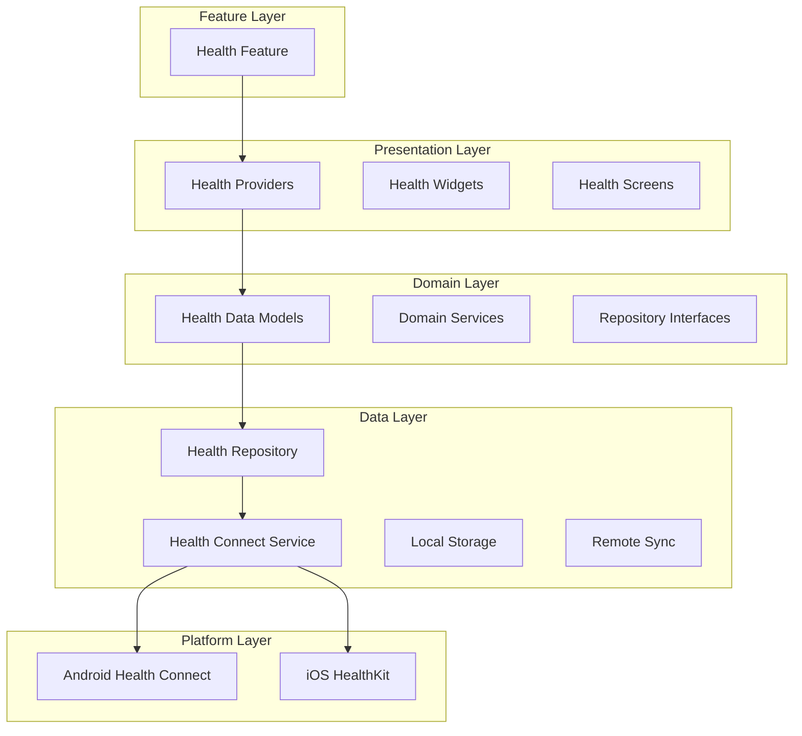
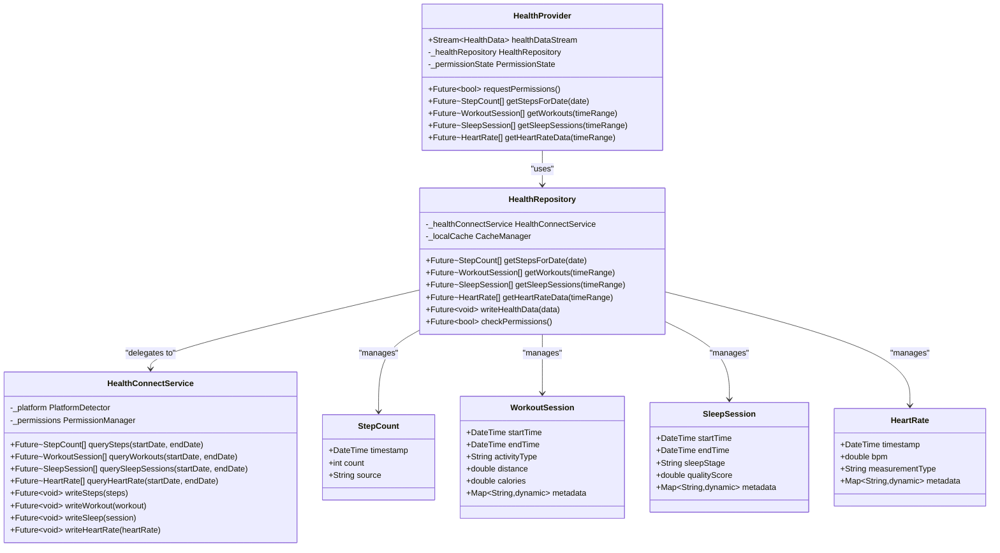
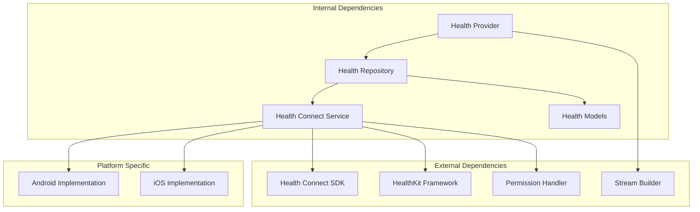

# Health Connect API Integration

<cite>
**Referenced Files in This Document**
- [lib/features/health/data/services/health_connect_service.dart](file://lib/features/health/data/services/health_connect_service.dart)
- [lib/features/health/data/repositories/health_repository.dart](file://lib/features/health/data/repositories/health_repository.dart)
- [lib/features/health/domain/models/health_data_model.dart](file://lib/features/health/domain/models/health_data_model.dart)
- [lib/features/health/presentation/providers/health_provider.dart](file://lib/features/health/presentation/providers/health_provider.dart)
- [android/app/src/main/AndroidManifest.xml](file://android/app/src/main/AndroidManifest.xml)
- [ios/Runner/Info.plist](file://ios/Runner/Info.plist)
- [pubspec.yaml](file://pubspec.yaml)
</cite>

## Table of Contents
1. [Introduction](#introduction)
2. [Project Structure](#project-structure)
3. [Core Components](#core-components)
4. [Architecture Overview](#architecture-overview)
5. [Detailed Component Analysis](#detailed-component-analysis)
6. [Dependency Analysis](#dependency-analysis)
7. [Performance Considerations](#performance-considerations)
8. [Troubleshooting Guide](#troubleshooting-guide)
9. [Conclusion](#conclusion)
10. [Appendices](#appendices)

## Introduction

This document provides comprehensive documentation for implementing Health Connect API integration in the Emerge application. The integration enables seamless collection and management of health data including fitness activities, sleep patterns, heart rate monitoring, and wellness metrics across Android (Health Connect) and iOS (HealthKit) platforms.

The implementation follows a clean architecture pattern with clear separation of concerns between presentation, domain, and data layers, ensuring maintainability and testability while providing a unified interface for health data operations.

## Project Structure

The health data integration is organized within the feature-based architecture of the Emerge application:

**Diagram sources**
- [lib/features/health/presentation/providers/health_provider.dart](file://lib/features/health/presentation/providers/health_provider.dart)
- [lib/features/health/domain/models/health_data_model.dart](file://lib/features/health/domain/models/health_data_model.dart)
- [lib/features/health/data/repositories/health_repository.dart](file://lib/features/health/data/repositories/health_repository.dart)
- [lib/features/health/data/services/health_connect_service.dart](file://lib/features/health/data/services/health_connect_service.dart)

**Section sources**
- [lib/features/health/presentation/providers/health_provider.dart](file://lib/features/health/presentation/providers/health_provider.dart)
- [lib/features/health/domain/models/health_data_model.dart](file://lib/features/health/domain/models/health_data_model.dart)
- [lib/features/health/data/repositories/health_repository.dart](file://lib/features/health/data/repositories/health_repository.dart)
- [lib/features/health/data/services/health_connect_service.dart](file://lib/features/health/data/services/health_connect_service.dart)

## Core Components

The Health Connect integration consists of several core components working together to provide a seamless health data experience:

### Health Data Models
The domain models define the structure for various health data types including steps, workouts, sleep sessions, heart rate measurements, and custom wellness metrics. These models ensure type safety and consistency across the application.

### Health Repository
The repository layer abstracts the complexity of platform-specific health data APIs, providing a unified interface for reading and writing health data. It handles data transformation, caching, and synchronization strategies.

### Health Connect Service
The service layer manages platform-specific implementations for Android Health Connect and iOS HealthKit, handling permissions, data queries, and write operations.

### Presentation Layer
The presentation layer includes providers that manage state and UI components that display health data insights and allow user interaction with health features.

**Section sources**
- [lib/features/health/domain/models/health_data_model.dart](file://lib/features/health/domain/models/health_data_model.dart)
- [lib/features/health/data/repositories/health_repository.dart](file://lib/features/health/data/repositories/health_repository.dart)
- [lib/features/health/data/services/health_connect_service.dart](file://lib/features/health/data/services/health_connect_service.dart)
- [lib/features/health/presentation/providers/health_provider.dart](file://lib/features/health/presentation/providers/health_provider.dart)

## Architecture Overview

The Health Connect integration follows a layered architecture pattern that ensures separation of concerns and maintainability:

**Diagram sources**
- [lib/features/health/presentation/providers/health_provider.dart](file://lib/features/health/presentation/providers/health_provider.dart)
- [lib/features/health/data/repositories/health_repository.dart](file://lib/features/health/data/repositories/health_repository.dart)
- [lib/features/health/data/services/health_connect_service.dart](file://lib/features/health/data/services/health_connect_service.dart)
- [lib/features/health/domain/models/health_data_model.dart](file://lib/features/health/domain/models/health_data_model.dart)

## Detailed Component Analysis

### Health Provider Analysis

The Health Provider serves as the main entry point for the presentation layer, managing state and exposing streams for real-time health data updates.

#### Key Responsibilities:
- Managing permission states and requesting necessary permissions
- Exposing streams for health data changes
- Handling UI state management for health features
- Coordinating between multiple health data sources

#### Implementation Patterns:
- Uses ChangeNotifier for reactive state management
- Implements stream controllers for real-time data updates
- Handles error states and loading indicators
- Manages lifecycle events for background processing

**Section sources**
- [lib/features/health/presentation/providers/health_provider.dart](file://lib/features/health/presentation/providers/health_provider.dart)

### Health Repository Analysis

The Health Repository abstracts the complexity of health data operations and provides a clean interface for the domain layer.

#### Core Methods:
- Data retrieval methods for different health metrics
- Write operations for health data
- Permission checking and management
- Caching and synchronization logic

#### Error Handling Strategy:
- Graceful degradation when permissions are denied
- Fallback to cached data when offline
- Comprehensive error logging and reporting
- User-friendly error messages

**Section sources**
- [lib/features/health/data/repositories/health_repository.dart](file://lib/features/health/data/repositories/health_repository.dart)

### Health Connect Service Analysis

The Health Connect Service handles platform-specific implementations for Android Health Connect and iOS HealthKit.

#### Platform-Specific Features:
- Android: Health Connect API integration with proper permission handling
- iOS: HealthKit framework integration with privacy controls
- Cross-platform abstraction for unified API
- Background processing support

#### Data Query Patterns:
- Efficient batch querying for large datasets
- Time-based filtering and aggregation
- Real-time subscription support where available
- Optimized query construction for performance

**Section sources**
- [lib/features/health/data/services/health_connect_service.dart](file://lib/features/health/data/services/health_connect_service.dart)

### Data Models Analysis

The health data models define the structure for all supported health metrics and ensure type safety throughout the application.

#### Supported Data Types:
- **Step Count**: Daily step counts with timestamps and source information
- **Workout Sessions**: Complete workout data including duration, type, and metrics
- **Sleep Sessions**: Sleep patterns with stages and quality metrics
- **Heart Rate**: Continuous or spot measurements with context
- **Custom Wellness Metrics**: Extensible framework for additional health data

#### Data Transformation:
- Platform-specific data normalization
- Unit conversion and standardization
- Metadata preservation and enrichment
- Validation and sanitization

**Section sources**
- [lib/features/health/domain/models/health_data_model.dart](file://lib/features/health/domain/models/health_data_model.dart)

## Dependency Analysis

The health integration has well-defined dependencies that ensure loose coupling and high cohesion:

**Diagram sources**
- [lib/features/health/presentation/providers/health_provider.dart](file://lib/features/health/presentation/providers/health_provider.dart)
- [lib/features/health/data/repositories/health_repository.dart](file://lib/features/health/data/repositories/health_repository.dart)
- [lib/features/health/data/services/health_connect_service.dart](file://lib/features/health/data/services/health_connect_service.dart)

**Section sources**
- [pubspec.yaml](file://pubspec.yaml)
- [lib/features/health/presentation/providers/health_provider.dart](file://lib/features/health/presentation/providers/health_provider.dart)
- [lib/features/health/data/repositories/health_repository.dart](file://lib/features/health/data/repositories/health_repository.dart)
- [lib/features/health/data/services/health_connect_service.dart](file://lib/features/health/data/services/health_connect_service.dart)

## Performance Considerations

### Query Optimization
- Implement efficient time-range queries to minimize data transfer
- Use pagination for large datasets to prevent memory issues
- Cache frequently accessed data locally to reduce API calls
- Batch multiple queries when possible to improve efficiency

### Memory Management
- Implement proper disposal of streams and subscriptions
- Use weak references for large data objects
- Clear caches appropriately to prevent memory leaks
- Monitor memory usage during long-running operations

### Battery Optimization
- Schedule background syncs during optimal times
- Use efficient polling intervals for real-time data
- Implement adaptive refresh rates based on device state
- Minimize network requests through intelligent caching

### Data Synchronization
- Implement conflict resolution strategies for concurrent updates
- Use incremental sync to minimize data transfer
- Handle network failures gracefully with retry logic
- Maintain data consistency across devices

## Troubleshooting Guide

### Common Issues and Solutions

#### Permission Denied Errors
- Verify app permissions are properly declared in manifest files
- Check runtime permission requests are implemented correctly
- Handle permission denial gracefully with user guidance
- Test permission flows on different Android/iOS versions

#### Data Not Showing Up
- Verify Health Connect/HealthKit is properly configured
- Check data synchronization status and background processing
- Ensure proper date range queries and timezone handling
- Validate data format and required fields

#### Performance Issues
- Monitor query execution times and optimize slow queries
- Implement proper caching strategies for frequently accessed data
- Use appropriate data structures for efficient lookups
- Profile memory usage during health data operations

#### Platform-Specific Issues
- Test thoroughly on both Android and iOS platforms
- Handle platform differences in data availability and formats
- Implement fallback mechanisms for missing data sources
- Follow platform-specific best practices and guidelines

**Section sources**
- [android/app/src/main/AndroidManifest.xml](file://android/app/src/main/AndroidManifest.xml)
- [ios/Runner/Info.plist](file://ios/Runner/Info.plist)

## Conclusion

The Health Connect API integration in the Emerge application provides a robust, scalable, and user-friendly solution for health data management across Android and iOS platforms. The implementation follows clean architecture principles with clear separation of concerns, making it maintainable and testable.

Key strengths of the implementation include:
- Comprehensive coverage of health data types and metrics
- Platform-specific optimizations for Android Health Connect and iOS HealthKit
- Robust error handling and user experience considerations
- Efficient data synchronization and caching strategies
- Extensible architecture supporting future health data types

The modular design allows for easy addition of new health metrics and platforms while maintaining consistency and reliability across the application.

## Appendices

### A. Supported Health Data Types

| Data Type | Description | Android Support | iOS Support | Read | Write |
|-----------|-------------|-----------------|-------------|------|-------|
| Steps | Daily step count | ✅ Full | ✅ Full | ✅ | ❌ |
| Workouts | Exercise sessions | ✅ Full | ✅ Full | ✅ | ✅ |
| Sleep | Sleep patterns | ✅ Full | ✅ Full | ✅ | ✅ |
| Heart Rate | BPM measurements | ✅ Full | ✅ Full | ✅ | ✅ |
| Weight | Body weight | ✅ Full | ✅ Full | ✅ | ✅ |
| Height | Body height | ✅ Full | ✅ Full | ✅ | ✅ |
| Calories | Calorie expenditure | ✅ Full | ✅ Full | ✅ | ✅ |
| Blood Pressure | BP measurements | ✅ Limited | ✅ Limited | ✅ | ✅ |

### B. Platform Configuration

#### Android Configuration
- Minimum SDK: 31 (Android 12+)
- Health Connect dependency version
- Required permissions in manifest
- ProGuard rules for obfuscation

#### iOS Configuration
- Minimum deployment target: iOS 13.0+
- HealthKit entitlement configuration
- Privacy descriptions in Info.plist
- Background mode setup

### C. Testing Strategies

#### Unit Testing
- Mock platform-specific health services
- Test data transformation logic
- Verify permission handling flows
- Test error scenarios and edge cases

#### Integration Testing
- Test with actual Health Connect/HealthKit APIs
- Verify data synchronization accuracy
- Test permission flows on real devices
- Validate cross-platform data consistency

### D. Security Considerations

- Implement proper data encryption for sensitive health information
- Follow platform-specific security guidelines
- Handle user consent and privacy preferences
- Secure data transmission over networks
- Implement proper authentication and authorization