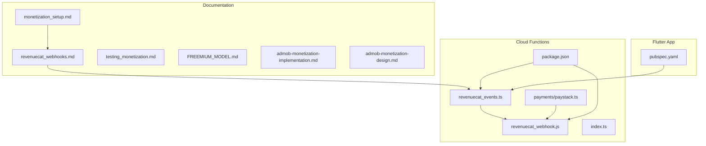
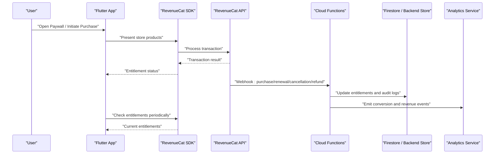
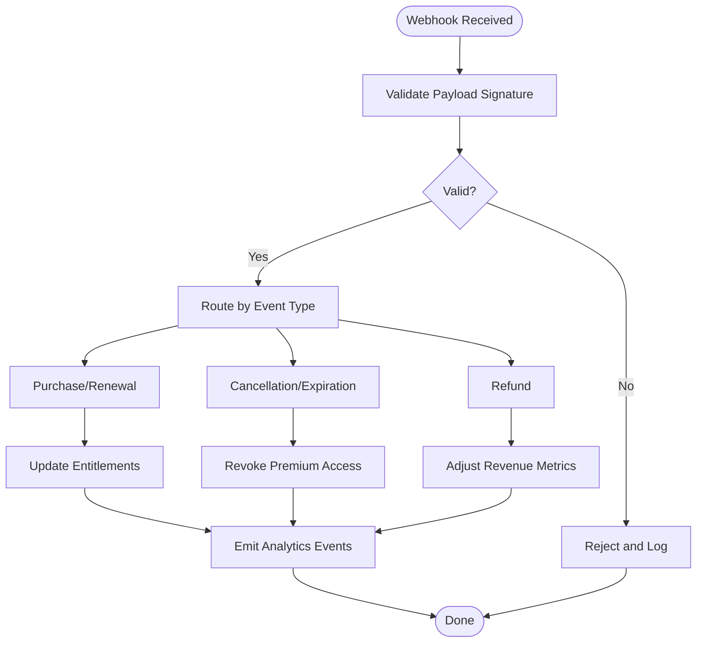
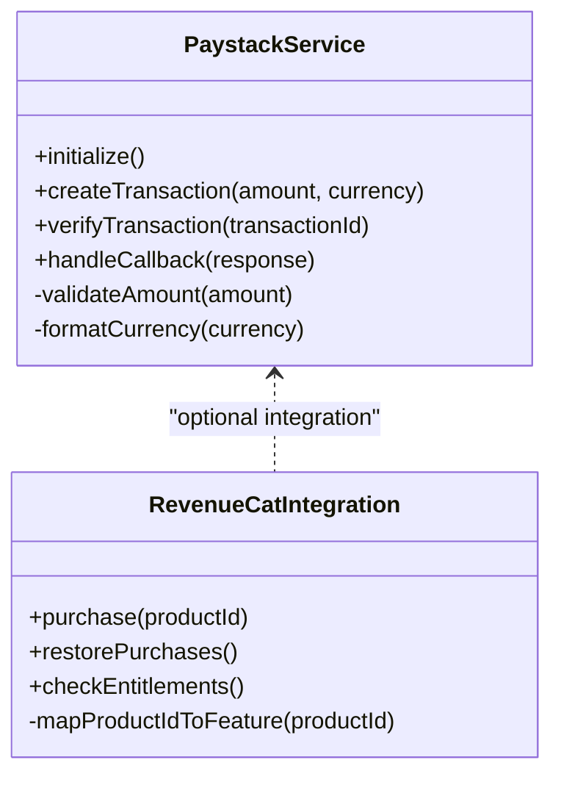
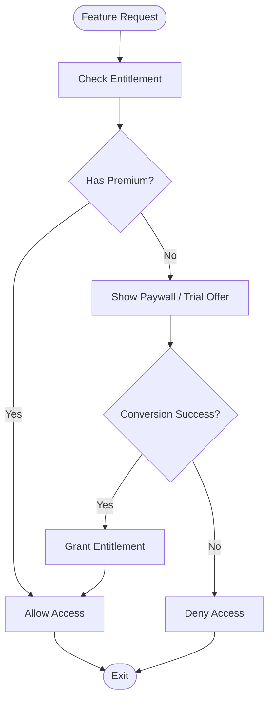
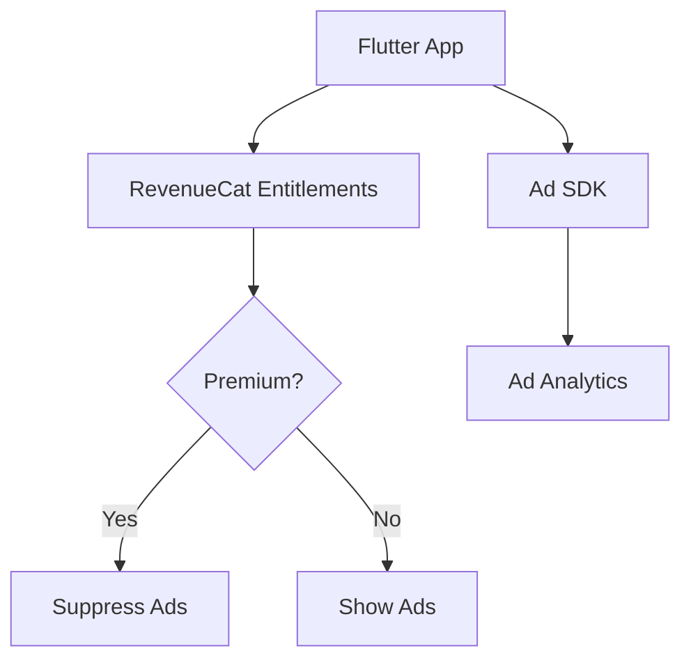
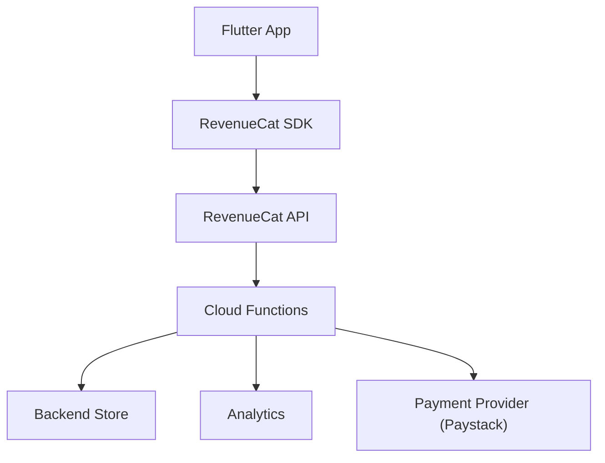

# Monetization & Subscription System

<cite>
**Referenced Files in This Document**
- [monetization_setup.md](file://docs/monetization_setup.md)
- [revenuecat_webhooks.md](file://docs/revenuecat_webhooks.md)
- [testing_monetization.md](file://docs/testing_monetization.md)
- [FREEMIUM_MODEL.md](file://docs/FREEMIUM_MODEL.md)
- [admob-monetization-implementation.md](file://docs/superpowers/plans/2026-05-05-admob-monetization-implementation.md)
- [admob-monetization-design.md](file://docs/superpowers/specs/2026-05-05-admob-monetization-design.md)
- [revenuecat_events.ts](file://functions/src/revenuecat_events.ts)
- [revenuecat_webhook.js](file://functions/lib/revenuecat_webhook.js)
- [revenuecat_webhook.js.map](file://functions/lib/revenuecat_webhook.js.map)
- [revenuecat_events.js](file://functions/lib/revenuecat_events.js)
- [paystack.ts](file://functions/src/payments/paystack.ts)
- [paystack.test.ts](file://functions/test/paystack.test.ts)
- [index.ts](file://functions/src/index.ts)
- [package.json](file://functions/package.json)
- [pubspec.yaml](file://pubspec.yaml)
- [PRIVACY_POLICY.md](file://docs/legal/PRIVACY_POLICY.md)
- [TERMS_OF_SERVICE.md](file://docs/legal/TERMS_OF_SERVICE.md)
</cite>

## Table of Contents
1. [Introduction](#introduction)
2. [Project Structure](#project-structure)
3. [Core Components](#core-components)
4. [Architecture Overview](#architecture-overview)
5. [Detailed Component Analysis](#detailed-component-analysis)
6. [Dependency Analysis](#dependency-analysis)
7. [Performance Considerations](#performance-considerations)
8. [Troubleshooting Guide](#troubleshooting-guide)
9. [Conclusion](#conclusion)
10. [Appendices](#appendices)

## Introduction
This document explains the monetization system for the application, focusing on subscription management, paywall implementation, and revenue tracking. It covers RevenueCat integration for subscriptions, entitlements, and cross-platform purchase verification; the paywall system with A/B testing and conversion optimization; premium feature gating; trials and promotions; webhook handling for subscription events; payment processing; and analytics. It also addresses legal compliance, refund handling, and international pricing considerations.

## Project Structure
The monetization system spans documentation, cloud functions, and platform configuration:
- Documentation outlines setup, webhooks, testing strategies, freemium model, and ad-based monetization plans.
- Cloud Functions implement RevenueCat webhook handlers and event processors, plus optional payment integrations (e.g., Paystack).
- Flutter project configuration includes dependencies and app-level settings relevant to monetization.

**Diagram sources**
- [monetization_setup.md](file://docs/monetization_setup.md)
- [revenuecat_webhooks.md](file://docs/revenuecat_webhooks.md)
- [testing_monetization.md](file://docs/testing_monetization.md)
- [FREEMIUM_MODEL.md](file://docs/FREEMIUM_MODEL.md)
- [admob-monetization-implementation.md](file://docs/superpowers/plans/2026-05-05-admob-monetization-implementation.md)
- [admob-monetization-design.md](file://docs/superpowers/specs/2026-05-05-admob-monetization-design.md)
- [revenuecat_events.ts](file://functions/src/revenuecat_events.ts)
- [revenuecat_webhook.js](file://functions/lib/revenuecat_webhook.js)
- [paystack.ts](file://functions/src/payments/paystack.ts)
- [package.json](file://functions/package.json)
- [index.ts](file://functions/src/index.ts)
- [pubspec.yaml](file://pubspec.yaml)

**Section sources**
- [monetization_setup.md](file://docs/monetization_setup.md)
- [revenuecat_webhooks.md](file://docs/revenuecat_webhooks.md)
- [testing_monetization.md](file://docs/testing_monetization.md)
- [FREEMIUM_MODEL.md](file://docs/FREEMIUM_MODEL.md)
- [admob-monetization-implementation.md](file://docs/superpowers/plans/2026-05-05-admob-monetization-implementation.md)
- [admob-monetization-design.md](file://docs/superpowers/specs/2026-05-05-admob-monetization-design.md)
- [revenuecat_events.ts](file://functions/src/revenuecat_events.ts)
- [revenuecat_webhook.js](file://functions/lib/revenuecat_webhook.js)
- [paystack.ts](file://functions/src/payments/paystack.ts)
- [package.json](file://functions/package.json)
- [index.ts](file://functions/src/index.ts)
- [pubspec.yaml](file://pubspec.yaml)

## Core Components
- RevenueCat Integration: Handles subscription lifecycle, entitlement checks, and cross-platform purchase verification via cloud functions and documentation.
- Webhook Processing: Receives and processes RevenueCat events to update user entitlements and trigger downstream actions.
- Payment Processing: Optional integrations such as Paystack for regional payments.
- Freemium Model: Defines free vs premium features and gating logic.
- Ad Monetization: Plans and specs for integrating ads alongside subscriptions.

Key responsibilities:
- Subscription management: creation, renewal, cancellation, and expiration.
- Entitlement management: mapping purchases to feature access.
- Conversion tracking: measuring paywall interactions and outcomes.
- Compliance: privacy, terms, refunds, and international pricing.

**Section sources**
- [monetization_setup.md](file://docs/monetization_setup.md)
- [revenuecat_webhooks.md](file://docs/revenuecat_webhooks.md)
- [FREEMIUM_MODEL.md](file://docs/FREEMIUM_MODEL.md)
- [admob-monetization-implementation.md](file://docs/superpowers/plans/2026-05-05-admob-monetization-implementation.md)
- [admob-monetization-design.md](file://docs/superpowers/specs/2026-05-05-admob-monetization-design.md)

## Architecture Overview
The monetization architecture integrates the Flutter app, RevenueCat SDK, and backend cloud functions:
- The app uses RevenueCat to manage purchases and entitlements.
- RevenueCat sends webhooks to cloud functions for event processing.
- Cloud functions update entitlements, handle refunds, and emit analytics events.
- Optional payment providers (e.g., Paystack) can be integrated for specific regions or flows.

**Diagram sources**
- [revenuecat_webhooks.md](file://docs/revenuecat_webhooks.md)
- [revenuecat_events.ts](file://functions/src/revenuecat_events.ts)
- [revenuecat_webhook.js](file://functions/lib/revenuecat_webhook.js)
- [paystack.ts](file://functions/src/payments/paystack.ts)
- [package.json](file://functions/package.json)
- [index.ts](file://functions/src/index.ts)

## Detailed Component Analysis

### RevenueCat Webhook Handler
Responsibilities:
- Validate incoming webhook payloads from RevenueCat.
- Map events (purchases, renewals, cancellations, expirations, refunds) to internal entitlement updates.
- Emit analytics events for conversion and revenue tracking.
- Handle edge cases like duplicate events and retry logic.

Implementation highlights:
- Event routing based on webhook type.
- Idempotency checks to prevent duplicate processing.
- Error logging and alerting for failed operations.

**Diagram sources**
- [revenuecat_webhook.js](file://functions/lib/revenuecat_webhook.js)
- [revenuecat_events.ts](file://functions/src/revenuecat_events.ts)

**Section sources**
- [revenuecat_webhooks.md](file://docs/revenuecat_webhooks.md)
- [revenuecat_events.ts](file://functions/src/revenuecat_events.ts)
- [revenuecat_webhook.js](file://functions/lib/revenuecat_webhook.js)

### Payment Processing (Paystack)
Responsibilities:
- Provide an alternative payment flow for specific regions or use cases.
- Integrate with RevenueCat where applicable or maintain parallel billing.
- Ensure secure handling of payment data and compliance with local regulations.

Implementation highlights:
- Encapsulated payment service interface.
- Test coverage for payment flows and error scenarios.

**Diagram sources**
- [paystack.ts](file://functions/src/payments/paystack.ts)
- [paystack.test.ts](file://functions/test/paystack.test.ts)

**Section sources**
- [paystack.ts](file://functions/src/payments/paystack.ts)
- [paystack.test.ts](file://functions/test/paystack.test.ts)

### Freemium Model and Feature Gating
Responsibilities:
- Define free vs premium features.
- Gate premium functionality behind entitlement checks.
- Support trials and promotional offers.

Implementation highlights:
- Clear separation between free and premium feature sets.
- Entitlement-driven access control in the app layer.

**Diagram sources**
- [FREEMIUM_MODEL.md](file://docs/FREEMIUM_MODEL.md)

**Section sources**
- [FREEMIUM_MODEL.md](file://docs/FREEMIUM_MODEL.md)

### Ad Monetization Integration
Responsibilities:
- Implement ad placements alongside subscriptions.
- Respect user preferences and premium status.
- Optimize ad frequency and placement for conversion.

Implementation highlights:
- Design specs outline ad types, placement strategies, and premium exemptions.
- Implementation plan details integration steps and testing.

**Diagram sources**
- [admob-monetization-design.md](file://docs/superpowers/specs/2026-05-05-admob-monetization-design.md)
- [admob-monetization-implementation.md](file://docs/superpowers/plans/2026-05-05-admob-monetization-implementation.md)

**Section sources**
- [admob-monetization-design.md](file://docs/superpowers/specs/2026-05-05-admob-monetization-design.md)
- [admob-monetization-implementation.md](file://docs/superpowers/plans/2026-05-05-admob-monetization-implementation.md)

## Dependency Analysis
Key dependencies:
- Flutter app depends on RevenueCat SDK for purchases and entitlements.
- Cloud functions depend on RevenueCat webhooks and may integrate with payment providers.
- Package configurations define runtime dependencies for functions and app.

**Diagram sources**
- [pubspec.yaml](file://pubspec.yaml)
- [package.json](file://functions/package.json)
- [index.ts](file://functions/src/index.ts)

**Section sources**
- [pubspec.yaml](file://pubspec.yaml)
- [package.json](file://functions/package.json)
- [index.ts](file://functions/src/index.ts)

## Performance Considerations
- Minimize network calls by caching entitlements locally and refreshing on app launch or background sync.
- Use idempotent webhook processing to avoid redundant computations.
- Batch analytics events to reduce overhead.
- Implement retry mechanisms with exponential backoff for transient failures.
- Profile ad loading and ensure premium users are exempt to improve UX.

[No sources needed since this section provides general guidance]

## Troubleshooting Guide
Common issues and resolutions:
- Webhook validation failures: verify signature and payload format.
- Duplicate event processing: implement idempotency keys and deduplication.
- Entitlement mismatches: reconcile RevenueCat state with backend records.
- Payment provider errors: log detailed error messages and retry safely.
- Analytics gaps: ensure events are emitted consistently across flows.

Operational tips:
- Monitor webhook success rates and latency.
- Set up alerts for critical failures (e.g., entitlement updates failing).
- Maintain audit logs for all monetization-related actions.

**Section sources**
- [revenuecat_webhooks.md](file://docs/revenuecat_webhooks.md)
- [testing_monetization.md](file://docs/testing_monetization.md)

## Conclusion
The monetization system combines RevenueCat for robust subscription management, cloud functions for reliable event processing, and clear freemium models for feature gating. With ad monetization options and comprehensive testing strategies, the system supports scalable growth while maintaining compliance and performance. Continuous monitoring and iterative optimization will drive conversion and revenue improvements.

[No sources needed since this section summarizes without analyzing specific files]

## Appendices

### Legal Compliance and International Pricing
- Privacy Policy and Terms of Service must be updated to reflect monetization practices, data handling, and refund policies.
- International pricing should consider local taxes, currency formatting, and regulatory requirements.
- Refund handling should align with platform policies and RevenueCat capabilities.

**Section sources**
- [PRIVACY_POLICY.md](file://docs/legal/PRIVACY_POLICY.md)
- [TERMS_OF_SERVICE.md](file://docs/legal/TERMS_OF_SERVICE.md)