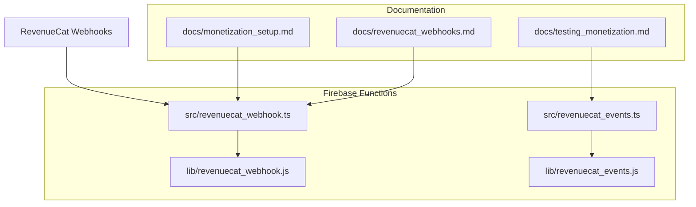
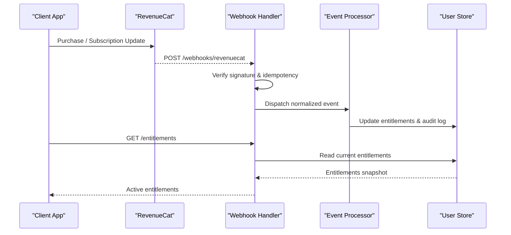
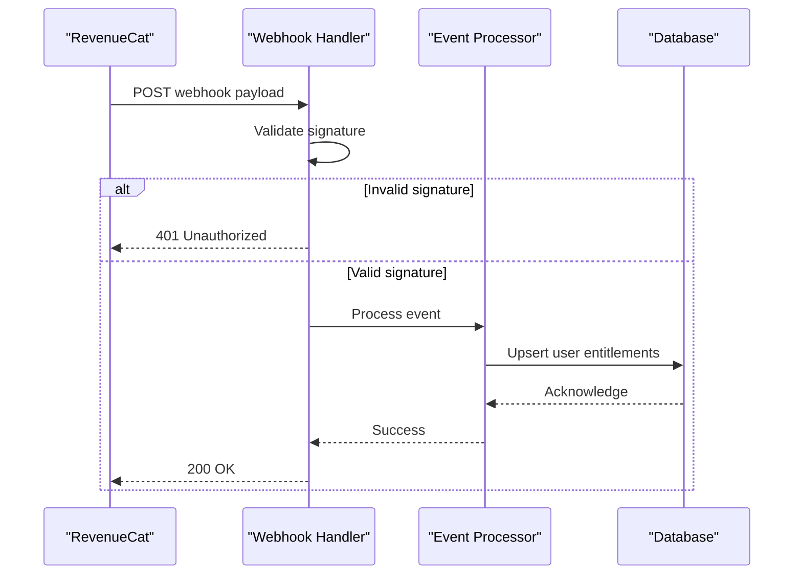
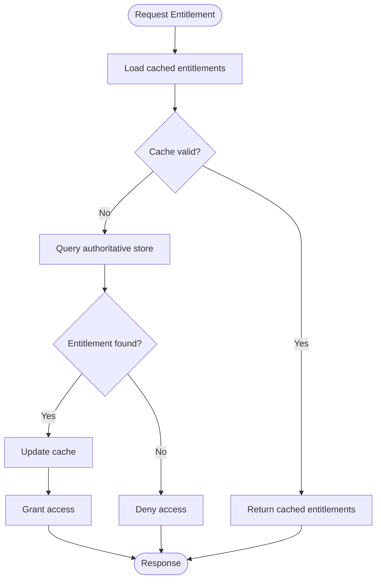
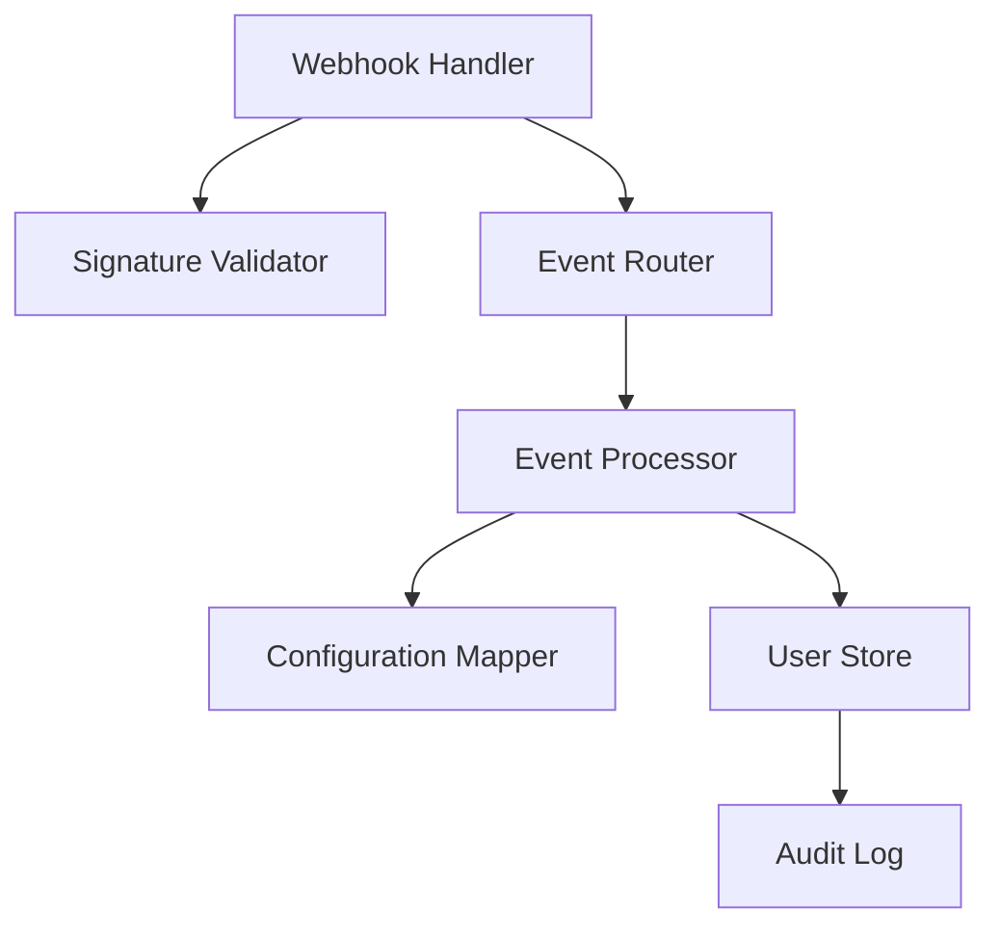

# RevenueCat Integration

<cite>
**Referenced Files in This Document**
- [revenuecat_webhook.js](file://functions/lib/revenuecat_webhook.js)
- [revenuecat_events.js](file://functions/lib/revenuecat_events.js)
- [revenuecat_webhook.ts](file://functions/src/revenuecat_webhook.ts)
- [revenuecat_events.ts](file://functions/src/revenuecat_events.ts)
- [monetization_setup.md](file://docs/monetization_setup.md)
- [revenuecat_webhooks.md](file://docs/revenuecat_webhooks.md)
- [testing_monetization.md](file://docs/testing_monetization.md)
</cite>

## Table of Contents
1. [Introduction](#introduction)
2. [Project Structure](#project-structure)
3. [Core Components](#core-components)
4. [Architecture Overview](#architecture-overview)
5. [Detailed Component Analysis](#detailed-component-analysis)
6. [Dependency Analysis](#dependency-analysis)
7. [Performance Considerations](#performance-considerations)
8. [Troubleshooting Guide](#troubleshooting-guide)
9. [Conclusion](#conclusion)
10. [Appendices](#appendices)

## Introduction
This document explains the RevenueCat integration for subscription management, entitlement checking, and cross-platform purchase verification. It covers webhook handling for new purchases, renewals, cancellations, and refunds; configuration for subscription tiers, trials, and promotions; implementation examples for entitlement checks and state changes; error handling and retry strategies; security considerations including signature verification; and data synchronization between client and server.

## Project Structure
The RevenueCat integration spans Firebase Cloud Functions (TypeScript source with compiled JavaScript), documentation, and tests:
- TypeScript sources under functions/src define the webhook handlers and event processors.
- Compiled outputs under functions/lib are used by the runtime.
- Documentation under docs outlines setup, webhooks, and testing guidance.

**Diagram sources**
- [revenuecat_webhook.ts](file://functions/src/revenuecat_webhook.ts)
- [revenuecat_webhook.js](file://functions/lib/revenuecat_webhook.js)
- [revenuecat_events.ts](file://functions/src/revenuecat_events.ts)
- [revenuecat_events.js](file://functions/lib/revenuecat_events.js)
- [monetization_setup.md](file://docs/monetization_setup.md)
- [revenuecat_webhooks.md](file://docs/revenuecat_webhooks.md)
- [testing_monetization.md](file://docs/testing_monetization.md)

**Section sources**
- [revenuecat_webhook.ts](file://functions/src/revenuecat_webhook.ts)
- [revenuecat_webhook.js](file://functions/lib/revenuecat_webhook.js)
- [revenuecat_events.ts](file://functions/src/revenuecat_events.ts)
- [revenuecat_events.js](file://functions/lib/revenuecat_events.js)
- [monetization_setup.md](file://docs/monetization_setup.md)
- [revenuecat_webhooks.md](file://docs/revenuecat_webhooks.md)
- [testing_monetization.md](file://docs/testing_monetization.md)

## Core Components
- Webhook receiver: Validates incoming RevenueCat webhook requests and routes events to processors.
- Event processor: Normalizes RevenueCat events into internal models and updates user entitlements.
- Entitlement service: Checks active subscriptions and grants access to premium features.
- Configuration module: Manages subscription tiers, trial periods, and promotional offers.

Key responsibilities:
- Signature verification and idempotency for webhook safety.
- Mapping RevenueCat product identifiers to app entitlements.
- Persisting subscription state and syncing with client-side entitlement checks.
- Handling lifecycle events: purchase, renewal, cancellation, expiration, refund, and pricing change.

**Section sources**
- [revenuecat_webhook.ts](file://functions/src/revenuecat_webhook.ts)
- [revenuecat_events.ts](file://functions/src/revenuecat_events.ts)
- [monetization_setup.md](file://docs/monetization_setup.md)
- [revenuecat_webhooks.md](file://docs/revenuecat_webhooks.md)

## Architecture Overview
The system receives webhooks from RevenueCat, validates them, processes events, and updates user entitlements. Clients query entitlements via a secure endpoint or local cache synchronized through the backend.

**Diagram sources**
- [revenuecat_webhook.ts](file://functions/src/revenuecat_webhook.ts)
- [revenuecat_events.ts](file://functions/src/revenuecat_events.ts)

## Detailed Component Analysis

### Webhook Receiver
Responsibilities:
- Accepts RevenueCat webhook payloads.
- Verifies signatures using shared secrets.
- Ensures idempotency by deduplicating events.
- Routes events to the appropriate processor based on event type.

Security:
- Validates request headers and payload integrity.
- Rejects malformed or unsigned requests.

Idempotency:
- Tracks processed event IDs to prevent duplicate processing.

Error handling:
- Returns appropriate HTTP status codes.
- Logs errors with contextual metadata.

**Section sources**
- [revenuecat_webhook.ts](file://functions/src/revenuecat_webhook.ts)
- [revenuecat_webhook.js](file://functions/lib/revenuecat_webhook.js)

### Event Processor
Responsibilities:
- Parses RevenueCat event types (purchase, renewal, cancellation, refund, etc.).
- Maps product identifiers to internal entitlement keys.
- Updates user records with subscription state and timestamps.
- Emits side effects such as granting access or revoking features.

Data mapping:
- Converts platform-specific details (Apple vs Google) into unified models.
- Preserves original event data for auditing.

State transitions:
- Handles grace periods, intro trials, and promotional periods.
- Manages expiration and reactivation flows.

**Section sources**
- [revenuecat_events.ts](file://functions/src/revenuecat_events.ts)
- [revenuecat_events.js](file://functions/lib/revenuecat_events.js)

### Entitlement Checking
Responsibilities:
- Provides an API to check if a user has a specific entitlement.
- Considers active subscriptions, trials, and promotional periods.
- Returns a deterministic result based on persisted state.

Implementation patterns:
- Caches recent entitlement snapshots for performance.
- Falls back to authoritative store when cache is stale.

Access control:
- Gate premium features behind entitlement checks.
- Enforce feature availability at both UI and service layers.

**Section sources**
- [revenuecat_events.ts](file://functions/src/revenuecat_events.ts)
- [monetization_setup.md](file://docs/monetization_setup.md)

### Configuration Management
Responsibilities:
- Defines subscription tiers and their associated entitlements.
- Configures trial durations and promotional offer mappings.
- Supports environment-specific settings (dev, staging, prod).

Configuration items:
- Product ID mappings per platform.
- Trial period lengths and eligibility rules.
- Promotional offer identifiers and discount rules.

**Section sources**
- [monetization_setup.md](file://docs/monetization_setup.md)

### Webhook Flow Sequence

**Diagram sources**
- [revenuecat_webhook.ts](file://functions/src/revenuecat_webhook.ts)
- [revenuecat_events.ts](file://functions/src/revenuecat_events.ts)

### Entitlement Check Flow

**Diagram sources**
- [revenuecat_events.ts](file://functions/src/revenuecat_events.ts)

## Dependency Analysis
The webhook handler depends on validation utilities and event routing logic. The event processor depends on configuration mappings and persistence services. Both components rely on consistent product identifier mappings across platforms.

**Diagram sources**
- [revenuecat_webhook.ts](file://functions/src/revenuecat_webhook.ts)
- [revenuecat_events.ts](file://functions/src/revenuecat_events.ts)

**Section sources**
- [revenuecat_webhook.ts](file://functions/src/revenuecat_webhook.ts)
- [revenuecat_events.ts](file://functions/src/revenuecat_events.ts)

## Performance Considerations
- Use caching for frequent entitlement checks to reduce database load.
- Batch updates where possible to minimize write operations.
- Implement exponential backoff for external API calls.
- Monitor webhook processing latency and error rates.

[No sources needed since this section provides general guidance]

## Troubleshooting Guide
Common issues:
- Signature verification failures due to misconfigured secrets.
- Duplicate processing caused by missing idempotency keys.
- Mismatched product identifiers leading to incorrect entitlement mapping.
- Stale client-side entitlements not reflecting server state.

Debugging steps:
- Inspect webhook logs for payload and signature validation results.
- Verify event idempotency tracking to prevent duplicates.
- Audit entitlement updates for consistency across platforms.
- Sync client entitlements explicitly after critical events.

Retry mechanisms:
- Implement retries for transient network errors with backoff.
- Queue failed events for later processing with dead-letter queues.

**Section sources**
- [revenuecat_webhook.ts](file://functions/src/revenuecat_webhook.ts)
- [revenuecat_events.ts](file://functions/src/revenuecat_events.ts)
- [testing_monetization.md](file://docs/testing_monetization.md)

## Conclusion
The RevenueCat integration provides robust subscription management, entitlement checking, and cross-platform purchase verification. By implementing secure webhook handling, comprehensive event processing, and reliable entitlement checks, the system ensures accurate access control and seamless user experiences. Proper configuration, error handling, and debugging practices are essential for maintaining a stable monetization pipeline.

[No sources needed since this section summarizes without analyzing specific files]

## Appendices

### Security Considerations
- Always verify webhook signatures using shared secrets.
- Enforce HTTPS for all endpoints.
- Limit exposure of sensitive configuration values.
- Regularly rotate secrets and monitor for unauthorized access.

### Data Synchronization
- Ensure client entitlements match server state after each webhook event.
- Provide explicit sync endpoints for clients to refresh entitlements.
- Handle offline scenarios gracefully with local caching and conflict resolution.

**Section sources**
- [revenuecat_webhooks.md](file://docs/revenuecat_webhooks.md)
- [testing_monetization.md](file://docs/testing_monetization.md)