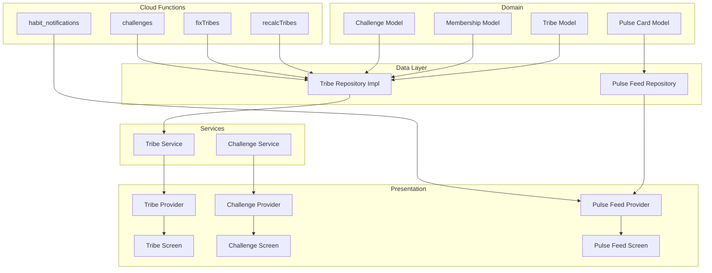
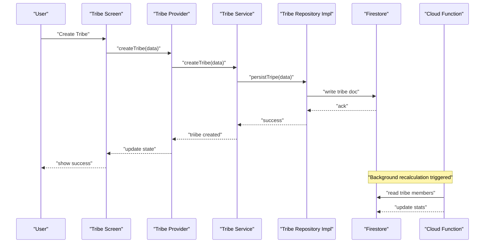
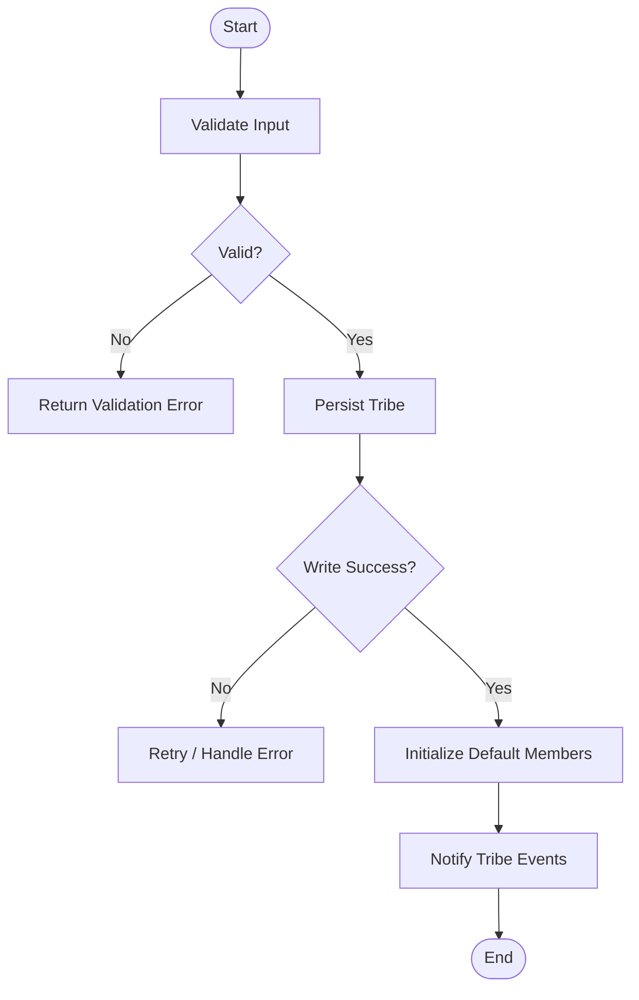
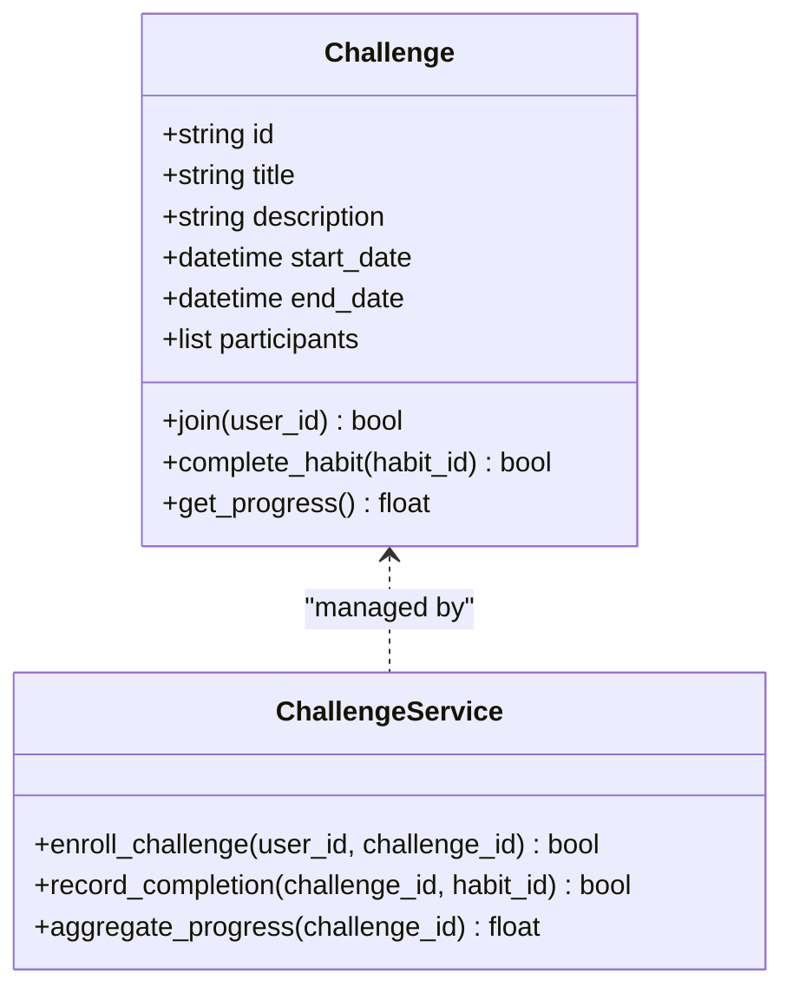
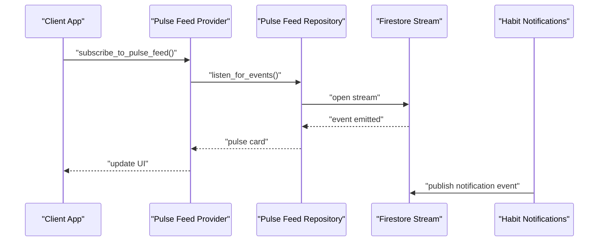
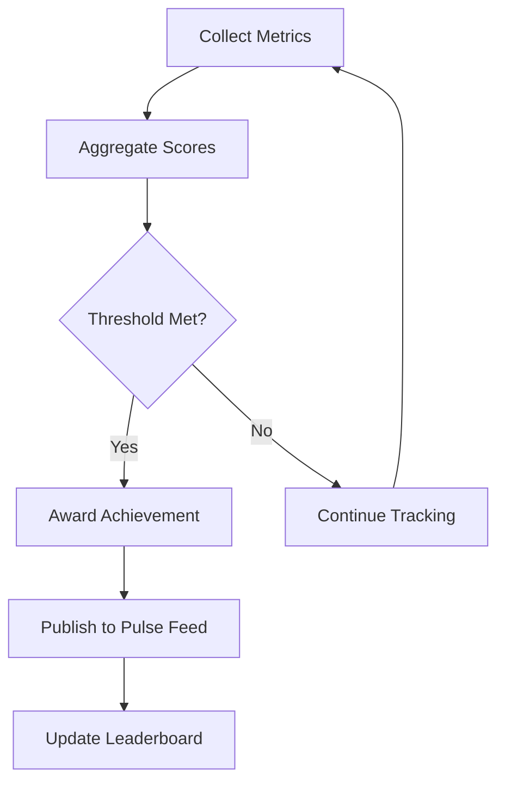
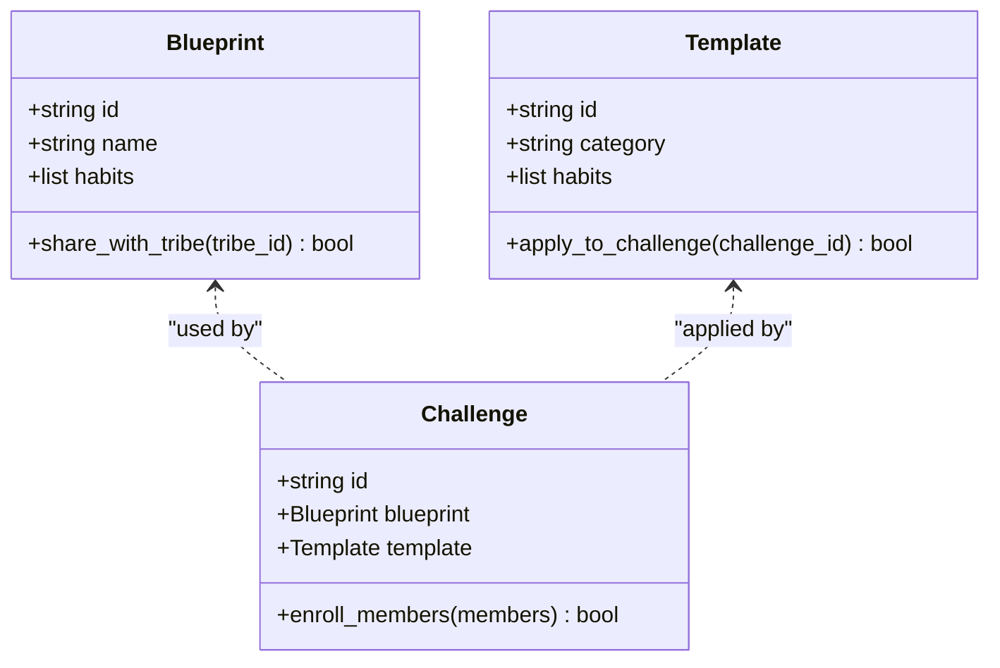
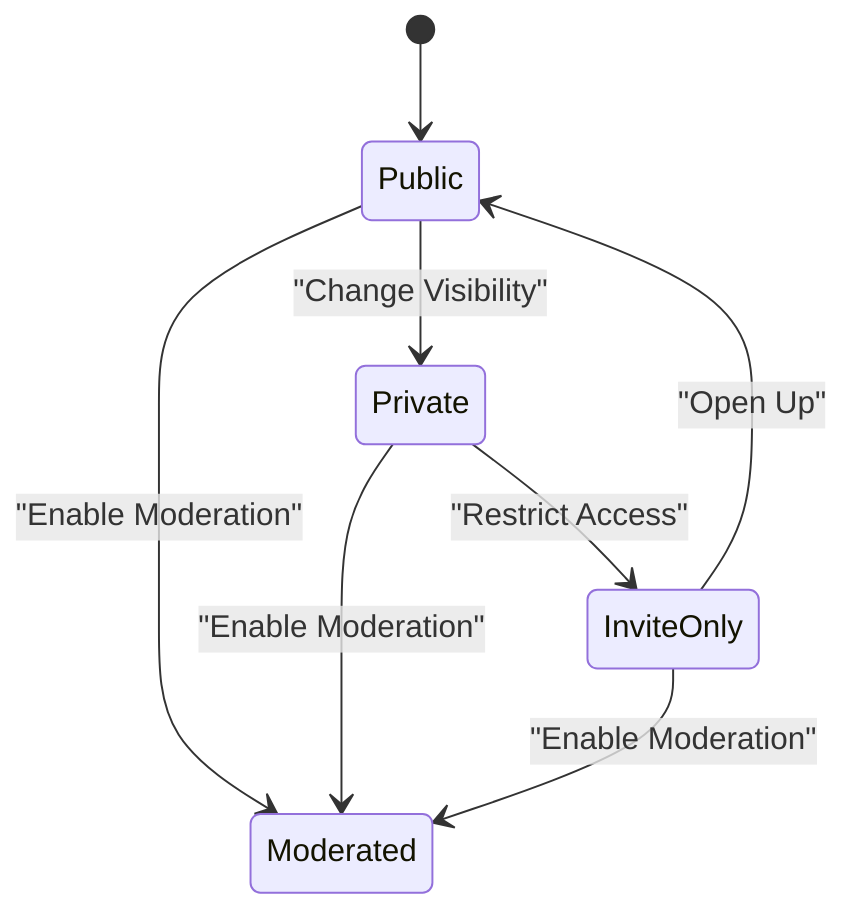
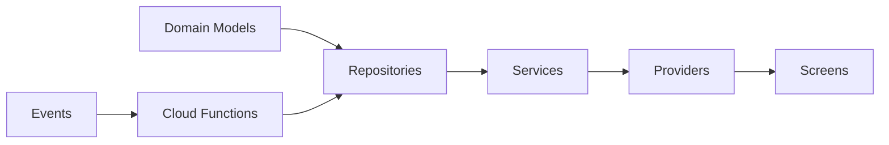

# Social & Tribes System

<cite>
**Referenced Files in This Document**
- [lib/features/social/domain/models/tribe_model.dart](file://lib/features/social/domain/models/tribe_model.dart)
- [lib/features/social/domain/models/membership_model.dart](file://lib/features/social/domain/models/membership_model.dart)
- [lib/features/social/domain/repositories/tribe_repository.dart](file://lib/features/social/domain/repositories/tribe_repository.dart)
- [lib/features/social/data/repositories/tribe_repository_impl.dart](file://lib/features/social/data/repositories/tribe_repository_impl.dart)
- [lib/features/social/domain/services/tribe_service.dart](file://lib/features/social/domain/services/tribe_service.dart)
- [lib/features/social/presentation/providers/tribe_provider.dart](file://lib/features/social/presentation/providers/tribe_provider.dart)
- [lib/features/social/presentation/screens/tribe_screen.dart](file://lib/features/social/presentation/screens/tribe_screen.dart)
- [lib/features/social/domain/models/challenge_model.dart](file://lib/features/social/domain/models/challenge_model.dart)
- [lib/features/social/domain/services/challenge_service.dart](file://lib/features/social/domain/services/challenge_service.dart)
- [lib/features/social/presentation/providers/challenge_provider.dart](file://lib/features/social/presentation/providers/challenge_provider.dart)
- [lib/features/social/presentation/screens/challenge_screen.dart](file://lib/features/social/presentation/screens/challenge_screen.dart)
- [lib/features/pulse_feed/domain/models/pulse_card_model.dart](file://lib/features/pulse_feed/domain/models/pulse_card_model.dart)
- [lib/features/pulse_feed/data/repositories/pulse_feed_repository.dart](file://lib/features/pulse_feed/data/repositories/pulse_feed_repository.dart)
- [lib/features/pulse_feed/presentation/providers/pulse_feed_provider.dart](file://lib/features/pulse_feed/presentation/providers/pulse_feed_provider.dart)
- [lib/features/pulse_feed/presentation/screens/pulse_feed_screen.dart](file://lib/features/pulse_feed/presentation/screens/pulse_feed_screen.dart)
- [functions/src/recalcTribes.ts](file://functions/src/recalcTribes.ts)
- [functions/src/fixTribes.ts](file://functions/src/fixTribes.ts)
- [functions/src/habit_notifications.ts](file://functions/src/habit_notifications.ts)
- [functions/src/challenges.ts](file://functions/src/challenges.ts)
- [firestore.rules](file://firestore.rules)
- [storage.rules](file://storage.rules)
- [docs/plans/2026-07-29-tribe-engagement-loop-closure.md](file://docs/plans/2026-07-29-tribe-engagement-loop-closure.md)
- [docs/plans/2026-07-29-tribe-membership-unified-social-plan.md](file://docs/plans/2026-07-29-tribe-membership-unified-social-plan.md)
- [docs/plans/2026-05-11-real-time-tribe-stats-design.md](file://docs/plans/2026-05-11-real-time-tribe-stats-design.md)
- [docs/plans/2026-06-13-creator-tribes-data-layer.md](file://docs/plans/2026-06-13-creator-tribes-data-layer.md)
- [docs/plans/2026-06-13-creator-tribes-hub.md](file://docs/plans/2026-06-13-creator-tribes-hub.md)
- [docs/plans/2026-06-13-creator-tribes-lobby.md](file://docs/plans/2026-06-13-creator-tribes-lobby.md)
- [docs/plans/2026-06-13-creator-tribes-space.md](file://docs/plans/2026-06-13-creator-tribes-space.md)
</cite>

## Table of Contents
1. [Introduction](#introduction)
2. [Project Structure](#project-structure)
3. [Core Components](#core-components)
4. [Architecture Overview](#architecture-overview)
5. [Detailed Component Analysis](#detailed-component-analysis)
6. [Dependency Analysis](#dependency-analysis)
7. [Performance Considerations](#performance-considerations)
8. [Troubleshooting Guide](#troubleshooting-guide)
9. [Conclusion](#conclusion)
10. [Appendices](#appendices)

## Introduction
This document explains the social features and tribe system, focusing on how users create tribes, manage membership, participate in collaborative habit challenges, and engage through a real-time pulse feed. It also covers leaderboards, achievements sharing, social proof mechanisms, and the creator system for building and sharing habit blueprints, templates, and challenges. Privacy settings, moderation tools, and community guidelines enforcement are addressed to ensure safe and healthy community interactions.

## Project Structure
The social and tribe system is organized by feature layers:
- Domain models define core entities such as Tribe, Membership, Challenge, and PulseCard.
- Repositories abstract data access for tribes, challenges, and pulse feed events.
- Services encapsulate business logic for tribe operations, challenge participation, and notifications.
- Presentation providers and screens expose UI state and user flows for tribe management, challenge participation, and pulse feed consumption.
- Cloud Functions handle background tasks like recalculating tribe stats, fixing inconsistencies, and generating notifications.
- Firestore and Storage rules enforce security and privacy boundaries.

**Diagram sources**
- [lib/features/social/domain/models/tribe_model.dart](file://lib/features/social/domain/models/tribe_model.dart)
- [lib/features/social/domain/models/membership_model.dart](file://lib/features/social/domain/models/membership_model.dart)
- [lib/features/social/domain/models/challenge_model.dart](file://lib/features/social/domain/models/challenge_model.dart)
- [lib/features/pulse_feed/domain/models/pulse_card_model.dart](file://lib/features/pulse_feed/domain/models/pulse_card_model.dart)
- [lib/features/social/data/repositories/tribe_repository_impl.dart](file://lib/features/social/data/repositories/tribe_repository_impl.dart)
- [lib/features/pulse_feed/data/repositories/pulse_feed_repository.dart](file://lib/features/pulse_feed/data/repositories/pulse_feed_repository.dart)
- [lib/features/social/domain/services/tribe_service.dart](file://lib/features/social/domain/services/tribe_service.dart)
- [lib/features/social/domain/services/challenge_service.dart](file://lib/features/social/domain/services/challenge_service.dart)
- [lib/features/social/presentation/providers/tribe_provider.dart](file://lib/features/social/presentation/providers/tribe_provider.dart)
- [lib/features/social/presentation/providers/challenge_provider.dart](file://lib/features/social/presentation/providers/challenge_provider.dart)
- [lib/features/pulse_feed/presentation/providers/pulse_feed_provider.dart](file://lib/features/pulse_feed/presentation/providers/pulse_feed_provider.dart)
- [lib/features/social/presentation/screens/tribe_screen.dart](file://lib/features/social/presentation/screens/tribe_screen.dart)
- [lib/features/social/presentation/screens/challenge_screen.dart](file://lib/features/social/presentation/screens/challenge_screen.dart)
- [lib/features/pulse_feed/presentation/screens/pulse_feed_screen.dart](file://lib/features/pulse/feed/presentation/screens/pulse_feed_screen.dart)
- [functions/src/recalcTribes.ts](file://functions/src/recalcTribes.ts)
- [functions/src/fixTribes.ts](file://functions/src/fixTribes.ts)
- [functions/src/habit_notifications.ts](file://functions/src/habit_notifications.ts)
- [functions/src/challenges.ts](file://functions/src/challenges.ts)

**Section sources**
- [lib/features/social/domain/models/tribe_model.dart](file://lib/features/social/domain/models/tribe_model.dart)
- [lib/features/social/domain/models/membership_model.dart](file://lib/features/social/domain/models/membership_model.dart)
- [lib/features/social/domain/models/challenge_model.dart](file://lib/features/social/domain/models/challenge_model.dart)
- [lib/features/pulse_feed/domain/models/pulse_card_model.dart](file://lib/features/pulse_feed/domain/models/pulse_card_model.dart)
- [lib/features/social/data/repositories/tribe_repository_impl.dart](file://lib/features/social/data/repositories/tribe_repository_impl.dart)
- [lib/features/pulse_feed/data/repositories/pulse_feed_repository.dart](file://lib/features/pulse_feed/data/repositories/pulse_feed_repository.dart)
- [lib/features/social/domain/services/tribe_service.dart](file://lib/features/social/domain/services/tribe_service.dart)
- [lib/features/social/domain/services/challenge_service.dart](file://lib/features/social/domain/services/challenge_service.dart)
- [lib/features/social/presentation/providers/tribe_provider.dart](file://lib/features/social/presentation/providers/tribe_provider.dart)
- [lib/features/social/presentation/providers/challenge_provider.dart](file://lib/features/social/presentation/providers/challenge_provider.dart)
- [lib/features/pulse_feed/presentation/providers/pulse_feed_provider.dart](file://lib/features/pulse_feed/presentation/providers/pulse_feed_provider.dart)
- [lib/features/social/presentation/screens/tribe_screen.dart](file://lib/features/social/presentation/screens/tribe_screen.dart)
- [lib/features/social/presentation/screens/challenge_screen.dart](file://lib/features/social/presentation/screens/challenge_screen.dart)
- [lib/features/pulse_feed/presentation/screens/pulse_feed_screen.dart](file://lib/features/pulse_feed/presentation/screens/pulse_feed_screen.dart)
- [functions/src/recalcTribes.ts](file://functions/src/recalcTribes.ts)
- [functions/src/fixTribes.ts](file://functions/src/fixTribes.ts)
- [functions/src/habit_notifications.ts](file://functions/src/habit_notifications.ts)
- [functions/src/challenges.ts](file://functions/src/challenges.ts)

## Core Components
- Tribe model defines tribe identity, metadata, and visibility settings.
- Membership model captures user roles, join status, and permissions within a tribe.
- Challenge model represents collaborative habit challenges with goals, timelines, and participant tracking.
- Pulse card model structures activity events for real-time updates across the community.
- Tribe repository abstraction and implementation provide CRUD operations and queries for tribe data.
- Tribe service orchestrates tribe creation, membership changes, and governance actions.
- Challenge service manages challenge lifecycle, enrollment, and progress aggregation.
- Providers expose reactive state for UI components (tribe, challenge, pulse feed).
- Screens implement user workflows for tribe management, challenge participation, and pulse feed consumption.
- Cloud Functions perform background computations and notifications.

**Section sources**
- [lib/features/social/domain/models/tribe_model.dart](file://lib/features/social/domain/models/tribe_model.dart)
- [lib/features/social/domain/models/membership_model.dart](file://lib/features/social/domain/models/membership_model.dart)
- [lib/features/social/domain/models/challenge_model.dart](file://lib/features/social/domain/models/challenge_model.dart)
- [lib/features/pulse_feed/domain/models/pulse_card_model.dart](file://lib/features/pulse_feed/domain/models/pulse_card_model.dart)
- [lib/features/social/domain/repositories/tribe_repository.dart](file://lib/features/social/domain/repositories/tribe_repository.dart)
- [lib/features/social/data/repositories/tribe_repository_impl.dart](file://lib/features/social/data/repositories/tribe_repository_impl.dart)
- [lib/features/social/domain/services/tribe_service.dart](file://lib/features/social/domain/services/tribe_service.dart)
- [lib/features/social/domain/services/challenge_service.dart](file://lib/features/social/domain/services/challenge_service.dart)
- [lib/features/social/presentation/providers/tribe_provider.dart](file://lib/features/social/presentation/providers/tribe_provider.dart)
- [lib/features/social/presentation/providers/challenge_provider.dart](file://lib/features/social/presentation/providers/challenge_provider.dart)
- [lib/features/pulse_feed/presentation/providers/pulse_feed_provider.dart](file://lib/features/pulse_feed/presentation/providers/pulse_feed_provider.dart)
- [lib/features/social/presentation/screens/tribe_screen.dart](file://lib/features/social/presentation/screens/tribe_screen.dart)
- [lib/features/social/presentation/screens/challenge_screen.dart](file://lib/features/social/presentation/screens/challenge_screen.dart)
- [lib/features/pulse_feed/presentation/screens/pulse_feed_screen.dart](file://lib/features/pulse_feed/presentation/screens/pulse_feed_screen.dart)

## Architecture Overview
The social and tribe system follows a layered architecture:
- Domain layer defines immutable models and contracts.
- Data layer implements repositories that interact with local storage and remote services.
- Services coordinate domain logic and cross-cutting concerns like validation and permissions.
- Presentation layer uses providers to reactively update UI based on state changes.
- Cloud Functions run server-side tasks triggered by events or schedules.

**Diagram sources**
- [lib/features/social/presentation/screens/tribe_screen.dart](file://lib/features/social/presentation/screens/tribe_screen.dart)
- [lib/features/social/presentation/providers/tribe_provider.dart](file://lib/features/social/presentation/providers/tribe_provider.dart)
- [lib/features/social/domain/services/tribe_service.dart](file://lib/features/social/domain/services/tribe_service.dart)
- [lib/features/social/data/repositories/tribe_repository_impl.dart](file://lib/features/social/data/repositories/tribe_repository_impl.dart)
- [functions/src/recalcTribes.ts](file://functions/src/recalcTribes.ts)

## Detailed Component Analysis

### Tribe Creation and Membership Management
- Tribe creation involves validating inputs, persisting tribe metadata, and initializing default settings.
- Membership management supports inviting users, accepting/denying requests, role assignment, and revocation.
- Governance actions include updating tribe rules, visibility, and moderation policies.

**Diagram sources**
- [lib/features/social/domain/services/tribe_service.dart](file://lib/features/social/domain/services/tribe_service.dart)
- [lib/features/social/data/repositories/tribe_repository_impl.dart](file://lib/features/social/data/repositories/tribe_repository_impl.dart)

**Section sources**
- [lib/features/social/domain/services/tribe_service.dart](file://lib/features/social/domain/services/tribe_service.dart)
- [lib/features/social/data/repositories/tribe_repository_impl.dart](file://lib/features/social/data/repositories/tribe_repository_impl.dart)
- [lib/features/social/presentation/providers/tribe_provider.dart](file://lib/features/social/presentation/providers/tribe_provider.dart)
- [lib/features/social/presentation/screens/tribe_screen.dart](file://lib/features/social/presentation/screens/tribe_screen.dart)

### Collaborative Habit Challenges
- Challenges define shared goals, timelines, and participant milestones.
- Enrollment allows users to join challenges and track collective progress.
- Progress aggregation computes completion rates and rewards.

**Diagram sources**
- [lib/features/social/domain/models/challenge_model.dart](file://lib/features/social/domain/models/challenge_model.dart)
- [lib/features/social/domain/services/challenge_service.dart](file://lib/features/social/domain/services/challenge_service.dart)

**Section sources**
- [lib/features/social/domain/models/challenge_model.dart](file://lib/features/social/domain/models/challenge_model.dart)
- [lib/features/social/domain/services/challenge_service.dart](file://lib/features/social/domain/services/challenge_service.dart)
- [lib/features/social/presentation/providers/challenge_provider.dart](file://lib/features/social/presentation/providers/challenge_provider.dart)
- [lib/features/social/presentation/screens/challenge_screen.dart](file://lib/features/social/presentation/screens/challenge_screen.dart)

### Pulse Feed System for Real-Time Activity Updates
- Pulse cards capture events such as habit completions, challenge joins, and tribe announcements.
- The pulse feed provider subscribes to real-time streams and updates UI reactively.
- Notifications integrate with cloud functions to alert users about relevant activities.

**Diagram sources**
- [lib/features/pulse_feed/presentation/providers/pulse_feed_provider.dart](file://lib/features/pulse_feed/presentation/providers/pulse_feed_provider.dart)
- [lib/features/pulse_feed/data/repositories/pulse_feed_repository.dart](file://lib/features/pulse_feed/data/repositories/pulse_feed_repository.dart)
- [lib/features/pulse_feed/domain/models/pulse_card_model.dart](file://lib/features/pulse_feed/domain/models/pulse_card_model.dart)
- [functions/src/habit_notifications.ts](file://functions/src/habit_notifications.ts)

**Section sources**
- [lib/features/pulse_feed/presentation/providers/pulse_feed_provider.dart](file://lib/features/pulse_feed/presentation/providers/pulse_feed_provider.dart)
- [lib/features/pulse_feed/data/repositories/pulse_feed_repository.dart](file://lib/features/pulse_feed/data/repositories/pulse_feed_repository.dart)
- [lib/features/pulse_feed/domain/models/pulse_card_model.dart](file://lib/features/pulse_feed/domain/models/pulse_card_model.dart)
- [lib/features/pulse_feed/presentation/screens/pulse_feed_screen.dart](file://lib/features/pulse_feed/presentation/screens/pulse_feed_screen.dart)
- [functions/src/habit_notifications.ts](file://functions/src/habit_notifications.ts)

### Leaderboard System and Achievement Sharing
- Leaderboards rank users and tribes based on habit consistency, challenge performance, and engagement metrics.
- Achievements are awarded for milestones and shared via the pulse feed to reinforce social proof.
- Aggregation is performed by cloud functions to maintain accuracy and performance.

**Diagram sources**
- [functions/src/recalcTribes.ts](file://functions/src/recalcTribes.ts)
- [functions/src/habit_notifications.ts](file://functions/src/habit_notifications.ts)

**Section sources**
- [functions/src/recalcTribes.ts](file://functions/src/recalcTribes.ts)
- [functions/src/habit_notifications.ts](file://functions/src/habit_notifications.ts)

### Creator System for Blueprints, Templates, and Challenges
- Creators build habit blueprints and templates that can be shared within tribes or publicly.
- Blueprints define habit sequences, cues, and rewards; templates standardize common patterns.
- Challenges can be authored using blueprints and distributed to tribe members.

**Diagram sources**
- [docs/plans/2026-06-13-creator-tribes-data-layer.md](file://docs/plans/2026-06-13-creator-tribes-data-layer.md)
- [docs/plans/2026-06-13-creator-tribes-hub.md](file://docs/plans/2026-06-13-creator-tribes-hub.md)
- [docs/plans/2026-06-13-creator-tribes-lobby.md](file://docs/plans/2026-06-13-creator-tribes-lobby.md)
- [docs/plans/2026-06-13-creator-tribes-space.md](file://docs/plans/2026-06-13-creator-tribes-space.md)

**Section sources**
- [docs/plans/2026-06-13-creator-tribes-data-layer.md](file://docs/plans/2026-06-13-creator-tribes-data-layer.md)
- [docs/plans/2026-06-13-creator-tribes-hub.md](file://docs/plans/2026-06-13-creator-tribes-hub.md)
- [docs/plans/2026-06-13-creator-tribes-lobby.md](file://docs/plans/2026-06-13-creator-tribes-lobby.md)
- [docs/plans/2026-06-13-creator-tribes-space.md](file://docs/plans/2026-06-13-creator-tribes-space.md)

### Privacy Settings, Moderation Tools, and Community Guidelines Enforcement
- Privacy controls allow tribes to be public, private, or invite-only.
- Moderation tools enable reporting, content filtering, and member sanctions.
- Community guidelines are enforced through automated checks and manual review processes.

**Diagram sources**
- [lib/features/social/domain/models/tribe_model.dart](file://lib/features/social/domain/models/tribe_model.dart)
- [firestore.rules](file://firestore.rules)
- [storage.rules](file://storage.rules)

**Section sources**
- [lib/features/social/domain/models/tribe_model.dart](file://lib/features/social/domain/models/tribe_model.dart)
- [firestore.rules](file://firestore.rules)
- [storage.rules](file://storage.rules)

## Dependency Analysis
The social and tribe system exhibits clear separation of concerns:
- Domain models are independent of infrastructure details.
- Repositories abstract data sources, enabling testing and swapping implementations.
- Services depend on repositories but remain free of UI concerns.
- Providers bridge services and UI, managing state and side effects.
- Cloud Functions operate independently, triggered by events or schedules.

**Diagram sources**
- [lib/features/social/domain/models/tribe_model.dart](file://lib/features/social/domain/models/tribe_model.dart)
- [lib/features/social/data/repositories/tribe_repository_impl.dart](file://lib/features/social/data/repositories/tribe_repository_impl.dart)
- [lib/features/social/domain/services/tribe_service.dart](file://lib/features/social/domain/services/tribe_service.dart)
- [lib/features/social/presentation/providers/tribe_provider.dart](file://lib/features/social/presentation/providers/tribe_provider.dart)
- [lib/features/social/presentation/screens/tribe_screen.dart](file://lib/features/social/presentation/screens/tribe_screen.dart)
- [functions/src/recalcTribes.ts](file://functions/src/recalcTribes.ts)

**Section sources**
- [lib/features/social/domain/models/tribe_model.dart](file://lib/features/social/domain/models/tribe_model.dart)
- [lib/features/social/data/repositories/tribe_repository_impl.dart](file://lib/features/social/data/repositories/tribe_repository_impl.dart)
- [lib/features/social/domain/services/tribe_service.dart](file://lib/features/social/domain/services/tribe_service.dart)
- [lib/features/social/presentation/providers/tribe_provider.dart](file://lib/features/social/presentation/providers/tribe_provider.dart)
- [lib/features/social/presentation/screens/tribe_screen.dart](file://lib/features/social/presentation/screens/tribe_screen.dart)
- [functions/src/recalcTribes.ts](file://functions/src/recalcTribes.ts)

## Performance Considerations
- Use pagination for large tribe member lists and challenge participant sets.
- Cache frequently accessed tribe metadata locally to reduce network calls.
- Debounce real-time updates in the pulse feed to prevent excessive UI re-renders.
- Offload heavy computations to cloud functions to keep the client responsive.

[No sources needed since this section provides general guidance]

## Troubleshooting Guide
Common issues and resolutions:
- Tribe creation failures: Check input validation and Firestore write permissions.
- Membership sync errors: Verify role assignments and permission checks in rules.
- Pulse feed lag: Ensure proper stream subscriptions and error handling.
- Challenge progress discrepancies: Review aggregation logic in cloud functions.

**Section sources**
- [lib/features/social/data/repositories/tribe_repository_impl.dart](file://lib/features/social/data/repositories/tribe_repository_impl.dart)
- [lib/features/pulse_feed/data/repositories/pulse_feed_repository.dart](file://lib/features/pulse_feed/data/repositories/pulse_feed_repository.dart)
- [functions/src/fixTribes.ts](file://functions/src/fixTribes.ts)
- [functions/src/challenges.ts](file://functions/src/challenges.ts)

## Conclusion
The social and tribe system provides a robust foundation for community-driven habit formation. Through well-structured components, real-time updates, and secure data handling, it enables meaningful collaboration and engagement. Continuous improvements in moderation, privacy, and performance will further enhance user experience and trust.

[No sources needed since this section summarizes without analyzing specific files]

## Appendices
- Tribe engagement loop closure plan outlines strategies for sustaining active participation.
- Unified social plan integrates tribe membership with broader social features.
- Real-time tribe stats design ensures accurate and timely metric updates.

**Section sources**
- [docs/plans/2026-07-29-tribe-engagement-loop-closure.md](file://docs/plans/2026-07-29-tribe-engagement-loop-closure.md)
- [docs/plans/2026-07-29-tribe-membership-unified-social-plan.md](file://docs/plans/2026-07-29-tribe-membership-unified-social-plan.md)
- [docs/plans/2026-05-11-real-time-tribe-stats-design.md](file://docs/plans/2026-05-11-real-time-tribe-stats-design.md)