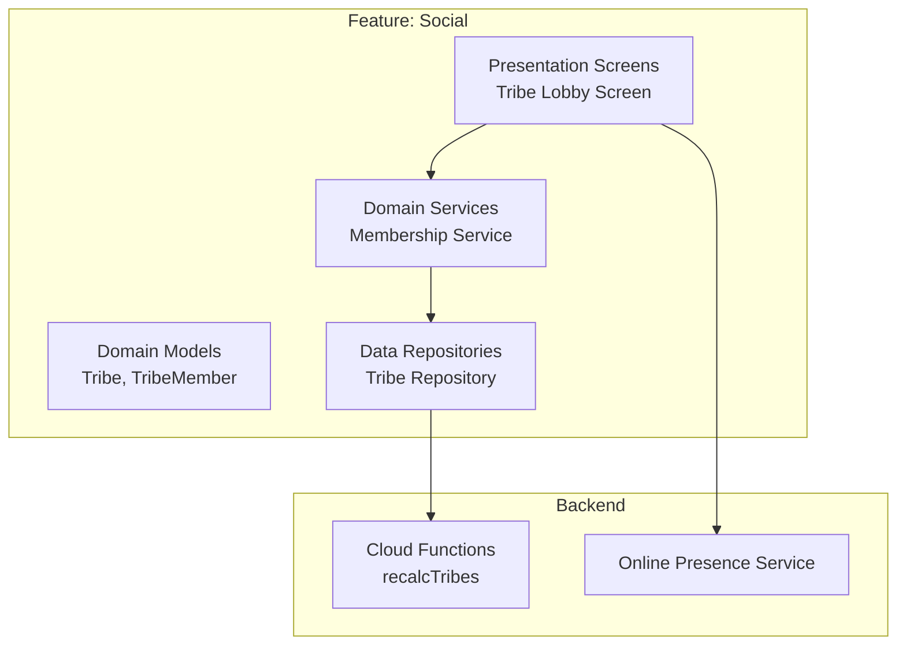
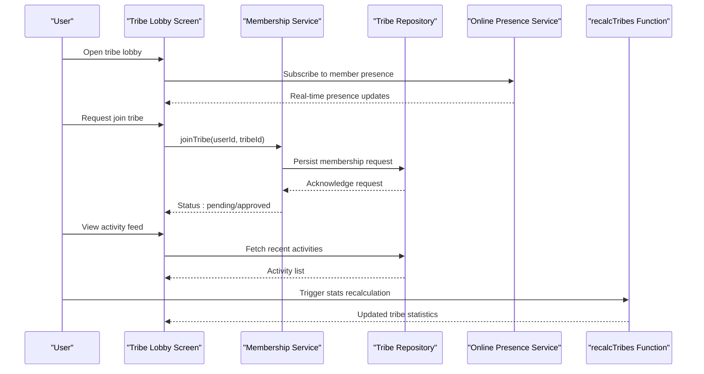
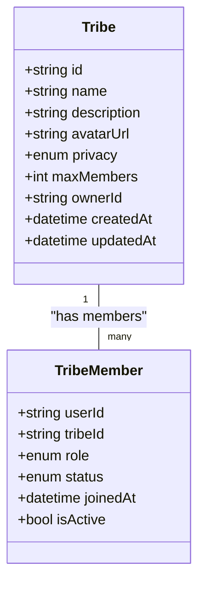
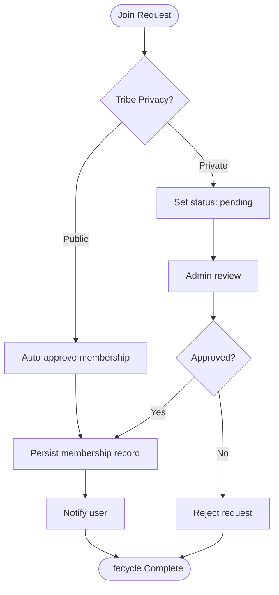
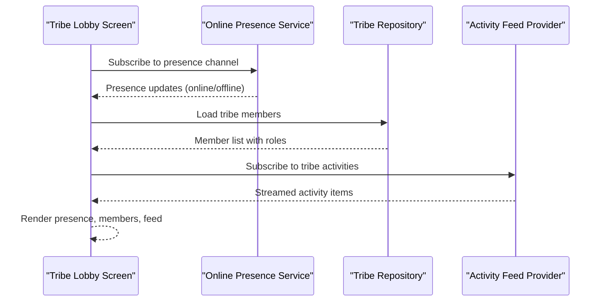
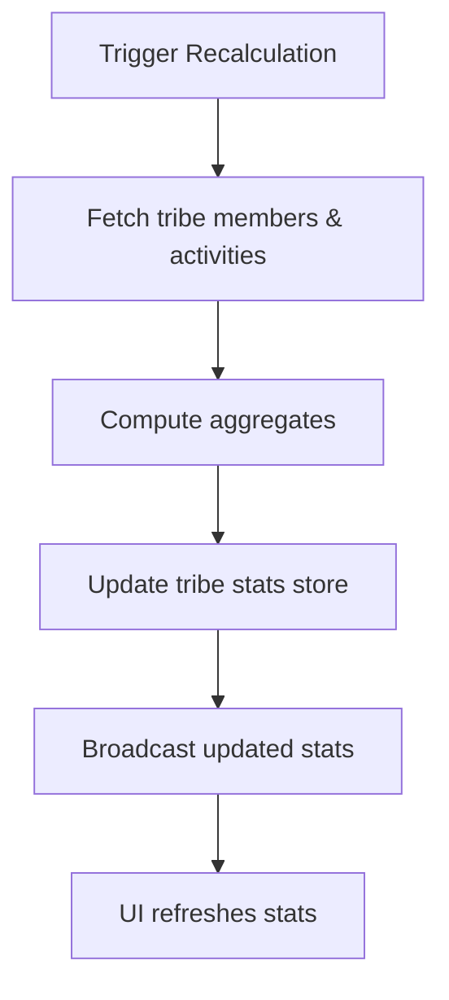
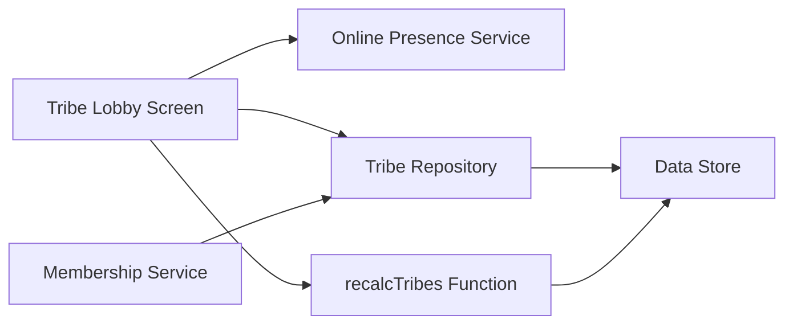

# Tribes Management

<cite>
**Referenced Files in This Document**
- [lib/features/social/domain/models/tribe_model.dart](file://lib/features/social/domain/models/tribe_model.dart)
- [lib/features/social/domain/services/tribe_membership_service.dart](file://lib/features/social/domain/services/tribe_membership_service.dart)
- [lib/features/social/presentation/screens/tribe_lobby_screen.dart](file://lib/features/social/presentation/screens/tribe_lobby_screen.dart)
- [functions/src/recalcTribes.ts](file://functions/src/recalcTribes.ts)
- [functions/lib/recalcTribes.js](file://functions/lib/recalcTribes.js)
- [lib/core/services/online_presence_service.dart](file://lib/core/services/online_presence_service.dart)
- [lib/features/social/data/repositories/tribe_repository.dart](file://lib/features/social/data/repositories/tribe_repository.dart)
- [lib/features/social/domain/models/tribe_member_model.dart](file://lib/features/social/domain/models/tribe_member_model.dart)
</cite>

## Table of Contents
1. [Introduction](#introduction)
2. [Project Structure](#project-structure)
3. [Core Components](#core-components)
4. [Architecture Overview](#architecture-overview)
5. [Detailed Component Analysis](#detailed-component-analysis)
6. [Dependency Analysis](#dependency-analysis)
7. [Performance Considerations](#performance-considerations)
8. [Troubleshooting Guide](#troubleshooting-guide)
9. [Conclusion](#conclusion)
10. [Appendices](#appendices)

## Introduction
This document provides comprehensive documentation for the tribe management system within the application. It covers the tribe creation workflow, membership lifecycle, role-based permissions, data model attributes (name, description, avatar, privacy settings, member limits), membership service operations (join/leave flows, approval processes, invitations), and the tribe lobby screen implementation including real-time presence, activity feeds, and communication tools. It also includes tribe configuration examples, member management operations, permission handling, statistics tracking, engagement metrics, and moderation capabilities.

## Project Structure
The tribe feature is organized under a feature-based structure:
- Domain models define core entities such as Tribe and TribeMember.
- Services encapsulate business logic for membership operations and approvals.
- Presentation screens implement UI components like the tribe lobby with real-time features.
- Data repositories abstract persistence and remote synchronization.
- Cloud functions handle server-side computations for tribe statistics and maintenance tasks.

**Diagram sources**
- [lib/features/social/domain/models/tribe_model.dart](file://lib/features/social/domain/models/tribe_model.dart)
- [lib/features/social/domain/models/tribe_member_model.dart](file://lib/features/social/domain/models/tribe_member_model.dart)
- [lib/features/social/domain/services/tribe_membership_service.dart](file://lib/features/social/domain/services/tribe_membership_service.dart)
- [lib/features/social/data/repositories/tribe_repository.dart](file://lib/features/social/data/repositories/tribe_repository.dart)
- [lib/features/social/presentation/screens/tribe_lobby_screen.dart](file://lib/features/social/presentation/screens/tribe_lobby_screen.dart)
- [functions/src/recalcTribes.ts](file://functions/src/recalcTribes.ts)
- [lib/core/services/online_presence_service.dart](file://lib/core/services/online_presence_service.dart)

**Section sources**
- [lib/features/social/domain/models/tribe_model.dart](file://lib/features/social/domain/models/tribe_model.dart)
- [lib/features/social/domain/models/tribe_member_model.dart](file://lib/features/social/domain/models/tribe_member_model.dart)
- [lib/features/social/domain/services/tribe_membership_service.dart](file://lib/features/social/domain/services/tribe_membership_service.dart)
- [lib/features/social/data/repositories/tribe_repository.dart](file://lib/features/social/data/repositories/tribe_repository.dart)
- [lib/features/social/presentation/screens/tribe_lobby_screen.dart](file://lib/features/social/presentation/screens/tribe_lobby_screen.dart)
- [functions/src/recalcTribes.ts](file://functions/src/recalcTribes.ts)
- [lib/core/services/online_presence_service.dart](file://lib/core/services/online_presence_service.dart)

## Core Components
- Tribe Model: Defines attributes such as name, description, avatar URL, privacy settings (public/private), and member limits. It may include metadata like createdAt, updatedAt, and owner reference.
- Tribe Member Model: Represents membership records with fields for user ID, role (owner, admin, moderator, member), status (active, pending, banned), join date, and flags for permissions.
- Membership Service: Encapsulates join/leave workflows, invitation issuance and acceptance, approval processes, and role updates.
- Tribe Repository: Provides data access abstractions for reading/writing tribe and membership data, syncing with cloud storage or database.
- Tribe Lobby Screen: Implements the UI for browsing members, viewing activity feeds, communicating via chat or announcements, and managing roles and permissions.
- Online Presence Service: Manages real-time presence indicators for active members in the lobby.
- Cloud Functions (recalcTribes): Computes aggregate statistics and engagement metrics for tribes.

**Section sources**
- [lib/features/social/domain/models/tribe_model.dart](file://lib/features/social/domain/models/tribe_model.dart)
- [lib/features/social/domain/models/tribe_member_model.dart](file://lib/features/social/domain/models/tribe_member_model.dart)
- [lib/features/social/domain/services/tribe_membership_service.dart](file://lib/features/social/domain/services/tribe_membership_service.dart)
- [lib/features/social/data/repositories/tribe_repository.dart](file://lib/features/social/data/repositories/tribe_repository.dart)
- [lib/features/social/presentation/screens/tribe_lobby_screen.dart](file://lib/features/social/presentation/screens/tribe_lobby_screen.dart)
- [lib/core/services/online_presence_service.dart](file://lib/core/services/online_presence_service.dart)
- [functions/src/recalcTribes.ts](file://functions/src/recalcTribes.ts)

## Architecture Overview
The tribe management system follows a layered architecture:
- Presentation Layer: Screens and widgets render tribe details, member lists, activity feeds, and communication tools.
- Domain Layer: Services enforce business rules for membership lifecycle, approvals, and permissions.
- Data Layer: Repositories abstract persistence and remote sync operations.
- Backend Layer: Cloud functions compute statistics and perform maintenance tasks.

**Diagram sources**
- [lib/features/social/presentation/screens/tribe_lobby_screen.dart](file://lib/features/social/presentation/screens/tribe_lobby_screen.dart)
- [lib/features/social/domain/services/tribe_membership_service.dart](file://lib/features/social/domain/services/tribe_membership_service.dart)
- [lib/features/social/data/repositories/tribe_repository.dart](file://lib/features/social/data/repositories/tribe_repository.dart)
- [lib/core/services/online_presence_service.dart](file://lib/core/services/online_presence_service.dart)
- [functions/src/recalcTribes.ts](file://functions/src/recalcTribes.ts)

## Detailed Component Analysis

### Tribe Data Model
The tribe data model defines core attributes:
- Name: Human-readable identifier for the tribe.
- Description: Summary or mission statement.
- Avatar: URL or asset reference for visual identity.
- Privacy Settings: Public or private visibility controls.
- Member Limits: Maximum number of members allowed.
- Metadata: Creation/update timestamps, owner ID, and optional tags.

**Diagram sources**
- [lib/features/social/domain/models/tribe_model.dart](file://lib/features/social/domain/models/tribe_model.dart)
- [lib/features/social/domain/models/tribe_member_model.dart](file://lib/features/social/domain/models/tribe_member_model.dart)

**Section sources**
- [lib/features/social/domain/models/tribe_model.dart](file://lib/features/social/domain/models/tribe_model.dart)
- [lib/features/social/domain/models/tribe_member_model.dart](file://lib/features/social/domain/models/tribe_member_model.dart)

### Membership Lifecycle and Service
The membership service manages:
- Join Flow: Users request to join; requests are persisted and may require approval based on privacy settings.
- Leave Flow: Members can leave tribes; ownership transfer may be required if the leaver is the owner.
- Approval Process: Admins/moderators approve or reject pending memberships.
- Invitation System: Owners/admins can invite users directly, bypassing pending status.
- Role-Based Permissions: Roles include owner, admin, moderator, member; each grants specific actions (e.g., edit tribe settings, manage members).

**Diagram sources**
- [lib/features/social/domain/services/tribe_membership_service.dart](file://lib/features/social/domain/services/tribe_membership_service.dart)

**Section sources**
- [lib/features/social/domain/services/tribe_membership_service.dart](file://lib/features/social/domain/services/tribe_membership_service.dart)

### Tribe Lobby Screen Implementation
The lobby screen provides:
- Real-time Member Presence: Displays online/offline status using presence service.
- Activity Feeds: Shows recent tribe events (joins, completions, achievements).
- Communication Tools: Chat or announcement channels moderated by roles.
- Member Management: Lists members with role badges and action buttons for admins/moderators.

**Diagram sources**
- [lib/features/social/presentation/screens/tribe_lobby_screen.dart](file://lib/features/social/presentation/screens/tribe_lobby_screen.dart)
- [lib/core/services/online_presence_service.dart](file://lib/core/services/online_presence_service.dart)
- [lib/features/social/data/repositories/tribe_repository.dart](file://lib/features/social/data/repositories/tribe_repository.dart)

**Section sources**
- [lib/features/social/presentation/screens/tribe_lobby_screen.dart](file://lib/features/social/presentation/screens/tribe_lobby_screen.dart)
- [lib/core/services/online_presence_service.dart](file://lib/core/services/online_presence_service.dart)
- [lib/features/social/data/repositories/tribe_repository.dart](file://lib/features/social/data/repositories/tribe_repository.dart)

### Tribe Statistics and Engagement Metrics
Statistics are computed server-side to ensure consistency and performance:
- Active Members Count: Number of members who engaged recently.
- Total Activities: Aggregated count of tribe-related actions.
- Engagement Rate: Ratio of active members to total members over time.
- Growth Metrics: New joins per period, churn rate.

**Diagram sources**
- [functions/src/recalcTribes.ts](file://functions/src/recalcTribes.ts)
- [functions/lib/recalcTribes.js](file://functions/lib/recalcTribes.js)

**Section sources**
- [functions/src/recalcTribes.ts](file://functions/src/recalcTribes.ts)
- [functions/lib/recalcTribes.js](file://functions/lib/recalcTribes.js)

### Permission Handling and Moderation
Role-based permissions control:
- Owner: Full control, including deleting tribe and transferring ownership.
- Admin: Manage members, edit settings, moderate content.
- Moderator: Moderate messages and manage minor settings.
- Member: Participate in activities and communicate.

Moderation capabilities include:
- Approving/rejecting join requests.
- Inviting users directly.
- Banning or removing members.
- Editing tribe metadata and privacy settings.

**Section sources**
- [lib/features/social/domain/models/tribe_member_model.dart](file://lib/features/social/domain/models/tribe_member_model.dart)
- [lib/features/social/domain/services/tribe_membership_service.dart](file://lib/features/social/domain/services/tribe_membership_service.dart)

## Dependency Analysis
Key dependencies and relationships:
- Tribe Lobby Screen depends on Online Presence Service for real-time updates and Tribe Repository for data access.
- Membership Service relies on Tribe Repository for persistence and enforces domain rules.
- Cloud Functions depend on data stores to compute and update tribe statistics.
- Models define contracts between layers ensuring consistent data structures.

**Diagram sources**
- [lib/features/social/presentation/screens/tribe_lobby_screen.dart](file://lib/features/social/presentation/screens/tribe_lobby_screen.dart)
- [lib/core/services/online_presence_service.dart](file://lib/core/services/online_presence_service.dart)
- [lib/features/social/data/repositories/tribe_repository.dart](file://lib/features/social/data/repositories/tribe_repository.dart)
- [functions/src/recalcTribes.ts](file://functions/src/recalcTribes.ts)

**Section sources**
- [lib/features/social/presentation/screens/tribe_lobby_screen.dart](file://lib/features/social/presentation/screens/tribe_lobby_screen.dart)
- [lib/core/services/online_presence_service.dart](file://lib/core/services/online_presence_service.dart)
- [lib/features/social/data/repositories/tribe_repository.dart](file://lib/features/social/data/repositories/tribe_repository.dart)
- [functions/src/recalcTribes.ts](file://functions/src/recalcTribes.ts)

## Performance Considerations
- Real-time presence subscriptions should be scoped to active tribes to minimize overhead.
- Activity feeds should paginate and cache recent items to reduce network calls.
- Statistics recalculation should be triggered on significant events rather than continuously.
- Use efficient queries in repositories to avoid full scans of large member lists.

[No sources needed since this section provides general guidance]

## Troubleshooting Guide
Common issues and resolutions:
- Membership stuck in pending: Verify privacy settings and admin approval workflow.
- Presence not updating: Ensure presence service subscription is active and network connectivity is stable.
- Stats not reflecting changes: Trigger manual recalculation and check function logs.
- Permission errors: Confirm user roles and validate permission checks in service layer.

**Section sources**
- [lib/features/social/domain/services/tribe_membership_service.dart](file://lib/features/social/domain/services/tribe_membership_service.dart)
- [lib/core/services/online_presence_service.dart](file://lib/core/services/online_presence_service.dart)
- [functions/src/recalcTribes.ts](file://functions/src/recalcTribes.ts)

## Conclusion
The tribe management system provides a robust framework for creating and managing tribes with clear membership lifecycles, role-based permissions, and real-time engagement features. The layered architecture ensures maintainability and scalability, while cloud functions support accurate statistics and metrics. Proper configuration and moderation capabilities enable effective community management.

[No sources needed since this section summarizes without analyzing specific files]

## Appendices
- Example tribe configuration: Set privacy to private, define max members, assign owner and initial admins.
- Member management operations: Invite users, approve pending requests, update roles, remove members.
- Permission handling: Validate actions based on roles before executing mutations.

[No sources needed since this section provides general guidance]