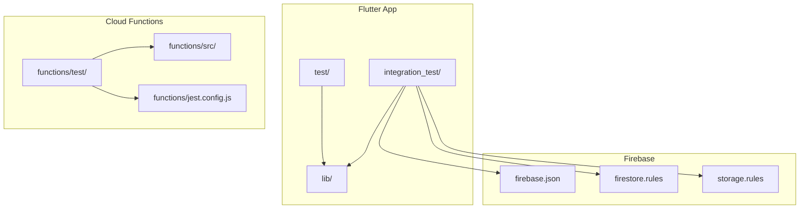
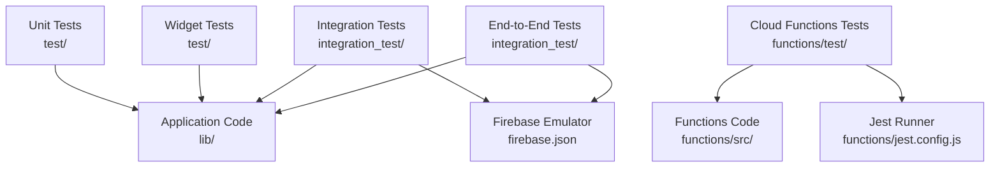
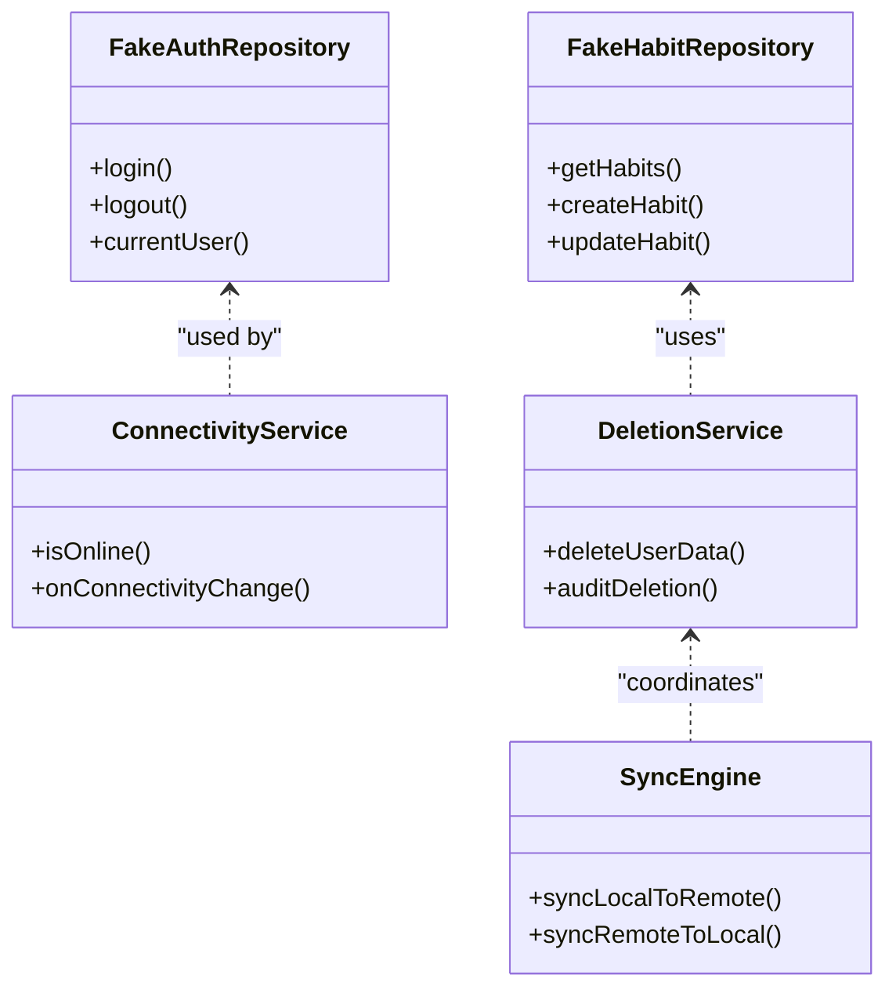
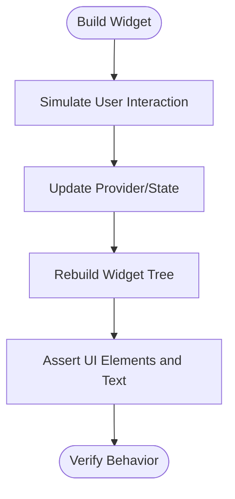
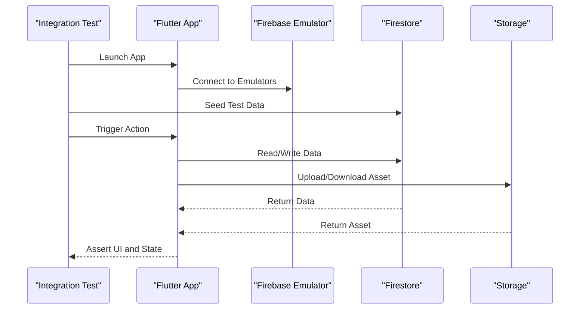
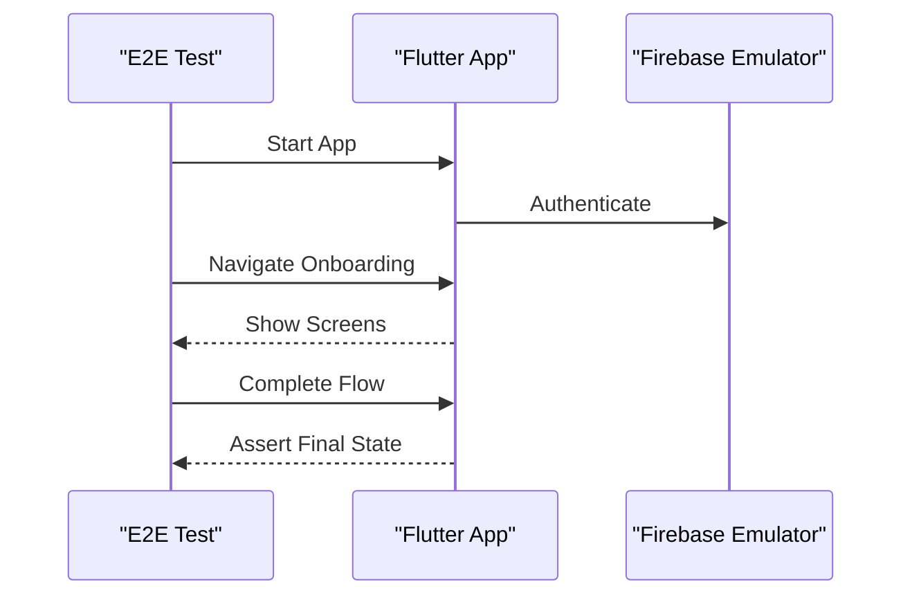
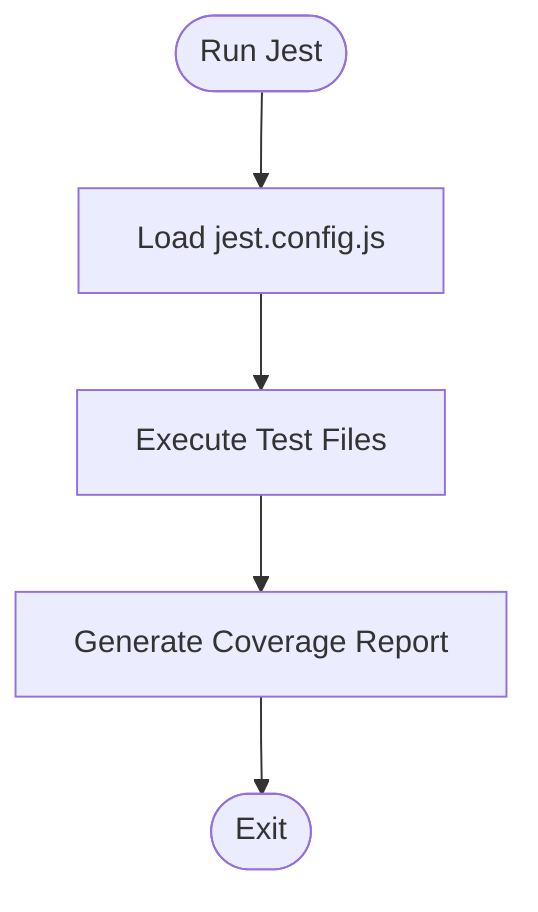
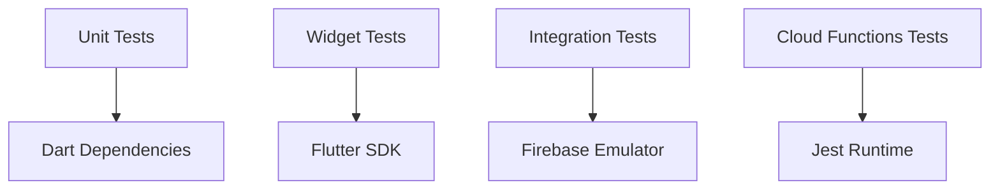

# Testing Strategy & Implementation

<cite>
**Referenced Files in This Document**
- [pubspec.yaml](file://pubspec.yaml)
- [firebase.json](file://firebase.json)
- [firestore.rules](file://firestore.rules)
- [storage.rules](file://storage.rules)
- [integration_test/app_test.dart](file://integration_test/app_test.dart)
- [integration_test/firebase_emulator_test.dart](file://integration_test/firebase_emulator_test.dart)
- [integration_test/onboarding_flow_test.dart](file://integration_test/onboarding_flow_test.dart)
- [test/core/config/app_config_test.dart](file://test/core/config/app_config_test.dart)
- [test/core/deletion/deletion_service_test.dart](file://test/core/deletion/deletion_service_test.dart)
- [test/core/drift/dao_deletion_methods_test.dart](file://test/core/drift/dao_deletion_methods_test.dart)
- [test/core/drift/test_database.dart](file://test/core/drift/test_database.dart)
- [test/core/drift_repositories/mocks.dart](file://test/core/drift_repositories/mocks.dart)
- [test/core/presentation/widgets/emerge_primary_button_test.dart](file://test/core/presentation/widgets/emerge_primary_button_test.dart)
- [test/core/services/connectivity_service_test.dart](file://test/core/services/connectivity_service_test.dart)
- [test/core/sync/enhanced_sync_engine_test.dart](file://test/core/sync/enhanced_sync_engine_test.dart)
- [test/features/auth/data/repositories/fake_auth_repository.dart](file://test/features/auth/data/repositories/fake_auth_repository.dart)
- [test/features/avatar/domain/models/avatar_data_test.dart](file://test/features/avatar/domain/models/avatar_data_test.dart)
- [test/features/habits/data/repositories/fake_habit_repository.dart](file://test/features/habits/data/repositories/fake_habit_repository.dart)
- [test/helpers/mocks/auth_mocks.dart](file://test/helpers/mocks/auth_mocks.dart)
- [test/helpers/widget_test_utils.dart](file://test/helpers/widget_test_utils.dart)
- [functions/jest.config.js](file://functions/jest.config.js)
- [functions/package.json](file://functions/package.json)
- [functions/src/index.ts](file://functions/src/index.ts)
- [functions/test/index.test.ts](file://functions/test/index.test.ts)
</cite>

## Table of Contents
1. [Introduction](#introduction)
2. [Project Structure](#project-structure)
3. [Core Components](#core-components)
4. [Architecture Overview](#architecture-overview)
5. [Detailed Component Analysis](#detailed-component-analysis)
6. [Dependency Analysis](#dependency-analysis)
7. [Performance Considerations](#performance-considerations)
8. [Troubleshooting Guide](#troubleshooting-guide)
9. [Conclusion](#conclusion)
10. [Appendices](#appendices)

## Introduction
This document explains the testing strategy and implementation across the application, covering unit tests for business logic and data layers, widget tests for presentation components, integration tests for Firebase services and third-party APIs, end-to-end flows, automated pipelines, and continuous integration setup. It also provides guidance on mocking strategies, test data management, code coverage requirements, best practices, and debugging techniques.

## Project Structure
The repository organizes tests into clear tiers:
- Unit tests under test/ mirroring lib/ structure (core, features, helpers).
- Integration tests under integration_test/ for Flutter app-level scenarios.
- Cloud Functions tests under functions/test/ with Jest configuration.
- Firebase rules and emulator configuration to support integration and end-to-end tests.

**Diagram sources**
- [pubspec.yaml](file://pubspec.yaml)
- [firebase.json](file://firebase.json)
- [firestore.rules](file://firestore.rules)
- [storage.rules](file://storage.rules)
- [functions/jest.config.js](file://functions/jest.config.js)
- [functions/package.json](file://functions/package.json)

**Section sources**
- [pubspec.yaml](file://pubspec.yaml)
- [firebase.json](file://firebase.json)
- [firestore.rules](file://firestore.rules)
- [storage.rules](file://storage.rules)
- [functions/jest.config.js](file://functions/jest.config.js)
- [functions/package.json](file://functions/package.json)

## Core Components
- Unit testing:
  - Business logic and domain models are tested via isolated Dart tests.
  - Data layer uses fakes and mocks to isolate repositories and DAOs.
- Widget testing:
  - UI components are validated using Flutter’s widget testing utilities.
- Integration testing:
  - Firebase Emulator Suite is used for Firestore, Auth, Storage, and Remote Config during integration tests.
- Cloud Functions testing:
  - Jest-based tests validate server-side logic and integrations.

Key patterns:
- Use fakes for repositories and services to avoid external dependencies.
- Use mock libraries to verify interactions and return controlled values.
- Centralize shared widget test helpers and fixtures.

**Section sources**
- [test/core/config/app_config_test.dart](file://test/core/config/app_config_test.dart)
- [test/core/deletion/deletion_service_test.dart](file://test/core/deletion/deletion_service_test.dart)
- [test/core/drift/dao_deletion_methods_test.dart](file://test/core/drift/dao_deletion_methods_test.dart)
- [test/core/drift/test_database.dart](file://test/core/drift/test_database.dart)
- [test/core/drift_repositories/mocks.dart](file://test/core/drift_repositories/mocks.dart)
- [test/core/presentation/widgets/emerge_primary_button_test.dart](file://test/core/presentation/widgets/emerge_primary_button_test.dart)
- [test/core/services/connectivity_service_test.dart](file://test/core/services/connectivity_service_test.dart)
- [test/core/sync/enhanced_sync_engine_test.dart](file://test/core/sync/enhanced_sync_engine_test.dart)
- [test/features/auth/data/repositories/fake_auth_repository.dart](file://test/features/auth/data/repositories/fake_auth_repository.dart)
- [test/features/habits/data/repositories/fake_habit_repository.dart](file://test/features/habits/data/repositories/fake_habit_repository.dart)
- [test/helpers/mocks/auth_mocks.dart](file://test/helpers/mocks/auth_mocks.dart)
- [test/helpers/widget_test_utils.dart](file://test/helpers/widget_test_utils.dart)

## Architecture Overview
Testing architecture spans multiple layers and environments:
- Unit tests run against pure Dart code without platform or network dependencies.
- Widget tests render UI trees and assert behavior and rendering.
- Integration tests use the Firebase Emulator to simulate backend services.
- End-to-end tests drive full app flows through Flutter Driver or integration_test runner.
- Cloud Functions are tested independently with Jest.

**Diagram sources**
- [firebase.json](file://firebase.json)
- [functions/jest.config.js](file://functions/jest.config.js)
- [functions/package.json](file://functions/package.json)

## Detailed Component Analysis

### Unit Testing Strategy
- Business Logic:
  - Domain services and algorithms are verified with deterministic inputs and outputs.
  - Example areas include deletion workflows, sync engines, and game loop logic.
- Data Layer:
  - Repositories and DAOs are isolated using fakes and mocks.
  - Drift database tests use an in-memory or temporary database instance.
- Presentation:
  - Widgets are tested by building them in a test environment and asserting state changes and interactions.

Mocking and fakes:
- Repository fakes provide predictable responses for auth and habit operations.
- Mocks verify method calls and parameters for connectivity and notification services.

Test data management:
- Centralized fixtures and helper utilities reduce duplication and improve readability.

**Diagram sources**
- [test/features/auth/data/repositories/fake_auth_repository.dart](file://test/features/auth/data/repositories/fake_auth_repository.dart)
- [test/features/habits/data/repositories/fake_habit_repository.dart](file://test/features/habits/data/repositories/fake_habit_repository.dart)
- [test/core/services/connectivity_service_test.dart](file://test/core/services/connectivity_service_test.dart)
- [test/core/deletion/deletion_service_test.dart](file://test/core/deletion/deletion_service_test.dart)
- [test/core/sync/enhanced_sync_engine_test.dart](file://test/core/sync/enhanced_sync_engine_test.dart)

**Section sources**
- [test/core/deletion/deletion_service_test.dart](file://test/core/deletion/deletion_service_test.dart)
- [test/core/drift/dao_deletion_methods_test.dart](file://test/core/drift/dao_deletion_methods_test.dart)
- [test/core/drift/test_database.dart](file://test/core/drift/test_database.dart)
- [test/core/drift_repositories/mocks.dart](file://test/core/drift_repositories/mocks.dart)
- [test/core/services/connectivity_service_test.dart](file://test/core/services/connectivity_service_test.dart)
- [test/core/sync/enhanced_sync_engine_test.dart](file://test/core/sync/enhanced_sync_engine_test.dart)
- [test/features/auth/data/repositories/fake_auth_repository.dart](file://test/features/auth/data/repositories/fake_auth_repository.dart)
- [test/features/habits/data/repositories/fake_habit_repository.dart](file://test/features/habits/data/repositories/fake_habit_repository.dart)
- [test/helpers/mocks/auth_mocks.dart](file://test/helpers/mocks/auth_mocks.dart)

### Widget Testing Framework
- Widget tests build component trees and assert:
  - Initial state rendering.
  - User interactions (taps, input).
  - State updates and side effects.
- Shared utilities centralize common actions like tapping buttons and entering text.

Best practices:
- Keep tests focused on one widget per file.
- Use realistic but minimal data to speed up execution.
- Assert both visual elements and underlying state changes.

**Section sources**
- [test/core/presentation/widgets/emerge_primary_button_test.dart](file://test/core/presentation/widgets/emerge_primary_button_test.dart)
- [test/helpers/widget_test_utils.dart](file://test/helpers/widget_test_utils.dart)

### Integration Testing for Firebase Services
- Uses Firebase Emulator Suite to simulate:
  - Firestore reads/writes.
  - Authentication flows.
  - Storage operations.
- Tests orchestrate realistic user journeys without hitting production services.

Typical flow:
- Initialize emulator connections.
- Seed test data.
- Execute actions and assert outcomes.
- Clean up after each test.

**Diagram sources**
- [integration_test/firebase_emulator_test.dart](file://integration_test/firebase_emulator_test.dart)
- [firebase.json](file://firebase.json)
- [firestore.rules](file://firestore.rules)
- [storage.rules](file://storage.rules)

**Section sources**
- [integration_test/firebase_emulator_test.dart](file://integration_test/firebase_emulator_test.dart)
- [integration_test/app_test.dart](file://integration_test/app_test.dart)
- [integration_test/onboarding_flow_test.dart](file://integration_test/onboarding_flow_test.dart)
- [firebase.json](file://firebase.json)
- [firestore.rules](file://firestore.rules)
- [storage.rules](file://storage.rules)

### End-to-End Testing Strategy
- Full app flows such as onboarding are executed via integration_test runner.
- Scenarios cover navigation, authentication, and feature usage.
- Assertions ensure correct routing and state transitions.

**Diagram sources**
- [integration_test/onboarding_flow_test.dart](file://integration_test/onboarding_flow_test.dart)

**Section sources**
- [integration_test/onboarding_flow_test.dart](file://integration_test/onboarding_flow_test.dart)
- [integration_test/app_test.dart](file://integration_test/app_test.dart)

### Cloud Functions Testing
- Jest-based tests validate server-side logic and integrations.
- Configuration includes test environment setup and reporters.

**Diagram sources**
- [functions/jest.config.js](file://functions/jest.config.js)
- [functions/package.json](file://functions/package.json)
- [functions/src/index.ts](file://functions/src/index.ts)
- [functions/test/index.test.ts](file://functions/test/index.test.ts)

**Section sources**
- [functions/jest.config.js](file://functions/jest.config.js)
- [functions/package.json](file://functions/package.json)
- [functions/src/index.ts](file://functions/src/index.ts)
- [functions/test/index.test.ts](file://functions/test/index.test.ts)

## Dependency Analysis
Testing dependencies are organized to minimize coupling:
- Unit tests depend only on Dart packages and local fakes/mocks.
- Integration tests depend on Firebase Emulator configuration.
- Cloud Functions tests depend on Jest and Node runtime.

**Diagram sources**
- [pubspec.yaml](file://pubspec.yaml)
- [firebase.json](file://firebase.json)
- [functions/jest.config.js](file://functions/jest.config.js)
- [functions/package.json](file://functions/package.json)

**Section sources**
- [pubspec.yaml](file://pubspec.yaml)
- [firebase.json](file://firebase.json)
- [functions/jest.config.js](file://functions/jest.config.js)
- [functions/package.json](file://functions/package.json)

## Performance Considerations
- Prefer in-memory databases for Drift tests to reduce IO overhead.
- Use lightweight fixtures and avoid heavy assets in widget tests.
- Parallelize independent tests where possible.
- Profile critical paths with performance tests and benchmarks.
- Monitor emulator startup time and optimize test sequencing.

[No sources needed since this section provides general guidance]

## Troubleshooting Guide
Common issues and resolutions:
- Emulator connection failures:
  - Verify firebase.json settings and emulator ports.
  - Ensure emulators are started before running integration tests.
- Flaky widget tests:
  - Add explicit waits for async operations.
  - Stabilize timers and animations.
- Cloud Functions test failures:
  - Check Jest configuration and environment variables.
  - Validate mocked modules and stubbed responses.

Debugging tips:
- Use print statements sparingly; prefer logging frameworks.
- Isolate failing tests by running them individually.
- Inspect emulator logs for backend errors.

**Section sources**
- [integration_test/firebase_emulator_test.dart](file://integration_test/firebase_emulator_test.dart)
- [firebase.json](file://firebase.json)
- [functions/jest.config.js](file://functions/jest.config.js)

## Conclusion
The testing strategy covers all layers of the application with clear separation of concerns:
- Unit tests ensure correctness of business logic and data operations.
- Widget tests validate UI behavior and interactions.
- Integration tests use Firebase Emulator to simulate backend services reliably.
- Cloud Functions tests verify server-side logic with Jest.
Adopting these practices improves reliability, accelerates development, and supports continuous delivery.

[No sources needed since this section summarizes without analyzing specific files]

## Appendices
- Best Practices:
  - Keep tests deterministic and fast.
  - Use descriptive test names that convey intent.
  - Maintain separate test data sets for different scenarios.
- Coverage Requirements:
  - Aim for high coverage on critical paths and business logic.
  - Track coverage trends over time.
- CI Setup:
  - Integrate unit, widget, integration, and cloud functions tests into CI pipelines.
  - Cache dependencies and emulator artifacts to speed up runs.

[No sources needed since this section provides general guidance]