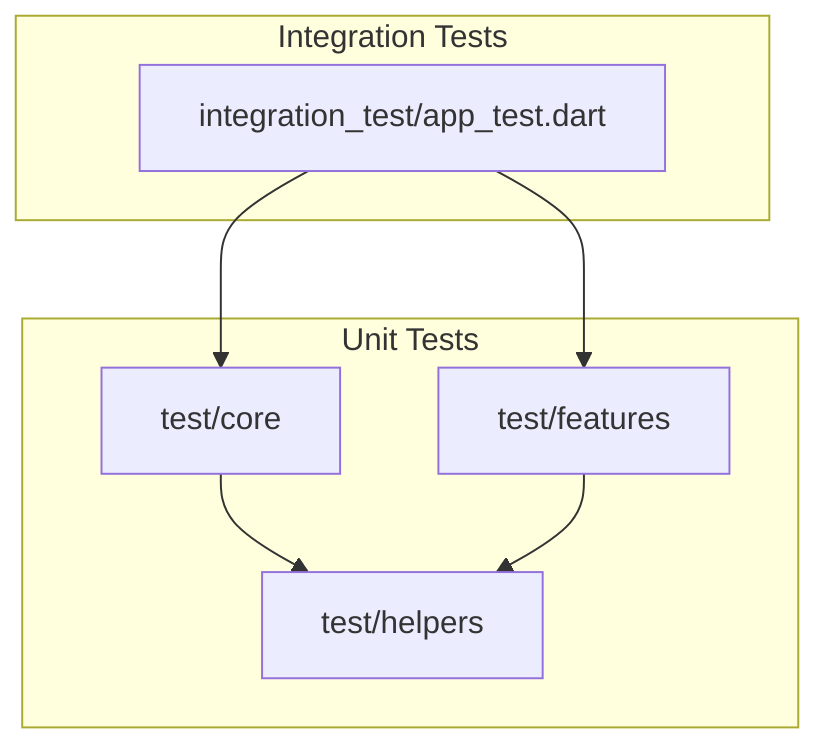
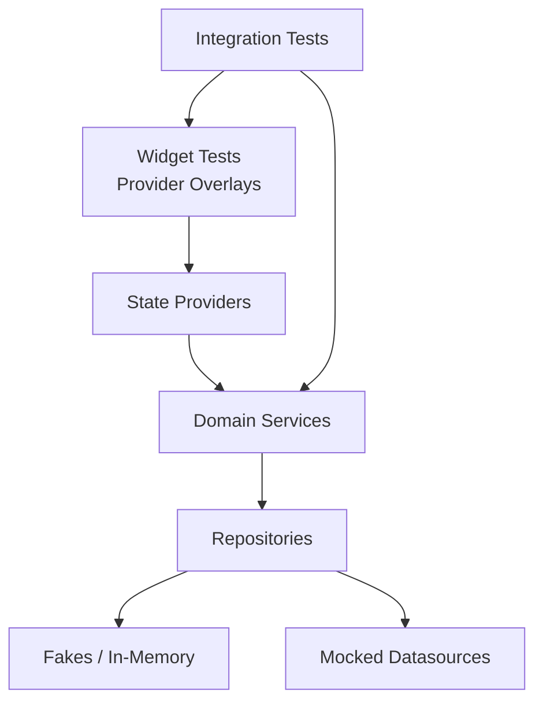
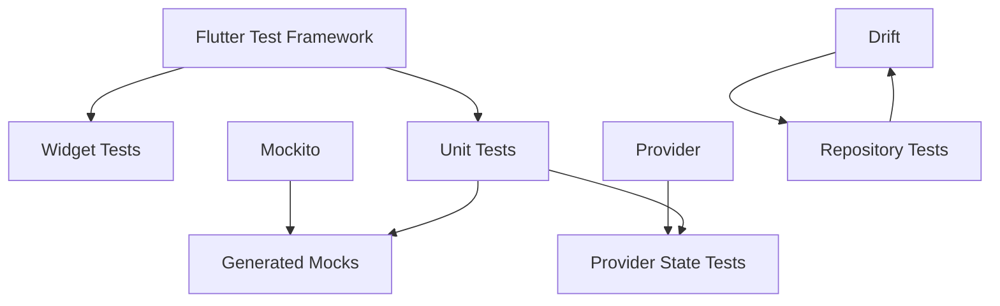

# Unit Testing Framework & Patterns

<cite>
**Referenced Files in This Document**
- [pubspec.yaml](file://pubspec.yaml)
- [test/core/config/app_config_test.dart](file://test/core/config/app_config_test.dart)
- [test/core/sync/sync_engine_test.dart](file://test/core/sync/sync_engine_test.dart)
- [test/core/drift_repositories/mocks.dart](file://test/core/drift_repositories/mocks.dart)
- [test/features/auth/data/repositories/fake_auth_repository.dart](file://test/features/auth/data/repositories/fake_auth_repository.dart)
- [test/helpers/mocks/habit_mocks.dart](file://test/helpers/mocks/habit_mocks.dart)
- [test/helpers/widget_test_utils.dart](file://test/helpers/widget_test_utils.dart)
- [integration_test/app_test.dart](file://integration_test/app_test.dart)
</cite>

## Table of Contents
1. Introduction
2. Project Structure
3. Core Components
4. Architecture Overview
5. Detailed Component Analysis
6. Dependency Analysis
7. Performance Considerations
8. Troubleshooting Guide
9. Conclusion

## Introduction
This document explains the unit testing framework and patterns used across the application. It covers Flutter’s test framework, mocking with Mockito, fake implementations, and test data management. It also provides guidance for writing effective tests for business logic, domain services, repositories, and presentation components, including async operations, state management with providers, dependency injection in tests, naming conventions, assertion patterns, code coverage, performance considerations, and debugging techniques.

## Project Structure
The project organizes tests alongside features and core modules:
- Unit tests under test/ mirror lib/ structure (core, features).
- Integration tests under integration_test/.
- Shared helpers and mocks under test/helpers/.
- Feature-specific fakes and mocks are colocated near their targets.

[No sources needed since this diagram shows conceptual workflow, not actual code structure]

## Core Components
Key testing building blocks:
- Test configuration and dependencies via pubspec.yaml.
- Widget and provider utilities for UI/state testing.
- Mocks and fakes for isolating external dependencies.
- Domain/service tests validating business rules.
- Repository tests using in-memory or mocked storage.

Examples of concrete files:
- Configuration and dependencies: [pubspec.yaml](file://pubspec.yaml)
- Widget/test utilities: [test/helpers/widget_test_utils.dart](file://test/helpers/widget_test_utils.dart)
- Mocks: [test/helpers/mocks/habit_mocks.dart](file://test/helpers/mocks/habit_mocks.dart), [test/core/drift_repositories/mocks.dart](file://test/core/drift_repositories/mocks.dart)
- Fakes: [test/features/auth/data/repositories/fake_auth_repository.dart](file://test/features/auth/data/repositories/fake_auth_repository.dart)
- Sync engine test: [test/core/sync/sync_engine_test.dart](file://test/core/sync/sync_engine_test.dart)
- App config test: [test/core/config/app_config_test.dart](file://test/core/config/app_config_test.dart)
- Integration test: [integration_test/app_test.dart](file://integration_test/app_test.dart)

**Section sources**
- [pubspec.yaml](file://pubspec.yaml)
- [test/helpers/widget_test_utils.dart](file://test/helpers/widget_test_utils.dart)
- [test/helpers/mocks/habit_mocks.dart](file://test/helpers/mocks/habit_mocks.dart)
- [test/core/drift_repositories/mocks.dart](file://test/core/drift_repositories/mocks.dart)
- [test/features/auth/data/repositories/fake_auth_repository.dart](file://test/features/auth/data/repositories/fake_auth_repository.dart)
- [test/core/sync/sync_engine_test.dart](file://test/core/sync/sync_engine_test.dart)
- [test/core/config/app_config_test.dart](file://test/core/config/app_config_test.dart)
- [integration_test/app_test.dart](file://integration_test/app_test.dart)

## Architecture Overview
Testing architecture follows a layered approach:
- Presentation layer tests use widget tests and provider overlays to assert UI behavior and state changes.
- Domain/service tests validate pure business logic without external side effects.
- Repository tests isolate persistence by using fakes or in-memory stores.
- Integration tests exercise end-to-end flows against emulated or real backends.

[No sources needed since this diagram shows conceptual workflow, not actual code structure]

## Detailed Component Analysis

### Test Organization and Naming Conventions
- Organize tests to mirror production code: core vs features, domain vs data vs presentation.
- Use descriptive names that express behavior and expected outcomes.
- Group related tests with feature folders and helper utilities.

Practical references:
- Example organization and naming can be seen in [test/core/config/app_config_test.dart](file://test/core/config/app_config_test.dart) and [test/core/sync/sync_engine_test.dart](file://test/core/sync/sync_engine_test.dart).

**Section sources**
- [test/core/config/app_config_test.dart](file://test/core/config/app_config_test.dart)
- [test/core/sync/sync_engine_test.dart](file://test/core/sync/sync_engine_test.dart)

### Mocking Strategies with Mockito
- Create mocks for interfaces and classes to isolate units from external dependencies.
- Centralize reusable mocks under test/helpers/mocks/.
- Use generated mocks to verify interactions and return controlled values.

References:
- Habit-related mocks: [test/helpers/mocks/habit_mocks.dart](file://test/helpers/mocks/habit_mocks.dart)
- Drift repository mocks: [test/core/drift_repositories/mocks.dart](file://test/core/drift_repositories/mocks.dart)

**Section sources**
- [test/helpers/mocks/habit_mocks.dart](file://test/helpers/mocks/habit_mocks.dart)
- [test/core/drift_repositories/mocks.dart](file://test/core/drift_repositories/mocks.dart)

### Fake Implementations
- Provide lightweight, deterministic fakes for repositories or services to avoid flakiness.
- Keep fakes simple and focused on test scenarios.

Reference:
- Auth repository fake example: [test/features/auth/data/repositories/fake_auth_repository.dart](file://test/features/auth/data/repositories/fake_auth_repository.dart)

**Section sources**
- [test/features/auth/data/repositories/fake_auth_repository.dart](file://test/features/auth/data/repositories/fake_auth_repository.dart)

### Test Data Management
- Define small, stable fixtures close to the tests that consume them.
- Prefer factory functions or builders for creating varied but consistent test data.
- Avoid coupling tests to large shared datasets; keep data minimal and purposeful.

[No sources needed since this section provides general guidance]

### Writing Effective Unit Tests for Business Logic and Domain Services
- Focus on inputs, outputs, and side-effect isolation.
- Assert state transitions and computed results explicitly.
- Cover edge cases and error paths.

References:
- Domain service tests pattern visible in sync engine tests: [test/core/sync/sync_engine_test.dart](file://test/core/sync/sync_engine_test.dart)

**Section sources**
- [test/core/sync/sync_engine_test.dart](file://test/core/sync/sync_engine_test.dart)

### Repository Testing Patterns
- Use fakes for local persistence and mocks for remote datasources.
- Validate CRUD operations, error handling, and transformation layers.

References:
- Drift repository mocks: [test/core/drift_repositories/mocks.dart](file://test/core/drift_repositories/mocks.dart)
- Auth repository fake: [test/features/auth/data/repositories/fake_auth_repository.dart](file://test/features/auth/data/repositories/fake_auth_repository.dart)

**Section sources**
- [test/core/drift_repositories/mocks.dart](file://test/core/drift_repositories/mocks.dart)
- [test/features/auth/data/repositories/fake_auth_repository.dart](file://test/features/auth/data/repositories/fake_auth_repository.dart)

### Presentation Layer and State Management with Providers
- Use widget tests to render screens and interact with widgets.
- Wrap widgets with provider overlays to supply mock or fake state.
- Assert UI updates based on state changes and user actions.

References:
- Widget test utilities: [test/helpers/widget_test_utils.dart](file://test/helpers/widget_test_utils.dart)

**Section sources**
- [test/helpers/widget_test_utils.dart](file://test/helpers/widget_test_utils.dart)

### Async Operations Testing
- Use pumpAndSettle or tester.pump() loops to await asynchronous work.
- For streams and futures, ensure proper scheduling and settling.
- Verify error propagation and retry behaviors.

References:
- Async patterns demonstrated in sync engine tests: [test/core/sync/sync_engine_test.dart](file://test/core/sync/sync_engine_test.dart)

**Section sources**
- [test/core/sync/sync_engine_test.dart](file://test/core/sync/sync_engine_test.dart)

### Dependency Injection in Tests
- Inject fakes/mocks into constructors or providers to replace heavy dependencies.
- Keep DI containers test-friendly by allowing overrides.

References:
- Config tests illustrate isolated setup: [test/core/config/app_config_test.dart](file://test/core/config/app_config_test.dart)

**Section sources**
- [test/core/config/app_config_test.dart](file://test/core/config/app_config_test.dart)

### Assertion Patterns
- Use explicit equality checks for domain objects.
- Assert UI text, visibility, and interaction outcomes.
- Validate stream emissions and future resolutions.

[No sources needed since this section provides general guidance]

### End-to-End and Integration Testing
- Use integration_test to validate full flows across layers.
- Leverage emulators where applicable to avoid external dependencies.

Reference:
- Integration test entry: [integration_test/app_test.dart](file://integration_test/app_test.dart)

**Section sources**
- [integration_test/app_test.dart](file://integration_test/app_test.dart)

## Dependency Analysis
Testing dependencies include:
- Flutter test framework for unit and widget tests.
- Mockito for generating mocks.
- Provider for state management in widget tests.
- Drift for database testing with in-memory or mocked DAOs.

[No sources needed since this diagram shows conceptual workflow, not actual code structure]

**Section sources**
- [pubspec.yaml](file://pubspec.yaml)

## Performance Considerations
- Keep tests fast by avoiding heavy initialization and network calls.
- Use fakes and in-memory stores instead of real databases when possible.
- Minimize widget tree size in UI tests; only render what is necessary.
- Batch assertions and reduce unnecessary rebuilds.
- Profile slow tests and extract common setup into reusable helpers.

[No sources needed since this section provides general guidance]

## Troubleshooting Guide
Common issues and remedies:
- Flaky async tests: Ensure pumpAndSettle is used correctly and timers are flushed.
- Provider state not updating: Verify provider scopes and builder contexts.
- Mock verification failures: Confirm method signatures and argument matchers.
- Database test failures: Check schema migrations and seed data consistency.

Debugging techniques:
- Use print/log statements sparingly; prefer targeted asserts.
- Run individual tests with verbose output to isolate failures.
- Inspect stack traces and focus on the failing assertion.

[No sources needed since this section provides general guidance]

## Conclusion
The application employs a robust testing strategy aligned with Flutter best practices:
- Clear separation between unit, widget, and integration tests.
- Consistent use of mocks and fakes to isolate behavior.
- Strong emphasis on deterministic test data and clear assertions.
- Practical patterns for async operations, provider state, and dependency injection.
Adhering to these patterns ensures maintainable, reliable tests that support rapid development and confident refactoring.