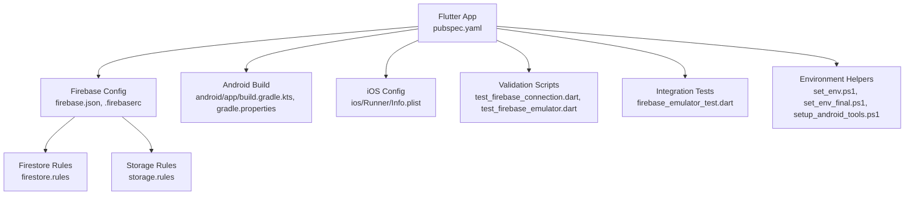
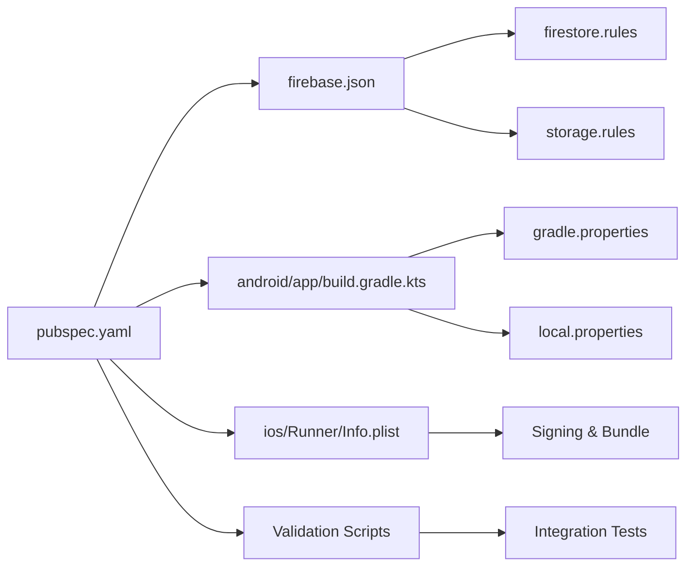

# Setup & Installation Issues

<cite>
**Referenced Files in This Document**
- [README.md](file://README.md)
- [pubspec.yaml](file://pubspec.yaml)
- [firebase.json](file://firebase.json)
- [.firebaserc](file://.firebaserc)
- [firestore.rules](file://firestore.rules)
- [storage.rules](file://storage.rules)
- [android/app/build.gradle.kts](file://android/app/build.gradle.kts)
- [android/build.gradle.kts](file://android/build.gradle.kts)
- [android/gradle.properties](file://android/gradle.properties)
- [android/local.properties](file://android/local.properties)
- [ios/Runner/Info.plist](file://ios/Runner/Info.plist)
- [scripts/test_firebase_connection.dart](file://scripts/test_firebase_connection.dart)
- [scripts/test_firebase_emulator.dart](file://scripts/test_firebase_emulator.dart)
- [integration_test/firebase_emulator_test.dart](file://integration_test/firebase_emulator_test.dart)
- [docs/FIREBASE_APP_CHECK_SETUP.md](file://docs/FIREBASE_APP_CHECK_SETUP.md)
- [set_env.ps1](file://set_env.ps1)
- [set_env_final.ps1](file://set_env_final.ps1)
- [setup_android_tools.ps1](file://setup_android_tools.ps1)
</cite>

## Table of Contents
1. [Introduction](#introduction)
2. [Project Structure](#project-structure)
3. [Core Components](#core-components)
4. [Architecture Overview](#architecture-overview)
5. [Detailed Component Analysis](#detailed-component-analysis)
6. [Dependency Analysis](#dependency-analysis)
7. [Performance Considerations](#performance-considerations)
8. [Troubleshooting Guide](#troubleshooting-guide)
9. [Conclusion](#conclusion)
10. [Appendices](#appendices)

## Introduction
This document provides comprehensive troubleshooting guidance for setup and installation issues in a Flutter + Firebase project. It focuses on common Flutter environment problems, Firebase configuration errors, dependency resolution failures, Android/iOS build issues, emulator setup problems, platform-specific configurations, Firebase project setup, authentication configuration, storage rules deployment, diagnostic commands, log analysis techniques, recovery procedures for failed installations, and network connectivity issues (proxy/firewall).

## Project Structure
The repository is a Flutter application with native Android and iOS targets, Firebase integration via CLI and SDKs, and helper scripts to validate connectivity and emulate services. Key setup-related files include:
- Flutter dependencies and entrypoints: pubspec.yaml
- Firebase project bindings: firebase.json, .firebaserc
- Platform configs: android/*, ios/Runner/Info.plist
- Validation scripts: scripts/test_firebase_connection.dart, scripts/test_firebase_emulator.dart
- Integration tests: integration_test/firebase_emulator_test.dart
- Documentation: docs/FIREBASE_APP_CHECK_SETUP.md
- Environment and tooling helpers: set_env.ps1, set_env_final.ps1, setup_android_tools.ps1



**Diagram sources**
- [pubspec.yaml](file://pubspec.yaml)
- [firebase.json](file://firebase.json)
- [.firebaserc](file://.firebaserc)
- [android/app/build.gradle.kts](file://android/app/build.gradle.kts)
- [android/gradle.properties](file://android/gradle.properties)
- [ios/Runner/Info.plist](file://ios/Runner/Info.plist)
- [scripts/test_firebase_connection.dart](file://scripts/test_firebase_connection.dart)
- [scripts/test_firebase_emulator.dart](file://scripts/test_firebase_emulator.dart)
- [integration_test/firebase_emulator_test.dart](file://integration_test/firebase_emulator_test.dart)
- [firestore.rules](file://firestore.rules)
- [storage.rules](file://storage.rules)
- [set_env.ps1](file://set_env.ps1)
- [set_env_final.ps1](file://set_env_final.ps1)
- [setup_android_tools.ps1](file://setup_android_tools.ps1)

**Section sources**
- [README.md](file://README.md)
- [pubspec.yaml](file://pubspec.yaml)
- [firebase.json](file://firebase.json)
- [.firebaserc](file://.firebaserc)
- [android/app/build.gradle.kts](file://android/app/build.gradle.kts)
- [android/gradle.properties](file://android/gradle.properties)
- [ios/Runner/Info.plist](file://ios/Runner/Info.plist)
- [scripts/test_firebase_connection.dart](file://scripts/test_firebase_connection.dart)
- [scripts/test_firebase_emulator.dart](file://scripts/test_firebase_emulator.dart)
- [integration_test/firebase_emulator_test.dart](file://integration_test/firebase_emulator_test.dart)
- [docs/FIREBASE_APP_CHECK_SETUP.md](file://docs/FIREBASE_APP_CHECK_SETUP.md)
- [set_env.ps1](file://set_env.ps1)
- [set_env_final.ps1](file://set_env_final.ps1)
- [setup_android_tools.ps1](file://setup_android_tools.ps1)

## Core Components
- Flutter dependency management: pubspec.yaml defines packages and versions; ensure compatible Dart/Flutter SDK versions and run dependency resolution before builds.
- Firebase project binding: firebase.json and .firebaserc link the app to a Firebase project; verify project IDs and service accounts.
- Android build system: Gradle Kotlin DSL and properties control SDK paths, compile/target SDKs, and signing.
- iOS configuration: Info.plist contains required keys for Firebase services and permissions.
- Validation and emulation: Dart scripts and integration tests help diagnose connectivity and emulator readiness.
- Security rules: Firestore and Storage rules must be deployed and consistent with client expectations.

**Section sources**
- [pubspec.yaml](file://pubspec.yaml)
- [firebase.json](file://firebase.json)
- [.firebaserc](file://.firebaserc)
- [android/app/build.gradle.kts](file://android/app/build.gradle.kts)
- [android/gradle.properties](file://android/gradle.properties)
- [ios/Runner/Info.plist](file://ios/Runner/Info.plist)
- [scripts/test_firebase_connection.dart](file://scripts/test_firebase_connection.dart)
- [scripts/test_firebase_emulator.dart](file://scripts/test_firebase_emulator.dart)
- [integration_test/firebase_emulator_test.dart](file://integration_test/firebase_emulator_test.dart)
- [firestore.rules](file://firestore.rules)
- [storage.rules](file://storage.rules)

## Architecture Overview
The setup flow involves configuring the Flutter environment, linking Firebase, validating connectivity, and deploying security rules. The following sequence illustrates typical steps and failure points.

```mermaid
sequenceDiagram
participant Dev as "Developer"
participant Env as "Flutter/Dart SDK"
participant Dep as "Package Manager"
participant FBCLI as "Firebase CLI"
participant And as "Android Build"
participant IOS as "iOS Build"
participant Net as "Network/Firewall"
participant Emu as "Emulators"
Dev->>Env : Install Flutter/Dart SDK
Dev->>Dep : flutter pub get
Dev->>FBCLI : firebase login, use project
Dev->>And : configure local.properties, gradle.properties
Dev->>IOS : configure Info.plist and signing
Dev->>Net : Verify connectivity/proxy settings
Dev->>Emu : Start emulators/devices
Dev->>Dev : Run validation scripts
Dev->>FBCLI : Deploy firestore.rules, storage.rules
Dev-->>Dev : Build and test app
```

**Diagram sources**
- [pubspec.yaml](file://pubspec.yaml)
- [firebase.json](file://firebase.json)
- [.firebaserc](file://.firebaserc)
- [android/local.properties](file://android/local.properties)
- [android/gradle.properties](file://android/gradle.properties)
- [ios/Runner/Info.plist](file://ios/Runner/Info.plist)
- [scripts/test_firebase_connection.dart](file://scripts/test_firebase_connection.dart)
- [scripts/test_firebase_emulator.dart](file://scripts/test_firebase_emulator.dart)
- [firestore.rules](file://firestore.rules)
- [storage.rules](file://storage.rules)

## Detailed Component Analysis

### Flutter Environment and Dependency Resolution
Common issues:
- Mismatched Dart/Flutter SDK versions causing plugin incompatibilities.
- Stale lockfiles or corrupted caches leading to unresolved dependencies.
- Network restrictions blocking package downloads.

Diagnostics and fixes:
- Validate Flutter/Dart versions and channel stability.
- Clean and re-resolve dependencies using standard Flutter commands.
- Inspect pubspec.yaml for version constraints and update if necessary.
- Use verbose output to identify failing downloads or timeouts.

Recovery procedures:
- Remove generated artifacts and caches, then re-run dependency resolution.
- If behind a proxy, configure HTTP(S) proxies for both Flutter and underlying tools.

**Section sources**
- [pubspec.yaml](file://pubspec.yaml)
- [README.md](file://README.md)

### Firebase Project Configuration
Common issues:
- Incorrect project ID or missing service account linkage.
- Missing or misconfigured google-services.json / GoogleService-Info.plist.
- Firebase CLI not logged in or pointing to wrong project.

Diagnostics and fixes:
- Confirm firebase.json and .firebaserc reference the correct project.
- Re-add Firebase to Android/iOS targets using official instructions.
- Ensure Firebase CLI is authenticated and active project is set.

Recovery procedures:
- Re-initialize Firebase integration for each platform.
- Re-download configuration files from Firebase console.

**Section sources**
- [firebase.json](file://firebase.json)
- [.firebaserc](file://.firebaserc)

### Android Build System
Common issues:
- Missing or incorrect Android SDK paths.
- Incompatible Gradle or AGP versions.
- Missing compileSdk/targetSdk or missing signing config.

Diagnostics and fixes:
- Verify android/local.properties points to valid Android SDK path.
- Check android/gradle.properties for JDK and Gradle settings.
- Review android/app/build.gradle.kts for plugin and SDK versions.

Recovery procedures:
- Update Gradle wrapper and plugins to recommended versions.
- Sync Android Studio project and rebuild.

**Section sources**
- [android/local.properties](file://android/local.properties)
- [android/gradle.properties](file://android/gradle.properties)
- [android/app/build.gradle.kts](file://android/app/build.gradle.kts)
- [android/build.gradle.kts](file://android/build.gradle.kts)

### iOS Configuration
Common issues:
- Missing required keys in Info.plist for Firebase services.
- Code signing or provisioning profile mismatches.
- CocoaPods dependency resolution failures.

Diagnostics and fixes:
- Ensure Info.plist includes required Firebase keys and permissions.
- Reinstall pods and clean derived data.
- Verify signing identities and bundle identifiers.

Recovery procedures:
- Reset CocoaPods cache and reinstall dependencies.
- Re-sign and rebuild with correct certificates.

**Section sources**
- [ios/Runner/Info.plist](file://ios/Runner/Info.plist)

### Connectivity and Emulators
Common issues:
- Firewall or proxy blocking Firebase endpoints.
- Emulators not started or misconfigured.
- Localhost vs host.docker.internal differences.

Diagnostics and fixes:
- Use provided scripts to test Firebase connectivity and emulator status.
- Configure network proxies at OS and tool levels.
- Start emulators explicitly and verify ports are accessible.

Recovery procedures:
- Restart emulators and clear state if needed.
- Temporarily disable firewall to isolate connectivity issues.

**Section sources**
- [scripts/test_firebase_connection.dart](file://scripts/test_firebase_connection.dart)
- [scripts/test_firebase_emulator.dart](file://scripts/test_firebase_emulator.dart)
- [integration_test/firebase_emulator_test.dart](file://integration_test/firebase_emulator_test.dart)

### Security Rules Deployment
Common issues:
- Undeployed or outdated Firestore/Storage rules causing permission errors.
- Rule syntax errors preventing deployment.
- Client-side mismatch between expected and actual rules.

Diagnostics and fixes:
- Validate rule syntax before deployment.
- Deploy rules using Firebase CLI and confirm deployment status.
- Test access patterns against deployed rules.

Recovery procedures:
- Roll back to previous known-good rules if needed.
- Iterate rules based on error logs and test results.

**Section sources**
- [firestore.rules](file://firestore.rules)
- [storage.rules](file://storage.rules)

### Authentication Configuration
Common issues:
- Missing or disabled auth providers in Firebase console.
- Incorrect redirect URIs or domain allowlists.
- Client initialization without proper provider configuration.

Diagnostics and fixes:
- Enable desired auth providers and configure domains/redirects.
- Verify client-side initialization matches provider requirements.
- Use logging to trace auth flows and errors.

Recovery procedures:
- Reconfigure providers and re-test sign-in flows.
- Clear cached tokens and retry authentication.

**Section sources**
- [docs/FIREBASE_APP_CHECK_SETUP.md](file://docs/FIREBASE_APP_CHECK_SETUP.md)

### Environment and Tooling Helpers
Purpose:
- PowerShell scripts assist in setting environment variables and installing Android tools.
- Useful when automating setup or fixing PATH issues.

Usage notes:
- Execute scripts with appropriate execution policies.
- Verify environment variables persist across sessions.

**Section sources**
- [set_env.ps1](file://set_env.ps1)
- [set_env_final.ps1](file://set_env_final.ps1)
- [setup_android_tools.ps1](file://setup_android_tools.ps1)

## Dependency Analysis
The project’s setup depends on coordinated configuration across Flutter, Firebase, and platform build systems. Misalignment in any layer can cause cascading failures.



**Diagram sources**
- [pubspec.yaml](file://pubspec.yaml)
- [firebase.json](file://firebase.json)
- [android/app/build.gradle.kts](file://android/app/build.gradle.kts)
- [android/gradle.properties](file://android/gradle.properties)
- [android/local.properties](file://android/local.properties)
- [ios/Runner/Info.plist](file://ios/Runner/Info.plist)
- [scripts/test_firebase_connection.dart](file://scripts/test_firebase_connection.dart)
- [scripts/test_firebase_emulator.dart](file://scripts/test_firebase_emulator.dart)
- [integration_test/firebase_emulator_test.dart](file://integration_test/firebase_emulator_test.dart)
- [firestore.rules](file://firestore.rules)
- [storage.rules](file://storage.rules)

**Section sources**
- [pubspec.yaml](file://pubspec.yaml)
- [firebase.json](file://firebase.json)
- [android/app/build.gradle.kts](file://android/app/build.gradle.kts)
- [android/gradle.properties](file://android/gradle.properties)
- [android/local.properties](file://android/local.properties)
- [ios/Runner/Info.plist](file://ios/Runner/Info.plist)
- [scripts/test_firebase_connection.dart](file://scripts/test_firebase_connection.dart)
- [scripts/test_firebase_emulator.dart](file://scripts/test_firebase_emulator.dart)
- [integration_test/firebase_emulator_test.dart](file://integration_test/firebase_emulator_test.dart)
- [firestore.rules](file://firestore.rules)
- [storage.rules](file://storage.rules)

## Performance Considerations
- Prefer stable channels for Flutter SDK during setup to avoid frequent breaking changes.
- Cache dependencies locally to speed up repeated builds.
- Use emulators judiciously; prefer physical devices for performance-sensitive testing.
- Keep Gradle and CocoaPods updated to benefit from performance improvements.

[No sources needed since this section provides general guidance]

## Troubleshooting Guide

### Flutter Environment Problems
Symptoms:
- “Unsupported operation” or plugin compilation errors.
- Package resolution failures or timeouts.

Steps:
- Verify Flutter/Dart SDK versions and channel.
- Clean and re-resolve dependencies.
- Inspect verbose logs for specific failures.

Commands:
- Validate Flutter installation and doctor checks.
- Clean build artifacts and re-run dependency resolution.
- Use verbose mode to capture detailed logs.

Logs:
- Capture full console output during pub get and build.
- Look for SSL/network errors or version conflicts.

**Section sources**
- [pubspec.yaml](file://pubspec.yaml)
- [README.md](file://README.md)

### Firebase Configuration Errors
Symptoms:
- Initialization failures or missing configuration.
- CLI errors indicating wrong project or authentication issues.

Steps:
- Confirm firebase.json and .firebaserc point to the correct project.
- Re-authenticate Firebase CLI and select the right project.
- Re-add Firebase to Android/iOS targets.

Commands:
- Login and set active project.
- Reinitialize Firebase for platforms.

Logs:
- Review CLI output for initialization errors.
- Check platform-specific logs for missing keys.

**Section sources**
- [firebase.json](file://firebase.json)
- [.firebaserc](file://.firebaserc)

### Dependency Resolution Failures
Symptoms:
- Timeouts or SSL handshake failures.
- Version constraint conflicts.

Steps:
- Check network connectivity and proxy settings.
- Update or adjust version constraints in pubspec.yaml.
- Clear caches and retry.

Commands:
- Retry with verbose logging.
- Force refresh of dependency locks.

Logs:
- Inspect network error messages and stack traces.

**Section sources**
- [pubspec.yaml](file://pubspec.yaml)

### Android Build Issues
Symptoms:
- Gradle sync failures or missing SDK paths.
- Compilation errors due to incompatible versions.

Steps:
- Verify local.properties and gradle.properties.
- Update Gradle wrapper and plugins.
- Sync Android Studio project and rebuild.

Commands:
- Run Gradle tasks with debug output.
- Rebuild with clean task.

Logs:
- Examine Gradle logs for exact failure points.

**Section sources**
- [android/local.properties](file://android/local.properties)
- [android/gradle.properties](file://android/gradle.properties)
- [android/app/build.gradle.kts](file://android/app/build.gradle.kts)
- [android/build.gradle.kts](file://android/build.gradle.kts)

### iOS Build Issues
Symptoms:
- CocoaPods resolution failures.
- Code signing errors.

Steps:
- Reinstall pods and clean derived data.
- Verify signing identities and bundle identifiers.

Commands:
- Clean and reinstall pods.
- Rebuild with explicit signing configuration.

Logs:
- Check Xcode build logs and CocoaPods output.

**Section sources**
- [ios/Runner/Info.plist](file://ios/Runner/Info.plist)

### Emulator Setup Problems
Symptoms:
- Emulators fail to start or connect.
- Port conflicts or missing virtual devices.

Steps:
- Start emulators explicitly and check logs.
- Ensure required virtual devices exist.
- Verify port accessibility.

Commands:
- List available devices and start emulators.
- Test connectivity with provided script.

Logs:
- Review emulator logs and connection attempts.

**Section sources**
- [scripts/test_firebase_emulator.dart](file://scripts/test_firebase_emulator.dart)
- [integration_test/firebase_emulator_test.dart](file://integration_test/firebase_emulator_test.dart)

### Platform-Specific Configurations
Android:
- Ensure SDK paths and JDK settings are correct.
- Align compileSdk/targetSdk with plugin requirements.

iOS:
- Include required keys in Info.plist.
- Configure code signing and provisioning profiles.

**Section sources**
- [android/app/build.gradle.kts](file://android/app/build.gradle.kts)
- [android/gradle.properties](file://android/gradle.properties)
- [ios/Runner/Info.plist](file://ios/Runner/Info.plist)

### Firebase Project Setup, Authentication, and Storage Rules
Firebase project:
- Create project and enable required services.
- Add apps for Android/iOS and download configuration files.

Authentication:
- Enable providers and configure domains/redirects.
- Initialize client with correct provider settings.

Storage rules:
- Write and deploy rules matching client expectations.
- Test access patterns and iterate.

**Section sources**
- [docs/FIREBASE_APP_CHECK_SETUP.md](file://docs/FIREBASE_APP_CHECK_SETUP.md)
- [firestore.rules](file://firestore.rules)
- [storage.rules](file://storage.rules)

### Diagnostic Commands and Log Analysis
Connectivity:
- Use provided scripts to test Firebase connectivity and emulator status.

Build logs:
- Capture verbose output from Flutter, Gradle, and CocoaPods.

Emulator logs:
- Inspect emulator logs for startup and runtime errors.

Recovery:
- Restart services, clear caches, and re-deploy rules as needed.

**Section sources**
- [scripts/test_firebase_connection.dart](file://scripts/test_firebase_connection.dart)
- [scripts/test_firebase_emulator.dart](file://scripts/test_firebase_emulator.dart)
- [integration_test/firebase_emulator_test.dart](file://integration_test/firebase_emulator_test.dart)

### Network Connectivity, Proxy, and Firewall
Symptoms:
- Timeouts downloading packages or reaching Firebase endpoints.
- SSL handshake failures.

Steps:
- Configure HTTP(S) proxies at OS and tool levels.
- Temporarily disable firewall to isolate issues.
- Verify DNS resolution and endpoint reachability.

Commands:
- Set environment variables for proxies.
- Test connectivity with curl or similar tools.

Logs:
- Inspect SSL and network error messages.

**Section sources**
- [scripts/test_firebase_connection.dart](file://scripts/test_firebase_connection.dart)

## Conclusion
Successful setup requires coordinated configuration across Flutter, Firebase, and platform build systems. Use the provided diagnostics and scripts to validate connectivity and emulator readiness, ensure correct project bindings, and deploy security rules consistently. When encountering failures, follow the step-by-step recovery procedures and analyze logs to pinpoint root causes.

[No sources needed since this section summarizes without analyzing specific files]

## Appendices

### Quick Reference Checklist
- Flutter/Dart SDK installed and validated.
- Dependencies resolved successfully.
- Firebase CLI authenticated and project selected.
- Android/iOS configurations present and correct.
- Emulators running and reachable.
- Security rules deployed and tested.
- Connectivity verified through scripts.

[No sources needed since this section provides general guidance]