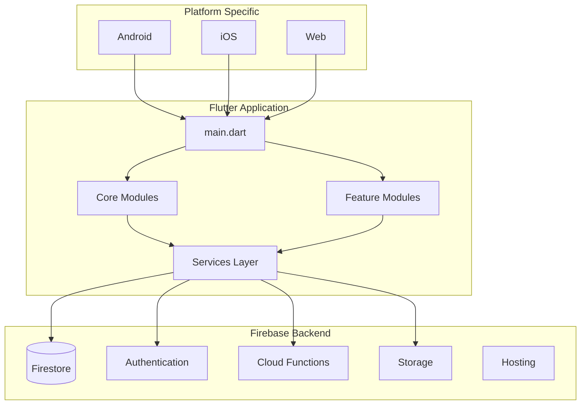

# Troubleshooting & FAQ

<cite>
**Referenced Files in This Document**
- [README.md](file://README.md)
- [pubspec.yaml](file://pubspec.yaml)
- [firebase.json](file://firebase.json)
- [lib/main.dart](file://lib/main.dart)
- [android/app/build.gradle.kts](file://android/app/build.gradle.kts)
- [ios/Runner/Info.plist](file://ios/Runner/Info.plist)
- [firestore.rules](file://firestore.rules)
- [storage.rules](file://storage.rules)
- [.firebaserc](file://.firebaserc)
- [scripts/test_firebase_connection.dart](file://scripts/test_firebase_connection.dart)
- [scripts/test_firebase_emulator.dart](file://scripts/test_firebase_emulator.dart)
- [functions/src/index.ts](file://functions/src/index.ts)
- [integration_test/firebase_emulator_test.dart](file://integration_test/firebase_emulator_test.dart)
</cite>

## Table of Contents
1. [Introduction](#introduction)
2. [Project Structure Overview](#project-structure-overview)
3. [Common Setup Issues](#common-setup-issues)
4. [Build Errors & Solutions](#build-errors--solutions)
5. [Runtime Issues & Debugging](#runtime-issues--debugging)
6. [Firebase Connectivity Troubleshooting](#firebase-connectivity-troubleshooting)
7. [Database Synchronization Issues](#database-synchronization-issues)
8. [Third-Party API Integration Problems](#third-party-api-integration-problems)
9. [Performance Optimization](#performance-optimization)
10. [Memory Leak Detection](#memory-leak-detection)
11. [Crash Analysis](#crash-analysis)
12. [Logging System & Error Reporting](#logging-system--error-reporting)
13. [Monitoring Tools Usage](#monitoring-tools-usage)
14. [FAQ - Configuration & Customization](#faq---configuration--customization)
15. [Diagnostic Scripts & Tools](#diagnostic-scripts--tools)
16. [Community Resources](#community-resources)

## Introduction

This comprehensive troubleshooting guide addresses common issues encountered when working with the Emerge App, a Flutter-based habit formation application integrated with Firebase services. The guide covers setup problems, build errors, runtime issues, debugging techniques, performance optimization, and provides step-by-step resolution procedures for frequent problems.

The Emerge App is built using Flutter with Firebase as the backend, incorporating features like real-time data synchronization, authentication, cloud functions, and mobile-specific optimizations. This documentation serves both developers and users who encounter technical challenges during development or deployment.

## Project Structure Overview

The Emerge App follows a modular Flutter architecture with clear separation between core functionality, feature modules, and platform-specific implementations:



**Diagram sources**
- [lib/main.dart:1-50](file://lib/main.dart#L1-L50)
- [firebase.json:1-30](file://firebase.json#L1-L30)

**Section sources**
- [README.md:1-100](file://README.md#L1-L100)
- [pubspec.yaml:1-50](file://pubspec.yaml#L1-L50)

## Common Setup Issues

### Flutter Environment Setup Problems

**Issue**: Flutter commands not recognized or version conflicts
**Symptoms**: 
- `flutter doctor` shows red marks
- Package installation fails
- Build process stops at dependency resolution

**Resolution Steps**:
1. Verify Flutter installation path is in system PATH
2. Run `flutter doctor --verbose` for detailed diagnostics
3. Update Flutter SDK if version mismatch detected
4. Clear pub cache with `flutter pub cache repair`
5. Reinstall dependencies with `flutter pub get`

### Firebase Project Configuration

**Issue**: Firebase configuration files missing or incorrect
**Symptoms**:
- Firebase initialization errors
- Authentication failures
- Database connection timeouts

**Resolution Steps**:
1. Ensure `google-services.json` (Android) and `GoogleService-Info.plist` (iOS) are present
2. Verify Firebase project ID matches in all configuration files
3. Check `.firebaserc` contains correct project references
4. Validate Firebase CLI installation with `firebase --version`
5. Re-authenticate with `firebase login`

### Platform-Specific Setup

**Android Setup Issues**:
- Missing Android SDK components
- Gradle version incompatibilities
- Signing certificate problems

**iOS Setup Issues**:
- Xcode command line tools not installed
- CocoaPods installation failures
- Bundle identifier conflicts

**Section sources**
- [android/app/build.gradle.kts:1-50](file://android/app/build.gradle.kts#L1-L50)
- [ios/Runner/Info.plist:1-30](file://ios/Runner/Info.plist#L1-L30)
- [.firebaserc:1-20](file://.firebaserc#L1-L20)

## Build Errors & Solutions

### Dependency Resolution Failures

**Common Causes**:
- Outdated Flutter SDK
- Conflicting package versions
- Network connectivity issues during download

**Solutions**:
1. Update Flutter: `flutter upgrade`
2. Clean project: `flutter clean`
3. Remove lock files and reinstall: `rm -rf pubspec.lock && flutter pub get`
4. Use specific package versions in `pubspec.yaml`

### Compilation Errors

**Dart Compilation Issues**:
- Null safety violations
- Type mismatches
- Missing imports

**Native Compilation Issues**:
- Android NDK version mismatches
- iOS deployment target issues
- Platform-specific library conflicts

**Resolution Process**:
1. Enable verbose logging: `flutter build --verbose`
2. Check Dart analysis: `flutter analyze`
3. Verify platform toolchain versions
4. Update platform-specific configurations

### Firebase Integration Build Problems

**Cloud Functions Build Issues**:
- TypeScript compilation errors
- Node.js version incompatibilities
- Missing function dependencies

**Mobile Build Issues**:
- Firebase plugin version conflicts
- ProGuard/R8 optimization errors
- Code signing failures

**Section sources**
- [functions/package.json:1-30](file://functions/package.json#L1-L30)
- [android/app/build.gradle.kts:50-100](file://android/app/build.gradle.kts#L50-L100)

## Runtime Issues & Debugging

### Application Startup Failures

**Common Symptoms**:
- App crashes immediately after launch
- White screen of death
- Infinite loading states

**Debugging Techniques**:
1. Enable debug mode: `flutter run --debug`
2. Check console logs for initialization errors
3. Verify all required services are properly initialized
4. Test with different device configurations

### Memory Management Issues

**Symptoms**:
- App becomes unresponsive over time
- Frequent garbage collection pauses
- Memory warnings on devices

**Investigation Steps**:
1. Use Flutter DevTools memory profiler
2. Monitor heap size during usage
3. Identify memory leaks in widgets and services
4. Check for improper resource cleanup

### UI Rendering Problems

**Common Issues**:
- Layout shifts and jank
- Image loading failures
- Animation performance issues

**Optimization Strategies**:
1. Implement proper widget lifecycle management
2. Use appropriate image caching strategies
3. Optimize rebuild cycles with const constructors
4. Profile rendering performance with DevTools

**Section sources**
- [lib/main.dart:50-150](file://lib/main.dart#L50-L150)

## Firebase Connectivity Troubleshooting

### Connection Establishment Issues

**Network Connectivity Problems**:
- SSL/TLS handshake failures
- DNS resolution errors
- Proxy configuration issues

**Firebase Service Authentication**:
- Invalid credentials
- Expired tokens
- Insufficient permissions

**Diagnostic Procedures**:
1. Test network connectivity with `ping` and `curl`
2. Verify Firebase service accounts have correct roles
3. Check firewall rules and proxy settings
4. Use Firebase emulator for local testing

### Real-time Data Sync Issues

**Common Problems**:
- Data not syncing across devices
- Conflict resolution failures
- Offline persistence issues

**Resolution Steps**:
1. Verify Firestore security rules
2. Check for conflicting write operations
3. Implement proper conflict resolution strategies
4. Test offline functionality thoroughly

### Cloud Functions Execution Errors

**Function Invocation Issues**:
- Timeout errors
- Permission denied
- Resource limits exceeded

**Debugging Approach**:
1. Enable Cloud Functions logging
2. Test functions locally with Firebase emulator
3. Check function execution logs in Firebase Console
4. Monitor function memory and CPU usage

**Section sources**
- [scripts/test_firebase_connection.dart:1-100](file://scripts/test_firebase_connection.dart#L1-L100)
- [functions/src/index.ts:1-50](file://functions/src/index.ts#L1-L50)

## Database Synchronization Issues

### Data Consistency Problems

**Symptoms**:
- Stale data displayed to users
- Inconsistent state across app screens
- Lost updates during network interruptions

**Root Causes**:
- Race conditions in concurrent updates
- Improper optimistic updates
- Missing error handling for failed syncs

**Solutions**:
1. Implement proper optimistic UI updates
2. Use transactional writes for critical data
3. Add retry mechanisms for failed operations
4. Implement proper state management

### Performance Bottlenecks

**Query Optimization**:
- Unoptimized Firestore queries
- Excessive document reads
- Missing database indexes

**Caching Strategies**:
- In-memory caching implementation
- Persistent cache configuration
- Cache invalidation policies

**Section sources**
- [firestore.rules:1-50](file://firestore.rules#L1-L50)

## Third-Party API Integration Problems

### Authentication & Authorization

**Common Issues**:
- API key exposure in client code
- Token refresh failures
- Rate limiting errors

**Security Best Practices**:
1. Store sensitive keys in environment variables
2. Implement proper token refresh logic
3. Handle rate limiting with exponential backoff

### API Response Handling

**Error Management**:
- Network timeout handling
- Invalid response parsing
- Graceful degradation strategies

**Testing Approaches**:
1. Mock external API responses
2. Test error scenarios comprehensively
3. Implement circuit breaker patterns

## Performance Optimization

### Flutter App Performance

**Widget Optimization**:
- Minimize unnecessary rebuilds
- Use const constructors where possible
- Implement proper list view optimizations

**Resource Management**:
- Efficient image loading and caching
- Proper disposal of resources
- Memory leak prevention

### Firebase Performance

**Query Optimization**:
- Use appropriate query structures
- Implement pagination for large datasets
- Leverage Firestore indexes effectively

**Connection Management**:
- Connection pooling strategies
- Request batching for multiple operations
- Offline-first architecture patterns

## Memory Leak Detection

### Common Memory Leak Sources

**Widget Lifecycle Issues**:
- Event listeners not properly disposed
- Stream subscriptions not cancelled
- Controllers not closed

**Data Structure Leaks**:
- Large objects held in memory
- Circular references
- Static variable misuse

### Diagnostic Tools

**Flutter DevTools**:
- Memory snapshot analysis
- Heap dump inspection
- Allocation tracking

**Platform-Specific Tools**:
- Android Studio Memory Profiler
- Xcode Instruments
- Chrome DevTools for web builds

## Crash Analysis

### Crash Collection & Analysis

**Implementation**:
- Firebase Crashlytics integration
- Custom error boundary implementation
- User-friendly error reporting

**Analysis Workflow**:
1. Review crash reports in Firebase Console
2. Analyze stack traces for root causes
3. Reproduce issues in development environment
4. Implement fixes and verify resolutions

### Error Boundary Implementation

**Best Practices**:
- Wrap critical widgets with error boundaries
- Provide fallback UI for failed components
- Log detailed error information for debugging

## Logging System & Error Reporting

### Logging Strategy

**Log Levels**:
- DEBUG: Development-only detailed logs
- INFO: General application flow
- WARNING: Potential issues requiring attention
- ERROR: Critical failures needing immediate action

**Log Management**:
- Structured logging format
- Context-aware log messages
- Sensitive data filtering

### Error Reporting

**Automated Reporting**:
- Firebase Crashlytics integration
- Custom error tracking
- User feedback collection

**Manual Debugging**:
- Console logging utilities
- Network request/response logging
- State change monitoring

## Monitoring Tools Usage

### Firebase Console

**Key Metrics**:
- App usage statistics
- Performance monitoring
- Crash analytics
- Real-time user activity

**Setup Requirements**:
- Firebase project configuration
- Analytics enabled
- Crashlytics configured

### Flutter DevTools

**Available Tools**:
- Widget inspector
- Performance overlay
- Memory profiler
- Network monitor

**Usage Scenarios**:
- UI layout debugging
- Performance bottleneck identification
- Memory leak detection
- Network issue diagnosis

## FAQ - Configuration & Customization

### Q: How do I configure Firebase for different environments?

**A**: Create separate Firebase projects for development, staging, and production. Use environment-specific configuration files and switch between them using Flutter's build flavors.

### Q: What's the recommended approach for handling offline data?

**A**: Implement an offline-first architecture using Hive or SQLite for local storage, with automatic synchronization when connectivity is restored. Use Firestore's offline persistence for seamless data availability.

### Q: How can I optimize Firestore query performance?

**A**: Design your data model to support efficient queries, use composite indexes for complex queries, implement pagination for large datasets, and leverage Firestore's built-in caching mechanisms.

### Q: What are best practices for managing app state?

**A**: Use provider or Riverpod for state management, implement proper state persistence, handle state synchronization across app restarts, and avoid unnecessary state rebuilds.

### Q: How do I handle push notifications effectively?

**A**: Implement FCM for Android and APNs for iOS, handle notification payloads appropriately, manage notification permissions, and provide user preferences for notification customization.

## Diagnostic Scripts & Tools

### Connection Testing

**Firebase Connection Test**:
```dart
// scripts/test_firebase_connection.dart
// Tests basic Firebase connectivity and service availability
```

**Emulator Testing**:
```dart
// scripts/test_firebase_emulator.dart  
// Validates local Firebase emulator setup
```

### Performance Monitoring

**Custom Performance Metrics**:
- Screen load times
- API response times
- Database operation durations
- Memory usage patterns

### Automated Testing

**Unit Tests**:
- Service layer testing
- Repository pattern validation
- Mock external dependencies

**Integration Tests**:
- End-to-end user flows
- Database synchronization testing
- Cross-platform compatibility

## Community Resources

### Official Documentation

**Flutter Resources**:
- Flutter official documentation
- Flutter Cookbook examples
- Community packages and plugins

**Firebase Documentation**:
- Firebase quickstart guides
- Security rules documentation
- Cloud Functions tutorials

### Support Channels

**Community Forums**:
- Stack Overflow tags: #flutter, #firebase
- Reddit communities: r/flutter, r/Firebase
- Discord channels for Flutter and Firebase

**Professional Support**:
- Firebase support plans
- Flutter community experts
- Consulting services for complex issues

### Learning Resources

**Video Tutorials**:
- Flutter YouTube channels
- Firebase official videos
- Community conference talks

**Books & Courses**:
- Flutter development books
- Firebase masterclass courses
- Mobile development best practices

**Section sources**
- [integration_test/firebase_emulator_test.dart:1-50](file://integration_test/firebase_emulator_test.dart#L1-L50)

## Conclusion

This troubleshooting guide provides comprehensive coverage of common issues encountered in Flutter and Firebase applications, with specific focus on the Emerge App architecture. By following the diagnostic procedures, implementing the suggested solutions, and utilizing the provided tools and resources, developers can efficiently resolve technical challenges and maintain high-quality application performance.

The key to successful troubleshooting lies in systematic problem-solving: identify symptoms, isolate root causes, implement targeted solutions, and validate fixes through thorough testing. Regular maintenance of dependencies, proper error handling, and comprehensive logging will significantly reduce troubleshooting time and improve overall application reliability.

For ongoing support, leverage the extensive Flutter and Firebase communities, utilize automated monitoring tools, and maintain up-to-date knowledge of platform best practices and emerging technologies.