# Design System & Theming

<cite>
**Referenced Files in This Document**
- [main.dart](file://lib/main.dart)
- [pubspec.yaml](file://pubspec.yaml)
- [THEME_ADAPTATION_PLAN.md](file://THEME_ADAPTATION_PLAN.md)
- [design.md](file://docs/design.md)
- [ARCHITECTURE.md](file://docs/ARCHITECTURE.md)
</cite>

## Table of Contents
1. [Introduction](#introduction)
2. [Project Structure](#project-structure)
3. [Core Components](#core-components)
4. [Architecture Overview](#architecture-overview)
5. [Detailed Component Analysis](#detailed-component-analysis)
6. [Dependency Analysis](#dependency-analysis)
7. [Performance Considerations](#performance-considerations)
8. [Troubleshooting Guide](#troubleshooting-guide)
9. [Conclusion](#conclusion)
10. [Appendices](#appendices)

## Introduction
This document explains the design system and theming architecture for the application. It covers color palettes, typography scales, spacing systems, visual hierarchy, theme configuration, dynamic theme switching, platform-specific adaptations, component styling patterns, custom themes, design token management, accessibility, dark mode support, and responsive design principles. The goal is to provide a clear, actionable guide for extending and maintaining consistency across platforms while ensuring accessibility and performance.

## Project Structure
The project follows a Flutter-based structure with Dart code under lib/, assets for media, and documentation under docs/. Theme-related configuration and plans are centralized in key files such as the main entry point and dedicated design/theming documents.

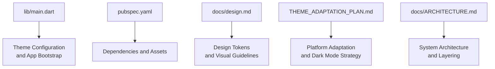

**Diagram sources**
- [main.dart](file://lib/main.dart)
- [pubspec.yaml](file://pubspec.yaml)
- [design.md](file://docs/design.md)
- [THEME_ADAPTATION_PLAN.md](file://THEME_ADAPTATION_PLAN.md)
- [ARCHITECTURE.md](file://docs/ARCHITECTURE.md)

**Section sources**
- [main.dart](file://lib/main.dart)
- [pubspec.yaml](file://pubspec.yaml)
- [design.md](file://docs/design.md)
- [THEME_ADAPTATION_PLAN.md](file://THEME_ADAPTATION_PLAN.md)
- [ARCHITECTURE.md](file://docs/ARCHITECTURE.md)

## Core Components
- Color Palette: Centralized tokens for light/dark modes, semantic colors (primary, secondary, error, success), and brand accents.
- Typography Scale: Consistent type scale for headings, body text, captions, and labels; supports platform font preferences.
- Spacing System: Unified spacing tokens for margins, paddings, gaps, and layout grids.
- Visual Hierarchy: Elevation, contrast ratios, and emphasis rules to guide attention and readability.
- Theme Configuration: Single source of truth for theme data, enabling dynamic switching and platform overrides.
- Dynamic Theme Switching: Runtime updates via providers or state management to reflect user preferences and system settings.
- Platform-Specific Adaptations: OS-level adjustments for fonts, insets, navigation bars, and safe areas.
- Component Styling Patterns: Reusable widgets that consume theme tokens consistently.
- Custom Themes: Extensible theme definitions for branding variations and feature-specific themes.
- Design Token Management: Versioned tokens with validation and tooling for asset generation.

[No sources needed since this section provides general guidance]

## Architecture Overview
The theming architecture separates concerns into layers:
- Token Layer: Defines colors, typography, spacing, and elevation tokens.
- Theme Layer: Aggregates tokens into light/dark themes and exposes APIs for consumers.
- Provider Layer: Supplies current theme context to widgets and handles runtime switching.
- Component Layer: Widgets consume theme tokens without hardcoding values.
- Platform Layer: Applies OS-specific adjustments and safe area handling.

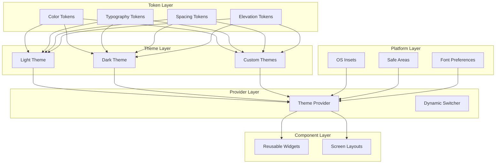

[No sources needed since this diagram shows conceptual architecture]

## Detailed Component Analysis

### Theme Configuration and Bootstrap
- Entry Point: Application bootstrap initializes theme provider and sets default theme based on system preference or persisted user choice.
- Theme Data: Centralized theme objects expose tokens for colors, typography, spacing, and elevation.
- Dynamic Switching: Provider listens to user settings and system changes, updating theme context efficiently.
- Platform Overrides: Platform-specific adjustments are applied during theme construction.

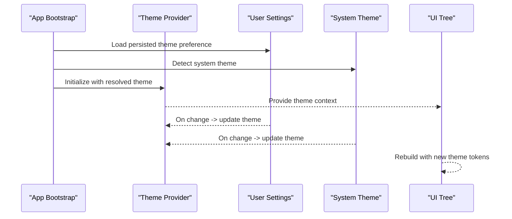

**Section sources**
- [main.dart](file://lib/main.dart)
- [THEME_ADAPTATION_PLAN.md](file://THEME_ADAPTATION_PLAN.md)

### Color Palette and Semantic Colors
- Base Palette: Neutral tones for backgrounds, surfaces, and borders.
- Semantic Colors: Primary, secondary, accent, success, warning, error mapped to both light and dark modes.
- Contrast Ratios: Ensures WCAG compliance for text and interactive elements.
- Brand Accents: Highlighted tokens for branding and call-to-action elements.

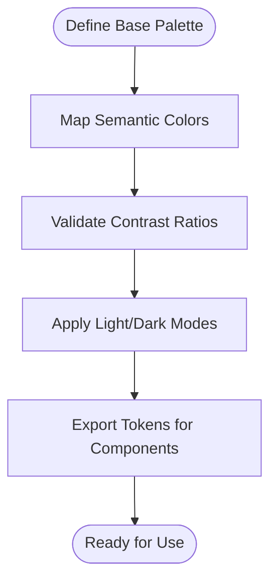

**Section sources**
- [design.md](file://docs/design.md)

### Typography Scale and Font Handling
- Type Scale: Hierarchical scale for headings, body, captions, and labels.
- Platform Fonts: Respect OS font preferences and fallbacks.
- Readability: Line heights, letter spacing, and weight adjustments for legibility.
- Accessibility: Sufficient contrast and scalable text sizes.

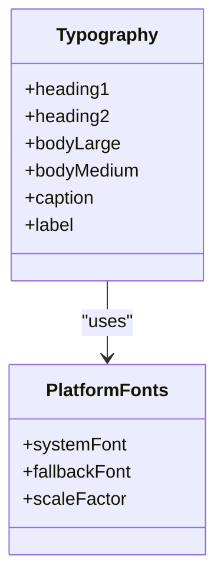

**Section sources**
- [design.md](file://docs/design.md)

### Spacing System and Layout Grid
- Spacing Tokens: Uniform increments for margins, paddings, and gaps.
- Grid System: Consistent column and row spacing for responsive layouts.
- Safe Areas: Integration with platform safe areas and insets.
- Responsive Behavior: Adaptive spacing based on screen size and orientation.

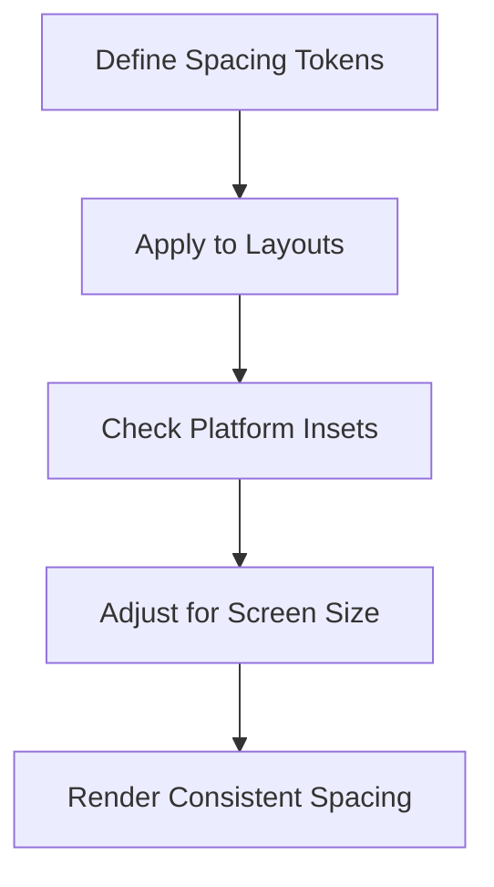

**Section sources**
- [design.md](file://docs/design.md)

### Visual Hierarchy and Elevation
- Elevation Tokens: Shadow and depth levels for cards, dialogs, and overlays.
- Emphasis Rules: Use of color, typography, and spacing to establish hierarchy.
- Focus States: Clear indicators for interactive elements.
- Motion and Feedback: Subtle animations to reinforce hierarchy and state changes.

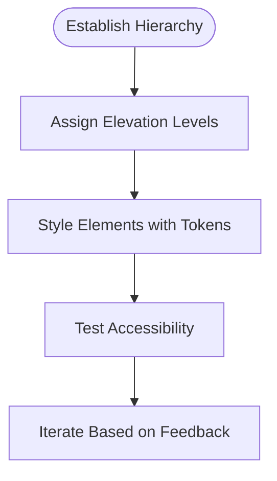

**Section sources**
- [design.md](file://docs/design.md)

### Dynamic Theme Switching and State Management
- Provider Pattern: Centralized theme provider manages current theme state.
- Event Listeners: Listen to user settings and system theme changes.
- Efficient Updates: Minimize rebuilds by scoping theme consumers.
- Persistence: Save user preference and restore on app start.

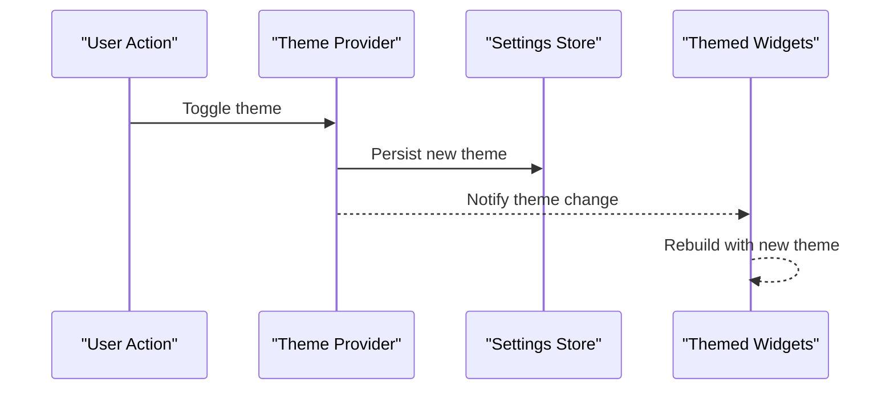

**Section sources**
- [THEME_ADAPTATION_PLAN.md](file://THEME_ADAPTATION_PLAN.md)

### Platform-Specific Adaptations
- OS Insets: Handle status bar, navigation bar, and safe areas.
- Font Preferences: Respect system font scaling and localization.
- Color Systems: Align with platform color semantics where appropriate.
- Navigation Styles: Adapt navigation bars and back gestures per platform.

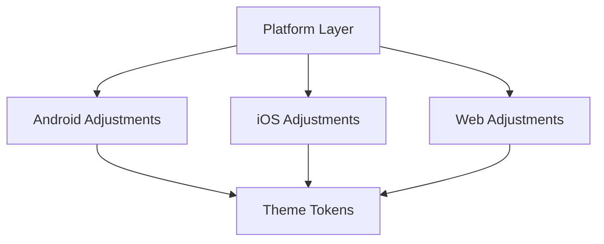

**Section sources**
- [THEME_ADAPTATION_PLAN.md](file://THEME_ADAPTATION_PLAN.md)

### Component Styling Patterns
- Token Consumption: Widgets read from theme tokens instead of hardcoded values.
- Reusability: Shared components encapsulate styling logic and behavior.
- Variants: Support for different states (default, hover, pressed, disabled).
- Composition: Combine base components to build complex screens.

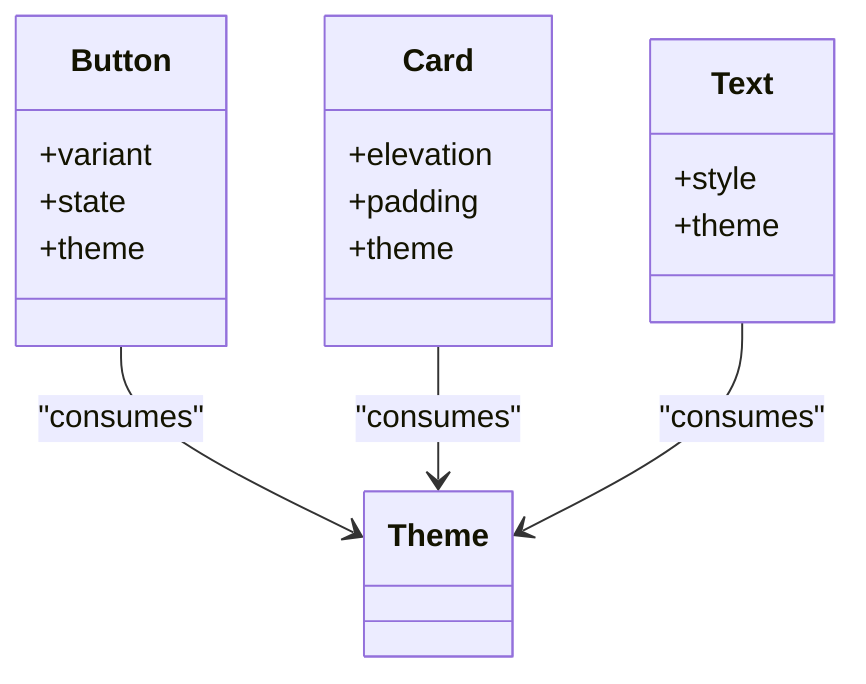

**Section sources**
- [design.md](file://docs/design.md)

### Custom Themes Implementation
- Theme Definition: Create theme objects that extend base tokens.
- Overrides: Override specific tokens for branding or feature needs.
- Validation: Ensure contrast and accessibility compliance for custom themes.
- Testing: Verify custom themes across platforms and devices.

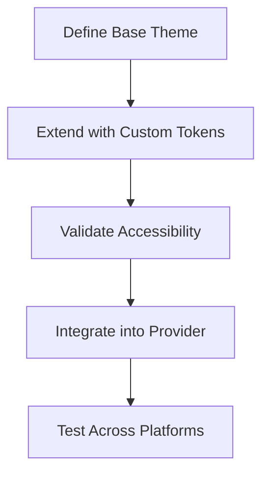

**Section sources**
- [THEME_ADAPTATION_PLAN.md](file://THEME_ADAPTATION_PLAN.md)

### Design Token Management
- Centralization: All tokens defined in a single location for consistency.
- Versioning: Track token changes and deprecations over time.
- Tooling: Generate assets and style maps automatically.
- Documentation: Maintain up-to-date token documentation and usage guidelines.

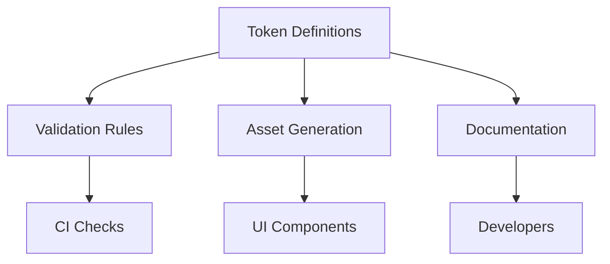

**Section sources**
- [design.md](file://docs/design.md)

## Dependency Analysis
The theming system depends on core Flutter framework features and optional packages for state management and asset generation. Dependencies include:
- Flutter Material/Cupertino themes for base styles.
- State management libraries for theme provider implementation.
- Asset generators for icons, images, and tokens.

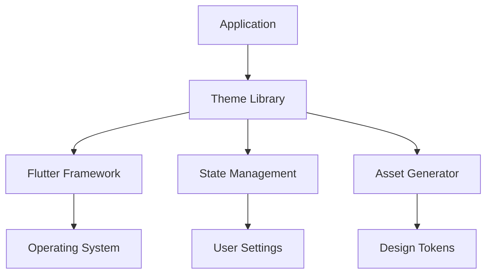

**Section sources**
- [pubspec.yaml](file://pubspec.yaml)
- [ARCHITECTURE.md](file://docs/ARCHITECTURE.md)

## Performance Considerations
- Minimize Rebuilds: Scope theme consumers to reduce unnecessary rebuilds.
- Lazy Loading: Load heavy assets only when needed.
- Caching: Cache computed theme values and generated assets.
- Profiling: Monitor theme switch performance and optimize hot paths.

[No sources needed since this section provides general guidance]

## Troubleshooting Guide
- Theme Not Applying: Verify provider initialization and context usage.
- Incorrect Colors: Check token mappings and contrast ratios.
- Platform Issues: Inspect insets and safe area handling.
- Performance Drops: Profile rebuilds and asset loading.

**Section sources**
- [THEME_ADAPTATION_PLAN.md](file://THEME_ADAPTATION_PLAN.md)

## Conclusion
The design system and theming architecture provide a robust foundation for consistent, accessible, and adaptable user interfaces across platforms. By centralizing tokens, implementing dynamic theme switching, and following component styling patterns, teams can maintain visual consistency while supporting customization and accessibility requirements.

[No sources needed since this section summarizes without analyzing specific files]

## Appendices
- Example Workflows: Creating custom themes, extending design tokens, and integrating platform-specific adjustments.
- Best Practices: Accessibility checks, responsive design principles, and performance optimization techniques.

[No sources needed since this section provides general guidance]