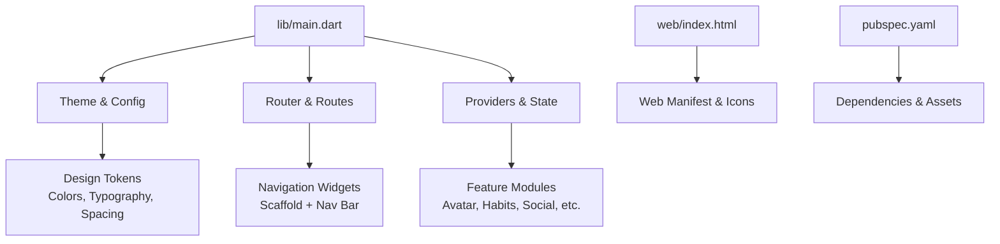
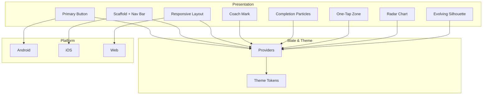
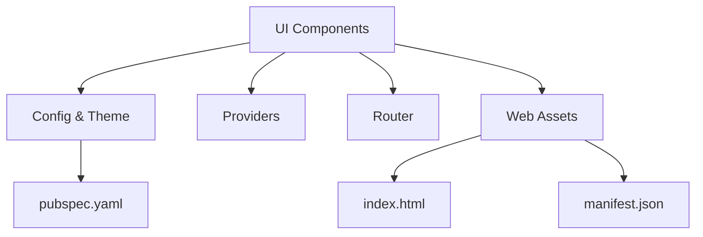

# UI Components & Widgets

<cite>
**Referenced Files in This Document**
- [main.dart](file://lib/main.dart)
- [pubspec.yaml](file://pubspec.yaml)
- [app_config_test.dart](file://test/core/config/app_config_test.dart)
- [responsive_layout_test.dart](file://test/core/presentation/widgets/responsive_layout_test.dart)
- [scaffold_with_nav_bar_test.dart](file://test/core/presentation/widgets/scaffold_with_nav_bar_test.dart)
- [emerge_primary_button_test.dart](file://test/core/presentation/widgets/emerge_primary_button_test.dart)
- [completion_particles_test.dart](file://test/core/presentation/widgets/completion_particles_test.dart)
- [feature_coach_mark_test.dart](file://test/core/presentation/widgets/feature_coach_mark_test.dart)
- [one_tap_completion_zone_test.dart](file://test/core/presentation/widgets/one_tap_completion_zone_test.dart)
- [attribute_radar_chart_test.dart](file://test/features/profile/attribute_radar_chart_test.dart)
- [evolving_silhouette_widget_test.dart](file://test/features/profile/evolving_silhouette_widget_test.dart)
- [index.html](file://web/index.html)
- [manifest.json](file://web/manifest.json)
</cite>

## Table of Contents
1. [Introduction](#introduction)
2. [Project Structure](#project-structure)
3. [Core Components](#core-components)
4. [Architecture Overview](#architecture-overview)
5. [Detailed Component Analysis](#detailed-component-analysis)
6. [Dependency Analysis](#dependency-analysis)
7. [Performance Considerations](#performance-considerations)
8. [Troubleshooting Guide](#troubleshooting-guide)
9. [Conclusion](#conclusion)
10. [Appendices](#appendices)

## Introduction
This document provides a comprehensive guide to the reusable UI components and widget library for the Emerge App. It covers the design system (colors, typography, spacing, component styling), responsive layout strategy, adaptive interfaces across screen sizes, platform-specific optimizations, animation and micro-interactions, accessibility features, form components, navigation elements, data visualization widgets, custom component creation patterns, theme customization, performance optimization, cross-platform compatibility, testing strategies, and composition patterns. The goal is to make the UI system understandable and usable by both technical and non-technical contributors.

## Project Structure
The Flutter application organizes presentation logic under lib/features and shared core utilities under lib/core. Tests are colocated under test/, with feature-level tests mirroring the feature structure. Web assets live under web/. The entry point is main.dart, which bootstraps the app and configures global settings such as themes and routing.

**Diagram sources**
- [main.dart](file://lib/main.dart)
- [pubspec.yaml](file://pubspec.yaml)
- [index.html](file://web/index.html)
- [manifest.json](file://web/manifest.json)

**Section sources**
- [main.dart](file://lib/main.dart)
- [pubspec.yaml](file://pubspec.yaml)
- [index.html](file://web/index.html)
- [manifest.json](file://web/manifest.json)

## Core Components
The UI library centers around a cohesive set of reusable widgets:
- Primary Button: Consistent call-to-action styling with accessible labels and haptic feedback where applicable.
- Scaffold with Navigation Bar: Provides consistent app shell, bottom navigation, and safe area handling.
- Responsive Layout: Adapts content density and layout based on screen size and orientation.
- Completion Particles: Micro-interaction animations that celebrate user actions.
- Coach Mark: Guided overlays to highlight new features or flows.
- One-Tap Completion Zone: Large touch targets optimized for quick interactions.
- Data Visualization Widgets: Radar charts and silhouette visualizations for profile insights.

These components are designed to be theme-aware, accessible, and performant across platforms.

**Section sources**
- [emerge_primary_button_test.dart](file://test/core/presentation/widgets/emerge_primary_button_test.dart)
- [scaffold_with_nav_bar_test.dart](file://test/core/presentation/widgets/scaffold_with_nav_bar_test.dart)
- [responsive_layout_test.dart](file://test/core/presentation/widgets/responsive_layout_test.dart)
- [completion_particles_test.dart](file://test/core/presentation/widgets/completion_particles_test.dart)
- [feature_coach_mark_test.dart](file://test/core/presentation/widgets/feature_coach_mark_test.dart)
- [one_tap_completion_zone_test.dart](file://test/core/presentation/widgets/one_tap_completion_zone_test.dart)
- [attribute_radar_chart_test.dart](file://test/features/profile/attribute_radar_chart_test.dart)
- [evolving_silhouette_widget_test.dart](file://test/features/profile/evolving_silhouette_widget_test.dart)

## Architecture Overview
The UI architecture follows a layered approach:
- Presentation Layer: Widgets and screens composed from reusable components.
- State Management: Providers manage UI state and react to changes.
- Theming: Centralized tokens define colors, typography, and spacing.
- Platform Abstraction: Conditional logic ensures native behavior on Android/iOS/Web.

[No sources needed since this diagram shows conceptual architecture]

## Detailed Component Analysis

### Design System: Colors, Typography, Spacing, and Styling
- Color Scheme: Semantic color tokens (primary, secondary, surface, error, success) ensure consistency and support dark/light modes.
- Typography: Type scale defines headings, body text, captions, and button labels with appropriate weights and line heights.
- Spacing: A modular spacing scale maintains rhythm and alignment across layouts.
- Component Styling: Each widget encapsulates style rules derived from theme tokens, enabling easy customization and consistent appearance.

Best practices:
- Use semantic tokens instead of hard-coded values.
- Ensure contrast ratios meet accessibility standards.
- Provide variants for different states (hover, pressed, disabled).

[No sources needed since this section provides general guidance]

### Responsive Layout System and Adaptive Interfaces
- Breakpoints: Define small, medium, large breakpoints to adapt layouts.
- Density: Adjust padding, font sizes, and grid columns based on available space.
- Orientation: Handle portrait vs landscape differences gracefully.
- Platform Adaptation: Optimize for mobile touch targets and desktop mouse interactions.

Testing focus:
- Verify layout correctness at multiple breakpoints.
- Validate touch target sizes and hit areas.
- Confirm content reflows without overflow.

**Section sources**
- [responsive_layout_test.dart](file://test/core/presentation/widgets/responsive_layout_test.dart)

### Animation System and Micro-Interactions
- Completion Particles: Lightweight particle effects triggered on task completion to reinforce positive feedback.
- Transitions: Smooth page transitions and modal entrances/exits.
- Haptics: Subtle device vibrations for tactile feedback on supported platforms.

Implementation tips:
- Keep animations short and purposeful.
- Respect reduced motion preferences.
- Avoid heavy computations during animation frames.

**Section sources**
- [completion_particles_test.dart](file://test/core/presentation/widgets/completion_particles_test.dart)

### Accessibility Features
- Semantics: Proper labeling for buttons, inputs, and dynamic content.
- Contrast: Ensure sufficient color contrast for readability.
- Focus Order: Logical tab order for keyboard navigation on web/desktop.
- Screen Readers: Descriptive labels and hints for assistive technologies.

Validation checklist:
- Run automated accessibility audits.
- Test with screen readers on each platform.
- Verify focus indicators and keyboard shortcuts.

[No sources needed since this section provides general guidance]

### Form Components
- Input Fields: Text fields with validation, placeholders, and helper text.
- Validation Feedback: Inline errors and success states.
- Action Buttons: Submit and cancel actions with clear affordances.
- Keyboard Handling: Proper focus management and enter key submission.

Accessibility considerations:
- Associate labels with inputs.
- Announce validation messages to screen readers.
- Support large touch targets on mobile.

[No sources needed since this section provides general guidance]

### Navigation Elements
- Bottom Navigation: Persistent tabs for primary sections.
- Top App Bar: Contextual actions and titles.
- Drawer/Side Menu: Secondary navigation for complex apps.
- Deep Linking: Route-based navigation with parameters.

Platform specifics:
- iOS: Follow Human Interface Guidelines for gestures and transitions.
- Android: Adhere to Material Design principles.
- Web: Ensure URL reflects current route for sharing and back navigation.

**Section sources**
- [scaffold_with_nav_bar_test.dart](file://test/core/presentation/widgets/scaffold_with_nav_bar_test.dart)

### Data Visualization Widgets
- Radar Chart: Visualize multi-dimensional attributes for profiles.
- Evolving Silhouette: Dynamic avatar representation reflecting progress.
- Charts Best Practices: Clear legends, tooltips, and responsive sizing.

Performance tips:
- Cache computed chart data.
- Debounce updates during rapid state changes.
- Use efficient rendering libraries.

**Section sources**
- [attribute_radar_chart_test.dart](file://test/features/profile/attribute_radar_chart_test.dart)
- [evolving_silhouette_widget_test.dart](file://test/features/profile/evolving_silhouette_widget_test.dart)

### Custom Component Creation Patterns
- Composition: Build complex widgets by composing smaller, reusable parts.
- Props API: Define clear, typed parameters for configuration.
- State Encapsulation: Manage internal state locally when possible.
- Testing: Write unit and widget tests for custom components.

Example pattern:
- Create a base widget with common props.
- Extend with specialized variants.
- Provide theme overrides via callbacks or theme tokens.

[No sources needed since this section provides general guidance]

### Theme Customization
- Token-Based Theming: Centralize colors, typography, and spacing in a theme object.
- Dark/Light Modes: Toggle themes dynamically based on user preference.
- Feature Overrides: Allow per-feature theme adjustments without breaking global consistency.

Implementation steps:
- Define tokens in a central theme file.
- Wrap app with theme provider.
- Reference tokens in all components.

[No sources needed since this section provides general guidance]

### Performance Optimization
- Widget Rebuilds: Minimize unnecessary rebuilds using const constructors and selective state updates.
- Image Optimization: Use appropriate formats and sizes; lazy-load images.
- Animation Efficiency: Prefer hardware-accelerated animations and avoid heavy computations.
- Memory Management: Dispose of controllers and listeners properly.

Monitoring:
- Use profiling tools to identify bottlenecks.
- Track frame drops and memory usage.
- Optimize critical paths first.

[No sources needed since this section provides general guidance]

### Cross-Platform Compatibility
- Platform Detection: Use conditional imports and runtime checks.
- Native Integrations: Wrap platform-specific code behind abstractions.
- Testing Across Platforms: Run tests on emulators and real devices.

Common pitfalls:
- Assuming identical APIs across platforms.
- Ignoring platform-specific UX conventions.
- Not handling platform differences in input/output.

[No sources needed since this section provides general guidance]

### Testing Strategies
- Unit Tests: Validate business logic and utility functions.
- Widget Tests: Ensure UI components render correctly and respond to interactions.
- Integration Tests: Simulate user flows across screens.
- Mocking: Isolate external dependencies with mocks and fakes.

Test organization:
- Mirror production structure in test directories.
- Name tests descriptively.
- Cover edge cases and error conditions.

**Section sources**
- [app_config_test.dart](file://test/core/config/app_config_test.dart)

## Dependency Analysis
The UI components depend on core configuration, providers, and platform-specific implementations. Dependencies are declared in pubspec.yaml, and web assets are managed through index.html and manifest.json.

**Diagram sources**
- [pubspec.yaml](file://pubspec.yaml)
- [index.html](file://web/index.html)
- [manifest.json](file://web/manifest.json)

**Section sources**
- [pubspec.yaml](file://pubspec.yaml)
- [index.html](file://web/index.html)
- [manifest.json](file://web/manifest.json)

## Performance Considerations
- Prioritize lightweight widgets and avoid deep nesting.
- Use const constructors where possible to reduce rebuilds.
- Implement lazy loading for images and heavy content.
- Profile animations and optimize frame rates.
- Monitor memory usage and dispose resources appropriately.

[No sources needed since this section provides general guidance]

## Troubleshooting Guide
Common issues and resolutions:
- Layout Overflow: Check constraints and use flexible layouts.
- Theme Not Applied: Ensure theme provider wraps the correct widget tree.
- Animations Stutter: Simplify animations and avoid heavy computations.
- Accessibility Failures: Add proper semantics and labels.
- Platform Differences: Use platform detection and fallbacks.

Debugging tips:
- Use Flutter DevTools for performance profiling.
- Enable verbose logging for state changes.
- Test on multiple devices and orientations.

[No sources needed since this section provides general guidance]

## Conclusion
The Emerge App UI components and widgets library provides a robust, accessible, and performant foundation for building consistent user experiences across platforms. By adhering to the design system, leveraging responsive layouts, and following best practices for animations and accessibility, teams can deliver high-quality interfaces efficiently. Continuous testing and performance monitoring ensure reliability and maintainability over time.

[No sources needed since this section summarizes without analyzing specific files]

## Appendices
- Glossary: Definitions of key terms used throughout the document.
- References: Links to official Flutter documentation and guidelines.
- Examples: Sample implementations and templates for common patterns.

[No sources needed since this section provides general guidance]