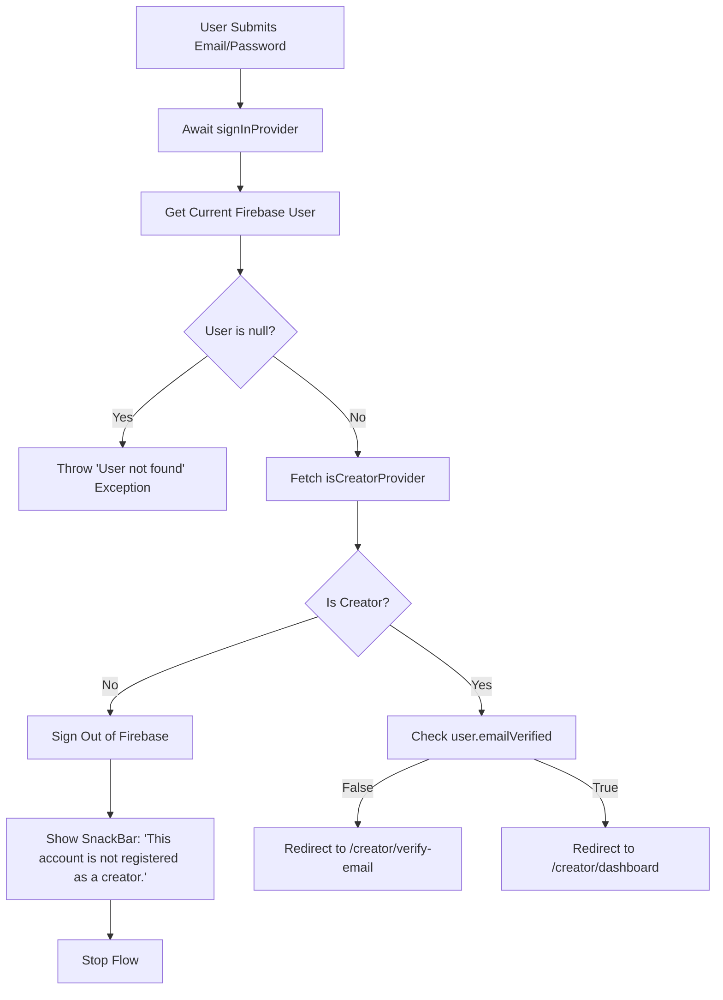

# Creator Login Screen Hardening Design Spec

This specification details the logic, UI, and testing updates required to harden the Creator Login Screen under Task 4.

## 1. Objectives

- Ensure that only users with the `creator` role (present in `creator_profiles` collection) can access the Creator Dashboard.
- Prevent non-creators from logging into the Creator Hub by signing them out and displaying an appropriate warning.
- Enforce email verification for creators prior to accessing the dashboard.
- Implement a Google Sign-In action tailored for creators.
- Update/add widget tests to verify all login paths, error scenarios, and redirection behavior.

---

## 2. Hardened Auth Flow Architecture

### Steps in Detail (Email/Password Login)
1. Trigger standard submission and run validation checks.
2. Await the future of `signInProvider(email, password)`.
3. Retrieve current user via `ref.read(firebaseAuthProvider).currentUser`.
4. If null, throw `Exception('User not found')` to trigger the snackbar.
5. Check role by awaiting `ref.read(isCreatorProvider(user.uid).future)`.
6. If `isCreator` is `false`:
   - Trigger `ref.read(authRepositoryProvider).signOut()`.
   - Show a SnackBar saying: `"This account is not registered as a creator."`
   - Terminate the login flow (do not route).
7. If `isCreator` is `true`:
   - Check if `user.emailVerified` is `true`.
   - If not verified: Redirect to `/creator/verify-email` via `context.go('/creator/verify-email')`.
   - If verified: Redirect to `/creator/dashboard` via `context.go('/creator/dashboard')`.

---

## 3. Google Sign-In Flow

Google Sign-In logic is handled using `signUpCreatorWithGoogleProvider`.

### Steps in Detail (Google Login)
1. Initialize manual subscription:
   `final subscription = ref.listenManual(signUpCreatorWithGoogleProvider, (prev, next) {});`
2. Await the future:
   `await ref.read(signUpCreatorWithGoogleProvider.future);`
3. If successful, check if mounted and redirect to `/creator/dashboard` via `context.go('/creator/dashboard')`.
4. Catch exceptions, show SnackBar with `e.toString().replaceAll('Exception: ', '')`.
5. In the `finally` block:
   - Call `subscription.close()`.
   - Reset loading state.

---

## 4. UI Changes

### A. Google Sign-In Button
Positioned below the standard "Login to Creator Hub" submit button, styled matching the Creator Hub design system:
- **Outline style:** `Colors.amber.withValues(alpha: 0.5)` border.
- **Icon:** `assets/images/google_logo.svg` (SvgPicture).
- **Label:** `"Sign in with Google"`

### B. Creator Sign-Up Link
Positioned below/near the "Go Back" row, offering quick navigation to Creator Signup:
- **Label:** `"New creator? Sign Up"`
- **Action:** Navigates to `/creator/signup` via `context.go('/creator/signup')` or `context.push('/creator/signup')`.

---

## 5. Testing Plan

We will update and add unit/widget tests in `test/features/auth/presentation/screens/creator_login_screen_test.dart` to verify the new behaviors.

### Required Mocks / Stubs
Since the page relies on multiple providers, we will override the following:
- `authRepositoryProvider`: Mocks sign out and standard login.
- `firebaseAuthProvider`: Returns mock FirebaseAuth instances and mock Firebase User.
- `isCreatorProvider(uid)`: Returns `true`/`false` depending on the test case.
- `signUpCreatorWithGoogleProvider`: Simulates google sign in success/failure.

### Test Cases
1. **Logging in as a non-creator:**
   - Stub `isCreatorProvider` -> `false`.
   - Enter credentials and press submit.
   - Assert `signOut` is invoked on the repository.
   - Assert SnackBar `"This account is not registered as a creator."` is displayed.
2. **Logging in as an unverified creator:**
   - Stub `isCreatorProvider` -> `true`.
   - Stub mock user `emailVerified` -> `false`.
   - Enter credentials and submit.
   - Verify context navigates to `/creator/verify-email`.
3. **Logging in as a verified creator:**
   - Stub `isCreatorProvider` -> `true`.
   - Stub mock user `emailVerified` -> `true`.
   - Enter credentials and submit.
   - Verify context navigates to `/creator/dashboard`.
4. **Google Sign-In Success:**
   - Stub `signUpCreatorWithGoogleProvider` to resolve successfully.
   - Press the Google Sign-In button.
   - Verify context navigates to `/creator/dashboard`.
5. **Google Sign-In Failure:**
   - Stub `signUpCreatorWithGoogleProvider` to throw an Exception.
   - Verify SnackBar displays the correct error message.
