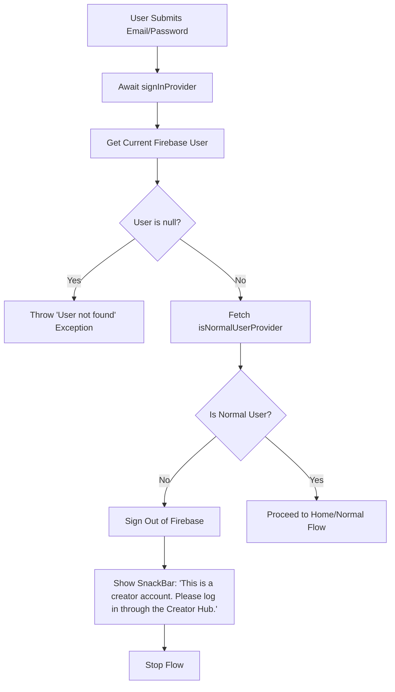

# Normal Login Screen Hardening Design Spec

This specification details the logic, UI, and testing updates required to harden the Normal Login Screen under Task 5.

## 1. Objectives

- Ensure that only users with the `normal` role (present in `users` collection) can access the Normal App Flow.
- Prevent creator-only accounts from logging into the Normal Flow by signing them out and displaying an appropriate warning.
- Implement role verification validation during email/password and Google login.
- Update/add widget tests to verify login paths, error scenarios, and role check failures.

---

## 2. Hardened Auth Flow Architecture

### Steps in Detail (Email/Password Login)
1. Trigger standard submission and run validation checks.
2. Await the future of `signInProvider(email, password)`.
3. Retrieve current user via `ref.read(firebaseAuthProvider).currentUser`.
4. If null, throw `Exception('User not found')` to trigger the snackbar.
5. Check role by awaiting `ref.read(isNormalUserProvider(user.uid).future)`.
6. If `isNormal` is `false`:
   - Trigger `ref.read(authRepositoryProvider).signOut()`.
   - Throw `Exception('This is a creator account. Please log in through the Creator Hub.')` to show in the SnackBar.
   - Terminate the login flow (do not route).

---

## 3. Google Sign-In Flow

### Steps in Detail (Google Login)
1. Call the Google sign in action on `ref.read(authRepositoryProvider).signInWithGoogle(isLogin: true)`.
2. Retrieve error or user credentials from the result.
3. If there is an auth error, handle it (show SnackBar unless message is 'redirect_initiated').
4. If successful, get the current Firebase Auth user: `ref.read(firebaseAuthProvider).currentUser`.
5. If user is null, throw `Exception('User not found')`.
6. Check if they are a normal user using `await ref.read(isNormalUserProvider(user.uid).future)`.
7. If they are NOT a normal user (i.e. `isNormal` is false):
   - Sign out using `ref.read(authRepositoryProvider).signOut()`.
   - Throw `Exception('This is a creator account. Please log in through the Creator Hub.')`.

---

## 4. Testing Plan

We will update and add unit/widget tests in `test/features/auth/presentation/screens/login_screen_test.dart` to verify the new behaviors.

### Required Mocks / Stubs
Since the page relies on multiple providers, we will override the following:
- `authRepositoryProvider`: Mocks sign out and standard login.
- `firebaseAuthProvider`: Returns mock FirebaseAuth instances and mock Firebase User.
- `isNormalUserProvider(uid)`: Returns `true`/`false` depending on the test case.

### Test Cases
1. **Logging in as a non-normal user / creator (email/password):**
   - Stub `isNormalUserProvider` -> `false`.
   - Enter credentials and press submit.
   - Assert `signOut` is invoked on the repository.
   - Assert SnackBar `"This is a creator account. Please log in through the Creator Hub."` is displayed.
2. **Google Sign-In with a creator account:**
   - Stub `isNormalUserProvider` -> `false`.
   - Click Google Sign-in button.
   - Assert `signOut` is invoked on the repository.
   - Assert SnackBar `"This is a creator account. Please log in through the Creator Hub."` is displayed.
